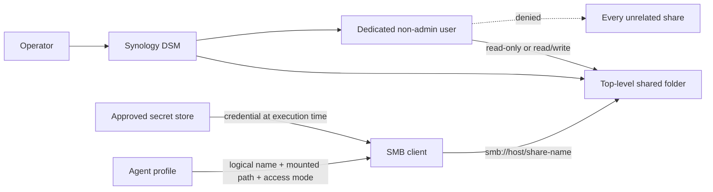
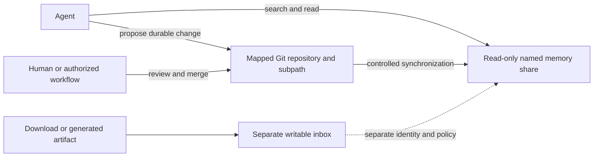

# Synology use case scenarios

## Create a named agent share

Create one human-readable network share that can be given to an agent without granting access to unrelated NAS data.
The share has a stable name, a dedicated non-admin login, an explicit access mode, and a secret reference. The password
itself never enters the agent's prompt or the public command repository.

## Use Synology as persistent agent memory

The normal agent route is read-only retrieval. The agent searches or reads the named Synology projection using its
dedicated identity. A durable correction or addition is made in the mapped Git repository, reviewed there, and then
delivered to the storage projection by the repository's controlled synchronization process.

This keeps browsing simple while retaining history, review, and recovery for sensitive information. A writable use case
does not change a memory share's permissions. Give downloads, captures, or generated artifacts their own `inbox` or
`workspace` share, dedicated credential, retention rule, and ingestion step.

### Why a top-level shared folder is required

DSM permissions are assigned to Synology shared folders and users or groups. A nested directory inside a Synology
Drive tree does not become an independent SMB security boundary merely because Finder displays it separately. When an
existing directory must receive its own login, create a top-level shared folder and migrate or copy the selected data
into it. Keep the old source until verification and rollback requirements are satisfied.

### Inputs to record without secrets

| Field | Example form | Rule |
| --- | --- | --- |
| Logical name | `incorporated` | Stable name used by humans and agents. |
| DSM shared-folder name | `incorporated` | Top-level share; use a filesystem-safe name. |
| Dedicated account | `share-incorporated` | Non-admin; one account per independently revocable boundary. |
| Access mode | `read-only` or `read-write` | Default to read-only. |
| Usage | `memory`, `workspace`, or `inbox` | Memory is the default for existing information. |
| Mutation route | `source-control` or `direct` | Source-controlled memory must be read-only. |
| Repository mapping | Logical repository ID plus relative subpath | Required for source-controlled memory; avoid infrastructure host details. |
| Source path | Local Synology Drive path or NAS path | Record for migration only; it is not the new boundary. |
| SMB target | `smb://<host>/<share>` | Keep the host in the private profile. |
| Local mount path | `/Volumes/<share>` | Verify after mounting; do not assume it exists. |
| Secret reference | Profile-owned logical secret ID | Record the reference, never the password. |
| Owner and purpose | Human owner plus bounded use | Required for review and later revocation. |

### Procedure

1. **Confirm reachability and source.** Discover the NAS, open DSM, and identify the exact existing source. Inventory the
   immediate contents without exposing document contents. Confirm backup or snapshot coverage before migration.
2. **Create the top-level share.** In DSM, open **Control Panel → Shared Folder → Create**. Use the recorded share name
   and description. Keep the share hidden from casual network browsing when discovery is unnecessary. Enable encryption
   only when its key recovery and boot-time mounting behavior are understood and recorded.
3. **Create the dedicated identity.** Open **Control Panel → User & Group → User → Create**. Create a non-admin account
   for this share. Generate a unique password in the approved secret store. Do not reuse a personal DSM account or a
   password from another share.
4. **Apply least privilege.** Deny this identity access to every unrelated shared folder. Grant only the new share as
   read-only or read/write. Do not add the identity to `administrators`. Limit application permissions to the protocol
   required by the client, normally SMB; disable DSM and unused packages when the DSM version exposes those controls.
5. **Migrate safely.** Copy the selected source into the new share first. Compare item counts and a bounded sample of
   file sizes or hashes. Switch consumers only after verification. Preserve the old source until the rollback window
   has passed; deletion is a separate human decision.
6. **Mount from Finder.** Use **Go → Connect to Server** and enter `smb://<host>/<share>`. Authenticate as the dedicated
   account and select only the intended share. Save the password to the operating-system keychain only when the human
   has chosen that recovery model. A Finder sidebar favorite is convenience, not authorization.
7. **Bind the agent by name.** Give the private profile the logical name, mounted path, allowed operations, share owner,
   and secret reference. The agent receives the name and boundary. A consuming command obtains credentials at execution
   time; the model does not receive the password.
8. **Verify positive and negative access.** With the dedicated identity, list the named share. For read/write access,
   create, read, and remove one harmless probe file. Confirm an unrelated share cannot be listed or mounted. Reconnect
   after clearing the current SMB session so cached personal credentials cannot produce a false pass.
9. **Record the receipt.** Record DSM share name, logical name, account name, access mode, private mount target, secret
   reference, verification time, and result. Exclude passwords, tokens, recovery keys, and document contents.

### Credential rotation and revocation

1. Generate a replacement password in the approved secret store.
2. Update the Synology user password and the secret reference's stored value in one bounded maintenance window.
3. Disconnect cached SMB sessions and reconnect using the dedicated identity.
4. Repeat positive access and unrelated-share denial checks.
5. To revoke access, disable the dedicated user first. Preserve the share and data unless deletion is separately
   requested and reviewed.

### Acceptance evidence

- The named share mounts through its exact SMB target.
- The dedicated identity has the requested access mode on that share.
- The same identity cannot access an unrelated share.
- The agent-facing profile contains only the logical name, path, access mode, owner, and secret reference.
- No password or document content appears in Git, logs, screenshots, tickets, or agent output.
- The migration has a documented rollback source until its retention decision is complete.
