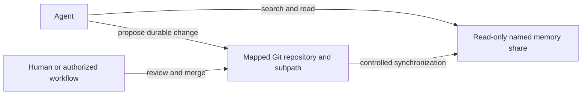

# Use Synology as persistent agent memory

Use a named Synology share as a stable retrieval surface for information an agent may search, list, and read. The
dedicated identity is read-only. Durable additions and corrections go through the mapped Git repository and relative
subpath, where they retain review history and rollback. A controlled synchronization process then updates Synology.



## Profile contract

```yaml
usage: memory
access: read-only
mutation: source-control
repository:
  id: example-memory
  subpath: documents/example
```

The repository ID is logical and does not expose the machine hosting the repository. An agent must not edit the mounted
memory projection directly even when a local operating-system session accidentally makes it writable.

## Acceptance evidence

- The dedicated identity can list, search, and read the named share.
- A write probe through that identity fails.
- The configured repository and subpath represent the same content boundary.
- A reviewed repository change reaches the projection through the controlled synchronization route.
- The identity cannot access an unrelated share.

