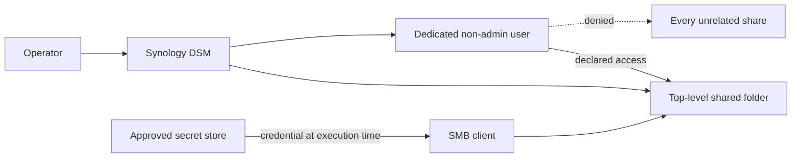

# Provision a named agent share

Create one human-readable top-level share with a dedicated non-admin login, an explicit access mode, and profile-owned
secret references. DSM permissions apply to shared folders; a nested directory or Finder favorite is not an independent
security boundary.

## Procedure

1. Discover the NAS and identify the exact source. Confirm snapshot or backup coverage before migration.
2. Create a top-level DSM shared folder using the configured share name.
3. Create its dedicated non-admin identity with a unique password generated in the approved secret store.
4. Deny unrelated shares and grant only the declared read-only or read-write access to this share.
5. Copy existing data first, compare counts and a bounded sample of sizes or hashes, and retain the old source for rollback.
6. Bind the logical share name, mount path, usage, mutation route, repository mapping when applicable, and secret references.
7. Verify allowed access and denial of an unrelated share using the dedicated identity, without cached personal credentials.
8. Record a value-free receipt containing the share, account, access mode, verification time, and result.

## Credential rotation and revocation

Generate the replacement in the approved secret store, update DSM and the mapped secret during one maintenance window,
clear cached SMB sessions, and repeat positive and negative access checks. Revoke by disabling the dedicated user first;
preserving or deleting data is a separate decision.

