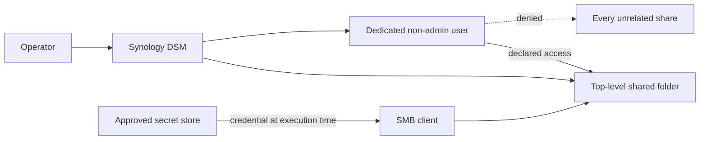

# Provision a named agent share

Create one human-readable top-level share with a dedicated non-admin login, an explicit access mode, and profile-owned
secret references. DSM permissions apply to shared folders; a nested directory or Finder favorite is not an independent
security boundary.

## Provisioning routes

Use either route against the same profile-owned mapping contract:

- **DSM UI route:** the currently verified operator procedure. Use it when the DSM API driver is unavailable or has not
  been verified against the selected DSM version.
- **DSM API route:** the intended automated `share apply` implementation. It must reconcile the same state and emit the
  same value-free evidence. Until its driver is verified, `apply` remains fail-closed and directs the operator to the UI
  route.

Neither route moves existing data as part of share creation. Migration is a separate, reversible operation.

## DSM UI procedure

1. **Discover and protect.** Discover the NAS, identify the exact source, and confirm snapshot or backup coverage before
   any migration.
2. **Create the shared folder.** In **Control Panel > Shared Folder**, create the configured top-level name. Select the
   configured volume, keep the Recycle Bin enabled, do not restrict the folder to administrators, and enable data
   checksum when the workload supports it. Do not enable encryption or WriteOnce unless the profile explicitly requires
   them.
3. **Enable the Team Folder.** In **Synology Drive Admin Console > Team Folder**, refresh, select the share, and enable
   it. Apply the configured version policy; the verified SC memory shares retain eight versions and rotate versions
   older than 30 days.
4. **Create a dedicated identity.** In **Control Panel > User & Group > User**, create the configured non-admin account.
   A human enters and confirms its unique password directly in DSM. Join only the system `users` group.
5. **Constrain folder access.** Grant the dedicated identity **Read Only** on its one memory share and **No Access** on
   every unrelated share, including `homes`. Accept the DSM notice explaining that the account will not have a personal
   home folder.
6. **Constrain application access.** Allow **Synology Drive** only. Explicitly deny AFP, DSM, FTP, File Station, SFTP,
   Synology Photos, SMB, Universal Search, and rsync. Keep default quotas and transfer limits unless the profile declares
   narrower values. Review the confirmation page before creating the account.
7. **Store the credential.** Save the configured username and password under the profile's declared secret references in
   the approved secret store. Never copy either value into Git, command output, screenshots, or agent text.
8. **Project or migrate data.** Configure the declared download-only Synology Drive projection. For existing data, copy
   first, compare counts and a bounded sample of sizes or hashes, and retain the old source for rollback. Do not delete or
   move the source during provisioning.
9. **Verify and record.** With cached personal credentials cleared, prove that the dedicated identity can read its share,
   cannot write to it, and cannot access an unrelated share. Record a value-free receipt containing the share, account,
   Team Folder/version state, access mode, application boundary, verification time, and result.

## Provisioned SC examples

DSM control-plane state and the least-privilege summaries were verified during UI provisioning. Credential-store,
client projection, and positive/negative access checks remain separate acceptance steps.

| Identity | Allowed Team Folder | Folder access | Application access |
| --- | --- | --- | --- |
| `sc-articles-reader` | `articles` | Read only; all other shares denied | Synology Drive only |
| `sc-incorporated-reader` | `incorporated` | Read only; all other shares denied | Synology Drive only |

For remote clients, follow the [private-tunnel access scenario](private-tunnel.md). Use the NAS private DNS name, keep
service ports private, and do not switch this managed route to Synology QuickConnect.

## Credential rotation and revocation

Generate the replacement in the approved secret store, update DSM and the mapped secret during one maintenance window,
clear cached SMB sessions, and repeat positive and negative access checks. Revoke by disabling the dedicated user first;
preserving or deleting data is a separate decision.
