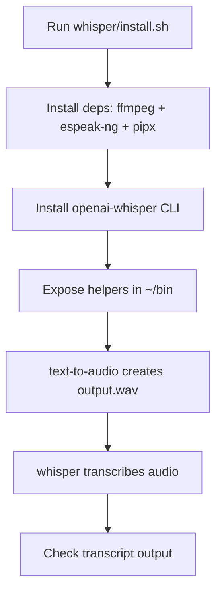

# Whisper setup

Installs OpenAI Whisper CLI on Ubuntu with local helper commands for quick validation.

## Official references

- Whisper repository: <https://github.com/openai/whisper>
- Whisper paper page: <https://openai.com/research/whisper>

## Basic flow



## Architecture

- Entrypoints:
  - `install.sh` installs dependencies/tools and optional smoke-test execution.
  - `text-to-audio.sh` orchestrates script parsing + TTS synthesis + playback + logging.
  - `smoke-test.sh` validates install/log/runtime and runs end-to-end synth + transcription.
- Configuration:
  - `install.config` is the source of truth for feature toggles and voice/prosody defaults.
  - Environment variables override `install.config` values at runtime.
- Parser layer:
  - `sample_text_parser.py` parses `sample-text.txt` according to `sample-text-ai.spec.md`.
  - Produces structured JSON + speaker segments used by the TTS pipeline.
- TTS layer:
  - Primary engine: `edge-tts` (neural voices).
  - Fallback engine: `espeak-ng` (only when fallback is enabled).
  - Multi-speaker mapping (Narrator/Maria/Robert) with per-speaker voice, rate, pitch.
- Audio layer:
  - Segment MP3 -> WAV conversion and final WAV concatenation via `ffmpeg`.
  - Optional immediate playback via `whisper-play-audio` (`ffplay`/`mpv`).
- ASR verification layer:
  - `whisper` CLI transcribes generated WAV to `output.txt` for quick validation.
- Logs/artifacts:
  - Install framework log: `rules/commands/install/logs/install.log`.
  - Text-to-audio runtime logs: `rules/commands/install/whisper/logs/*.log`.
  - Generated artifacts: `rules/commands/install/whisper/test/output.wav` and `output.txt`.

## What it installs

- `ffmpeg` (required runtime dependency)
- `edge-tts` (higher-quality neural TTS, default engine; installer retries via public PyPI if the default pip index fails)
- `espeak-ng` (fallback TTS if neural engine is unavailable)
- `mpv` (CLI audio player to play generated WAV immediately)
- `pipx` (preferred isolated installer for Python CLIs)
- `openai-whisper` package
- helper links in `~/bin`:
  - `whisper-text-to-audio`
  - `whisper-smoke-test`
  - `whisper-play-audio`

## Install

```bash
./install.sh
```

## install.config

Feature toggles are controlled in:

- `rules/commands/install/whisper/install.config`

Main toggles:

- `WHISPER_FEATURE_INSTALL_EDGE_TTS` (`1/0`)
- `WHISPER_FEATURE_INSTALL_ESPEAK_NG` (`1/0`)
- `WHISPER_FEATURE_INSTALL_PLAYER` (`1/0`)
- `WHISPER_FEATURE_AUTORUN_SMOKE_TEST` (`1/0`)
- `WHISPER_FEATURE_REQUIRE_NEURAL` (`1/0`)
- `WHISPER_FEATURE_AUTOPLAY` (`1/0`)
- `WHISPER_FEATURE_MULTI_VOICE` (`1/0`)
- `WHISPER_TTS_TIMEOUT_SEC` (per-segment neural TTS timeout)
- `WHISPER_TTS_DEFAULT_UNLABELED_SPEAKER` (`narrator` recommended)

## Common use cases

- Local transcription for short voice notes.
- Quick subtitle draft generation (`txt`, `srt`, `vtt`).
- Offline transcription checks during development.
- CI/local smoke testing that Whisper is operational on a machine.

## Tests to verify it works

1. Check CLI is available:

```bash
whisper --help
```

2. Generate a sample WAV from text:

```bash
whisper-text-to-audio "Whisper installation check sample text."
```

This command now plays the WAV immediately after creating it.
It also checks previous `text-to-audio` log status and prints current run status (`[OK]`/`[FAIL]`).

If you run without passing text, it uses:

- `rules/commands/install/whisper/sample-text.txt` (default UFO story script)

3. Run end-to-end smoke test (audio generation + transcription):

```bash
whisper-smoke-test
```

The smoke test now validates:

- required commands are available
- install log exists at `rules/commands/install/logs/install.log`
- latest `whisper/install.sh` log status is `OK`
- audio + transcript files are created successfully
- voice-report readiness generation works with the bundled fast voice profile

If any check fails, it exits with non-zero status and prints `[FAIL]` lines.

4. Check outputs exist:

```bash
ls -la ./test
cat ./test/output.txt
```

If a command is missing, open a new shell (`exec zsh`) so PATH updates are loaded.
If noninteractive sudo is unavailable, the installer skips `apt` and still tries the Python-side setup; system packages
such as `ffmpeg`/`espeak-ng` may then need manual install.
If the configured pip index is unreachable, the installer retries Python packages against `https://pypi.org/simple`.
Generated WAV/transcript artifacts are stored in `rules/commands/install/whisper/test/` by default.
Set `WHISPER_AUTOPLAY=0` to disable immediate playback when needed.
Set `WHISPER_TTS_VOICE` (for example `en-US-AriaNeural`) to choose the neural voice.
Neural voice is required by default (`WHISPER_REQUIRE_NEURAL=1`), so the script fails instead of silently using robotic fallback.
Set `WHISPER_REQUIRE_NEURAL=0` only if you explicitly want `espeak-ng` fallback.
Env vars override values from `install.config`.

Script speaker format (multi-voice):

- `[narrator ...]` sets narrator context and is not spoken.
- `Maria: [voice notes]` sets speaker context and is not spoken.
- `Maria: actual line` speaks `actual line` with Maria voice.
- `---` separators are ignored.
- Per-speaker voices are configured in `install.config` (`NARRATOR`, `MARIA`, `ROBERT`).
- Per-speaker prosody is configurable in `install.config` (`WHISPER_TTS_RATE_*`, `WHISPER_TTS_PITCH_*`).
- Unlabeled lines default to narrator voice (`WHISPER_TTS_DEFAULT_UNLABELED_SPEAKER=narrator`).
- Common typos like `Robot` are normalized to `Robert`.

Structured parser:

- `sample_text_parser.py` parses `sample-text.txt` per `sample-text-ai.spec.md`.
- When `text-to-audio.sh` uses default sample text, it first generates:
  - `logs/sample-text.parsed.json`
  - parsed speaker segments used for synthesis

## Framework notes

- Installer execution is logged to `rules/commands/install/logs/install.log`.
- No `v_matrix.json` entry is required for Whisper in the current framework because it does not use matrix-driven version selection.
