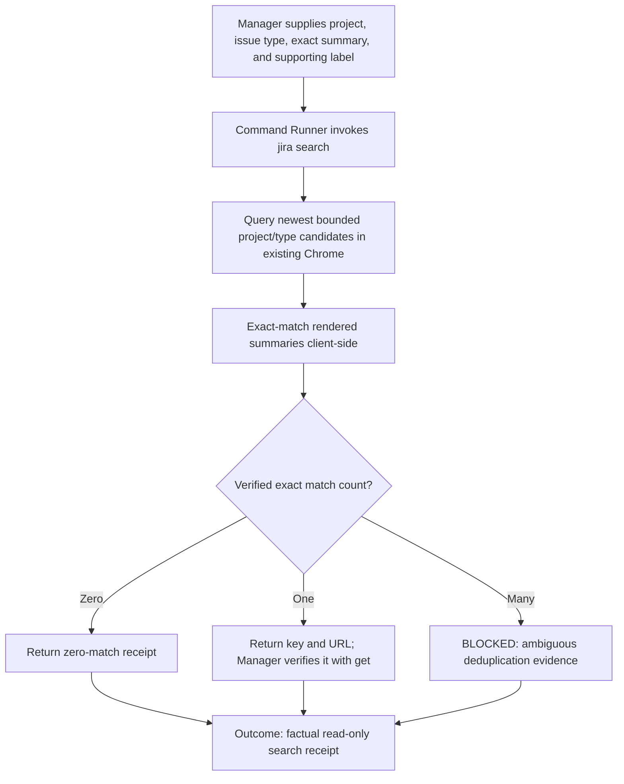
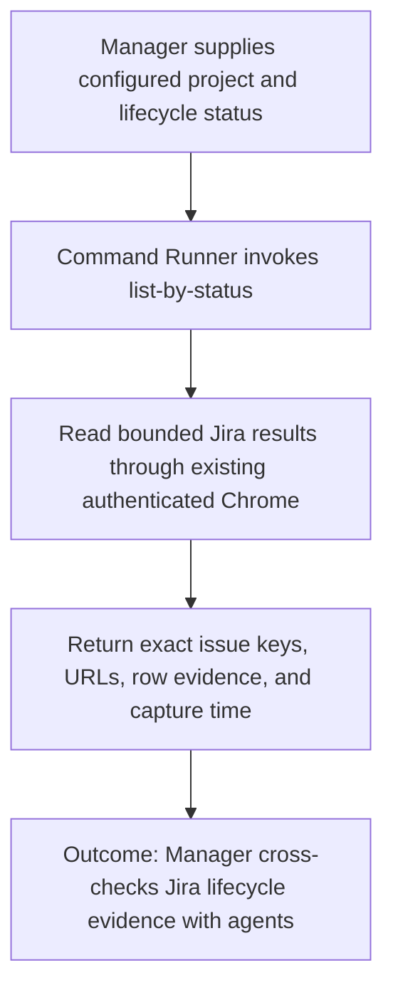

## Execution role

- `command-runner` — Bounded mechanical execution is allowed when the work order supplies exact context and instructions.

## Tags

#command #jira #ticket #browser #playwright #e2e

For a teammate-friendly overview and examples, see [`README.md`](README.md).
For reusable live verification of board inventory, exact reads, and workflow routing, follow
[`jira.scenario.md`](jira.scenario.md).

Read, create, clone, safely update, comment on, transition an owned ticket to In Progress, or synchronize a Jira ticket
by driving the visible Jira UI in the operator's existing authenticated Chrome window. The default macOS transport uses
JavaScript from Apple Events through a shared Node driver; an explicitly configured Playwright transport remains
available as a fallback for isolated testing. This command must not use the Jira REST API, GraphQL, MCP, or direct
database access.

## Intent mapping

- Requests such as `current sprint`, `get current sprint`, or `show current sprint` map to `[dev][jira]
current-sprint`; it reports the configured visible board URL for clone-source selection.
- Requests such as `create a Jira`, `open a ticket`, `file a Jira`, `create the follow-up ticket`, `update the Jira
description`, `add a comment to Jira`, or `sync my plan with Jira` map to `[dev][jira]`.
- Route work through explicit subcommands: `get`, `search`, `list-by-status`, `create`, `clone`, `update`, `comment`,
`set-in-progress`, `sync-plan`, or `template`. `get ISSUE-KEY --output-dir DIR` is the registered read-only route and
writes a factual JSON receipt from the visible issue page. `search --project KEY --issue-type TYPE --summary-exact TEXT
--label LABEL --output-dir DIR` is the registered closed-schema read-only deduplication route; Manager uses its
zero/one/many receipt before a create decision. `list-by-status --project KEY --status STATUS --output-dir DIR` is the
registered read-only lifecycle inventory route used before Manager cross-checks active agents. Each browser-writing
operation has an isolated shell entry point and shares only the common browser/bootstrap runner and driver.
- When the new work follows an existing Jira, prefer `--clone <issue-key>` so Jira carries forward the source ticket's
project/type conventions through its own Clone UI; then replace the summary and description with the new scope.
- When creating a follow-up for the current sprint, open the configured sprint board, choose a relevant current-sprint
issue as the clone source, and use `clone` rather than `create`. Jira's Clone UI preserves the source ticket's sprint
membership by default; preserve it unless the user explicitly requests a different sprint or backlog placement.
- Use `JIRA_CURRENT_SPRINT_BOARD_URL` from Jira command config when set. The configured board is the source of truth
for selecting a current-sprint clone source; do not guess a sprint from issue numbering or status alone.
- After creating a clone, clear Smart Checklist items inherited from the source before applying the new description.
Then synchronize the active session plan to the new issue so its Smart Checklist represents the current process state,
not the source ticket's work. Preserve the source checklist and other explicitly requested clone context such as sprint
membership.
- Submitted create and clone flows add an ai-config ownership-marker comment. `set-in-progress` is allowed only when
the authenticated user is the visible reporter or authored a visible ai-config ownership-marker comment; this
accommodates cloned tickets that preserve the source reporter while refusing unrelated tickets.
- Collect the project key, app/project display name, issue type, summary, and description before execution. Labels,
priority, assignee, parent, and story points are optional.
- When an estimate is requested, pass `--story-points <number>`. Create flows set the configured Jira field when
available. Jira's Clone dialog can omit Story Points, so clone flows preserve the source estimate and verify the
visible value after creation before reporting success; choose a clone source with the requested estimate.
- Prefer `--ticket-file` for multiline descriptions and repeatable automation.
- Ticket meaning and formatting are profile-owned. Manager resolves and validates the active profile's summary convention,
  description template, required sections, and project-specific fields before execution. This provider command validates
  only Jira-safe mechanics and must not invent or enforce a client/workflow ticket format.
- `jira.command.sh template` prints the template selected by `JIRA_DESCRIPTION_TEMPLATE_FILE`; it fails closed when the
  active profile has not configured one.

## Configuration source and precedence

This command is organization-neutral. It does not know a corporation's Jira host, project key, board, lifecycle names,
or custom-field IDs. The active profile/project configuration is the canonical source for those non-secret values and
provides them through `tracker.execution.command_env_overrides` in the initialized tracker execution binding. Every override
key must match a placeholder documented by this command (for example `JIRA_BASE_URL` or
`JIRA_CURRENT_SPRINT_BOARD_URL`). Manager forwards that validated binding unchanged and
Command Runner invokes the registered command relative to the initialized `commandsRoot` with its resolved environment.

Configuration precedence, from highest to lowest, is:

1. Exact operation arguments in the authorized command packet.
2. `command_env_overrides` resolved from the active profile's tracker execution binding.
3. An explicitly selected machine-local `jira.command.conf`, limited to secrets and machine-specific settings.
4. Generic fail-closed placeholders and mechanical defaults supplied by this command.

Committed `jira.command.example.conf` values are placeholders that document supported override names. They are not a
profile and must never contain a real organization's Jira URL, project key, board ID, credentials, or ticket policy.
Machine-local configuration is optional and is appropriate only for secrets, local browser paths, and machine-specific
timeouts. The loader preserves any profile-resolved organization setting when the same name also appears locally, so the
local file cannot become a second canonical copy of profile-owned settings. Missing required profile context is
a configuration blocker; the command must not infer it from the current directory, an issue URL, browser history, or a
same-named local file.

### Declared profile override placeholders

An active profile may populate these keys under `tracker.execution.command_env_overrides`:

| Placeholder                      | Purpose                                                          |
| -------------------------------- | ---------------------------------------------------------------- |
| `JIRA_BASE_URL`                  | Organization Jira origin used for board and search navigation    |
| `JIRA_BROWSE_BASE_URL`           | Issue browse base used for exact ticket reads                    |
| `JIRA_ISSUE_KEY_PATTERN`         | Organization-supported issue-key validation pattern              |
| `JIRA_STORY_POINTS_FIELD_ID`     | Jira custom field used for story-point mechanics                 |
| `JIRA_BROWSER_MODE`              | Registered browser transport selection                           |
| `JIRA_CURRENT_SPRINT_BOARD_URL`  | Exact board/filter URL used for current-sprint selection         |
| `JIRA_DESCRIPTION_TEMPLATE_FILE` | Profile-owned ticket-description template path                   |
| `AI_CONFIG_REPO_URL`             | Public attribution link used by submitted command-owned comments |
| `AI_CONFIG_JIRA_COMMAND_URL`     | Public Jira-command attribution link                             |

Browser profile directories, channels, headless selection, and timeout values are machine-specific placeholders and may
remain in ignored local configuration unless a profile deliberately standardizes them. Credentials, cookies, and tokens
must never be placed in `command_env_overrides`.

In `existing-chrome` mode, the visible authenticated Jira session is the source of truth for the current actor. A profile
may set `tracker.actor.source: authenticated_session` and an ownership field such as `assignee`; it need not hardcode a
username. Exact-read receipts expose `authenticatedUser` when Jira renders the current-user profile identity. An optional
profile expected display name is only a fail-closed account guard. For a user-scoped request, missing authenticated-user
evidence is a blocker rather than permission to infer identity from Git, the operating system, or ticket history.

## Mandatory operational route

`command-runner` is the Jira execution role.

`manager` owns Jira/tracker identity, semantics, deduplication, intended
mutation, and readback interpretation. Designer/Reviewer routes every Jira
intent—including read-only ticket inspection—to Manager and never operates
Jira, its browser automation, tracker connectors, or these scripts directly.
Manager uses its configured Jira capability when available. Only when that
capability is unavailable may Manager dispatch the exact registered Jira
fallback to `command-runner`, which must discover and follow this command
document and invoke the matching `./ai-commands/jira/jira.command.sh` subcommand.
A Jira key used as task context is not mutation intent, and naming a Codex role
never means creating or assigning Jira work. Direct browser interaction is not
a substitute for this command flow; use it only for narrow recovery or
verification after a command attempt recorded its result artifact.

- Synchronize Jira Smart Checklist updates with
  `./ai-commands/jira/jira.command.sh sync-plan`, using the active external
  `session-plan.md` or an explicit `--session-plan FILE`. Pass `--submit` only
  after the user explicitly authorizes the Jira write. Manager supplies the
  issue/session-plan inputs and authorization state; command-runner owns the
  command and browser mechanics.
- Route Jira description and summary changes through
  `./ai-commands/jira/jira.command.sh update ISSUE-KEY` with the prepared
  description and optional `--summary`; pass `--submit` only after explicit
  user authorization.
- Keep the existing authenticated visible-Chrome automation model. Do not
  introduce Jira REST APIs, GraphQL, MCP, or other direct Jira access.

## Registered exact search



`search` is the reusable registered Jira discovery and create-deduplication subcommand. Use it instead of manually
scanning recent tickets or inventing another browser route:

```bash
./ai-commands/jira/jira.command.sh search \
  --project EXAMPLE \
  --issue-type Task \
  --summary-exact "[Example Service][AI Config Live Test]: Return finalName in key-group responses" \
  --label ai-config-live-test \
  --output-dir /private/tmp/jira-search
```

The command queries a bounded newest-first project/type candidate set and performs the exact summary comparison against
rendered results. Jira's optional create-form label is supporting evidence only and is not identity. A valid Jira
search may redirect directly to the newest matching issue; that redirected issue page is supported, as is the normal
result table. Console receipts include `JIRA_SEARCH_STATUS`, `JIRA_SEARCH_MATCH_COUNT`, and one `JIRA_SEARCH_MATCH` per
verified key/URL. Zero, one, and multiple matches are factual results; Manager owns the semantic decision. Before
create, Manager may authorize creation only from a fresh zero-match receipt. For one match, read the candidate by exact
key and verify its expected marker and fields. Multiple matches fail closed.

## Registered status inventory



Use the registered read-only status inventory before answering an overall-progress question:

```bash
./ai-commands/jira/jira.command.sh list-by-status \
  --project EXAMPLE \
  --status "In Progress" \
  --output-dir /private/tmp/jira-in-progress
```

When `JIRA_CURRENT_SPRINT_BOARD_URL` is configured, the command opens that exact board and reads only the matching status
column. It does not construct a global issue search that Jira may redirect into the first issue's detail view. Without a
configured board it falls back to the bounded project/status JQL search. The command writes
`jira-list-by-status-result.json` with source mode/URL, exact JQL when applicable, issue count, issue keys, URLs, rendered
row evidence, and capture time. Manager interprets and correlates the receipt; Command Runner owns only the browser mechanics.
This route is read-only and never transitions, edits, assigns, comments on, or otherwise mutates a Jira issue.

## Profile-owned ticket policy

The active profile/project context owns summary and description conventions, templates, required sections, definition of
done, custom fields, and any organization-specific terminology. Manager validates that policy before invoking Jira. The
Jira adapter preserves the supplied values and verifies the visible Jira result; it does not know which client or workflow
selected them.

## Safety and interaction

- On macOS, live execution requires an existing Chrome window and first checks its front tab. If Chrome has no window
or JavaScript from Apple Events is disabled, the command stops without launching another browser or changing Jira.
- The existing-Chrome create route supports Jira's current two-step form: verify the configured Project and Issue Type
on the first page, click `Next`, then fill Summary, Description, and remaining fields. Failure to reach the second page
is a command/UI compatibility blocker, not an authentication conclusion.
- Enable `View > Developer > Allow JavaScript from Apple Events` in Chrome. The command reuses the existing
authenticated tab/session and does not require a separate automation profile in the default mode.
- `JIRA_APPLE_EVENTS_ACCESS_UNAVAILABLE` is runtime-boundary evidence, not proof that Chrome or Jira is unavailable.
Command Runner must retry the same registered Jira command with identical arguments exactly once through the platform
desktop/Apple Events escalation route. Only the escalated result may classify the external Chrome/Jira state; an
unavailable escalation is a platform-permission blocker.
- Without `--submit`, it fills the form, captures a screenshot/result, and does not click Create.
- Clicking Create is an external write. Use `--submit` only when the user explicitly asked to create the ticket or
approved the filled ticket.
- Do not place passwords, tokens, cookies, or other secrets in ticket files, command arguments, reports, or committed config.
- Jira UI changes can invalidate locators. On failure, keep the result artifact and update the UI locator logic; do not
fall back to an API or MCP.
- The command never deletes, trashes, removes, or archives Jira issues, attachments, links, or unowned comments. The
sole deletion exception is an explicitly submitted `delete-owned-comment` operation that passes author and ai-config
marker verification.
- Allowed Jira writes are create/clone and an explicitly requested non-destructive update of an existing issue's
description (plus an optional profile-approved summary). Existing-issue updates require `--update <issue-key>`, a
profile-approved description, and explicit `--submit`; they do not change status, assignment, priority, labels, links,
comments, or attachments.
- The only allowed status write is `set-in-progress ISSUE-KEY --submit`. It is idempotent, ownership-guarded, and
cannot transition to any other status. Preview and validation modes do not change Jira.
- Before an existing-issue update, preserve the current summary, description, and other editable form values in
`jira-ticket-before.json`. After submission, reopen the Edit form, save `jira-ticket-after.json`, and fail verification
if the requested summary/description did not persist or another editable field changed.
- After a verified submitted update, add a timestamped Jira comment stating that ai-config performed the update. The
comment must link to the ai-config repository and the Jira command folder. This attribution comment is part of the
update workflow and is not optional when `--submit` is used.
- Mark every ai-config-created Jira comment with `/created-with-ai-config`. Deletion is allowed only through
`delete-owned-comment`, only with explicit `--submit`, and only when the comment author matches the authenticated Jira
user and the ownership marker is present. The earlier attribution heading is accepted as a legacy marker for comments
created before this rule.
- Adding a comment is non-destructive but requires explicit `--submit`. Use repeatable `--mention USER` and `--link
"LABEL|HTTPS_URL"` arguments so Jira receives native `[~USER]` mentions and `[LABEL|URL]` links. After submission, the
command must read the visible comment list and verify the requested comment text plus every requested link inside that
comment; never report success from a button click alone. `--skip-if-link-exists` checks visible Jira comments for an
ai-config-owned comment carrying the same link and exits without creating a duplicate; use it for automated PR-link
comments. Prefer `--comment-file` for multiline text.
- For product implementation work, use one Jira comment at the initial draft-PR milestone to link the product PR. Keep
it concise and reviewer-facing: state the PR, delivered behavior, and only validation results or blockers that
materially affect review or release. Do not include internal setup or credential-refresh details (for example SDE),
routine command mechanics, or other facts unrelated to the change. Do not add later Jira comments for individual
ai-config workflow/helper commits; retain those references in the product PR body.

## Usage

```bash
./ai-commands/jira/jira.command.sh template > /tmp/jira-description.md

./ai-commands/jira/jira.command.sh search \
  --project EXAMPLE \
  --issue-type Task \
  --summary-exact "[Example Service]: Exact ticket summary" \
  --label optional-supporting-label \
  --output-dir /private/tmp/jira-search

./ai-commands/jira/jira.command.sh \
  create \
  --project EXAMPLE \
  --issue-type Task \
  --summary "[Example Service]: Add version-scoped selector search coverage" \
  --description-file /tmp/jira-description.md

./ai-commands/jira/jira.command.sh create --ticket-file /path/to/ticket.json --submit

./ai-commands/jira/jira.command.sh \
  clone EXAMPLE-8316 \
  --summary "[Example Service]: Support selector search in published version snapshots" \
  --description-file /path/to/follow-up.md \
  --story-points 1 \
  --submit

./ai-commands/jira/jira.command.sh \
  update EXAMPLE-8336 \
  --description-file /path/to/revised-description.md \
  --submit

./ai-commands/jira/jira.command.sh sync-plan EXAMPLE-8336 --submit

./ai-commands/jira/jira.command.sh comment EXAMPLE-8336 \
  --comment-file /path/to/comment.txt \
  --mention sshapiro \
  --link "Draft PR|https://github.example.invalid/example-org/example-service/pull/504" \
  --skip-if-link-exists \
  --submit

./ai-commands/jira/jira.command.sh set-in-progress EXAMPLE-8399 --submit

./ai-commands/jira/jira.command.sh delete-owned-comment EXAMPLE-8336 \
  --comment-id 12160426 \
  --submit
```

Ticket JSON shape:

```json
{
  "project": "EXAMPLE",
  "cloneFrom": "EXAMPLE-8316",
  "issueType": "Task",
  "summary": "[Example Service]: Add version-scoped selector search coverage",
  "description": "<complete rendered Jira description template with every placeholder replaced>",
  "labels": ["localization", "selectors"],
  "priority": "Medium",
  "storyPoints": 1,
  "assignee": "",
  "parent": ""
}
```

For a new ticket, `project`, `issueType`, `summary`, and `description` are required. For a clone, the issue key,
`summary`, and `description` are required; the project is inferred from the source key and Jira retains the source
issue type unless explicitly changed in the Clone UI. Optional `storyPoints` values must be non-negative numbers and
are verified after create/clone submission. For an update, the issue key and `description` are required; `summary` is
optional, and other field changes are rejected. Manager is responsible for profile policy validation before invoking
this adapter. Use `--validate-only` to validate and normalize Jira mechanics without opening a browser. Use
`--output-dir` to override `AI_FLOW_OUTPUT_DIR`; otherwise reports go under `<project>/.ai/jira/` or
`ai-commands/jira/reports/`.

The `template` subcommand prints the active profile's configured description template. It does not require Playwright,
Jira authentication, or browser access. Complete and validate that template according to the profile policy, then pass the
result with `--description-file`. The abbreviated JSON description above is illustrative, not literal ticket content.

Use Jira-native wiki markup in description files: `h2.`/`h3.` headings, `*` bullets, `#` numbered items, `{{inline
code}}`, and `{code}` blocks for actual code. Do not use Markdown `##` headings: Jira interprets leading `#` characters
as numbered-list markers, which produces duplicated numbering such as `1. 1.`. Do not wrap the whole description in
`{code}` because that removes semantic headings, lists, links, and readable ticket structure.

Subcommand entry points:

- `create-ticket.sh`: create a new issue from explicit project/type inputs or a ticket file.
- `clone-ticket.sh`: clone a named source issue and replace its summary/description.
- `update-ticket.sh`: update only the description and optional summary of a named existing issue.
- `add-comment.sh`: add a Jira-native formatted comment to an existing issue.
- `set-in-progress.sh`: verify ticket ownership and transition only to In Progress.
- `jira-set-in-progress.mjs`: isolated visible-UI implementation and post-transition verification.
- `delete-owned-comment.sh`: delete only a specifically identified comment after authenticated-author and ai-config
ownership-marker verification.
- `sync-plan.sh`: map the active Flow `session-plan.md` checkboxes to Jira Smart Checklist.
- `jira-ticket-runner.sh`: shared dependency checks, active-Chrome preflight, config/output setup, and JavaScript
driver invocation. Do not call it directly for normal operator workflows.

### Smart Checklist plan sync

`sync-plan` reads the active external Flow session through `<AI_SESSIONS_ROOT>/.current-session-path`, then reads that
session's `session.env` and `session-plan.md`; it never uses a repo-local session directory. Pass `ISSUE-KEY`
explicitly, or let the command infer it from active session metadata and plan text. `--session-plan FILE` is available
for focused validation and tests.

For a cloned issue, run `sync-plan <new-issue-key> --submit` only after the inherited checklist has been cleared and
the active session plan has been updated to the real current status. The resulting managed checklist must describe the
new story's active work; do not copy source-ticket steps.

Markdown `- [ ]` items become incomplete Smart Checklist items and `- [x]`/`- [X]` items become complete items,
preserving plan order. The command translates these to Smart Checklist's native bulk syntax (`-` pending and `+`
completed), then reconciles the rendered checkboxes. It replaces only the section between `# AI Flow Plan (managed by
ai-config)` and its managed end marker. Checklist content outside that section is preserved, duplicate managed blocks
are collapsed, and a legacy managed section without an end marker is migrated on its next sync.

Without `--submit`, the command fills the bulk editor and cancels, leaving Jira unchanged. Use `--validate-only` for
parsing with no browser interaction. Use `--submit` only when the user explicitly asks to sync the plan; repeated runs
update the same managed section.

Supported machine-local overrides belong in ignored `jira.command.conf`; committed generic placeholders live in
`jira.command.example.conf`:

```bash
JIRA_BASE_URL="https://jira.example.invalid"
JIRA_BROWSE_BASE_URL="https://jira.example.invalid/browse/"
JIRA_ISSUE_KEY_PATTERN="^[A-Z][A-Z0-9_]*-[0-9]+$"
JIRA_STORY_POINTS_FIELD_ID="customfield_10004"
JIRA_BROWSER_MODE="existing-chrome"
JIRA_CURRENT_SPRINT_BOARD_URL="https://jira.example.invalid/secure/RapidBoard.jspa?rapidView=0&projectKey=EXAMPLE&quickFilter=0"
```

The issue-key regex is intentionally configurable because Jira project key conventions may differ later.

## Output

- `jira-ticket-result.json`: normalized non-secret inputs, status, created issue key/URL when available, and error details.
- `jira-ticket-before.json` / `jira-ticket-after.json`: existing-issue snapshots used to verify intended changes and
retain the previous Jira state.
- `jira-ticket.png`: final form/result screenshot when the selected browser transport supports capture.
- `jira-smart-checklist-result.json`: inferred issue, source plan, normalized checklist items, and sync status.
- `jira-comment-result.json`: formatted non-secret comment input, Jira issue URL, and comment status.
- `jira-set-in-progress-result.json`: ownership evidence, previous/final status, issue URL, and transition result.
- Console markers: `JIRA_TICKET_STATUS`, `JIRA_TICKET_RESULT`, and, after creation or update, `JIRA_TICKET_KEY` / `JIRA_TICKET_URL`.
- When story points are requested and verified, the command also prints `JIRA_TICKET_STORY_POINTS`.
