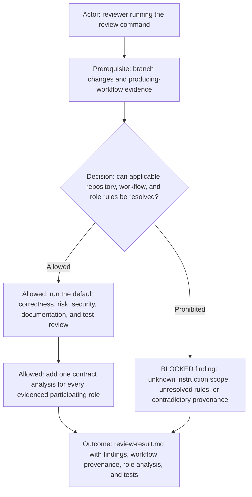

# Review Command

## Execution role

- `designer / reviewer` — invoke this semantic review directly. Do not delegate evidence interpretation, finding
  selection, or report authorship to Command Runner.

The diagram is the review route; the rules below define its exact evidence and reporting requirements. A diagram/text
mismatch is a blocking defect in this command documentation.

Use this command to perform a branch review (validate = review) and write `review-result.md` under
`${AI_FLOW_OUTPUT_DIR:-<commandsRoot>/review}` (not the target repo being reviewed), where `commandsRoot` comes from
the initialized configuration binding.

The report must read like a PR review comment: it should clearly call out what is wrong or risky,
what to improve or change, and any missing tests/docs. Avoid a "only what changed" summary-only writeup.
When the changes touch generated API contract artifacts, follow the repository-local format/publish steps before final review.
Every PR must include a link to the related ai-config commits that updated instructions/automation for this workstream.

Model discipline:

- Review/validation work is one of the few places where `high`/`xhigh` reasoning is acceptable by default.
- When the active work changes from review back to coding or script execution, re-check the model/tier and downgrade
before continuing unless the user explicitly insists.

Steps:

1. Collect all commits in the current branch (relative to main) with messages and diffs.
2. Locate relevant documentation for the context:
   - Use existing `/documentation/*.md` files in the repo when present.
   - If none exists, note that in the review.
3. Review code changes, tests, and docs against `definition-of-done.md`.
   - Before requiring Snyk, check the selected project entry in `commands/projects/projects-registry.yml`; registry
fields such as `snyk_required: false` or `snyk_project_url: NONE` override the base review/Definition of Done Snyk
expectation.
   - For Smithy changes, explicitly check doc style consistency (prefer `///` over `@documentation(...)` unless the
existing model uses traits), and prefer `@examples`/`@dataExamples` for usage samples instead of inline comments.
     3.1) Workflow integrity check (treat markdown as code, not prose) when changes include workflow or command docs:
   - Inspect the changed workflow package, its manifest, its guides, and the affected command definitions.
   - Validate that the package metadata, runtime entry points, and command requirements agree.
   - Validate that command references resolve inside the selected configuration bundle.
   - Flag any inconsistency as a blocking finding because workflow documentation and manifests are runtime inputs.
     3.2) Producing-workflow role review (additive to every default review):
   - Determine which initialized workflow produced the reviewed code from the ticket packet, workflow/task evidence,
handoffs, or other recorded provenance. Do not infer a workflow merely from the current directory or current reviewer
session.
   - Resolve that workflow, its shared routing rules, capability matrix, guides, and role contracts only through the
selected configuration-bundle binding.
   - Enumerate every role evidenced as participating in producing or validating the change. Include the
originating/planning, design/review, coding, command-execution, and acceptance roles when their packets or handoffs
show participation; do not invent participation from a role's availability alone.
   - Read each participating role definition completely, then locate the sections relevant to that role's contribution
by meaning rather than by one required heading. Relevant sections include ownership and boundaries, design or
requirements fidelity, coding style and DDD, command delegation, validation and testing, UI acceptance, communication
and return routing, evidence, and closure authority when present.
   - Follow references from those role sections to shared routing, capability matrices, workflow guides, and
command/style contracts inside the selected configuration bundle. An unresolved reference or contradictory role-rule
chain is a review finding.
   - For each participating role, run a distinct role-lens analysis of its inputs, actions, outputs, handoffs, and
resulting code against that role's exact initialized contract and the shared workflow rules. This is contract-based
analysis of recorded evidence, not permission to contact, wake, initialize, or send messages to participants.
   - Apply the role lenses that exist in the producing workflow rather than collapsing them into one generic agent check:
     - Designer/Reviewer: project-documentation and ticket prerequisites; Manager-first ticket resolution where
required; architecture and semantic ownership; matching vertical implementation diagram and prose; complete worker
packets; direct dispatch to the correct worker; and independent technical review.
     - Manager: verified caller, project, repository, return route, and tracker binding; deterministic ticket-search
budget; exact reuse versus bounded checklist addition versus distinct creation; grounded labels, priority, and
hours-or-days estimate; matrix-correct staffing; no worker-proxy behavior; and evidence-backed closure only after
required gates.
     - Coder: exact ticket and accepted packet; execution-role and repository binding; diagram/text design preflight;
bounded authorized edits; low-level implementation decisions; validation requests returned to Designer/Reviewer;
preservation of unrelated work; and terminal non-closure evidence.
     - Command Runner: exact ticket and registered command identity; validated parameters, preflights, approvals,
encoded effects and cleanup; no raw-shell reconstruction, semantic decisions, code edits, or UI acceptance; and an
exact terminal command receipt including resulting state.
     - UI Acceptance Tester: exact ticket, documented journey, readiness, and expected state; delegation of registered
setup, launch, readiness, capture, reset, and cleanup commands; visible end-user interaction and positive evidence; no
API, source-inspection, database, or headless substitute; and terminal non-closure acceptance evidence.
     - Judge: per-role cursor scope when scheduled; complete participant-communication firewall; no initial rule meaning
       or semantic policy authorship; protected edits only after a verified human-authored Markdown seed and only for
       meaning-preserving maintenance; validation of each permitted maintenance diff; and reporting only through the
       authorized human or scheduler route.
     - Human lead: explicit outcome, scope, exception, approval, and final-authority evidence when a downstream role
relies on human authorization.
   - Use the capability matrix as a cross-cutting ownership check. Flag work performed by the wrong role even when the
resulting code or command output appears correct; output correctness does not erase a routing or authority violation.
   - Trace each finding to the violated role rule and concrete code or workflow evidence. Check at minimum ticket/scope
authority, design fidelity, implementation style and DDD discipline, command delegation, test evidence, UI acceptance
evidence, return routing, and closure authority when those responsibilities apply.
   - Treat missing or contradictory workflow provenance, missing required role evidence, role-boundary violations, and
code that contradicts an applicable role contract as review findings. If the producing workflow cannot be established
after bounded evidence inspection, report `PRODUCING_WORKFLOW_UNKNOWN` and state which evidence is missing; do not
silently substitute the current workflow.
   - Keep this role-contract pass additive: it must not replace or weaken the existing correctness, security,
documentation, testing, Definition of Done, or code-quality review.
4. If controller changes are present, verify Hurl tests exist or flag the gap.
   4.1) Security hygiene check: flag any scripts or logs that print or persist secrets (API keys, tokens, auth
headers), and require redaction or suppression.
   Example redaction (bash, aligned with recent findings):
   - `some_command 2>&1 | perl -pe 's/(x-api-key:)[^\r\n]*/$1 [REDACTED]/ig;
s/(--header\s+["'\'']x-api-key:)[^"'\'']*/$1 [REDACTED]/ig; s/(API Key:\s*).*/$1[REDACTED]/;
s/(Authorization:\s*Bearer\s+)[^\r\n]*/$1[REDACTED]/ig; s/(OKTA_[A-Z_]+=)[^ ]+/$1[REDACTED]/g; s/(OIDC_[A-Z_]+=)[^
]+/$1[REDACTED]/g'`
5. If this is a re-review after PR updates:
   - Compare against the previous review result and identify fixes made since the last review.
   - Briefly report in the console what findings were fixed and what still remains.
   - Update the review result accordingly.
6. Write the review summary to `${AI_FLOW_OUTPUT_DIR:-<commandsRoot>/review}/review-result.md` (local-only; must be gitignored).

## Documentation Review

- see the `commands/doc/doc.command.md` - validate (review) if the documentation in the current changes meets the quality bar.

Report format:

- Findings: ordered by severity with file/line references, describing issues, risks, or required changes.
- Workflow Integrity: explicitly state whether workflow docs/command maps/inheritance are valid when those files changed.
- Producing Workflow: identified workflow and exact provenance used, or `PRODUCING_WORKFLOW_UNKNOWN` with missing evidence.
- Role Contract Analysis: one entry per evidenced participating role with contract sources, evidence inspected,
disposition, and findings; explicitly state that no participant was contacted.
- Role Rule Sources: participating role-definition files, relevant semantic sections, and resolved shared workflow,
routing, review, style, DDD, testing, and acceptance rules.
- Questions/Assumptions: anything unclear or needing confirmation.
- Change Summary: brief (secondary; do not lead with this).
- Tests: what was run or not run.
- Provenance: record `Reviewed-By-Role: designer-reviewer`, the producing/initiating role, and whether branch, commit, and
  PR provenance agree. Review identity does not replace the initiating role.

## Inputs

## Roles

- `planner`
- See command description
- AI_FLOW_PROJECT_DIR / AI_FLOW_OUTPUT_DIR when applicable

## Output

- Updated files/logs/reports described above
- Terminal output and exit status
