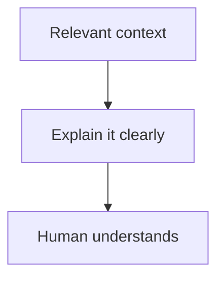
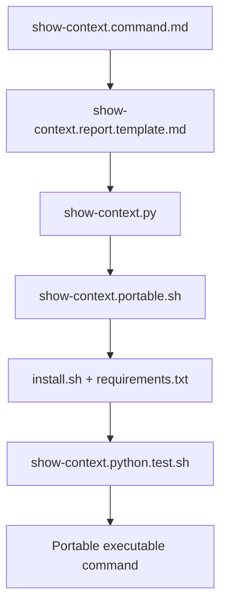
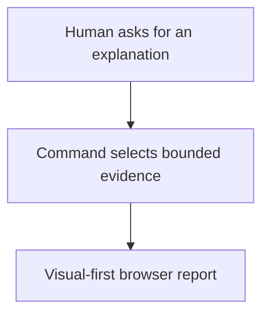
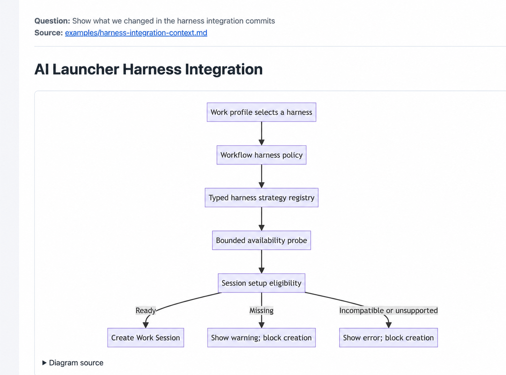
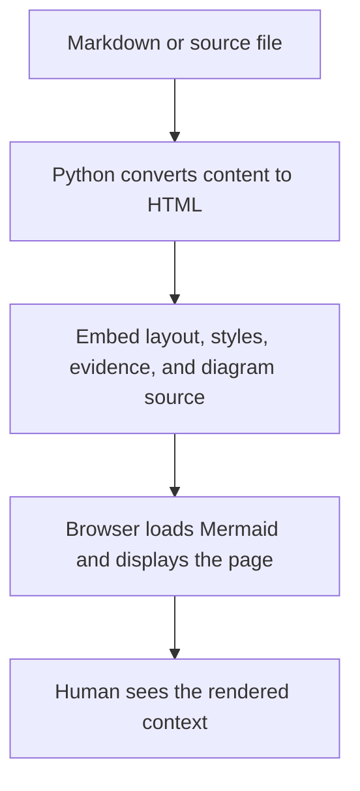
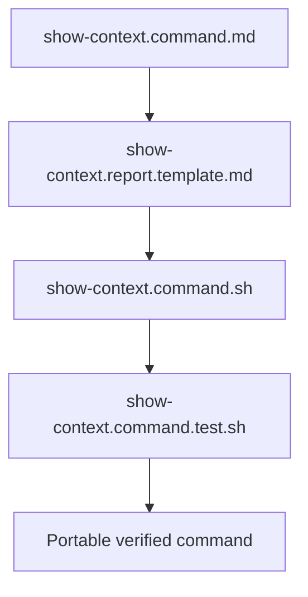
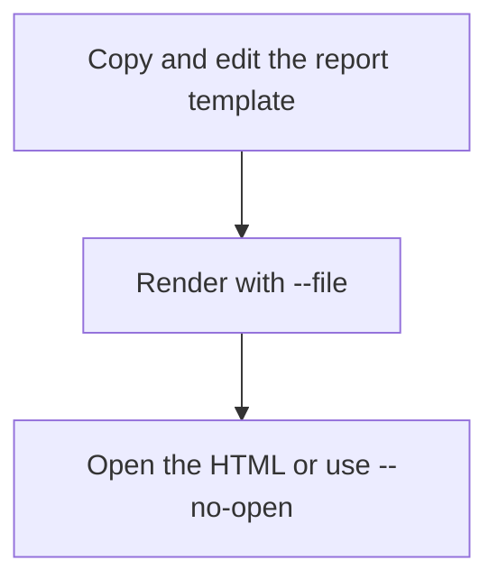
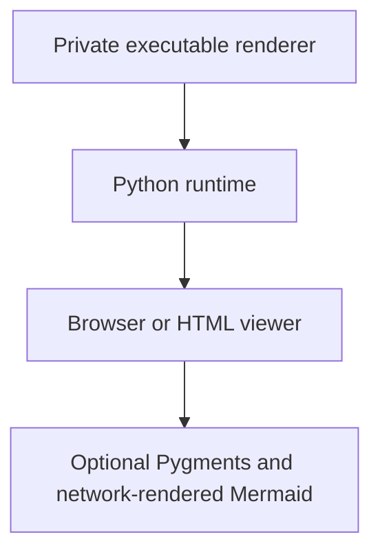

# Show Context



**Use `show-context` to explain relevant context to a human.**

It is a generic presentation command for turning bounded evidence
into a human-readable report. It is useful on its own and as the final visual
layer of code review, investigation, handoff, architecture, and testing flows.

**Usually:** inspect relevant folders, source material, conversation history,
summaries, or reports; select what matters; then present it in the form a human
can understand most easily. Connect the command to the human-facing agent that
has access to—and responsibility for—the relevant knowledge. The
[`agents` command](../agents/README.md) explains the shared identity,
capability, context-boundary, and communication rules for that connection.

## Portable package



The portable layer consists of the command contract, visual-first report
template, standard-library Python renderer, and its test. It requires Python 3
and an HTML viewer or browser. Mermaid loads from a public CDN when network
access is available; diagram source remains readable without it. Pygments is an
optional enhancement and is never required to generate a report.

The renderer does not assume a profile, organization, operating system, package
manager, or local directory.

## Browser example





This sanitized example shows the intended result: the reader's question and
source are explicit, the explanation starts with a vertical diagram, and the
report opens as a readable browser page. The example source is intentionally a
portable relative path; generated reports must not expose private machine paths
or unrelated context.

For reproducible syntax highlighting, run `./install.sh` once and invoke
`./show-context.portable.sh ...`. Without installation, the wrapper uses an
available system Python and still produces readable escaped code. Installation
never writes into the global Python environment.

## How rendering works



The render logic lives in `show-context.py`; there are no prebuilt report files.
It reads the source, converts supported Markdown and code blocks to HTML, embeds
the page layout and CSS, writes one standalone HTML artifact, prints its path,
and opens it with the system browser unless `--no-open` is supplied. Mermaid is
rendered inside that page by the browser when the public CDN is reachable.

Without `--output`, a source such as `review.md` produces `review.md.html` beside
the source. Use `--output <path>` to place generated reports in a temporary,
ignored, or command-owned output folder. Generated HTML is runtime output and
should not be committed.

## Private package extensions



- [`show-context.command.md`](show-context.command.md) defines intent, mapping,
  report structure, safety boundaries, and completion.
- [`show-context.report.template.md`](show-context.report.template.md) is the
  smallest visual-first report starting point.
- `show-context.command.sh` renders evidence to HTML; local private bundles may
  extend it with project discovery or shared-file integrations.
- `show-context.command.test.sh` verifies the portable rendering contract.
- `show-context.portable.sh` uses the isolated command environment when present
  and a readable standard-library fallback otherwise.
- `install.sh` creates that local environment and installs only the dependency
  declared in `requirements.txt`.

## Quick start



```bash
./show-context.command.sh \
  --file show-context.report.template.md \
  --title "Review context" \
  --request "What should the reader understand?"
```

Without the private renderer, copy `show-context.report.template.md`, replace
its placeholder diagram and explanation, remove unused sections, and present the
resulting Markdown using the host's normal preview or browser surface.

The portable renderer works directly:

```bash
python3 show-context.py \
  --file show-context.report.template.md \
  --title "Review context" \
  --request "What should the human understand?"
```

## Prerequisites



The private renderer checks its runtime at execution. Python and an HTML viewer
are required. Pygments is optional and falls back to built-in highlighting.
Mermaid and browser-side syntax highlighting currently load from public CDNs,
so rich rendering needs network access; the report remains readable as HTML and
exposes Mermaid source when those resources are unavailable.

Optional meeting discovery is disabled by default. Configure it with
`--meetings-dir <path>` or `SHOW_CONTEXT_MEETINGS_DIR`; the renderer does not
assume a meeting provider or a location inside the user's home directory.
