# Show Context

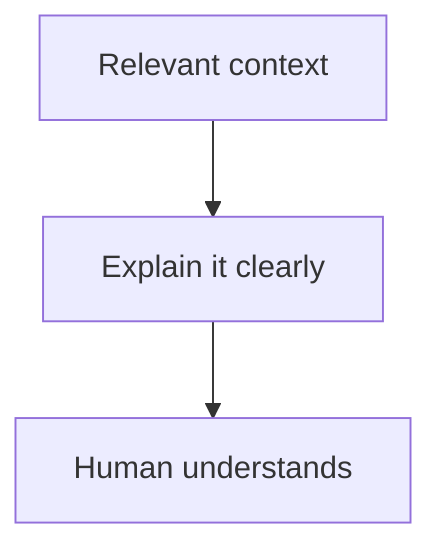

**Use `show-context` to explain relevant context to a human.**

It turns bounded evidence into a human-readable visual report.
It is a low-level presentation command: other commands and workflows may compose
it for code review, investigation, handoff, manual testing, architecture, or any
other situation where a person needs to understand context before acting.

**Usually:** inspect relevant folders, source material, conversation history,
summaries, or reports; select what matters; then present it in the form a human
can understand most easily.

Start with what the person needs to understand. Then show the smallest useful
visual, explain what it means, and add code or other evidence only when it helps.
The command presents evidence; it does not decide approval, modify the subject,
or replace a specialized review command.

## Execution role

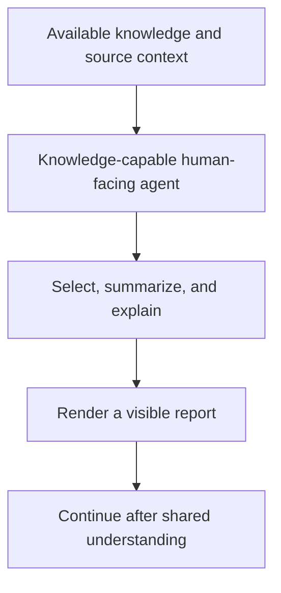

- Route to the human-facing agent responsible for the relevant knowledge. The
  caller remains responsible for validating that agent's identity, capabilities,
  context boundary, and communication rules.
- Give that agent access to the bounded folders, source material, conversation
  history, summaries, or reports needed to answer the human's question.
- Do not delegate presentation-only work to an execution-only role.
- A composing command remains responsible for its own domain decisions.

`show-context` defines how context is selected and presented; it does not make a
weakly informed agent knowledgeable. Report quality depends on the connected
agent's reasoning capability, its access to the right sources, and the quality
of the surrounding profile, workflow, and project context. If knowledge is
missing, the agent must identify the gap rather than invent an explanation.

## Intent mapping

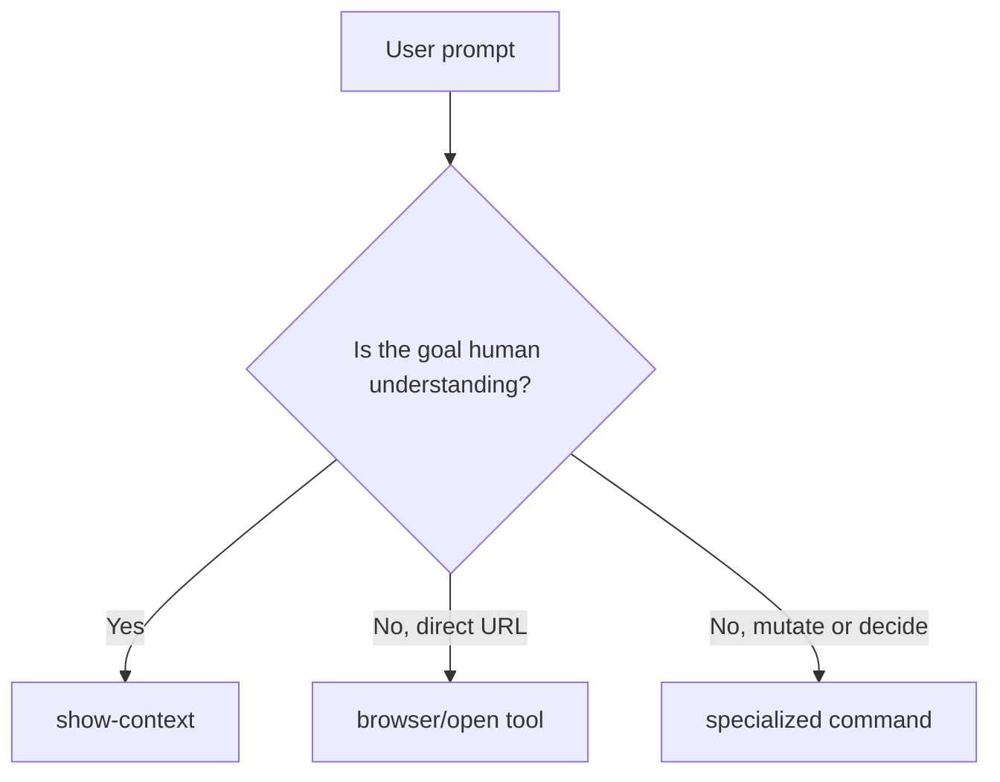

Map requests such as “show the context,” “prepare a report,” “walk me through
it,” “show the code review context,” or “show the diagram, screenshots, diff, or
evidence” when the intended outcome is visible understanding.

Use a direct browser or file-opening tool when the user only wants an item
opened. Use a specialized command when the user asks for a decision, mutation,
or domain-specific procedure; that command may call `show-context` for its
human-visible result.

## Report contract

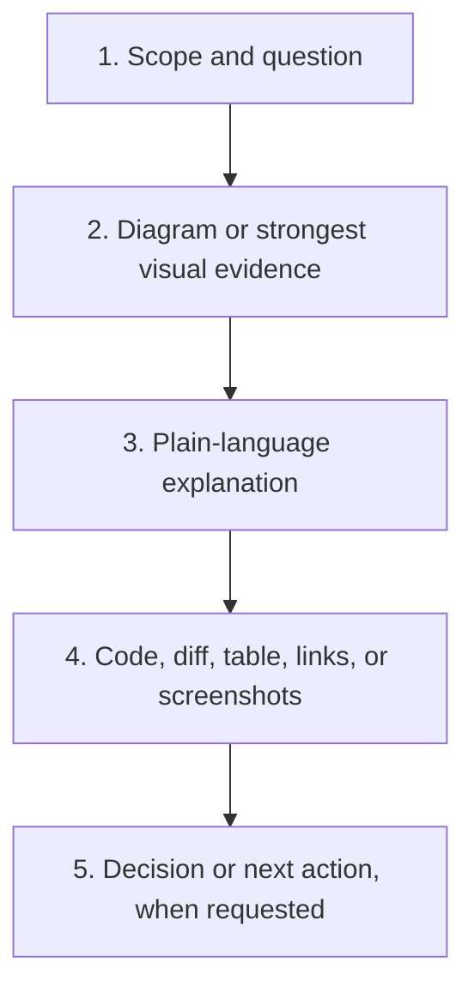

Every generated report should:

- answer one bounded human question;
- lead with the smallest useful visual, normally a vertical Mermaid diagram;
- explain what the visual means before exposing implementation detail;
- include only evidence that changes understanding or supports a claim;
- preserve source paths or links so evidence can be inspected;
- clearly distinguish facts, inferences, risks, and recommended actions;
- omit code when code is irrelevant, and use focused snippets instead of dumps;
- avoid secrets, credentials, private configuration, and unrelated context.

All report diagrams follow the canonical
[Diagram First Principle](../doc/principles/diagram-first-principle.md). This command defines report composition and
template selection; it does not restate or weaken that principle.

## Template selection

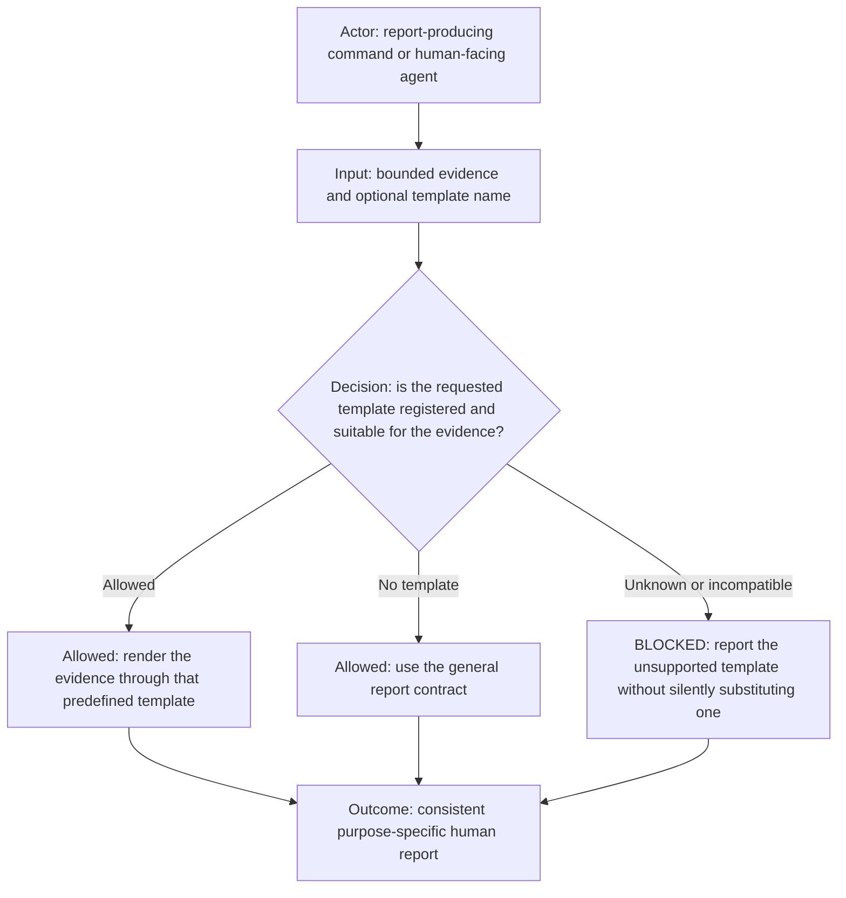

`--template <template-id>` is the command's report-format extension point. A registered template defines required inputs,
section order, evidence presentation, and decision framing for one report purpose. Callers select the template and supply
evidence; they do not rebuild that template manually. Without `--template`, the general report contract applies. An unknown
or evidence-incompatible template fails closed instead of falling back silently.

The currently registered template is `md-rules-changed`. A future purpose such as code review may register a separate
template, for example `code-review`, without changing the general report contract. That example documents the extension
design only; `code-review` is not currently registered or accepted by the command.

The `md-rules-changed` template requires the following:

- lead with a specific compact vertical diagram representing the actual rule-review path, governed by the canonical
  [Diagram First Principle](../doc/principles/diagram-first-principle.md);
- directly follow that diagram with prose that explains its actor, material nodes, decision branches, and outcome;
- place **Modified Markdown rules** before summary or conclusion sections;
- inject each complete changed normative section as exact current source in a fenced `markdown` block, including its
  heading, Mermaid diagram, allowed/prohibited structure, and prose;
- extract every Mermaid block from each injected Markdown file, validate its syntax, and render it separately under that
  file's **Rendered diagrams** section;
- include all changed sections without ellipses, and include a whole file when the whole file changed;
- enable source highlighting and treat file links as supplementary navigation only;
- never substitute links, path inventories, paraphrases, screenshots, or separate reports for inline exact content.

Use the predefined template when the source is one or more modified Markdown rule files:

```bash
show-context.command.sh --template md-rules-changed \
  --file <markdown-rule> \
  [--file <markdown-rule> ...] \
  [--title <title>] \
  [--request <description>] \
  [--result <result>] \
  [--no-open]
```

`md-rules-changed` generates one self-contained report in this order: a specific vertical decision diagram, a description
of what the review does, and then each selected Markdown file as exact highlighted current content, separately rendered
diagram previews, and its complete working-tree diff against `HEAD`, including staged and unstaged changes. The earlier
`rule-review` positional form remains an equivalent compatibility alias.
It ends with the result, when supplied, and the human decision gate. It accepts Markdown files only and does not itself
authorize commit, push, reload, publication, or activation.

Use [`show-context.report.template.md`](show-context.report.template.md) as the
portable starting point. Delete unused sections rather than filling space.

## Presentation modes

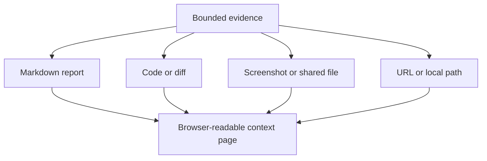

A host-provided renderer may render Markdown, text, and source files; select one
Markdown section; render Mermaid; highlight code and diffs; preview shared
images; and open explicitly supplied URLs or local paths. Project discovery and
local drop folders are optional integrations, not part of the portable report
contract.

## Rendering validation

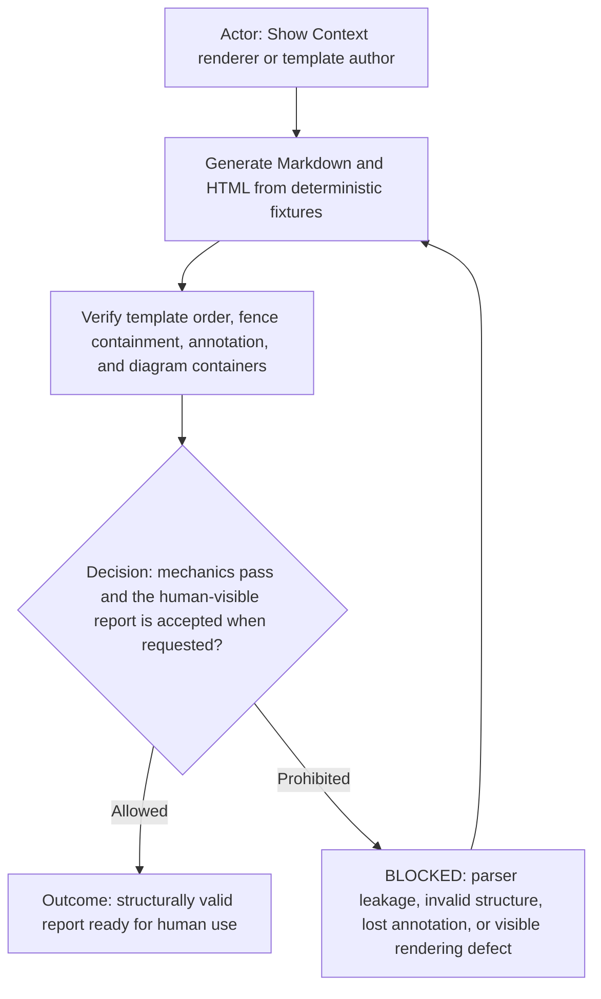

The renderer must recognize the opening fence character and length. A nested three-backtick fence cannot close an outer
four-backtick `markdown` fence. Markdown rule source uses the explicit `markdown` language annotation and remains one
highlighted source block; Mermaid inside that source is displayed literally and is not promoted to a report-level diagram.

Generated reports use the repository-provided Mermaid browser asset when available so local rendering does not depend on a
CDN. Deterministic unit tests verify template section order, outer-fence containment, the `markdown` language annotation,
one report-level Mermaid container, preserved literal nested Mermaid source, and absence of leaked `flowchart TD` prose.

Visible appearance remains a manual acceptance check when the human asks to inspect the report. The mechanical tests do not
launch a browser, call a model, send a prompt, consume model tokens, or claim that static HTML structure proves visual
quality. A reported manual rendering defect remains a failing acceptance result and requires a focused correction.

## Prerequisites

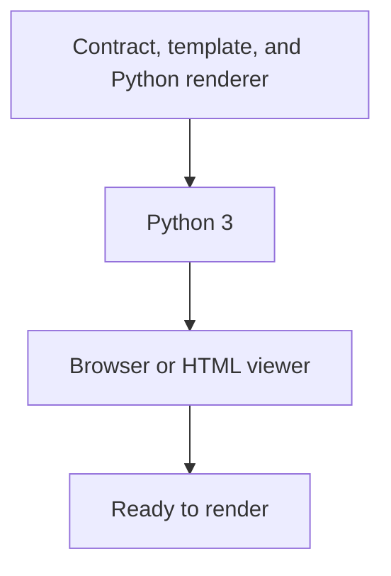

The portable executable requires Python 3 and a browser or HTML viewer. It uses
only the Python standard library. No command-specific installer is required.
Pygments is optional; without it, code remains escaped and readable. Mermaid is
loaded from a public CDN when network access is available, while the generated
page retains readable diagram source when it is unavailable.

An optional executable renderer should declare and check its own dependencies.
A typical implementation needs a browser or HTML viewer and a general-purpose
runtime such as Python. Mermaid and syntax highlighting may be bundled for
offline use or loaded from a documented public CDN. An unavailable optional
highlighter should reduce formatting quality, not prevent the report from being
read. Installation must require the user's authorization and must not assume an
operating system, package manager, profile, organization, or local directory.

## Usage

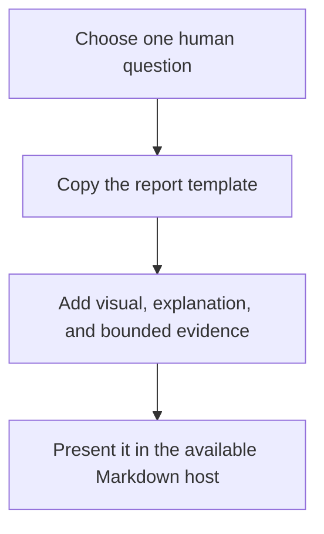

The portable flow can use the included Python renderer:

```bash
python3 show-context.py \
  --file <report-or-source-file> \
  --title "Context title" \
  --request "Question being answered"
```

Use `--output <path>` to choose the HTML location and `--no-open` to generate it
without opening the browser. A Markdown-capable host can also present the report
template directly without running the renderer.

The private executable adapter automates that flow:

```bash
./show-context.command.sh \
  --file <report-or-source-file> \
  --title "Context title" \
  --request "Question being answered"

./show-context.command.sh \
  --file <markdown-file> \
  --section "Review Context" \
  --no-open

./show-context.command.sh --see latest
./show-context.command.sh --url <url>
./show-context.command.sh --path <local-path>
```

Private or host-specific integrations may also support `--project`, `--project-dir`,
`--feature`, `--output-dir`, `--open-links`, `--see-dir`, `--meetings-dir`, and
repeated `--url` or `--path` values. Run `./show-context.command.sh --help` for
the exact local interface.

Meeting discovery is provider-neutral and disabled unless the user supplies
`--meetings-dir <path>` or `SHOW_CONTEXT_MEETINGS_DIR`. The configured directory
may contain an `indexed/` folder of prepared meetings and legacy `*-feature`
folders. The command must not assume a meeting provider, home-directory layout,
or provider-specific storage convention.

## Output and completion

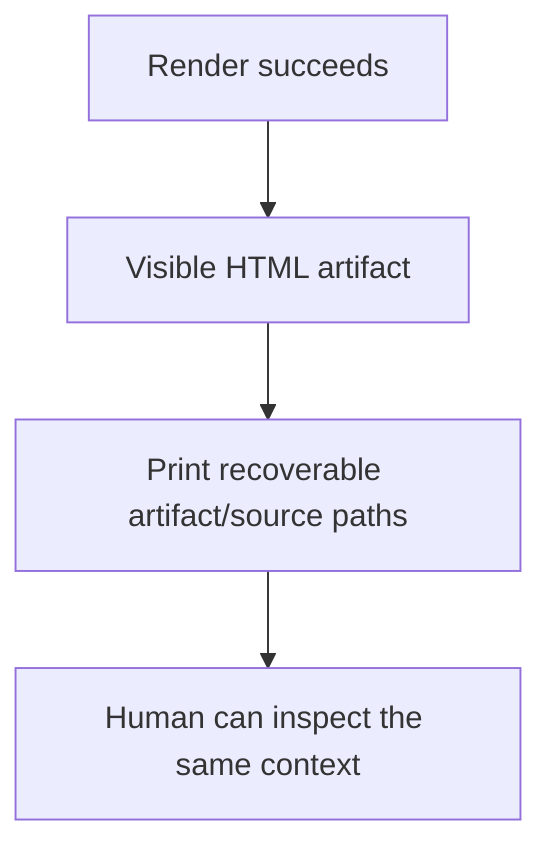

Completion requires a readable artifact, recoverable location, faithful source
links, and no silent mutation of the material being presented. If the available
evidence cannot answer the question, say what is missing instead of producing a
confident but ungrounded report.

The Python renderer embeds the HTML structure and CSS directly in the generated
page. By default `<source>` becomes `<source>.html` beside the input; `--output`
selects another location. It prints the artifact path and opens the system
browser unless `--no-open` is used. Mermaid renders in the browser from its
documented public CDN, with diagram source retained as the fallback. Generated
HTML is runtime output and must remain outside version control.

## Tags

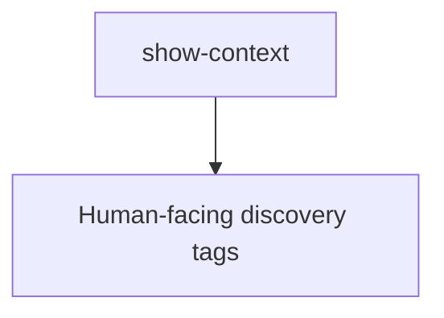

`#command` `#ai-command` `#show-context` `#human-context` `#visual-report`
`#code-review` `#evidence`
