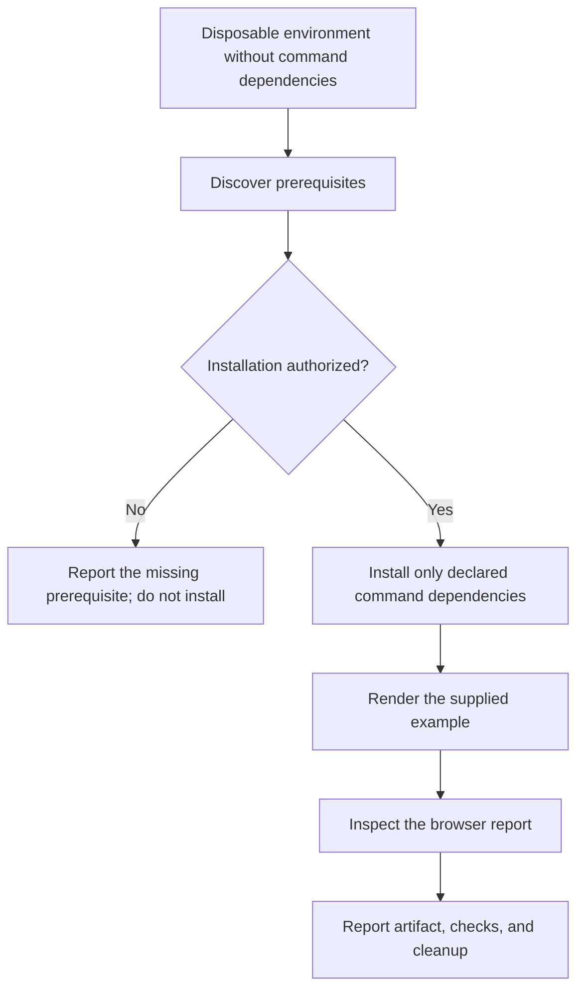
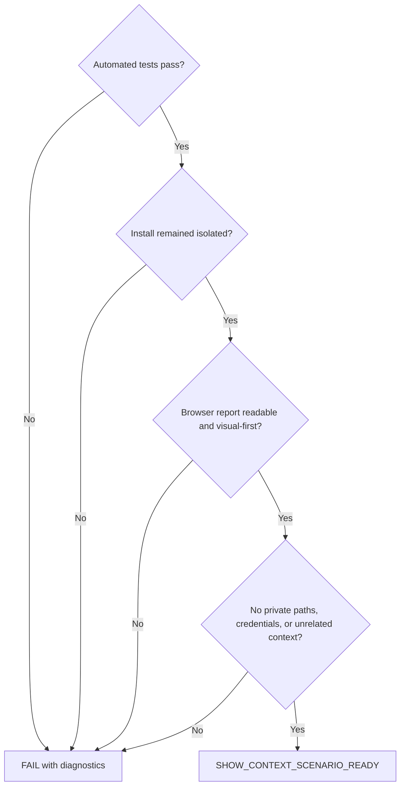

# Show Context Live Scenario

## Goal

Prove that a new user can take the portable `show-context` package, discover
what it needs, install only its declared optional dependency into an isolated
command environment, and open a readable visual-first report in a browser.

This is a live acceptance scenario, not a replacement for the shell or Python
tests. Run those tests first; then complete the human-visible checks below.

## Safety boundary

- Work in a newly created disposable directory outside the repository.
- Copy only the portable command files needed by this scenario.
- Do not use an existing command `.venv`, global Python packages, credentials,
  profile configuration, meeting folders, or private project discovery.
- Network access is permitted only after the user authorizes dependency
  installation. Installation must remain inside the disposable directory.
- Opening the generated local HTML report in a browser is expected.
- Remove the disposable directory when evidence has been recorded, unless the
  user asks to retain it for diagnosis.

## Portable files

Copy these files from the command package:

- `show-context.command.md`
- `show-context.report.template.md`
- `show-context.py`
- `show-context.portable.sh`
- `install.sh`
- `requirements.txt`
- `show-context.python.test.sh`

Do not copy a pre-existing `.venv` or generated report.

## Scenario

1. Read `show-context.command.md` and this file completely.
2. Create a unique disposable directory and copy the portable files into it.
3. Confirm the copy contains no `.venv` and does not resolve Pygments from a
   command-local environment.
4. Run `show-context.python.test.sh` with the available system Python. The
   fallback path must produce readable HTML without requiring Pygments.
5. Run `show-context.portable.sh` with the report template, a bounded example
   question, a neutral title, an explicit output path inside the disposable
   directory, and `--no-open`. Confirm the artifact exists and contains the
   question, diagram source, explanation, and no private absolute source path.
6. Explain that isolated syntax highlighting is optional and ask the user for
   authorization before running `install.sh`. If authorization is not granted,
   stop installation and report the fallback result as partial scenario
   evidence.
7. After authorization, run `install.sh`. Confirm it creates only the local
   `.venv` and installs only dependencies declared in `requirements.txt`.
8. Run `show-context.portable.sh` again without `--no-open`, using the same
   bounded example. Confirm a browser opens the generated local report.
9. Visually inspect the report. It must show, in this order:
   the human question and source, a vertical diagram, a plain-language
   explanation, and focused evidence when present. Text must be readable,
   diagrams must not overflow, and code or lists must not be clipped.
10. Run the Python test with the command-local interpreter and confirm it still
    passes.
11. Record the disposable path, commands invoked, test outcomes, generated HTML
    path, dependency boundary, and visual observations. Then perform cleanup.

## Acceptance

Return `SHOW_CONTEXT_SCENARIO_READY` only when every acceptance check passes.
Otherwise return `SHOW_CONTEXT_SCENARIO_BLOCKED` with the failing step, observed
evidence, and the smallest safe next action. Never install without authority or
relax the scenario to obtain the ready token.
