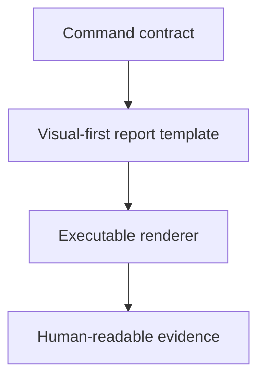

# Show Context Spec

## Purpose

Define the operating rules for the `show-context` command.

## Command Files

- `show-context.command.md`
- `show-context.report.template.md`
- `show-context.py`
- `show-context.portable.sh`
- `install.sh`
- `requirements.txt`
- `show-context.python.test.sh`
- `show-context.scenario.md`
- `show-context.command.sh`
- `show-context.command.test.sh`

## Rules

- Keep command behavior aligned with the command markdown contract.
- Keep examples and implementation references current when behavior changes.
- Do not add unrelated behavior to this command; create or use a narrower command instead.
- Keep the portable rendering path independent of project registries, profiles,
  workflows, and private folders.
- Treat project discovery and shared-file folders as optional local integrations.
- Generated reports follow the visual-first report contract and minimize exposed
  context.

## UI Behavior

- When this command is selected in the Command panel, show this spec in the Spec panel.
- Clicking the Spec panel title opens this file in the central dialog.
