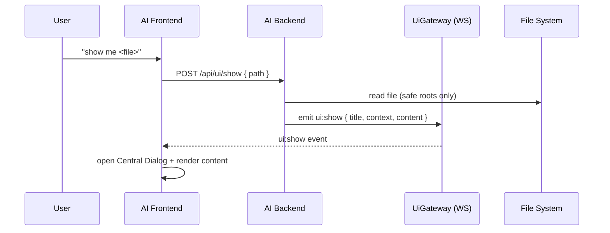

# show.command

## Tags

#command #ai-command #show

Display content (typically a file) in the AI web UI Central Dialog.

## Intent

Use when the user says “show me <file>” or requests to display a file/content in the Central Dialog.

## Behavior

- If input resolves to a readable file path, send its content to the UI.
- If inline content is provided instead, send it directly.
- Emit a websocket event so the Central Dialog opens and renders the content.

## Inputs

- `path` (string, optional): file path to show (relative to project root or AI app root).
- `content` (string, optional): inline content to show.
- `title` (string, optional): dialog title.
- `contextLabel` (string, optional): label shown under title (default: `File`).
- `contextValue` (string, optional): label value (default: filename or `content`).
- `contextPath` (string, optional): path shown under header.
- `contentType` (optional): `text/plain` or `text/markdown`.

## Output

- UI Central Dialog opens with the content.
- Backend returns `{ ok: true, path?, truncated?, size? }`.

## How To Invoke (HTTP)

```bash
curl -s \
  -X POST http://127.0.0.1:4300/api/ui/show \
  -H 'Content-Type: application/json' \
  -d '{"path":"apps/ai/ARCHITECTURE.md","title":"Architecture","contextLabel":"File","contextValue":"ARCHITECTURE.md"}'
```

### Inline content example

```bash
curl -s \
  -X POST http://127.0.0.1:4300/api/ui/show \
  -H 'Content-Type: application/json' \
  -d '{"title":"Notes","content":"Hello from show.command"}'
```

## How To Invoke (Shell)

```bash
rules/commands/show/show.command.sh --path apps/ai/ARCHITECTURE.md --title "Architecture"
```

```bash
echo "Hello from show.command" | rules/commands/show/show.command.sh --stdin --title "Notes"
```

## Notes

- Content is sent via websocket event `ui:show`.
- If the file is large, the backend truncates to a safe size and marks it as truncated.

## Architecture

### Flow



### Safe Path Resolution

- Allowed roots:
  - `AI_FLOW_PROJECT_DIR` (if set)
  - `process.cwd()`
  - AI app root (resolved via `resolveAiAppRoot()`)
- Non-files or missing paths are rejected.
