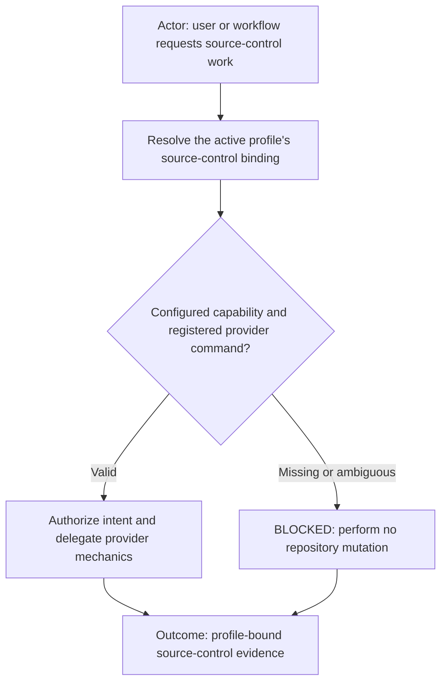

# source-control



Execution route: `manager`.

Command kind: `adapter`.

Adapter layer: `provider-neutral`.

## Purpose

`source-control` is the provider-neutral command for repository inspection and mutation. It owns intent such as status,
diff, branch, commit, pull, push, and remote-policy validation. It resolves the provider only from the active profile's
explicit command binding and never infers one from a repository, executable, URL, or remembered context.

The selected provider implementation command owns mechanical interaction. For `capability: git`, the registered `git`
command owns Git CLI semantics, identity inspection, branch/upstream handling, remote parsing, and credential-helper
integration.

## Profile binding

The profile declares `source-control` as a real command and references its profile-owned configuration:

```yaml
commands:
  - id: source-control
    config: commands/source-control/config.yml
```

The referenced configuration declares the provider binding and organization-specific policy. Reusable commands never
hardcode identity, remotes, credentials, organization names, or project paths.

```yaml
version: 1
command: source-control
capability: git
registered_command: git
command_path: git/git.command.sh
identity_name: Example Developer
identity_email: developer@example.com
credential_scope: remote_host
credential_base_url: https://github.com
allowed_remote_url_patterns:
  - https://github.com/example/*
```

Secrets never belong in this configuration. Credentials remain in ignored machine-local storage selected only after the
profile, workflow, project, provider, identity, and remote host have been verified.

## Provider implementation boundary

| Neutral intent                       | Provider command responsibility                                                  |
| ------------------------------------ | -------------------------------------------------------------------------------- |
| Inspect repository status or changes | Execute the provider's read-only status/diff mechanics                           |
| Commit bounded changes               | Validate identity and execute the provider commit mechanics                      |
| Push or pull                         | Validate remote policy, credentials, branch, and upstream before execution       |
| Create a review request              | Hand off to the provider-specific review command after source-control validation |

The neutral command retains authorization and interpretation. A provider command cannot choose itself, reconstruct missing
profile context, weaken profile policy, or substitute a different identity or remote.

## Agent-aware provenance

Every mutating source-control request must carry the exact initialized `callerTaskId`, canonical `callerRole`, and
`returnTaskId`. Trusted runtime evidence must bind both caller task and role plus the authorized return task. When trusted
`agent_identities.enabled` is true, also record `producingRole` for a different producer and require a trusted production
receipt binding its exact receipt ID, producer task and role, caller/return route, and stable change identity. Consumed or
wrong-change receipts are rejected. While disabled, producer fields and receipts may be absent and must not block. The
authorized caller is the
initiating role used for branch and commit/PR provenance. The provider command verifies these fields against trusted
runtime identity; it never infers them from the model, Git identity, process, repository, or prose.

Example: Designer/Reviewer dispatches a push for Coder-produced work. The branch is
`designer-reviewer/<short-kebab-description>`, the metadata records `Initiated-By-Role: designer-reviewer`,
`Produced-By-Role: coder`, and `Executed-By-Role: command-runner`. Command Runner never replaces the caller identity with
its own role. A caller task/role mismatch, foreign return route, missing production receipt, or untrusted on-behalf-of
claim is `BLOCKED` before mutation.

Resolve enablement through the initialized work profile's `agent_identities.config` path, canonicalize that file inside
the profile, and read its exact `enabled` value as trusted configuration. A packet value cannot enable or disable it, and
a missing, foreign, or mismatched config binding is `BLOCKED`. This provider-account and durable metadata gate is active
only when that trusted value is true. While false, source control keeps the profile's ordinary human Git/GitHub identity and
does not require agent emails, accounts, credentials, production receipts, or commit/PR signatures. The role-prefixed
new-branch rule and exact caller task/role/return verification remain active independently.

## Boundary

Missing command binding, provider capability, config reference, identity, allowed remote policy, workflow coordinate, or
project ownership is `BLOCKED`. Cross-profile configuration is prohibited. The command never changes global source-control
identity, commits credentials, or treats directory placement as an activated override without the explicit profile
reference.
