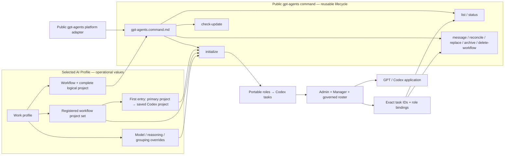

# GPT Agents

## Purpose

Use `gpt-agents` to check for stable application updates, initialize, inspect, reconcile, message, replace, or recoverably archive AI Fleas logical agents realized
as Codex tasks. The command composes the selected profile, portable workflow roster, and public `gpt-agents` platform adapter;
it never infers tasks from titles, recency, or nearby repositories.

Physical GPT/ChatGPT desktop application installation, upgrade, and uninstall belong to the `chatgpt` command
under the `install` command group. This command owns the logical-agent lifecycle after the application is available.

The profile selects operational values, the workflow defines role authority, the platform adapter realizes each role,
and this command owns the repeatable lifecycle transaction. Changing a saved project, model choice, or grouping policy
therefore changes profile configuration rather than the portable workflow roster.

## Canonical terminology

- **Logical project** and **group** are synonyms for the workflow-level container, such as `example-dev`.
- **Project** means one profile-registered folder inside that logical project/group, such as `ai-fleas` or `example-services`.
- The ordered project's first entry is the **primary project**. It contains the rules, commands, workflow definitions, and
  agent launch context. Every later entry is an associated project.
- On GPT/Codex, the logical project/group maps to one exact folder-backed saved project. Its ordered project records map
  to that saved project's scoped folder list, and its agent tasks appear beneath that saved project.

## Inputs

| Input | Required | Source | Description |
|---|---|---|---|
| Active AI Profile | Yes | Host activation | Must list `gpt-agents` as available. The invocation may explicitly select it; otherwise the profile default is used. |
| Ordered selected project subset and complete logical project | Yes | User and profile | Select one or more project/work targets from those registered to the workflow. Registration authorizes availability but does not make every project mandatory. The first selected project is primary and hosts the rules, commands, workflow definitions, and Codex agents; remaining selected projects are associated work projects. |
| GPT role overrides | No | Profile-owned `commands[].config` | Override supported model, reasoning, title, or elastic-pool realization values without changing role authority. |
| Grouping policy | No | Profile-owned `commands[].config` | Defines the saved-project name template and deterministic collision suffix policy. |
| Lifecycle subcommand | Yes | User request | One of `check-update`, `initialize-governor`, `status-governor`, `reinitialize-governor`, `initialize-system`, `status-system`, `watch-system-group`, `unwatch-system-group`, `reinitialize-system`, `initialize`, `list`, `status`, `message`, `reconcile`, `replace`, `archive`, or `delete-workflow`. Human wording such as “delete group” routes to `delete-workflow`. |
| Exact instance identifiers | Conditional | Prior creation receipts | Required for operations on existing tasks; titles are never lifecycle identity. |

## Outputs

| Output | Destination | Description |
|---|---|---|
| Agent-instance receipts | Profile-owned binding-state registry and caller | Exact logical-agent, role, task ID, host ID, logical saved-project ID, complete ordered scoped-folder bindings, readiness, generation, and creation outcome. |
| Lifecycle result | Caller | Verified status, delivery, replacement, reconciliation, or archival result. |

## Entry Point

| Entry point | Type | Profile-aware invocation |
|---|---|---|
|| `gpt-agents/gpt-agents.command.md` | AI-readable contract | The invoking host controller loads this contract and invokes the selected app adapter's exact task lifecycle capabilities. |

Every invocation is profile-aware: the host must activate the selected AI Profile and workflow, verify that `gpt-agents` is
available, resolve its platform contract, load the workflow's registered project choices and the non-empty selected subset, and resolve one
pre-existing exact folder-backed saved Codex project named for the logical project/group before workflow-task mutation. Verify its
ordered scoped folders from the selected profile-authorized project records. The first selected folder is primary. Registered but
unselected projects are not required roots. The primary project hosts the control plane and agent launch context. An explicit
command-level `--agent-platform gpt-agents` selection takes precedence over the profile default but must still be listed by
the profile. System lifecycle resolves the profile/platform binding without belonging to a workflow logical project.

Committed configuration template: `gpt-agents/gpt-agents.command.example.config`. Copy it into the selected profile, set only supported command value overrides, reference the copied file through `commands[].config`, and let the host expose it as `AI_COMMAND_CONFIG_PATH`. The committed example is documentation and must never be used as operational configuration.

The selected command config must declare `binding_state.owner: profile`, a profile-relative `binding_state.path`, and
`schema_version: gpt-agents-binding-state.v1`. Resolve that path beneath the activated profile directory; reject absolute
paths and traversal. The registry is the durable lifecycle authority and records the profile/platform binding, logical
saved-project ID, ordered scoped-folder roots, every role's logical-agent/task/host IDs,
readiness and generation, System task/pinning/scheduler/watch receipts, and deletion or replacement tombstones. Runtime
IDs belong only in this ignored profile-owned state, never in public manifests or title-based discovery.

## Linked Commands

| Command | Relationship | Use when |
|---|---|---|
| [`chatgpt`](../install/chatgpt/chatgpt.command.md) | Physical application prerequisite | ChatGPT must be inspected, installed, smoke-tested, updated, upgraded, or uninstalled. |
| [`install`](../install/install.command.md) | Parent installation command group | The human asks generically to install or update GPT and the request must be routed to the exact child command. |

The application must be installed and pass its smoke test before agent initialization. Do not substitute the linked
`install/codex` CLI installer.

## Subcommands

| Subcommand | Behavior |
|---|---|
| `initialize-governor --human HUMAN_PROFILE_ID` | Create or reconcile the one human-scoped Personal Governor task for the exact human profile. Load the portable Governor role plus human-owned memory/resources/authorized-profile bindings, verify `PERSONAL_GOVERNOR_READY`, and pin the exact task when supported. No workflow or Admin is required. |\n| `status-governor --human HUMAN_PROFILE_ID` | Verify the exact recorded Personal Governor binding, human profile, readiness, authoritative memory route, and pin state without title-based inference. |\n| `reinitialize-governor --human HUMAN_PROFILE_ID --confirm-reinitialize-governor` | Transactionally create/initialize/verify/pin a successor Governor before recoverably archiving the exact predecessor. |\n| `check-update` | Read-only query of the GPT/Codex app host's trusted stable update channel. Report the installed and latest stable versions when the host exposes them, recommend an explicit upgrade when newer, or return `GPT_APP_UPDATE_CHECK_UNAVAILABLE` when status cannot be established. Never update automatically. |
| `initialize-system [--watch-group LOGICAL_PROJECT_ID]... [--every DURATION]` | Explicitly create or reconcile the one system-scoped System task, pin it when supported, and bootstrap one scheduler with the exact initial watch-scope set. Repeat `--watch-group` for multiple groups. Reuse only an exact recorded binding. |
| `status-system` | Verify the exact recorded System task without inferring identity from title, project, section, or recency. |
| `watch-system-group --group LOGICAL_PROJECT_ID` | Add one exact receipt-backed logical project to System's scheduler watch scope and verify the updated schedule. |
| `unwatch-system-group --group LOGICAL_PROJECT_ID` | Remove one exact logical project from System's scheduler watch scope without changing that workflow group or its agents. |
| `reinitialize-system --confirm-reinitialize-system` | Explicitly create and verify a successor System task, transfer required lifecycle state, then recoverably archive the predecessor. |
| `initialize` | Idempotently realize the exact requested roster: reuse active receipts, reactivate exact receipt-backed archived tasks, create only genuinely missing roles, initialize every role, and record exact task receipts. |
| `list` | Return recorded logical-agent-to-task bindings without inferring unbound tasks. |
| `status` | Verify task existence, project binding, role initialization, and current lifecycle state. |
| `message` | Deliver a prompt to one exact bound task ID. |
| `reconcile` | Create missing instances and report mismatches or duplicates; never silently adopt candidates. |
| `replace` | Create and verify a successor before recoverably archiving its exact predecessor. |
| `archive` | Recoverably archive one exact task ID after confirming its binding. |
| `delete-workflow` | Recoverably archive every exact task bound to one logical project while preserving its saved Codex project and scoped folders. |

## Workflow deletion contract

In human-facing requests, **group**, **workflow group**, and **logical project** may describe the same AI Fleas scope.
The adapter must still keep the three concrete identities distinct:

| AI Fleas scope | GPT/Codex App realization | Deleted by `delete-workflow`? |
|---|---|---|
| Logical project, such as `<profile>-<workflow>[-<suffix>]` | Lifecycle scope recorded by AI Fleas | Its active binding is retired and a deletion receipt is retained. |
| Logical project/group | One exact folder-backed Codex saved-project ID | No. Preserve it. |
| Primary project | First exact scoped folder in the ordered workflow project list | No. Preserve it. |
| Project set | Every exact registered folder scoped into the saved project | No. Preserve all of them. |

`delete-workflow` performs one guarded transaction:

1. Require explicit deletion intent plus the exact profile, workflow, logical saved-project ID, ordered scoped-folder
   bindings, and complete agent-task receipts.
2. Preflight every receipt and host capability before mutation. Reject a missing, duplicate, foreign, or title-inferred
   binding with zero mutation.
3. Recoverably archive every exact bound agent task. Archive the calling Admin last so it can verify and report the
   transaction; use the host's background self-archive capability when required.
4. Never delete, rename, or detach the saved Codex project or any scoped folder as an implicit consequence of deleting
   the workflow roster.
5. Verify the tasks are archived, then retain a tombstone receipt containing the logical-project/saved-project ID,
   scoped-folder bindings, archived task IDs, and outcomes.

If the host cannot preflight the complete transaction, return an exact no-mutation failure. A section name, visible
title, sidebar position, or phrase such as `example-dev` is never sufficient deletion identity.

## Agent realization

`initialize` has the same lifecycle meaning as it does in `hermes-agents`: realize the agents declared for the selected
workflow on the selected platform. GPT App realizes the workflow's complete governed role roster as separate Codex
tasks. Hermes App realizes its declared roles as named profiles collected in a workflow group. The selected platform
adapter—not the shared lifecycle verb—determines the concrete task/profile mapping.

## Initialization contract

System and workflow initialization are separate lifecycle transactions. A human may explicitly request both in one
command-level operation; in that case run `initialize-system` first and then `initialize`, returning separate receipts.
This does not turn System creation into a side effect of ordinary workflow initialization.

### Personal Governor initialization

Personal Governor lifecycle is independent of workflow and System lifecycle.

1. Require explicit Personal Governor intent and exact human profile ID. Resolve a configured `type: human` profile; never infer the person from a workflow profile, task title, previous conversation, or nearby files.
2. Load the complete portable Personal Governor role and calendar/governance policies plus the human profile's Governor, authoritative-memory, resource, and authorized-profile bindings.
3. Resolve the selected GPT platform realization. The Governor is human-scoped and global/persistent; it is not created inside a workflow saved project and requires no Admin, Manager, or System.
4. Resolve trusted lifecycle state for this exact human/platform binding. Reuse one exact active Governor. Ambiguous/unrecorded candidates block creation rather than being adopted by title.
5. When absent, create exactly one Governor task with the configured model/reasoning and recommended presentation title `🧭 Personal Governor`. Dispatch the canonical initialization message containing the exact human identity, role/policies, logical permanent-memory route, and authorized profile contexts. Do not embed secret values or provider administrator credentials.
6. Verify `PERSONAL_GOVERNOR_READY`, including usable authoritative memory resolution. Pin the exact task in global navigation when supported and record task/host/human IDs, readiness, generation, memory binding identity, and pin result in trusted lifecycle state.
7. `status-governor` verifies the recorded binding and memory route read-only.
8. `reinitialize-governor` is successor-first: preflight existing binding, create successor, initialize from canonical configuration and durable memory, verify readiness, pin successor, then recoverably archive predecessor. A failure leaves the predecessor active.
9. Governor initialization never initializes, reconciles, or mutates workflow rosters. Authorized workflow profiles are context/capability grants, not ownership.

### System initialization

1. Require explicit System lifecycle intent, the exact profile, and an explicit or default `gpt-agents` platform selection.
2. Load `system_agent`, require `scope: system`, `cardinality: one-per-platform`, its schedule, and the complete
   `platform_bindings.gpt-agents` realization, including its presentation title and readiness token. `--every` may override the configured
   interval for this System binding; reject invalid or unsupported intervals.
3. Resolve recorded System receipts for this exact profile/platform binding. Reuse one active exact binding; block on an
   unrecorded candidate, ambiguity, or multiple candidates instead of adopting or creating another.
4. Create a System task only when no exact active binding exists. Initialize it from the complete common System role,
   scope, continuity, knowledge-transfer, scheduling, and lifecycle contracts, using the profile binding's model and
   reasoning. Supply the portable schedule definition, effective interval, and requested initial watch scopes in its
   initialization message; do not create the concrete scheduler on System's behalf.
5. Verify readiness, pin the exact System task in the global pinned section when the host exposes task pinning, and record
   the exact task and host IDs plus the pinning outcome. System remains outside every workflow sidebar section and is
   never included in a workflow logical-project receipt. If pinning is unavailable, retain the valid System binding and
   report `pinning: unsupported` rather than placing it in a workflow section.
6. Grant System read access to trusted host-managed workflow lifecycle receipts, not membership in workflow peer rosters.
   Resolve the selected profile's configured `binding_state.path` to one canonical absolute registry path and include that
   exact path plus `gpt-agents-binding-state.v1` in both System's initialization message and scheduler prompt. System must
   read that exact registry; it must not discover receipts by filename search. It may use those receipts to monitor multiple
   groups and initiate only authorized lifecycle messages to exact task IDs.
   Do not publish System's task ID or routing address to workflow agents.
7. When scheduling is enabled, System requests the selected platform adapter to create or reconcile exactly one scheduler
   bound to its own exact instance, then verifies and returns the platform scheduler receipt. System resolves every
   repeated `--watch-group` value to an exact logical-project lifecycle receipt before activating it. For an explicitly
   requested group that is not initialized yet, System retains it as a pending exact scope and performs no agent action until its receipt
   exists. Pending scope is normal asynchronous state, not System initialization failure. On every scheduled check, report
   a compact user-facing status for each still-missing exact group and state that it will be checked again. The scheduled instruction inspects agent-list, lifecycle, availability, and explicit context-health metadata;
   it does not read product conversation payloads merely to estimate exhaustion. Scheduler ID, interval, active/pending
   watch scopes, and verification outcome are required parts of the System receipt and `SYSTEM_READY` gate.
   Use one scheduler for the complete set. Each run checks every scope once with independent per-group receipts, cursors,
   agent bindings, health evidence, and reporting state; one group's missing or failed state does not skip the others.
8. `watch-system-group` and `unwatch-system-group` route the explicit user request to the exact System instance. System
   modifies only the exact watch-scope set through its selected platform adapter, preserves its identity and unrelated
   scopes, and returns the updated verified scheduler receipt.
9. For explicit reinitialization, verify the successor and transfer required lifecycle and scheduler state before recoverably archiving
   the exact predecessor. Never reinitialize System during workflow reconciliation or reinitialization.

### Workflow initialization

1. Require an exact profile, workflow, complete logical-project ID, and a non-empty ordered selected project subset. Every
   selected entry must resolve to a project registered by that workflow. The first selected entry is the primary project
   and must contain or resolve the group's rules, commands, and workflow definitions; later selected entries are associated
   work projects. Registered but unselected projects are available choices, not required scoped folders.
2. Resolve the invocation-selected platform, or otherwise the profile default, through `platforms/registry.yml`; require
   that it is listed in `agent_platforms.available` and equals `gpt-agents` for this command.
3. Load the portable workflow agent manifest and the GPT workflow role bindings completely.
4. Resolve every selected project record in selected order to one canonical folder root. Require one pre-existing folder-backed
   Codex project named `<profile>-<workflow>[-<suffix>]`; this is the GPT-platform prerequisite implied by an initialize
   request. Verify its immutable ID, logical-project name, primary root, and complete ordered selected scoped-folder list, then
   record that binding before any agent creation. This command does not create or edit the saved Codex project. A missing
   project, name-only match, unauthorized or mismatched selected folder, or ambiguous result fails with zero agent mutation.
5. Do not create a custom sidebar section for the logical project. The folder-backed saved project is the logical
   project/group's GPT container; all verified roster tasks appear beneath it.
6. Join `initializer.agentId` and every portable `agents[].agentId` to exactly one GPT `agents[].role` binding. Reject
   missing, duplicate, or additional roles before creating anything.
7. Treat the caller as the mechanical initialization controller. It is never a workflow roster member merely because it
   invoked this command. Resolve the complete effective roster, including Admin, before creating any task. Admin is a
   compatibility role and must not bootstrap, delegate, or orchestrate initialization.
8. Resolve runtime values in order: public GPT role-binding defaults, then supported profile-owned `role_overrides`.
   Reject unknown roles, unsupported keys, unavailable models, invalid reasoning levels, and pool values outside the
   portable role's declared bounds.
9. Read both the active and archived host catalogs to exhaustion, following every pagination cursor. Resolve every
   receipt-backed role by exact task ID before considering title, recency, or creation. An exact workflow `initialize`
   request authorizes reactivating the exact archived roster for that profile, workflow, and logical project. Unarchive
   all matching archived roles in one host batch when supported, including when the complete roster is archived, then
   reread the active catalog and require the exact saved-project ID. Never create a replacement merely because an exact
   receipt is absent from the active-only catalog. Unrecorded, superseded, foreign-scope, or same-titled archived tasks
   remain ineligible. When an explicit human roster contraction removes a role, also supply every exact task ID retained
   in that role's durable receipt history as `retiredReceipts`; archive every task returned in `archive`, including older
   active generations, and never discover retired tasks by title alone. Feed the declared roles, trusted receipts, retired
   receipts, exact project ID, and complete inventories through `platforms/gpt-agents/agents/reconcile-roster.mjs`; honor
   its `reuse`, `reactivate`, `create`, `archive`, or `blocked` result rather than reclassifying tasks conversationally.
10. Mechanically create exactly one task for every still-missing selected role, including Admin and Manager, in one host batch
   when the platform supports batching. Every creation request must include the complete canonical initialization prompt
   as its non-empty first user message and the effective non-empty presentation title. Treat `title` only as presentation
   and apply the effective model and reasoning values exactly. Do not wait for one role to initialize before creating the
   next role. A prompt retained only as the controller's tool-call input or function-call output is not a child-task user
   message and does not satisfy creation.
11. Record every returned task or provisional client ID, resolve all provisional creations together, then dispatch all
    canonical initialization messages concurrently. Role authority governs subsequent workflow work, not roster startup.
12. Reread the host's task catalog after restoration or creation and require every exact task ID to be present beneath the exact logical
    saved-project ID with a non-empty user-visible preview, first user message, and effective presentation title. Direct task access, a
    readiness response, a locally persisted task record, or a requested project target does not prove saved-project
    membership. A task omitted from the project catalog is an invalid provisional creation and must not receive an active
    binding receipt. Reconcile that exact candidate before considering another creation; never create a duplicate while
    the candidate remains unresolved. Normalize the saved project's sidebar order so the exact managed roster is a
    contiguous ordered sequence, then verify that the user-visible expanded project enumerates every managed role.
    Additional human-created tasks, including another Admin task, are allowed and remain outside managed lifecycle
    receipts; they cannot satisfy or replace a required roster member. Stale or archived task IDs must not precede or
    interrupt the managed roster. A backend catalog result alone does not prove sidebar visibility. Remove stale
    same-named custom-section references through supported presentation operations; a custom section never substitutes
    for the saved-project roster. Do not move a valid project task into a custom section.
13. Build each initialization message from the portable role definition, team policy, routing and permission policies,
    complete ordered selected project subset, primary-project binding, logical-project scope, and readiness token. Supply exact peer task-ID bindings only when that role's declared
    communication topology permits peer routing. A direct-human-only role such as Judge receives its own binding and
    governance scope, never a participant-routing roster. Never include System's task ID, routing address, or runtime
    location in any workflow-agent initialization message. Include the selected profile's canonical absolute directory and
    exact resolved binding-registry path; never substitute a public example or a repository-relative profile guess. Do not
    replace contracts with a hand-written role summary.
    Send lifecycle control to an endpoint already bound to the Workflow Router only through
    `scripts/queue-lifecycle-control.mjs`. It registers a short-lived, one-shot permit bound to the exact session ID, full
    prompt digest, expected readiness token, and lifecycle action, then delivers that same prompt through daemon-backed
    `codex queue` so `UserPromptSubmit` runs in the existing task owner. Cross-task message tools that materialize the
    prompt as function-call output are not lifecycle delivery. A natural-language marker without a matching host permit
    never bypasses the Router.
14. Wait for every role's exact readiness token, reread the project catalog, and inspect the rendered expanded
    saved-project sidebar with the host's screenshot/computer-vision capability. Automatically expand or scroll the
    project as needed and require visual evidence of every exact managed task title and task count. An accessibility-tree
    or backend-only result is supporting evidence, not a substitute for the rendered check. Record the capture timestamp,
    project ID, expected and observed managed titles and counts, and observation method in the binding receipt. Never ask
    the human to confirm roster visibility when the host can capture the UI. Additional human-created Admin tasks are
    permitted but are recorded as extras and never counted toward the managed roster. Only then commit active binding
    receipts. Readiness without catalog and computer-vision-verified sidebar presence is an explicit
    partial-initialization failure.

For the current Dev roster, the mechanical controller directly creates or reconciles Admin, Manager, Designer Reviewer,
Judge, Coder, Command Runner, and UI Acceptance Tester. Admin remains temporarily for compatibility but has no special
initialization responsibility. Changes to the roster must come from the portable workflow manifest and corresponding GPT
bindings—not from edits to this command.

Workflow initialization is complete when that workflow roster is ready; it does not wait for, locate, create, or register
System. If System exists, the trusted host lifecycle registry makes the new group receipts available to System separately.

## Safety

- Never create a saved project, worktree, clone, projectless task, or task in a merely similar project. The exact saved
  project is a GPT-platform prerequisite. Every scoped folder must be selected and profile-authorized, but registered
  projects that were not selected are not required roots.
- Never use a title as identity or create a duplicate while a candidate may still resolve.
- Never emulate a logical saved project with a custom sidebar section.
- Never interpret `delete-workflow` as deletion of a saved Codex project, checkout, repository, or work target.
- Never archive a predecessor until its requested replacement is verified.
- Never weaken portable role authority or communication boundaries.
- Never let profile overrides add roles, remove required roles, change readiness tokens or lifecycle authority, or exceed
  workflow-declared elastic-pool limits.
- Never place host task IDs or operational project identifiers in this public command.
- Never infer update status from model availability, documentation dates, or a failed check; only a trusted host update
  channel may establish the installed and latest stable app versions.

## Tags

#command #ai-command #gpt-agents #codex #agents #lifecycle

See [spec.md](spec.md) and the registered [`gpt-agents` platform adapter](../../platforms/gpt-agents/README.md).
