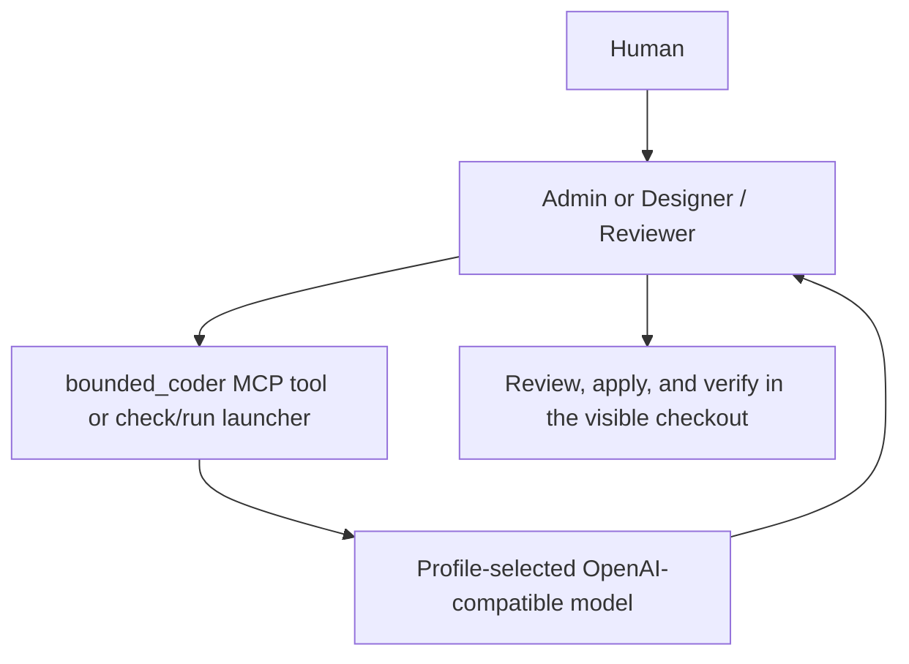

# Bounded Coder route

The selected profile may realize Dev Coder as a bounded model route. The portable
workflow still assigns a Coder step, but Hermes does not create a Coder profile
for a role whose profile binding declares `realization: bounded-route`.

The route reads its endpoint and model from the operational profile. The model
receives only the bounded task text; it has no filesystem or shell tools. The
answer is a proposal, not a committed change or independent review. The caller
must include relevant code excerpts, interface constraints, examples, and a
stop condition, then inspect and verify any accepted code. A model response
that is empty or ends at the output token limit fails the route.

`bounded-model.command.mjs ask` reads one prompt from standard input.
`serve-mcp` provides the same model through one MCP tool, `bounded_coder`.
`bounded-model.delegate.mjs check|run --project ID` resolves the selected Dev
project, named branch, endpoint, model, and limits from the profile before a
GPT Admin uses the route. The profile's `hermes-agents` command configuration
selects which Hermes roles receive the MCP tool. Workflow reconciliation
reapplies that binding and removes an old Coder profile from the group while
preserving its files and conversations.

The backend currently serves the selected 35B model with a 32K window, below
Hermes's 64K agent minimum. This route does not initialize it as a Hermes
agent. Keep requests within the configured input and output caps. Review is
essential: a local currency parser probe produced incorrect code on both the
first answer and one correction despite explicit examples.
