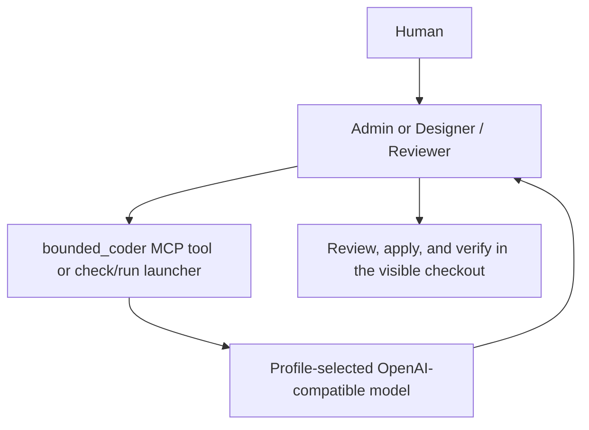

# Bounded Coder route

The selected profile may realize Dev Coder as a bounded model route. The portable
workflow still assigns a Coder step, but Hermes does not create a Coder profile
for a role whose profile binding declares `realization: bounded-route`.

The route reads its endpoint and model from the operational profile. The model
receives only the bounded task text; it has no filesystem or shell tools. The
answer is a proposal, not a committed change or independent review. The caller
must include relevant code excerpts, interface constraints, examples, and a
stop condition, then inspect and verify any accepted code. A model response
that is empty or ends at the output token limit fails the route.

## Preliminary Q5 versus routed 35B observation

On 2026-09-27, a broad Router design request through the direct 35B launcher returned
`Model answer was empty or truncated` after about 27 seconds. A shorter design request
returned only `BLOCKED`. A narrow JavaScript function request returned a usable proposal
in about 1.3 seconds; a larger, single-function request returned a proposal in about
4.4 seconds. This suggests splitting Coder handoffs at a known function or interface
boundary for this model. It does not establish that the model can complete the full
Router migration.

We also ran the Hermes Admin profile on a target-selection code proposal. Q5 alone took
53 seconds and mistakenly used a route ID as the destination task ID. Q5 calling the
`bounded_coder` MCP tool returned in 23 seconds and used the caller task ID, but omitted
strict string validation and claimed a risk that optional chaining already addressed.
The prompts and tool availability differed slightly, so this is directional evidence,
not a controlled speed or quality ranking. The routed answer still requires Admin review.

A second Hermes Admin trial asked for a command-planning patch. Q5 alone took about
60 seconds, spending five turns searching for files and returning an incomplete
proposal. The run instructed to use `bounded_coder` took about 36 seconds, but Q5
spent its five turns on file search and never called the MCP tool. This is a
handoff-compliance failure, not a 35B result. For this profile, provide a
self-contained excerpt and verify an actual MCP call before counting a run as
Q5 plus 35B. A direct 35B proposal for the same narrow code path returned in
about 1.4 seconds but exposed unauthorized command syntax, so Admin rejected
that part. The accepted implementation was verified with the real Command
Runner wrapper.

A later matched one-line change included the selected project and branch in a
validated command plan. The Q5-only Hermes run took about 26 seconds and
returned the correct expression. With Hermes restricted to the `bounded-coder`
toolset, Q5 actually called the 35B MCP tool and returned the same correct
expression in about 24 seconds. We applied it and verified the real planner
output. For this small task, delegation showed no meaningful time or quality
advantage. The `-t bounded-coder` server-name toolset is the reproducible way
used here to prevent unrelated Hermes tools from consuming the trial.

A matched, more representative amount-parser task produced a different result.
Both Hermes runs received the same acceptance cases and returned JavaScript for
`parseAmountCents`; the routed run used the actual `bounded_coder` MCP tool.
Q5 alone took about 41 seconds and passed 8 of 13 independent in-memory cases.
Q5 plus 35B took about 49 seconds and passed 7 of 13. The direct answer
converted comma-grouped amounts incorrectly and accepted an explicitly
forbidden suffix. The routed answer rejected valid amounts such as `0.05` and
`$1,234.56`; Q5's written review nevertheless claimed the requirements were
met. These scores are observations from one task, not a general model ranking.
For parsing, arithmetic, and other correctness-sensitive Coder work, run the
same explicit cases through Command Runner before accepting either proposal.

The initial route used temperature 0. The [Qwen3.6 model card](https://huggingface.co/Qwen/Qwen3.6-35B-A3B)
recommends temperature 0.7, top-p 0.8, top-k 20, and presence penalty 1.5
for non-thinking mode. Two direct, read-only trials with those parameters on
the same parser prompt passed 11/13 and 12/13 cases in about 12 and 5 seconds.
Neither passed the maximum-safe-value case. Sampling is now a bounded,
profile-owned route setting; this observation motivates a launcher-level
retest and does not by itself prove an improvement through Hermes. With those
settings applied to the real launcher, two further proposals passed 12/13 and
10/13 cases. A subsequent Hermes Admin call through the reconfigured MCP
tool produced a reviewed answer passing 11/13 in about 49 seconds; the raw
35B tool response in that turn was not executable JavaScript. The results
vary and still fall short of correctness, so retain the proposal-only boundary
and independent executable verification.

`bounded-model.command.mjs ask` reads one prompt from standard input.
`serve-mcp` provides the same model through one MCP tool, `bounded_coder`.
`bounded-model.delegate.mjs check|run --project ID` resolves the selected Dev
project, named branch, endpoint, model, and limits from the profile before a
GPT Admin uses the route. The profile's `hermes-agents` command configuration
selects which Hermes roles receive the MCP tool. Workflow reconciliation
reapplies that binding and removes an old Coder profile from the group while
preserving its files and conversations.

The backend currently serves the selected 35B model with a 32K window, below
Hermes's 64K agent minimum. This route does not initialize it as a Hermes
agent. Keep requests within the configured input and output caps. Review is
essential: a local currency parser probe produced incorrect code on both the
first answer and one correction despite explicit examples.
