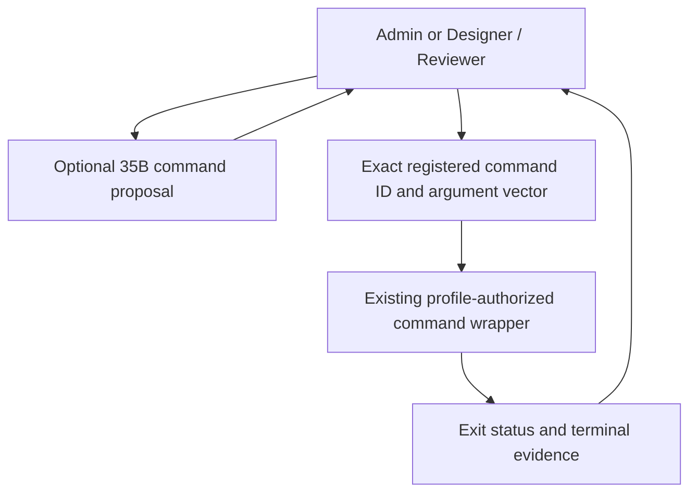

# Command Runner route

A profile can realize Dev Command Runner as a command route instead of a Hermes
bot. The route keeps mechanical execution separate from model planning.

`command-runner-route.mjs` exposes two MCP tools. `plan_registered_command`
asks the profile-selected model for a suggestion and has no effects.
`run_registered_command` executes a command registered to the selected Dev
workflow. It accepts an exact project ID, command ID, and argument vector,
checks the project's named branch, and invokes the existing wrapper without a
shell. The selected profile gives each caller an explicit command allowlist.
The wrapper keeps its own authorization, credential, and effect checks.
The current SC profile allows Admin to call `test` and `source-control`;
Designer / Reviewer may call `test`. Other registered
commands remain outside this route until that profile explicitly authorizes
them.

The GPT launcher offers the same deterministic route through `check --project
ID` and `run --project ID --command ID -- ARGS...`. A caller must inspect a
model proposal against the command's real interface before execution. The
route returns the command's actual exit status, output, and signal; a model
answer is never execution evidence. It does not replace independent review or
UI acceptance.

For these repositories, the registered `test` wrapper accepts `--script`
followed by an existing repository-relative `.test.sh` or `.test.mjs` file.
The route uses that wrapper to execute focused checks with a hard timeout.
