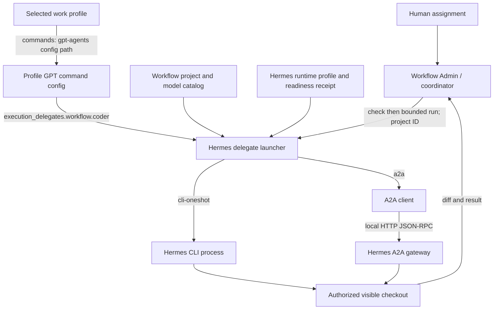
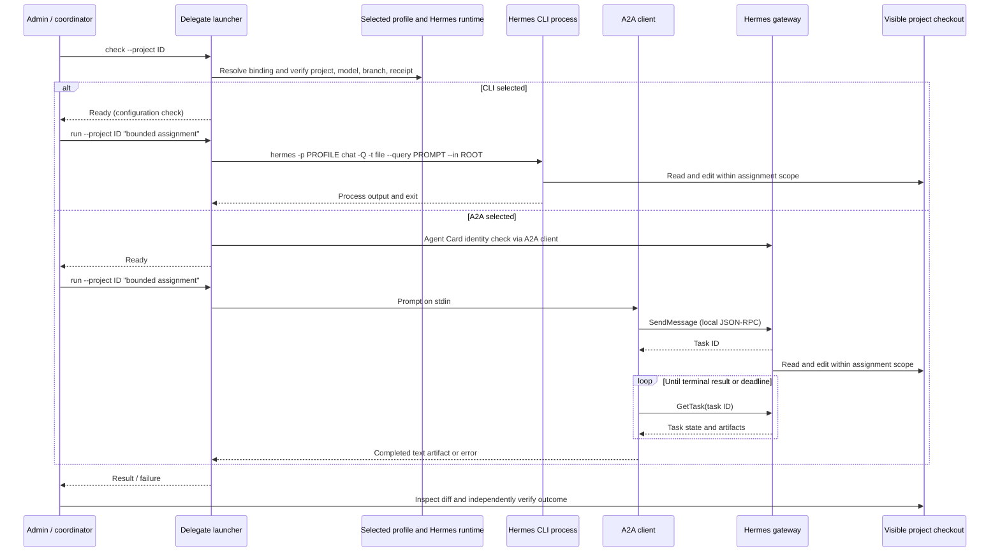

# Hermes Coder delegation architecture

This document describes the current direct Admin-to-Hermes Coder route. The selected AI Profile owns the project, model, Coder identity, routing policy, and transport. The public command supplies validation and dispatch, not operational defaults. A profile may choose `cli-oneshot` or `a2a` and must select the matching [transport strategy](../../../ai-workflows/dev/agents/delegation-strategies/README.md).

## Configuration and trust boundary

The caller selects `AI_PROFILE_ROOT`, `AI_WORK_PROFILE_ID`, and `AI_FLOW_WORKFLOW`. The launcher reads the work profile's single `gpt-agents` `commands[].config` reference. That relative path must resolve to a regular file inside the selected profile. From it, the launcher reads `execution_delegates.<workflow>.coder`; it does not choose a transport or model when those settings are absent.

Before either route, `check` verifies the declared delegate, selected project, workflow project root, named Git branch, Hermes readiness receipt, and live Hermes profile against the workflow's provider, model, and endpoint. For A2A it also checks the local Agent Card name and URL. CLI `check` verifies configuration, but does not run an inference turn. A profile-owned wrapper may select the profile and project; the shared launcher performs these checks.

CLI `run` requires the caller to set `HERMES_WRITE_SAFE_ROOT` to its authorized write boundary; `check` does not require it. The caller still needs an independent process deadline and must inspect the actual diff and task result.

## Assignment flow

Both routes receive the same bounded assignment prompt, which names the selected checkout and branch and tells Coder to stay within the assignment's write scope. The launcher validates the selected project root but does **not** enforce per-file write scope or a sandbox. The coordinator must inspect the resulting diff and any unrequested files after the underlying work has stopped. Coder's response does not itself provide independent acceptance.

## Transport behavior and recovery

| Concern | CLI one-shot | A2A |
| --- | --- | --- |
| Connection | Launches `hermes` as a local process for one assignment. | A2A client connects to the configured local Hermes gateway over HTTP. |
| Context | A fresh process per bounded assignment; reuse is disabled by current strategy. | Current launcher starts a fresh context per assignment; task ID is used for polling, not verified context reuse. |
| Progress and result | Waits for process output and exit. | `SendMessage` returns a task ID; `GetTask` is polled until a terminal result or client deadline. |
| Interruption | Stop the exact one-shot process, verify it and descendants have exited, then inspect the diff. | A failed or timed-out task does not prove the gateway turn stopped. Check task state, stop the exact gateway when needed, verify no continuing session writes, then inspect the diff. |
| Current limit | The launcher has no enforced wall-clock timeout. | The client has a 30-minute deadline; a gateway message may fail earlier. Terminal A2A state is not a process-stop guarantee. |

The [JavaScript adapter](a2a-client.mjs) exposes A2A `ListTasks`, `GetTask`, and `CancelTask`, plus named-profile gateway status, start, and stop through Hermes CLI. `CancelTask` does not abort a live in-flight turn. The [external coordinator contract](external-coordinator.md) defines when a GPT coordinator may call these operations directly and how to verify recovery; the Dev workflow's internal Manager route is not the transport control path for that external caller.

Do not overlap assignments that may edit the same files. After a transport failure, inspect the visible checkout and process or session state before retrying. The [CLI strategy](../../../ai-workflows/dev/agents/delegation-strategies/transports/hermes-cli-oneshot.strategy.yml) and [A2A strategy](../../../ai-workflows/dev/agents/delegation-strategies/transports/hermes-a2a.strategy.yml) hold the current recovery rules and observed limits. The [model strategy index](../../../ai-workflows/dev/agents/delegation-strategies/model-profiles/README.md) separately describes model-specific delegation behavior.

## Where to change behavior

- Change the selected transport, delegate profile, project allowlist, or routing policy in the selected profile's GPT command config, reached through its work profile `commands[].config`. The [sanitized example](../../../ai-profile/example/commands-config/gpt-agents/config.yml) shows the shape and possible values.
- Change transport-specific waiting and recovery guidance in the matching strategy file. Changing a strategy alone does not change the launcher's transport selection.
- Change shared validation or dispatch in [the launcher](hermes-delegate.command.sh), and A2A protocol handling in [the client](a2a-client.mjs).
