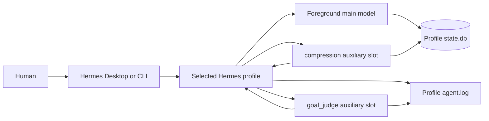
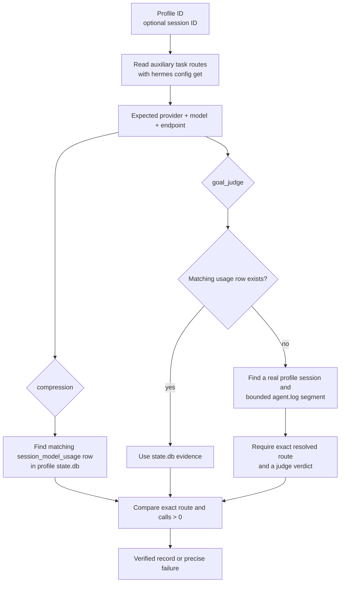

# Hermes Agents tests

This directory contains offline contract tests and the live auxiliary-route verifier for a selected Hermes profile.
The tests are profile-portable: operational profile IDs, model names, providers, endpoints, and session IDs are inputs
or are discovered from Hermes. The fixture uses synthetic values and never calls a model.

## Hermes at a glance

A Hermes profile is one configured agent runtime. Desktop or CLI opens the profile, the foreground agent sends normal
conversation turns to its main model, and auxiliary task slots send specialized calls to the models assigned by that
same profile. The normal minimum binds both `compression` and `goal_judge`; these slots are services, not extra agents.



The profile configuration remains the source of truth for expected routes. `state.db` stores session-scoped usage
records, including compression calls. Goal judging runs between foreground turns in current Hermes releases, outside
the ambient usage-accounting context, so a judge call may have no `session_model_usage` row. Hermes still logs the
resolved judge route and returned verdict in the profile log.

## How live verification works

Run the verifier with a profile ID. Supplying a session is optional:

```bash
# Discover qualifying evidence independently for both required tasks.
../verify-auxiliary-usage.sh --profile PROFILE

# Restrict verification to one exact session.
../verify-auxiliary-usage.sh --profile PROFILE --session SESSION_ID

# Inspect only one supported task.
../verify-auxiliary-usage.sh --profile PROFILE --task compression
```



With no `--session`, discovery is task-specific. Compression and goal judging may be verified from different sessions.
Candidate goal sessions come from the profile database; unrelated bracketed text in logs is not treated as a session.
With `--session`, both the database lookup and the bounded log fallback are restricted to that exact session.

The verifier reads only:

- `auxiliary.<task>.provider`, `.model`, and `.base_url` from the selected Hermes profile;
- `~/.hermes/profiles/PROFILE/state.db` (or the explicit test override); and
- `~/.hermes/profiles/PROFILE/logs/agent.log` when judge accounting is absent.

It does not modify a profile, call a model, infer a machine, or provide operational defaults.

## Offline tests

Run the focused fixture:

```bash
bash verify-auxiliary-usage.test.sh
```

Run the aggregate Hermes Agents suite:

```bash
bash hermes-agents.command.test.sh
```

The auxiliary fixture creates a synthetic Hermes command, SQLite database, and agent log. It proves that route values
come from the selected profile, compression and judge evidence can be discovered in different sessions, explicit-session
verification still works, and missing evidence fails. It performs no network calls and reads no real profile data.

## What a pass means

A pass proves that runtime evidence matches the provider, model, and endpoint currently configured for the selected
profile: a recorded compression call and either a recorded judge call or a bounded log segment containing the exact
judge route and a returned verdict.

A pass does not prove that the auxiliary output was high quality, that the foreground model used it well, or that an
entire coding task succeeded. Configuration text, UI labels, and activity animations alone are also not proof. Those
questions require separate behavioral benchmarks; this verifier answers the narrower routing question.

See [the command guide](../hermes-agents.command.md) for lifecycle operations and
[the specification](../spec.md#live-auxiliary-acceptance) for the normative acceptance contract.
