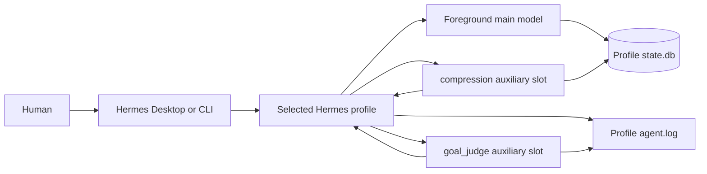
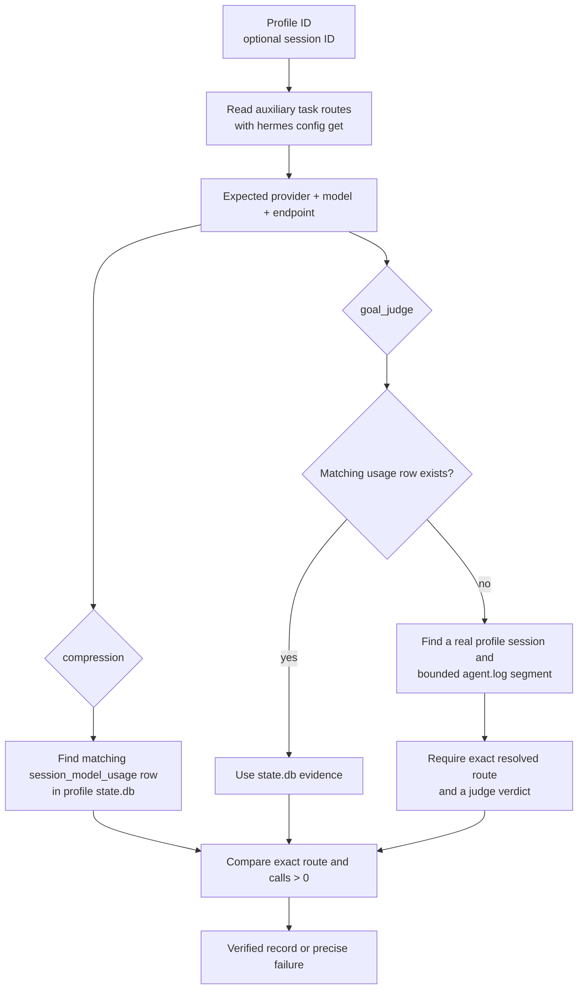

# Hermes Agents tests

This directory contains offline contract tests and the live auxiliary-route verifier for a selected Hermes profile.
The tests are profile-portable: operational profile IDs, model names, providers, endpoints, and session IDs are inputs
or are discovered from Hermes. The fixture uses synthetic values and never calls a model.

## Hermes at a glance

A Hermes profile is one configured agent runtime. Desktop or CLI opens the profile, the foreground agent sends normal
conversation turns to its main model, and auxiliary task slots send specialized calls to the models assigned by that
same profile. The normal minimum binds both `compression` and `goal_judge`; these slots are services, not extra agents.



The profile configuration remains the source of truth for expected routes. `state.db` stores session-scoped usage
records, including compression calls. Goal judging runs between foreground turns in current Hermes releases, outside
the ambient usage-accounting context, so a judge call may have no `session_model_usage` row. Hermes still logs the
resolved judge route and returned verdict in the profile log.

## How live verification works

Run the verifier with a profile ID. Supplying a session is optional:

```bash
# Discover qualifying evidence independently for both required tasks.
../verify-auxiliary-usage.sh --profile PROFILE

# Restrict verification to one exact session.
../verify-auxiliary-usage.sh --profile PROFILE --session SESSION_ID

# Inspect only one supported task.
../verify-auxiliary-usage.sh --profile PROFILE --task compression
```



With no `--session`, discovery is task-specific. Compression and goal judging may be verified from different sessions.
Candidate goal sessions come from the profile database; unrelated bracketed text in logs is not treated as a session.
With `--session`, both the database lookup and the bounded log fallback are restricted to that exact session.

The verifier reads only:

- `auxiliary.<task>.provider`, `.model`, and `.base_url` from the selected Hermes profile;
- `~/.hermes/profiles/PROFILE/state.db` (or the explicit test override); and
- `~/.hermes/profiles/PROFILE/logs/agent.log` when judge accounting is absent.

It does not modify a profile, call a model, infer a machine, or provide operational defaults.

## Offline tests

Run the focused fixture:

```bash
bash verify-auxiliary-usage.test.sh
```

Run the aggregate Hermes Agents suite:

```bash
bash hermes-agents.command.test.sh
```

The auxiliary fixture creates a synthetic Hermes command, SQLite database, and agent log. It proves that route values
come from the selected profile, compression and judge evidence can be discovered in different sessions, explicit-session
verification still works, and missing evidence fails. It performs no network calls and reads no real profile data.

## What a pass means

A pass proves that runtime evidence matches the provider, model, and endpoint currently configured for the selected
profile: a recorded compression call and either a recorded judge call or a bounded log segment containing the exact
judge route and a returned verdict.

A pass does not prove that the auxiliary output was high quality, that the foreground model used it well, or that an
entire coding task succeeded. Configuration text, UI labels, and activity animations alone are also not proof. Those
questions require separate behavioral benchmarks; this verifier answers the narrower routing question.

See [the command guide](../hermes-agents.command.md) for lifecycle operations and
[the specification](../spec.md#live-auxiliary-acceptance) for the normative acceptance contract.

## Gotchas

The following behaviors are observed in current Hermes releases and may cause misleading test or verification results.

### Configuration changes do not retrofit existing live chats

A profile's `auxiliary.*` configuration is read only when the foreground agent starts. Changing the model, provider, or endpoint after a session began does not retroactively affect already-running chats. New auxiliary calls from an existing session continue using the previously resolved route until the foreground agent restarts.

**Verification advice**: To confirm a new configuration, start a fresh session, exercise the auxiliary task, and verify the usage record from that new session only.

---

### Configured YAML or UI activity is not runtime proof

Hermes Desktop displays model names, provider labels, and status animations, but those surfaces do not prove that a call actually used the configured route.

**Verification advice**: Always rely on `state.db` records or bounded `agent.log` segments that contain the exact resolved route URL, not on UI labels, status text, or configuration YAML.

---

### `goal_judge` may be absent from `session_model_usage`

In current Hermes releases, the `goal_judge` task runs between foreground turns as a background service call. It does not emit a `session_model_usage` row; instead, Hermes logs the resolved route and returned verdict in the profile's `agent.log`. A missing `session_model_usage` row for `goal_judge` is expected, not an error.

**Verification advice**: For `goal_judge`, inspect the bounded `agent.log` segment for the selected session and require both the exact resolved route and a visible verdict. Do not treat absence of a `session_model_usage` row as a failure.

---

### `background_review` is a different task and may remain on the main model

The `background_review` task (when present) is unrelated to the primary `compression` and `goal_judge` services. Its binding and route come from a separate configuration, and it may be assigned to the foreground main model instead of the auxiliary slot. A verification failure for `background_review` does not indicate a problem with `compression` or `goal_judge`.

**Verification advice**: Focus verification on the tasks explicitly named in the assignment (`compression` and `goal_judge`). Treat `background_review` as a separate concern unless the workflow explicitly requires its auxiliary route.

---

### Task evidence can come from different sessions

When no `--session` is supplied, the verifier discovers the newest qualifying evidence independently for each task. A `compression` call may be found in session A while a `goal_judge` verdict appears in a different session B. Both are valid as long as each matches the current profile configuration.

**Verification advice**: Do not assume evidence must come from the same session unless `--session` is explicitly provided. Each task's discovery is bounded to the profile database or log, not to a single session ID.

---

### Log session candidates must be grounded in the database

The verifier does not treat arbitrary bracketed text in `agent.log` as a session. Candidate sessions are derived from session IDs already recorded in the profile's `state.db`; only their bounded log segments are considered.

**Verification advice**: When verifying without `--session`, ensure the profile database contains usage for at least one real session before expecting log-based judge verification to succeed.

---

### Compression output and latency can be unexpectedly large

In the live experiment, one compression response contained more output tokens than its input and the surrounding delegated run exceeded its wrapper timeout. This is an observation, not a guarantee about other profiles or models.

**Verification advice**: Inspect the recorded input/output token counts and call evidence before changing limits. Treat unusually large summaries or latency as a separate quality/performance problem even when routing passes.

---

### A timeout does not itself prove the model route was unused

If the foreground agent reports a timeout for an auxiliary call, it may have succeeded but the result was lost, or the route never resolved. A timeout should trigger inspection of the profile log and `state.db` rather than assuming the route was skipped.

**Verification advice**: Inspect `state.db`, the bounded profile log, the visible checkout, and any identifiable task state before retrying. Do not send a duplicate assignment solely because its wrapper timed out.

---

### Profile/model/endpoint names must be derived, not hardcoded

The verifier derives provider, model, and endpoint from the active profile's `auxiliary.*` configuration at runtime. Hardcoded values fail when the profile changes or uses a non-default provider.

**Verification advice**: Never assume a model name, provider alias, or base URL in verification logic. Query `hermes -p PROFILE config get` for the live values before constructing the expected route.
