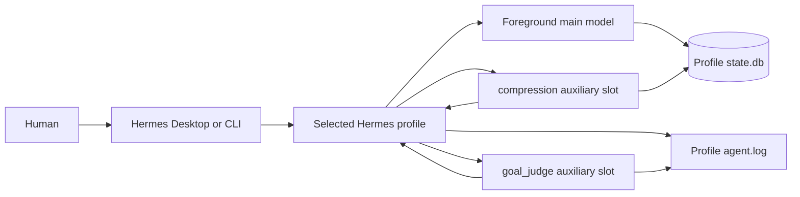

# Hermes architecture at a glance

A Hermes profile is one configured agent runtime. Desktop or CLI opens the profile, the foreground agent sends normal
turns to its main model, and auxiliary task slots send specialized calls to models assigned by the same profile. The
normal minimum binds both `compression` and `goal_judge`; these slots are services, not extra workflow agents.

The profile configuration is the source of truth for expected routes. `state.db` stores session-scoped usage records,
including compression calls. Goal judging runs between foreground turns in current Hermes releases, outside the ambient
usage-accounting context, so a judge call may have no `session_model_usage` row. Hermes still logs its resolved route
and verdict in the profile log.

This is intentionally a system overview, not a map of Hermes internals. AI Fleas resolves and writes profile bindings;
Hermes owns conversations, model calls, usage state, logs, and Desktop/CLI runtime behavior.
