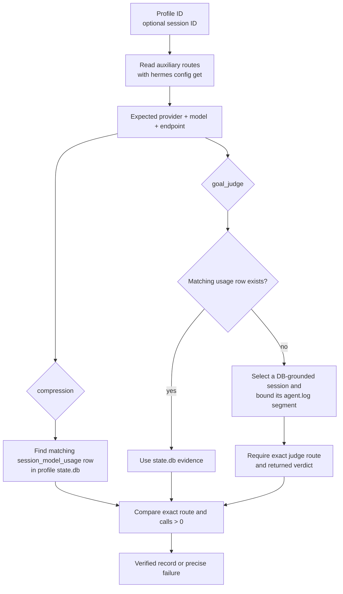

# Auxiliary-route verification

The live verifier is read-only and profile-portable:

```bash
# Discover qualifying evidence independently for both required tasks.
../../verify-auxiliary-usage.sh --profile PROFILE

# Restrict both checks to one session, or inspect only one task.
../../verify-auxiliary-usage.sh --profile PROFILE --session SESSION_ID
../../verify-auxiliary-usage.sh --profile PROFILE --task compression
```



With no `--session`, discovery is task-specific: compression and goal judging may come from different sessions.
Candidate goal sessions come from `state.db`; unrelated bracketed log text is not treated as a session. With
`--session`, database and log evidence are restricted to that exact session.

The verifier reads the selected profile's `auxiliary.<task>.provider`, `.model`, and `.base_url`, its `state.db`, and its
`agent.log` when judge accounting is absent. It does not modify a profile, call a model, infer a machine, or provide
operational defaults.

## Offline fixture

`verify-auxiliary-usage.test.sh` creates a synthetic Hermes command, SQLite database, and agent log. It proves that
route values come from the selected profile, task evidence can be discovered in different sessions, exact-session mode
still works, and missing evidence fails. It performs no network calls and reads no real profile data.

## Meaning of a pass

A pass proves the runtime evidence matches the provider, model, and endpoint currently configured for the profile: a
recorded compression call and either a recorded judge call or a bounded log segment containing the exact judge route
and verdict. It does not prove output quality, effective use by the foreground model, or completion of a coding task.
Configuration text, UI labels, and activity animations alone are not evidence.
