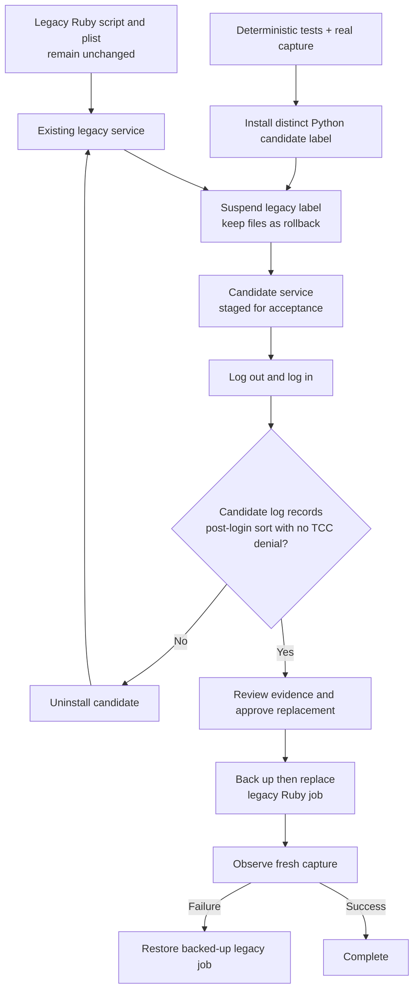

# macOS Screenshot Sorter

## Purpose

Use `macos-screenshot-sorter` on macOS to move only macOS-style screenshot files into visible, capture-date `YYYY-MM-DD` folders. It preserves unrelated Desktop images and reserves a new name such as ` (1)` when a destination name already exists. It does not support Linux or Windows.

## Inputs

| Input | Required | Source | Description |
|---|---|---|---|
| Active AI Profile and workflow | Yes | Host activation | Authorizes the command and exposes its selected profile-owned configuration. |
| Source directory | Yes | Profile config | The folder macOS captures into. |
| Destination directory | Yes | Profile config | The visible screenshot folder. It may equal the source directory. |
| Operation | No | Invocation | `ui`, `ui --force`, `probe`, `sort`, `migrate`, `render-launchagent`, candidate install/removal, or legacy suspend/restore. |

## Outputs

| Output | Destination | Description |
|---|---|---|
| JSON movement records | Standard output | One record per recognized screenshot and a final count. |
| Date folders | Configured destination | `YYYY-MM-DD` folders containing screenshots without replacement. |
| Candidate LaunchAgent | Profile-selected LaunchAgents directory | An event-driven user LaunchAgent used only after explicit installation. |

## Entry Point

| Entry point | Type | Profile-aware invocation |
|---|---|---|
| `macos-screenshot-sorter/macos-screenshot-sorter.command.sh` | Shell executable | Activate the selected profile and workflow, then invoke through the host's profile-aware command runner. |

Every invocation is profile-aware: the host verifies workflow authorization and supplies the selected profile-owned configuration as `AI_COMMAND_CONFIG_PATH`.

## Run against any authorized profile

Use this section when a terminal agent such as Hermes needs to run the command directly. Do not infer a profile from the current directory. Supply the exact absolute **profile project** that contains `ai-profile/`, its profile ID, and a workflow that explicitly allows `macos-screenshot-sorter`.

1. In that profile’s `ai-profile/<profile-id>/<profile-id>-work-profile.yml`, bind the command to its private configuration file and list the command under the intended workflow:

   ```yaml
   commands:
     - id: macos-screenshot-sorter
       config: commands-config/macos-screenshot-sorter.env
   workflows:
     - path: <workflow>.workflow.md
       platform: <platform-id>
       commands:
         - macos-screenshot-sorter
   ```

2. Copy `macos-screenshot-sorter.command.example.config` to the referenced private configuration path and set every `SCREENSHOT_SORTER_*` value to real local paths. In particular, set the source and destination directories, a unique LaunchAgent label, `/usr/bin/python3`, and an executable `SCREENSHOT_SORTER_ELECTRON_BIN` if the agent will open the UI. The command deliberately has no operational fallbacks.

3. Set these five shell variables once. Replace every angle-bracket value; do not use them literally. `PROFILE_PROJECT` is the repository containing the profile—not necessarily the AI Fleas command repository.

   ```bash
   AI_FLEAS_REPO="/absolute/path/to/ai-fleas"
   PROFILE_PROJECT="/absolute/path/to/profile-project"
   PROFILE_ID="<profile-id>"
   WORKFLOW="<workflow>.workflow.md"
   PLATFORM="<platform-id>"
   ```

4. Run the activation preflight, then the command’s read-only resolved-runtime check:

   ```bash
   AI_CONFIG_PROJECT="$PROFILE_PROJECT" AI_WORK_PROFILE_ID="$PROFILE_ID" AI_FLOW_WORKFLOW="$WORKFLOW" AI_AGENT_PLATFORM="$PLATFORM" \
     bash "$AI_FLEAS_REPO/ai-commands/_runtime/profile/activate-profile.sh" \
       --profile "$PROFILE_ID" --workflow "$WORKFLOW" --platform "$PLATFORM" --command macos-screenshot-sorter

   AI_CONFIG_PROJECT="$PROFILE_PROJECT" AI_WORK_PROFILE_ID="$PROFILE_ID" AI_FLOW_WORKFLOW="$WORKFLOW" AI_AGENT_PLATFORM="$PLATFORM" \
     bash "$AI_FLEAS_REPO/ai-commands/system/macos-screenshot-sorter/macos-screenshot-sorter.command.sh" probe
   ```

   The first command must print an `AI_COMMAND_CONFIG_PATH` and an `AI_COMMANDS_ROOT` that resolves to this AI Fleas checkout. `AI_AGENT_PLATFORM` is optional only when the profile’s workflow can resolve its default platform. Supplying it makes an agent run reproducible. A successful `probe` prints the exact source, destination, candidate label, logs, and both timing values; it does not move files or install anything.

5. Reuse the **same four context variables** for the required operation:

   ```bash
   # Open the settings/Screenshots app in the current macOS GUI session.
   AI_CONFIG_PROJECT="$PROFILE_PROJECT" AI_WORK_PROFILE_ID="$PROFILE_ID" AI_FLOW_WORKFLOW="$WORKFLOW" AI_AGENT_PLATFORM="$PLATFORM" \
   bash "$AI_FLEAS_REPO/ai-commands/system/macos-screenshot-sorter/macos-screenshot-sorter.command.sh" ui

   # Agent-only: close the exact existing Screenshot Sorter process and open a fresh instance.
   AI_CONFIG_PROJECT="$PROFILE_PROJECT" AI_WORK_PROFILE_ID="$PROFILE_ID" AI_FLOW_WORKFLOW="$WORKFLOW" AI_AGENT_PLATFORM="$PLATFORM" \
     bash "$AI_FLEAS_REPO/ai-commands/system/macos-screenshot-sorter/macos-screenshot-sorter.command.sh" ui --force

   # Scan and sort once; this is a real file-moving operation.
   AI_CONFIG_PROJECT="$PROFILE_PROJECT" AI_WORK_PROFILE_ID="$PROFILE_ID" AI_FLOW_WORKFLOW="$WORKFLOW" AI_AGENT_PLATFORM="$PLATFORM" \
     bash "$AI_FLEAS_REPO/ai-commands/system/macos-screenshot-sorter/macos-screenshot-sorter.command.sh" sort
   ```

Only use `install --apply`, legacy suspension, migration, or uninstall after following [the acceptance scenario](macos-screenshot-sorter.scenario.md). A manual `sort` or `ui` run does not prove that launchd has the required Desktop/TCC access after login.

Common preflight failures are intentional: `PROFILE_REQUIRED` means the profile ID or workflow was omitted; `PROFILE_BLOCKED: command is not allowed by workflow` means add the binding above; `missing profile-owned command config` means the configured private file does not exist; and `SCREENSHOT_SORTER_ELECTRON_REQUIRED` means the configured UI runtime path is not executable. Do not bypass these checks by exporting `AI_COMMAND_CONFIG_PATH` directly.

## Supported platform

This command is **macOS-only**. Every operation rejects a non-macOS host; its background integration uses a per-user `launchd` LaunchAgent and its file recognition is specific to Apple screenshot names.

Committed configuration template: `macos-screenshot-sorter/macos-screenshot-sorter.command.example.config`. Copy it into the selected profile, reference the copy through `commands[].config`, and let the host expose it as `AI_COMMAND_CONFIG_PATH`. The committed example is documentation and must never be used as operational configuration.

`sort` and `migrate` are equivalent, idempotent scans. The command moves only regular, non-symlinked files named like `Screenshot …` or `Screen Shot …` with a supported image suffix. It never selects an unrelated image solely because it is a PNG.

`install --apply` creates a distinct candidate LaunchAgent; it intentionally does not replace an existing personal job. `suspend-legacy --apply` unloads only the configured legacy label while preserving its script and plist, preventing a race during candidate acceptance. `restore-legacy --apply` loads that exact plist again. `uninstall --apply` removes only this command's configured candidate label and plist. Do not replace an old sorter or claim success from a manual run. Follow the live scenario first, including a real capture after logout/login in the GUI session and a TCC check for the launchd-executed Python process.

`ui` opens the Electron settings app. It has **Settings** and **Screenshots** tabs, a persistent camera menu-bar icon, secure folder pickers for the capture inbox and sorted folder, both timing controls, current status, and an **Apply and reload sorter** action. The Screenshots tab groups recognized captures in real `YYYY-MM-DD` folders and displays their thumbnails; it is read-only until a future action is explicitly added. It does not expose filesystem paths to the renderer or follow symlinked folders/files. It is single-instance: launching it again reveals and focuses the existing window instead of starting a second tray process. `ui --force` terminates only processes running this exact Screenshot Sorter main script, waits for the lock to clear, and starts a fresh instance; use it only when the existing app is unresponsive. Closing its settings window hides it; only the camera icon’s context-menu **Quit Screenshot Sorter** action exits it. Applying settings updates the active profile’s configuration, sets macOS’s screenshot location to the chosen inbox, reloads `SystemUIServer`, and regenerates the candidate LaunchAgent.

## Settings

Every operational value is declared in the selected profile configuration; the command has no silent operational defaults. The UI edits the first four settings below. The remaining settings are deliberately profile-managed so an installed LaunchAgent’s identity, executable, and log location cannot change accidentally through the UI.

| Setting | Default in the example | Meaning |
|---|---:|---|
| Capture inbox | `~/Pictures/Screenshots` | Where macOS writes new screenshots. |
| Sorted screenshots folder | `~/Pictures/Screenshots` | Visible root holding the `YYYY-MM-DD` folders. |
| Wait for screenshot file to finish writing | `2` seconds | Starts only after a recognized screenshot appears. It prevents moving a file while macOS is still writing it. `0–60` whole seconds; `0` moves immediately. |
| Missed-event recovery scan | `10` seconds | A launchd safety-net scan if `WatchPaths` misses an event. It never delays normal event-driven sorting. `0` disables it; otherwise `10–3600` whole seconds. |
| LaunchAgent label, LaunchAgents folder, log folder, Python executable, Electron executable | Example values in the config template | Profile-managed runtime identity, locations, and the optional UI runtime. |
| Legacy label and plist | Empty/legacy-specific | Used only for the explicit staged migration or rollback operations. |

The screenshot-name/image-type recognition rule and collision-safe suffix allocation are fixed safety protections, not hidden preferences: the sorter never moves an arbitrary `.png` and never overwrites an existing file.

`probe` reports the resolved source, destination, LaunchAgent labels, plist locations, log locations, and recovery interval. It enables an agent to execute the live scenario without guessing any profile-specific path.

The UI uses the Electron runtime explicitly configured as `SCREENSHOT_SORTER_ELECTRON_BIN` in the selected profile. This avoids silently borrowing another command’s runtime.

For a real background-job test, follow [the agent acceptance scenario](macos-screenshot-sorter.scenario.md) as the authoritative procedure. It distinguishes what an agent can verify in the current GUI session from the separate human logout/login gate.

## Capture and sorting flow

```mermaid
flowchart LR
  Capture[macOS screenshot capture] --> Source[Configured capture folder]
  Source --> Watch[Candidate LaunchAgent\nWatchPaths]
  Watch --> Sorter[Python sorter\nwaits for write completion]
  Sorter --> Recognize{Recognized screenshot\nname and image type?}
  Recognize -- No --> Leave[Leave file untouched]
  Recognize -- Yes --> Day[Capture-date folder\nYYYY-MM-DD]
  Day --> Collision{Name already exists?}
  Collision -- No --> Move[Move without overwrite]
  Collision -- Yes --> Suffix[Allocate unique\n (1), (2), … suffix]
  Suffix --> Move
```

The visible Desktop folder may be a shortcut to an unprotected capture folder. That arrangement keeps screenshots visible from Desktop while avoiding the background-agent Desktop privacy problem; do not silently change it to a physical Desktop directory without completing the TCC gate.

## Staging, replacement, and rollback



During the acceptance window, only the candidate watches the capture directory. The legacy files remain intact but unloaded, preserving a safe rollback path and preventing a manual successful run from being mistaken for background authorization.

## Tags

`#command` `#macos` `#screenshots` `#launchagent` `#migration`
