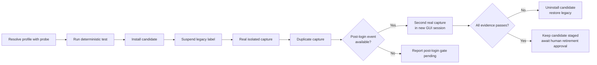

# macOS Screenshot Sorter agent acceptance scenario

This is the executable acceptance runbook for an authorized agent. When asked to test the command, the agent reads this file, performs every applicable step in order, records the stated evidence, and does not retire the Ruby implementation unless the human separately asks for retirement.

The scenario authorizes these bounded effects: install or remove the **candidate** LaunchAgent; suspend or restore the configured legacy LaunchAgent; create test captures in the configured screenshot source; and move only the test captures through the sorter. It never authorizes deletion or replacement of the legacy Ruby script or plist.



## Preconditions and evidence record

1. Confirm macOS: `test "$(uname -s)" = Darwin`.
2. Invoke `macos-screenshot-sorter.command.sh probe` through the selected profile-aware command runner. Record every returned key/value. The agent must use these values rather than inventing paths or labels.
3. Set local variables from the probe output: `source_dir`, `destination_dir`, `candidate_label`, `candidate_plist`, `candidate_stdout`, `candidate_stderr`, `settle_seconds`, `start_interval_seconds`, `legacy_label`, and `legacy_plist`. Record both timing values so the agent can distinguish the short post-write wait from the missed-event recovery scan.
4. Verify `source_dir` and `destination_dir` exist. Verify `legacy_plist` exists before suspending the legacy job. If a physical Desktop directory is used, inspect the candidate error log for `Operation not permitted` after each capture; a manual shell success does not prove background authorization.
5. Run `bash macos-screenshot-sorter.command.test.sh`. A pass proves deterministic recognition, date placement, collision allocation, idempotency, and rendering of the actual LaunchAgent plist. It does not prove GUI-session behavior or TCC.

## Isolated candidate capture test

1. Install the candidate: `macos-screenshot-sorter.command.sh install --apply`.
2. Suspend the legacy job: `macos-screenshot-sorter.command.sh suspend-legacy --apply`. Verify `launchctl print "gui/$(id -u)/$legacy_label"` fails while the legacy plist and Ruby script still exist. This removes the two-watcher race; do not proceed if both jobs can watch the same source folder.
3. Verify the candidate is loaded with `launchctl print "gui/$(id -u)/$candidate_label"`. Its `ProgramArguments` must name `macos-screenshot-sorter.py`.
4. Choose a unique test name that matches Apple’s convention, using the local capture date: `Screenshot YYYY-MM-DD at agent-<unique>.png`. Create a real screen capture with `/usr/sbin/screencapture -x "$source_dir/$test_name"`.
5. Wait no more than ten seconds, polling for `$destination_dir/YYYY-MM-DD/$test_name`. Pass only when the source-root file is gone and that dated destination file exists.
6. Record the new JSON movement record from `candidate_stdout`. `candidate_stderr` must be empty or contain no `Operation not permitted`, `EPERM`, or TCC/privacy denial. Record `launchctl print` state, runs, and last exit code after the process exits.

## Collision and non-screenshot safety test

1. Hash the first dated test file using `shasum -a 256`.
2. Capture a second real image with the same `$test_name` into `$source_dir`. Wait for the candidate to move it.
3. Pass only when the original hash is unchanged and a second dated file with a unique ` (1)` suffix exists. Do not compare independent image bytes; two captures can legitimately differ.
4. If an unrelated PNG is already present in the source root, record that it remains. Do not create, move, or classify unrelated user images merely to satisfy this check.

## Post-login gate

A fresh GUI login cannot be simulated by `launchctl bootstrap`, `kickstart`, or a manual command. If the human has not logged out and back in during this acceptance run, record **POST_LOGIN_PENDING** and leave the candidate staged; do not retire Ruby.

After an actual logout/login, the agent repeats the isolated candidate capture test with a new unique name. Pass this gate only if the candidate’s own stdout records the move in the new GUI session, its stderr has no TCC/privacy denial, and the dated file appears promptly. Record the new session’s `launchctl print` result.

## Failure handling and rollback

On any failed capture, TCC/privacy denial, ambiguous watcher state, or collision failure:

1. Run `macos-screenshot-sorter.command.sh uninstall --apply`.
2. Confirm the legacy label is unloaded, then run `macos-screenshot-sorter.command.sh restore-legacy --apply`.
3. Verify `launchctl print "gui/$(id -u)/$legacy_label"` succeeds and that the legacy plist and Ruby script remain present.
4. Report the failed evidence. Do not delete, overwrite, or replace either legacy file.

## Completion rule

The candidate is eligible for human-approved retirement of Ruby only after deterministic, isolated real-capture, duplicate, non-screenshot, and post-login gates pass with their recorded evidence. The agent reports readiness; it does not retire Ruby on its own.

## Playwright E2E Tests

The scenario.md is the **leading master source of truth** for testing. Each scenario step maps to one or more Playwright tests that verify the same behavior programmatically.

### Scenario-to-Test Mapping

| Scenario Step | Playwright Test | Purpose |
|---------------|-----------------|---------|
| 4. Install candidate | N/A (E2E tests UI only) | LaunchAgent installation is backend testing |
| 10. Tab order (Settings → Screenshots) | `Screenshot tab shows default config values` | Verifies Screenshots tab is first, Settings second |
| 10. Settings form fields | `Settings tab shows default config values` | Verifies UI loads and shows fields |
| Tab switching | `Tab switching works correctly` | Verifies clicking tabs switches content |

### Running E2E Tests

```bash
cd launcher/renderer

# Install dependencies
npm install

# Run all tests
npm test

# Run with UI mode
npm run test:ui

# Run specific test file
npx playwright test macos-screenshot-sorter.e2e.spec.cjs
```

### Writing New Tests

1. **Start with scenario.md**: Read the acceptance scenario first
2. **Add test to scenario.md**: Document what the test should verify
3. **Add Playwright test**: Create test that matches the scenario step 1:1
4. **Run both**: Verify scenario works manually AND test passes programmatically

### Test Principles

- **Scenario-first**: scenario.md is the master; tests implement what scenario describes
- **1:1 mapping**: Each scenario step should have at least one corresponding test
- **User action simulation**: Tests should click, type, and interact like a real user
- **Visible assertions**: Check what the user sees - text, classes, attributes, visibility
