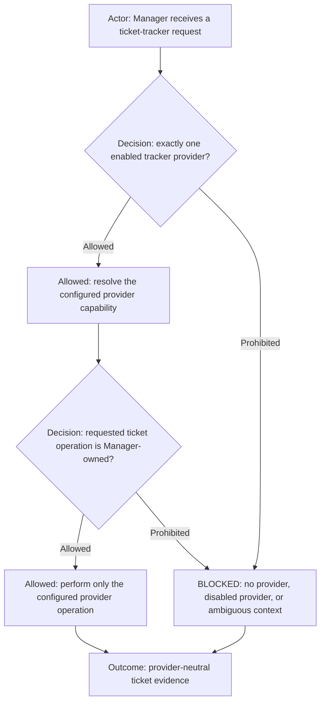

# ticket-tracker

Execution route: `manager`.

Command kind: `adapter`.

Adapter layer: `provider-neutral`.

## Provider-neutral resolution

`ticket-tracker` is the provider-neutral Manager route for ticket search, read, status inventory,
creation, checklist update, lifecycle update, and evidence-gated closure. It
resolves the provider only from the active workflow's validated context record:
`tracker.provider`, `tracker.capability`, and `disabledProviders`.

The request must identify the project, repository, caller, exact return task,
ticket or correlation ID when available, bounded operation, and closed return
route authorization. Manager rejects a missing, disabled, ambiguous, or
foreign-provider route. The selected provider is an implementation detail of
the validated workflow context; callers must not select a provider by name.

## Provider implementations

After resolving `tracker.capability`, load only its registered provider command from the selected `ai_commands_root`.
Provider implementation commands own mechanical provider interaction; `ticket-tracker` and Manager retain operation
semantics, authorization, deduplication, lifecycle, ticket formatting, and evidence interpretation. Summary conventions,
required
description sections, templates, and project-specific fields come from the active profile/project context. Provider
commands accept those resolved values and must not hardcode a client's ticket policy or corporate endpoint. The active
profile/project configuration is the canonical source for provider workspace/container identity, URLs, lifecycle names,
registered operation names, command binding, and `command_env_overrides` keyed by environment placeholders declared by
the adapter. A provider command documents generic placeholder variables for those values but never supplies a real
organization's values. A provider command must never be selected from URL shape, company name, current directory, or
remembered context.

Manager validates the override keys against the selected provider command contract and forwards the resolved
provider-neutral execution binding unchanged. Command Runner may apply an explicitly
configured machine-local override where the provider command permits one, but an override is not project configuration
and must not be used to reconstruct missing profile context. Secrets and machine-specific paths remain outside committed
profile files.

| Configured capability | Provider command contract                         | Route                                        |
| --------------------- | ------------------------------------------------- | -------------------------------------------- |
| `jira`                | [`jira/jira.command.md`](../jira/jira.command.md) | Manager authorizes; Command Runner executes. |

For an overall-progress request, Manager first resolves the configured provider's read-only status-inventory operation
using the profile's project/container and `in_progress` lifecycle value. It then reads the returned exact ticket evidence
before asking relevant initialized agents for execution detail. Missing provider inventory support is a reported blocker;
Manager must not silently substitute agent recollection for tracker state.

An unknown, disabled, unavailable, or multiply resolved capability is `BLOCKED`. Adding another provider requires its own
registered command contract and an explicit adapter row here; it does not change workflow-agent contracts.

This command grants no shell, browser, source-editing, implementation, or
generic Command Runner authority. It preserves the existing Manager ownership
and ticket-lifecycle gates in shared execution routing.
