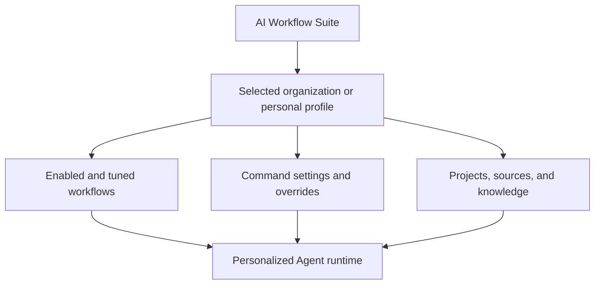
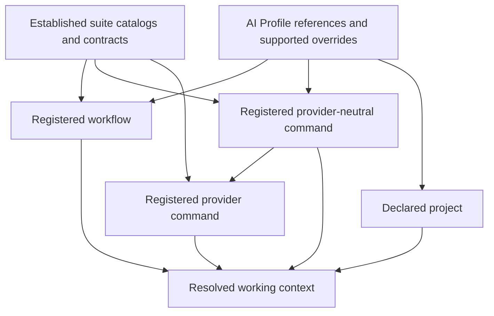
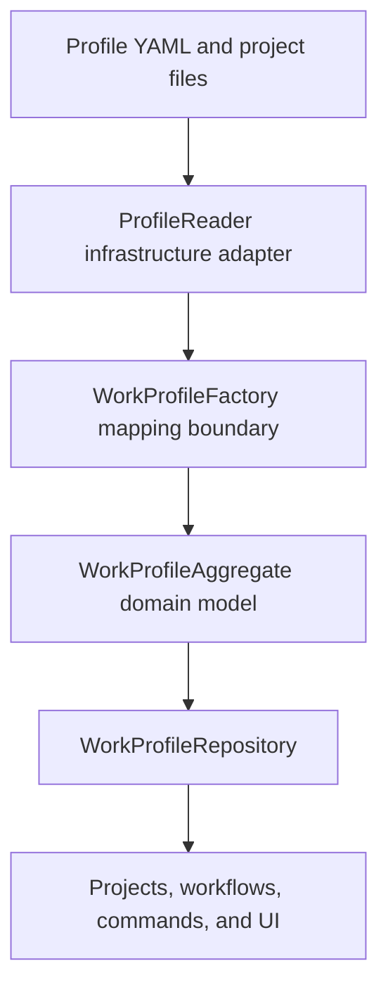
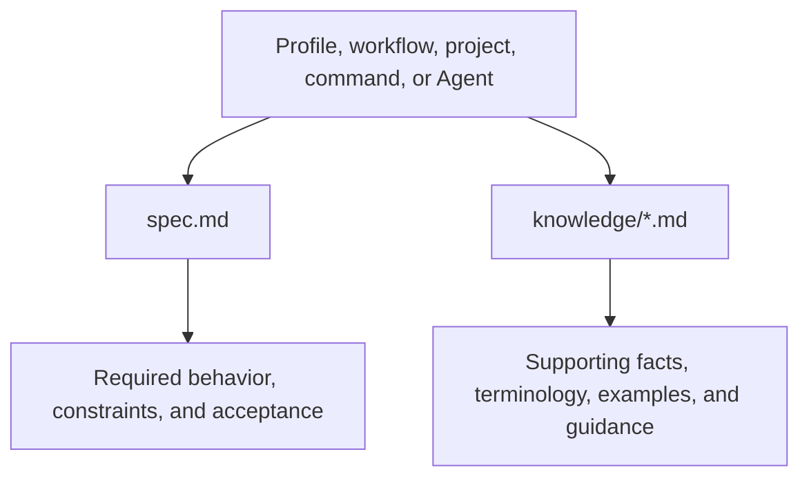

# AI Profiles



An AI profile is the organization-specific or personal configuration that tunes the AI Workflow Suite for one working
context. Reusable commands and workflows remain profile-agnostic; the selected profile tells them where and how they are
allowed to operate. It makes the suite personal to its user or organization without hardcoding those details into shared
commands or workflow packages.

A profile can select or configure:

- the registered agent platform that realizes logical workflow agents;
- the workflows available to the user and the default workflow;
- the commands available to each workflow and profile-specific command settings or templates;
- projects, source folders, expected Git remotes, external knowledge, and other working context;
- Agent runtime and login defaults;
- organization domains, service URLs, environments, and application layout settings;
- credential requirements and local credential references required by commands or integrations, never secret values.

The reusable catalog defines what a command or workflow can do. The profile supplies organization-specific values,
narrows what is enabled, and may override supported settings. Repository-local instructions and current source files
remain authoritative for work inside a selected project.

## Referential configuration



An AI Profile is primarily referential configuration. It selects established objects in the AI Workflow Suite and
supplies values through extension points those objects already declare. It is not a second command catalog, workflow
catalog, Agent definition store, provider implementation, or copy of project source configuration.

For example:

- a workflow entry references an existing workflow package and selects its allowed projects and commands;
- a command entry references an existing registered command and supplies only supported profile-owned overrides;
- `source-control` references the existing `git` provider command instead of embedding Git behavior in the profile;
- `ticket-tracker` resolves an existing Jira or Trello provider command instead of defining a tracker implementation;
- a project entry references one project definition and may attach profile-owned knowledge that cannot live in the
  project repository.

Every reference must resolve unambiguously within the selected catalog and ownership boundary. Unknown command IDs,
workflow paths, provider bindings, project references, unsupported override keys, escaping paths, and duplicate bindings
must fail closed in the consuming runtime. Directory placement alone never creates or activates an object.

Profile-owned files contain configuration values, policies, templates, references, and supplemental knowledge. They must
not duplicate reusable command instructions, workflow behavior, provider mechanics, source code, or credentials. When a
new capability is required, define it in the appropriate reusable catalog first; then reference and tune it from the
profile.

## Profile boundary

Each immediate child of `ai-profile/` is one self-contained profile. Its `<profile-id>-work-profile.yml` is the entry point
for that profile's work context. Select the individual directory, such as `ai-profile/sc`, in the launcher—not the
`ai-profile/` catalog itself. Selection is performed by the consuming host or
platform; this public repository does not define that host's launcher.

```text
ai-profile/
└── <profile-id>/
    ├── <profile-id>-work-profile.yml
    ├── commands/       # Overrides that apply to the complete profile
    ├── workflows/      # Workflow resources and workflow-scoped command overrides
    ├── projects/       # Project mappings, knowledge, and project-scoped command overrides
    └── .creds/         # Local credentials; always ignored and never committed
```

The work-profile file commonly defines `default_agent`, `agent_login_method`, `default_workflow`, `workflows`, project
bindings, catalog locations, organization metadata, environments, and app-mode settings. Runtime selection may use
`WORK_PROFILE_ID`, and session state remains scoped under `session-root/<work-profile>/...`.

`agent_platform` selects the exact adapter that realizes logical workflow agents, while `ai_platforms_root` selects its
registry. The profile runtime resolves the adapter contract explicitly and fails closed when it is absent. A workflow may
still select a command-execution harness independently; an agent platform defines agent identity and lifecycle, while a
harness defines how an agent executes a particular workload.

The consuming host reads this entry point through one typed profile reader. It parses YAML once, rejects duplicate keys,
malformed workflow/project collections, unsupported top-level project placement, missing workflow paths, unsafe alias
expansion, and oversized profile files before repositories or the UI consume profile data. Repositories use the normalized
reader model for workflow paths, command lists, harnesses, and project references; they must not independently reinterpret
the same YAML structure.



`ProfileReader` owns safe YAML decoding, `WorkProfileFactory` translates decoded configuration into domain language, and
`WorkProfileAggregate` enforces profile invariants and owns workflow-scoped command, harness, and project-reference
queries. `WorkProfileRepository` owns discovery and loading only; consumers should ask the aggregate for scoped data
instead of indexing its configuration maps directly.

Use `example/` as the publication-ready, sanitized template. It contains explicit TODO projects plus non-secret
ticket-tracker, Git, and Hermes override patterns; replace every placeholder before using a copied profile. The Hermes
example intentionally shows a loopback endpoint, fictional provider/model IDs, context-window settings, and
`${AI_COMMANDS_ROOT}` command access without exposing an operational host. Operational profiles,
project bindings, provider settings, credentials, and platform implementation-root bindings belong in the consuming
private platform. Run `./ai-profile/validate-example.sh` before publishing the example.

## Command override scopes

Profiles activate portable capabilities by referencing real registered commands. Provider-neutral commands own intent and
policy, while provider commands own mechanics. For example, a profile binds `source-control` to `git` rather than defining
a special `source_control` profile concept:

```yaml
commands:
  - id: source-control
    config: commands/source-control/config.yml
```

The referenced config declares `capability: git`, `registered_command: git`, the provider command path, identity, and
allowed remote policy. Credentials remain outside committed configuration. This follows the same composition model as
`ticket-tracker` selecting Jira or Trello: profile configuration selects and tunes a real command; it does not introduce a
parallel capability schema.

Command configuration may be owned at three scopes:

```text
<profile-id>/commands/<command-id>/
<profile-id>/workflows/<workflow-id>/commands/<command-id>/
<profile-id>/projects/<workflow-id>/<project-id>/commands/<command-id>/
```

- **Profile scope** applies to every use of that command in the selected profile.
- **Workflow scope** applies only while that workflow is active.
- **Project scope** applies only while that exact workflow project is active.

Resolution proceeds from reusable command defaults to profile, workflow, and then project scope. A narrower scope may
override only values the command contract declares overridable; it cannot replace the command's safety rules or execution
ownership. Credentials remain local regardless of scope.

Directory placement describes ownership but does not activate an override by itself. The profile, workflow, or project
configuration must explicitly reference the policy, template, or supported override values. This makes the effective
configuration auditable and prevents an unrelated workflow or project from inheriting a nearby file accidentally.

## Credentials and sensitive configuration

Credentials belong only in the selected profile's local `.creds/` directory. The entire directory is ignored by Git;
do not commit credentials, tokens, private URLs containing secrets, private keys, or populated credential examples. A
profile may describe which credential scope or provider is required, but secret values must remain local.

Operational command configuration also belongs to the selected profile and should be ignored in operational/private
repositories when it contains organization, machine, endpoint, identifier, or credential values. A public example may
show the supported shape only with unmistakably fictional placeholders. Command launchers resolve `commands[].config`
and pass its absolute path as `AI_COMMAND_CONFIG_PATH`; reusable command folders never own operational overrides.

The committed `ai-profile/example/` directory is the deliberate exception for documentation: it may contain complete,
realistic configuration shapes so users can understand and copy them, but every value must be fictional, non-secret,
non-operational, and clearly labeled as an example. A copied operational profile must not be committed. Keep its
`commands/**/config.yml`, `config.yaml`, `config.env`, and `config.conf` files ignored, especially when they contain real
identities, paths, endpoints, account IDs, or credentials.

In domain language, an Agent is the configured work-running instance the operator talks to. A Work Profile supplies that
Agent's defaults, allowed workflow and project context, login method, and app-mode settings.

## Specifications and knowledge



Specifications and knowledge are both contextual documents, but they have different authority:

- `spec.md` is normative. It defines what its owner is supposed to do, the constraints it must preserve, and the evidence
  by which its behavior can be accepted.
- `knowledge/*.md` is descriptive. It supplies facts and guidance that help an Agent understand the context, but it does
  not create executable behavior or silently override a specification.

The distinction is not limited to projects. A profile, workflow, project, command, or Agent may conceptually own a
specification, knowledge, or both. Keep each document at the narrowest scope that owns it. More-specific knowledge may
extend broader context; it must not contradict or replace a higher-level contract. When sources disagree, current source
and repository-local instructions remain authoritative, followed by applicable specifications; supplemental knowledge
does not win a conflict merely because it is more specific.

The current typed profile implementation loads explicitly referenced project knowledge. The broader ownership model above
is the convention for extending profiles to workflow-, command-, profile-, or Agent-level knowledge without treating every
Markdown file as an executable command. A UI may present specifications and knowledge together as contextual information,
but it should preserve their labels and authority instead of merging them into one undifferentiated document.

## Workspace projects and external knowledge

Inside a Work Profile, each `workflows[].projects[]` entry references a project definition under the profile's `projects/`
directory. Organize definitions by workflow when that makes ownership clear, for example
`projects/dev/example-service/project.yml`. The referenced file identifies the project folder visible to that workflow,
its canonical path, and, for Git projects, its expected remote. Project configuration belongs in these files rather than
being embedded as a large block in the Work Profile.

The first directory below `projects/` should match the owning workflow ID: `projects/dev/` contains project definitions
used by `dev.workflow.md`, while `projects/financial-insights/` contains definitions used by `financial-insights.workflow.md`. This folder
name is a human-readable organization convention; it does not create the relationship automatically. The explicit `ref`
under that workflow's `projects:` list is the authoritative mapping. A project is available to a workflow only when that
workflow references its definition.

A project may optionally declare profile-owned knowledge that should not or cannot be stored in that repository:

```yaml
# <profile-id>-work-profile.yml
projects:
  - ref: projects/dev/example-service/project.yml

# projects/dev/example-service/project.yml
id: organization/example-service
repo_path: /configured/path/example-service
remote_url: https://example.invalid/organization/example-service.git
knowledge:
  - id: local-development
    kind: instructions
    ref: knowledge/local-development.md
    applies_to: [build, validation]
```

Each project is a directory whose `project.yml` is its entry point. Optional `commands/` and `knowledge/` directories sit
beside it, keeping every project-specific resource inside one ownership boundary. Knowledge references resolve relative
to `project.yml`. Give every knowledge item a stable ID and use optional `applies_to` topics to avoid loading irrelevant
context.

When a workflow selects one exact project for command execution, the host
exports that resolved definition as `AI_PROFILE_PROJECT_FILE`. Commands consume
that single profile-owned `project.yml`; they must not scan or maintain a
project registry under `ai-commands/`. If a workflow exposes multiple projects,
the host or caller must select one before invoking a project-dependent command.

The consuming host reads each referenced knowledge file through the typed project-definition reader and exposes it on the
resolved Project model as `knowledge[]`. Every entry includes its `id`, `kind`, relative `ref`, resolved source path,
`appliesTo` topics, and bounded text content. Consumers should select only entries whose `appliesTo` value matches the
current activity; an empty list means general project knowledge. Missing files, duplicate IDs, malformed lists, oversized
content, and references escaping the project profile directory fail closed while loading the profile.

Knowledge is context, not executable behavior. For example, a project knowledge file may explain which validation tasks
to run and what evidence to inspect, while a registered command remains responsible for executing those tasks. This keeps
organization/project facts in the profile without turning every project into a separate reusable command.

```text
projects/
└── <workflow-id>/
    └── <project-id>/
        ├── project.yml
        ├── commands/
        │   └── <command-id>/
        └── knowledge/
```

Do not put workflow-wide overrides in `projects/<workflow-id>/commands/`; that path is ambiguous with a project named
`commands`. Put them in `workflows/<workflow-id>/commands/`. Everything beneath a project directory is scoped only to that
project unless an explicit configuration reference says otherwise.
Use `kind: instructions` for prose guidance such as build procedures, review conventions, architecture notes, and local
environment knowledge. A knowledge entry is not a registered command and does not create an execution route; executable
work still uses the workflow's existing capabilities and command ownership. Profile-specific command policies and
templates belong at their narrowest applicable command-override scope; workflow-specific resources belong under
`workflows/`.
Knowledge is supplemental: repository-local instructions and current source/build files remain authoritative. Do not put
credentials, tokens, or other secrets in knowledge files. Client-specific knowledge belongs here, never in a reusable
workflow or command.
