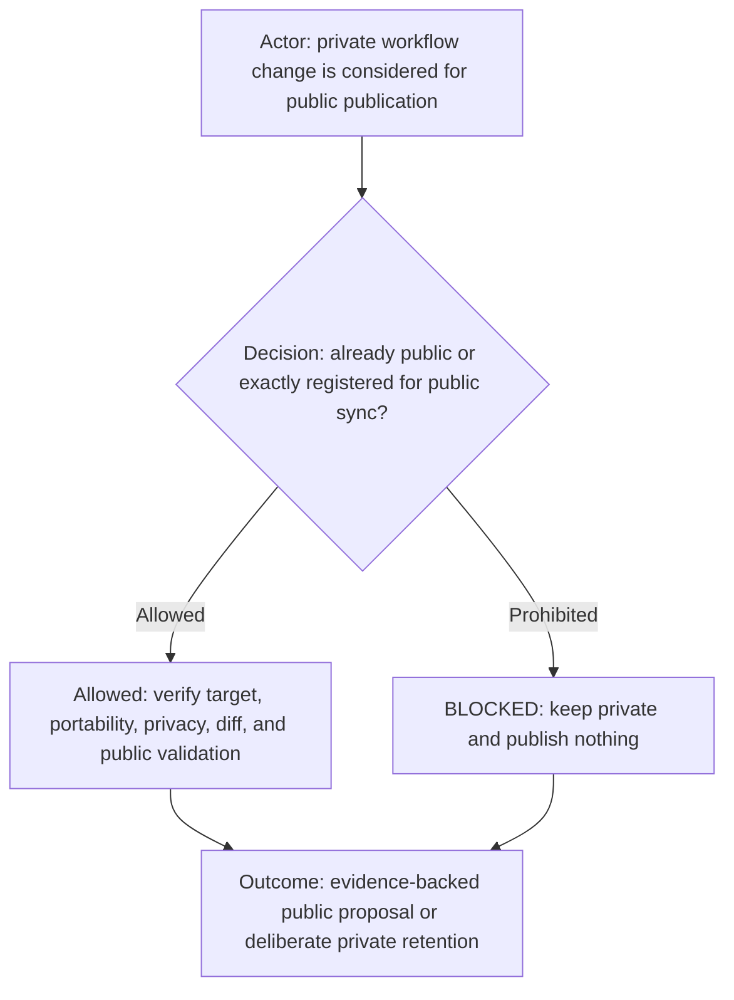
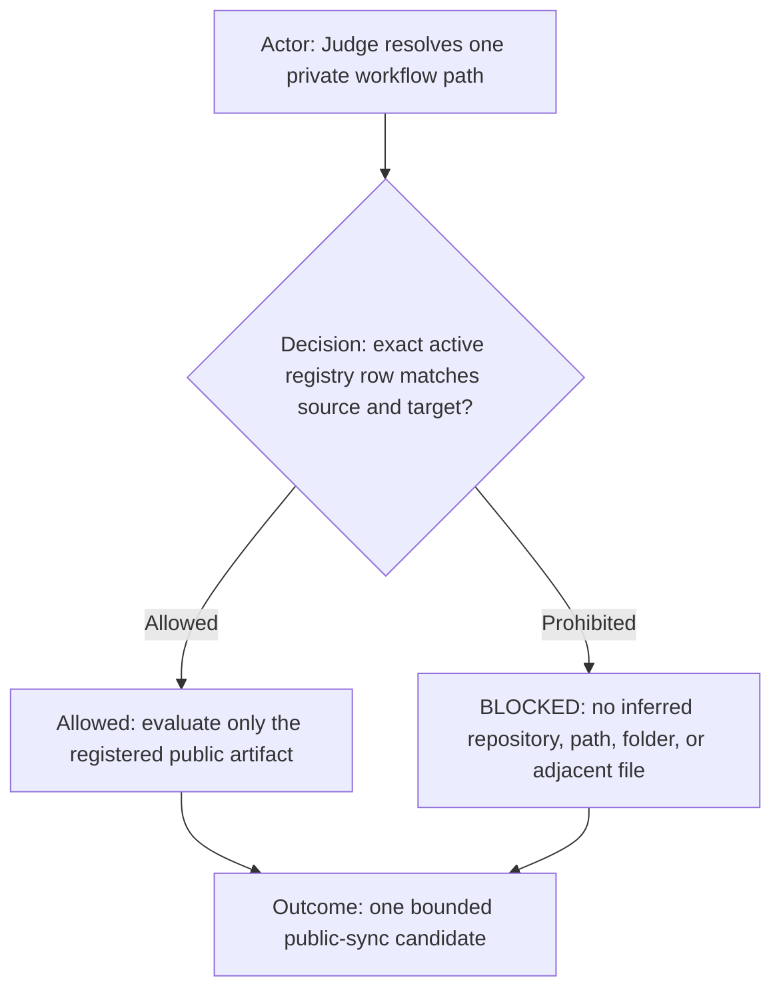

# Public workflow synchronization

Workflow material may participate in public reconciliation only when either its exact path already exists in the
verified public repository history or the root [`../ai-publication.yml`](../ai-publication.yml) registry explicitly maps
the private source and exact public target.
Repository similarity, reusable-looking content, a public repository with a related name, or tool access is insufficient.

Before any public commit, push, or pull request, Judge fetches both sides and verifies the source path, public repository,
target path, both revisions, complete divergence, portability, privacy, security, license compatibility, validation,
and ordinary protected-governance receipt chain. Missing or conflicting evidence is `BLOCKED_PUBLIC_SYNC_SCOPE`.

This file and the root registry are private maintenance metadata and must never be copied into a public repository. For a
registered folder without `include`, every descendant must exactly match the mapped public target. When a registry
row has `include`, those unique normalized relative non-symlink files are the complete artifact boundary: every member must
exist on both sides with identical path, mode, and bytes, no other public file may exist under the target, and other private
descendants remain unregistered. Public-owned variants are prohibited.
Any organization-specific value inside a registered source must move to profile-owned or unregistered private configuration
before synchronization.

Portable improvements may originate in either repository, including direct human edits made outside the governed workflow.
Judge reviews the complete divergence and applies the intended behavior to the other side. Repository location, timestamp,
or an assumption that private is newer never resolves a conflict. Reconciliation is complete only when the registered
inventories and hashes match exactly.

## Public workflow registry resolution

The active registry row for the common workflow contract maps `ai-workflows/agents.md` to `agents.md` in
`starodubtsevconsulting/ai-workflows`. Judge reads the machine-readable root registry rather than maintaining a second
workflow-local table. The mapping applies only to the exact row. It does not authorize adjacent private workflow files,
profile data,
project bindings, role directories, runtime implementation, tests, credentials, paths, tracker details, or client data.
