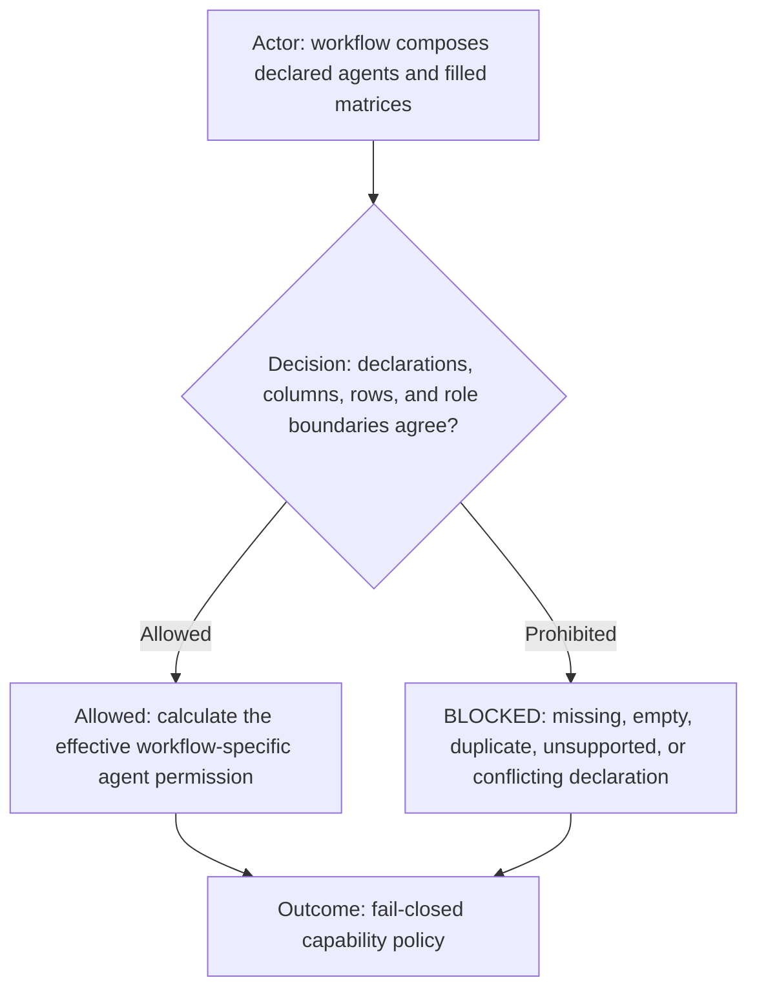
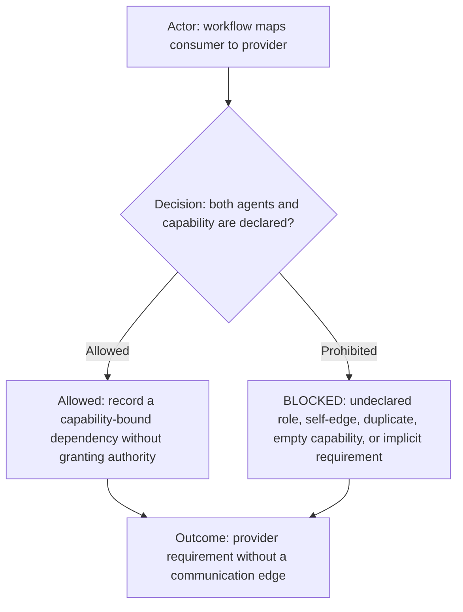

# Agent access matrix mechanism

**DIAGRAM-FIRST CONTRACT — NO UNCOVERED RULE TEXT.** Every normative chapter starts with a compact vertical Mermaid
diagram containing its actor, prerequisite or decision, allowed route, prohibited or `BLOCKED` route, and terminal
outcome. Diagram/text mismatch is `BLOCKED`.

This reusable mechanism defines how a workflow grants capabilities to instantiated agents. It contains no workflow
roles, permissions, providers, or project values. Filled matrices always belong to one workflow. Runtime-routed
workflows derive dispatch from their authoritative stage-to-role declarations, not from a communication matrix.

## Composition and authority

The workflow's `agents.yml` names the exact filled capability-ownership matrix. After the leading row key, matrix columns
must equal the manifest's unique `matrixColumn` values in declaration order. Row keys are nonempty and unique; every cell
is nonempty. `PROHIBITED` is an explicit denial. An absent agent, row, column, cell, or referenced file grants nothing.
Communication matrices and peer-route grants are unsupported. A workflow uses Router stage declarations for dispatch.

An effective action requires all applicable layers: the common role supports the behavior, the agent declaration selects
that role, the workflow capability matrix grants the action, workflow/Router routing requirements pass, and the
initialized profile/project context matches. A workflow may narrow a common role but cannot expand its intrinsic
boundary. A profile may fill declared parameters or narrow project context but cannot silently add a role, capability,
runtime transition, or matrix column.

The example in [capability-ownership.template.csv](capability-ownership.template.csv) demonstrates shape only. Its
placeholder rows grant nothing and must never be loaded as effective workflow policy.

## Workflow dependency projection

Reusable common roles define intrinsic behavior and boundaries. They must not require another named role to exist.
When one instantiated agent needs another instantiated agent for a workflow capability, `agents.yml` declares that
relationship under `dependencies`. Each dependency names a declared consumer, a different declared
`providerRole`, a supported `kind`, the `capability-bound` requirement, and one or more unique nonempty capabilities.
The current schema supports `capability-provider` and `return-coordinator` kinds.

`capability-bound` means the consumer may still be instantiated and perform unrelated capabilities when the provider is
unavailable. Only the named capability is blocked. The current schema intentionally has no agent-existence dependency.
A dependency entry cannot grant ownership, execution, dispatch, receipt, or contact. The common role, capability matrix,
workflow declaration, Router contract, and runtime context must independently authorize the action. Conflict is
fail-closed.

The example in [dependencies.template.yml](dependencies.template.yml) demonstrates shape only. Placeholder entries grant
nothing and must never be loaded as effective workflow policy. Provider requirements belong in the workflow manifest,
never in an unrelated role, and never create peer topology.

## Workflow projection

During the current incremental schema, `agents.yml` references an external capability-ownership CSV. A later schema version may embed
equivalent row and cell data inside `agents.yml`, but it must preserve the same unique-column, unique-row, nonempty-cell,
role-boundary, profile-neutrality, and fail-closed rules. Moving representation never changes authority.
