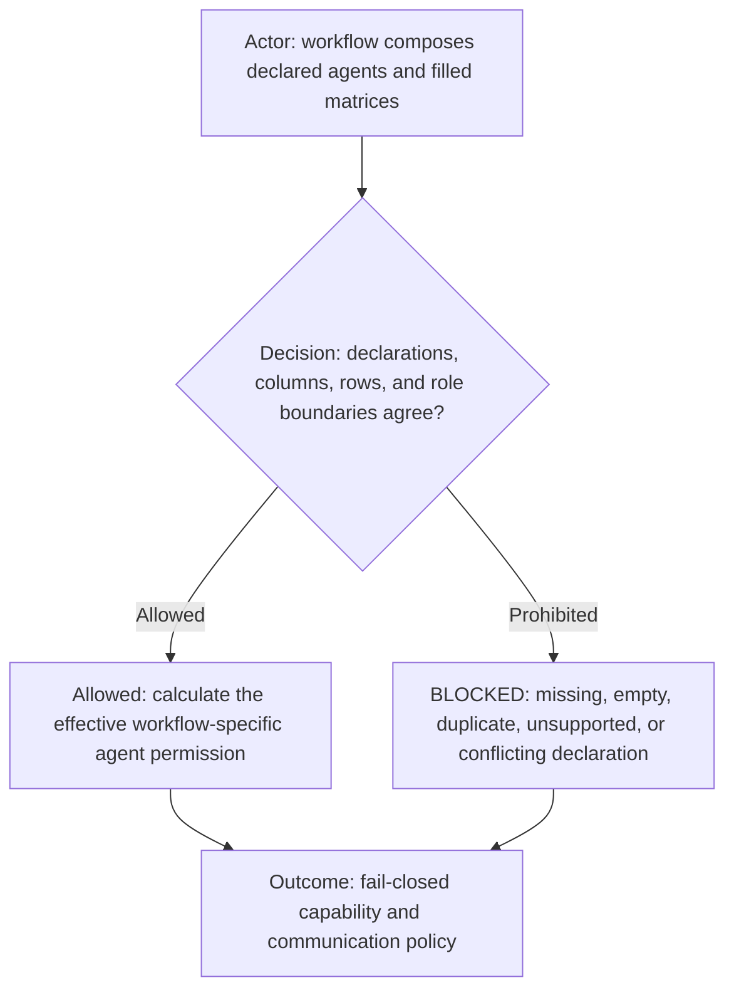
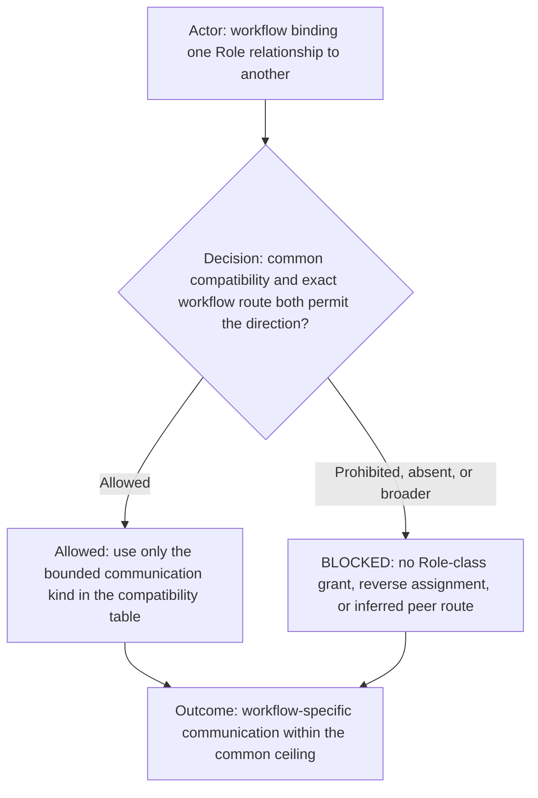
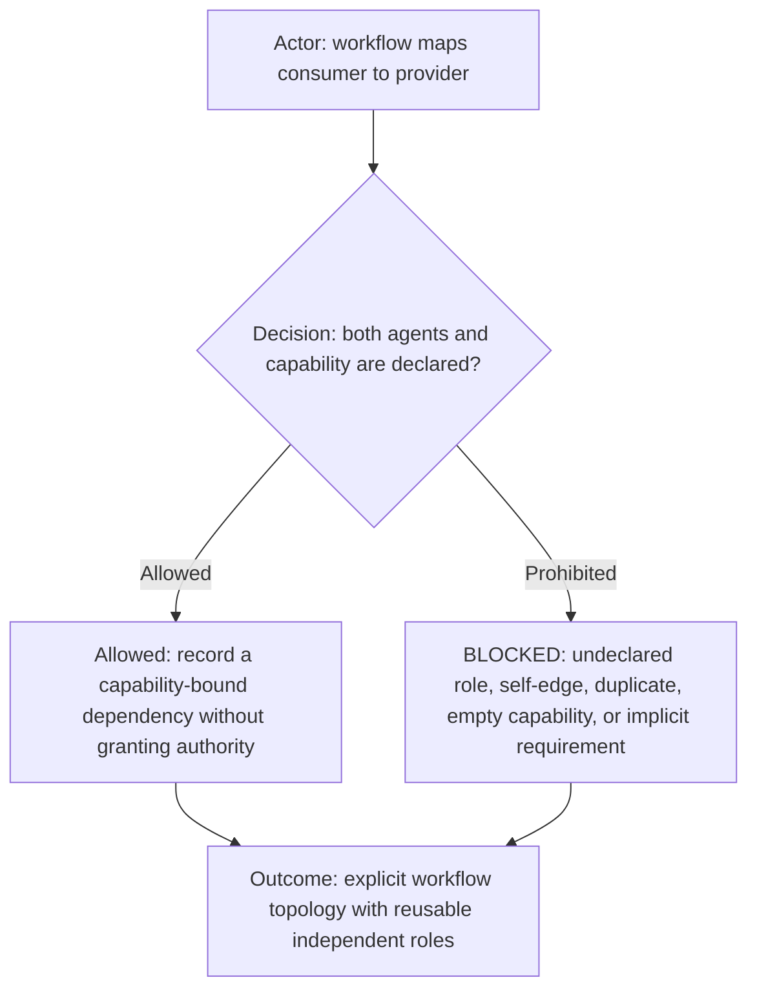
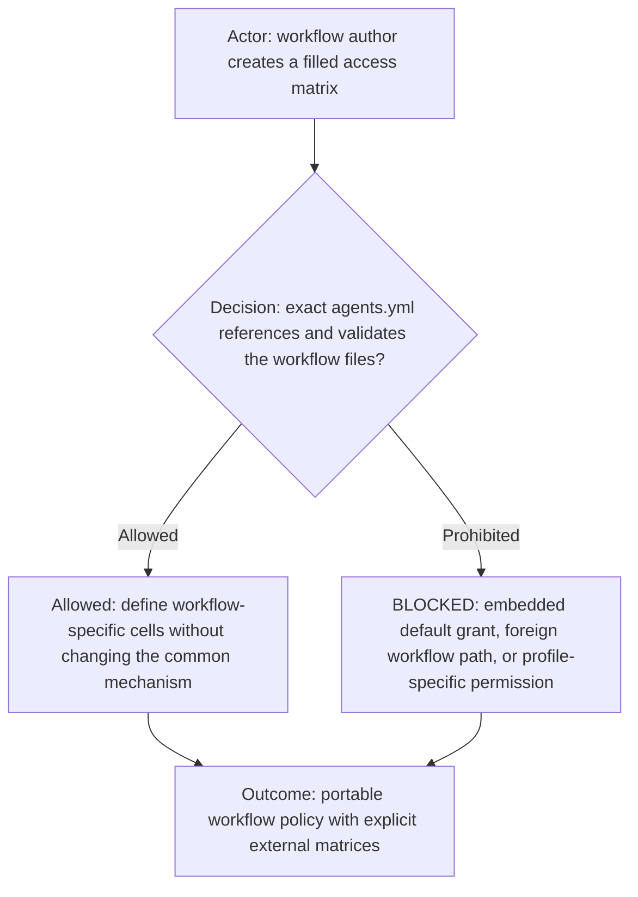

# Agent access matrix mechanism

**DIAGRAM-FIRST CONTRACT — NO UNCOVERED RULE TEXT.** Every normative chapter starts with a compact vertical Mermaid
diagram containing its actor, prerequisite or decision, allowed route, prohibited or `BLOCKED` route, and terminal
outcome. Diagram/text mismatch is `BLOCKED`.

This reusable mechanism defines how a workflow grants capabilities and communication routes to instantiated agents. It
contains no workflow roles, permissions, providers, or project values. Filled matrices always belong to one workflow.

## Composition and authority

The workflow's `agents.yml` names the exact filled capability-ownership and communication matrices. After the leading row
key, matrix columns must equal the manifest's unique `matrixColumn` values in declaration order. Row keys are nonempty and
unique; every cell is nonempty. `PROHIBITED` is an explicit denial. An absent agent, row, column, cell, or referenced file
grants nothing.

An effective action requires all applicable layers: the common role supports the behavior, the agent declaration selects
that role, the workflow capability matrix grants the action, the communication matrix permits its route, workflow routing
requirements pass, and the initialized profile/project context matches. A workflow may narrow a common role but cannot
expand its intrinsic boundary. A profile may fill declared parameters or narrow project context but cannot silently add a
role, capability, communication route, or matrix column.

The examples in [capability-ownership.template.csv](capability-ownership.template.csv) and
[communication.template.csv](communication.template.csv) demonstrate shape only. Their placeholder rows grant nothing and
must never be loaded as an effective workflow policy.

## Role-relationship communication compatibility

The common matrix below is an authoritative compatibility ceiling for relationships, not a concrete communication
grant. A workflow binds concrete Agents to these relationships and must separately authorize the exact sender,
recipient, direction, capability, and packet type. `PERMITTED_IF_WORKFLOW_BOUND` means only that a workflow may grant
the narrower route; it never permits every Agent with the same Role class to communicate. `RETURN_ONLY` carries a
result, question, blocker, or terminal disposition to the packet's exact return identity and grants no reverse
assignment authority. An absent relationship or communication kind is `PROHIBITED`.

| Sender relationship | Recipient relationship | Common compatibility | Maximum communication kind |
| --- | --- | --- | --- |
| Supervising Worker | Assigned Worker | PERMITTED_IF_WORKFLOW_BOUND | Bounded assignment or same-scope correction packet. |
| Assigned Worker | Supervising Worker | RETURN_ONLY | Evidence, clarification question, blocker, or terminal disposition. |
| Assigned Worker | Execution Worker | PERMITTED_IF_WORKFLOW_BOUND | Bounded implementation-mechanics packet. |
| Execution Worker | Packet return coordinator | RETURN_ONLY | Mechanical evidence, blocker, or terminal disposition. |
| Worker | Manager | PERMITTED_IF_WORKFLOW_BOUND | Ticket, capability, staffing, or lifecycle request allowed by the selected workflow. |
| Manager | Exact requesting Worker | RETURN_ONLY | Requested ticket, capability, staffing, or lifecycle result. |
| Governed Agent | Judge | PROHIBITED | None. |
| Judge | Governed Agent | PROHIBITED | None. |
| Governed Agent | Admin | PROHIBITED | None. |
| Admin | Governed Agent | INITIALIZATION_ONLY | Exact human-directed initialization or lifecycle binding only; never product work. |

A workflow may narrow any compatible row or prohibit it completely. It must not broaden `RETURN_ONLY`,
`INITIALIZATION_ONLY`, or `PROHIBITED`, and it must not convert a relationship into a universal Role-class route.
Conflict between the common ceiling and a workflow matrix fails as `BLOCKED_ROLE_COMMUNICATION_COMPATIBILITY`.

## Workflow dependency projection

Reusable common roles define intrinsic behavior and boundaries. They must not require another named role to exist.
When one instantiated agent needs another instantiated agent for a workflow capability, `agents.yml` declares that
relationship under `dependencies`. Each dependency names a declared `consumerRole`, a different declared
`providerRole`, a supported `kind`, the `capability-bound` requirement, and one or more unique nonempty capabilities.
The current schema supports `capability-provider` and `return-coordinator` kinds.

`capability-bound` means the consumer may still be instantiated and perform unrelated capabilities when the provider is
unavailable. Only the named capability is blocked. The current schema intentionally has no agent-existence dependency.
A dependency entry cannot grant ownership, execution, dispatch, receipt, or contact. The common role, capability matrix,
communication matrix, routing contract, and runtime context must independently authorize the action. Conflict is
fail-closed.

The example in [dependencies.template.yml](dependencies.template.yml) demonstrates shape only. Placeholder entries grant
nothing and must never be loaded as effective workflow policy. Exact peer names and topology belong in the workflow
manifest, matrices, or an explicit workflow override, never in an unrelated role.

## Workflow projection

During the current incremental schema, `agents.yml` references external CSV matrices. A later schema version may embed
equivalent row and cell data inside `agents.yml`, but it must preserve the same unique-column, unique-row, nonempty-cell,
role-boundary, communication, profile-neutrality, and fail-closed rules. Moving representation never changes authority.
