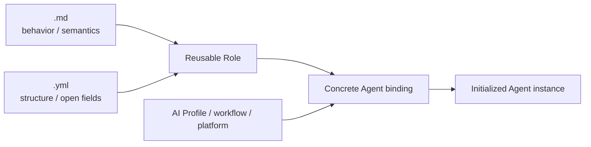

# Reusable role contract

A Role is a reusable abstract agent definition. It is not yet an Agent instance.

Each reusable role SHOULD have two adjacent files with the same basename:

```text
<role-id>.md   # semantic / behavioral contract
<role-id>.yml  # machine-readable structural interface
```

The Markdown contract explains intent, responsibilities, boundaries, prompt interpretation, routing, and other semantics that benefit from human-readable prose and diagrams.

The YAML companion defines the structural properties that an implementation can validate and fill: canonical role ID, scope, human-facing mode, lifecycle defaults, fixed invariants, configurable fields, required references, cardinality, and ownership of each binding.

The YAML MUST NOT duplicate the Markdown prose or provider-specific operational values. It defines shape and ownership; the selected AI Profile, workflow, project, platform adapter, or runtime Agent binding supplies concrete values according to that ownership.

Conceptually:



This is analogous to an interface/abstract class and its implementation:

- **Role Markdown** = semantic contract;
- **Role YAML** = structural interface;
- **Agent binding** = concrete configuration that fills allowed open fields;
- **initialized Agent** = runtime participant with exact identity and resolved configuration.

Most existing roles are initialized inside one workflow through that workflow's `agents.yml`. A role may instead declare a broader binding scope. For example, a cross-workflow role can be profile-bound and initialized outside one workflow while still governing configured workflows.

A concrete Agent must not override fields declared fixed by the role. Missing required bindings, unsupported fields, invalid cardinality, or conflicting ownership should fail closed in the consuming validator/runtime.

`_role.yml` is the publication-ready structural template for this convention. Existing roles may migrate incrementally; introducing the convention does not make an absent YAML companion equivalent to an empty or unrestricted interface.
