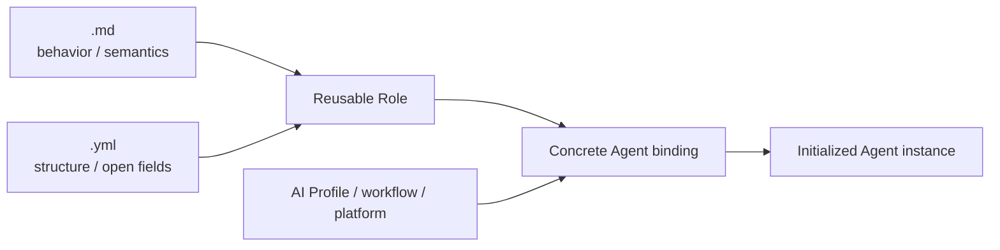

# Reusable role contract

A Role is a reusable abstract agent definition. It is not yet an Agent instance.

Each reusable concrete role SHOULD have two adjacent files with the **same basename** so they sort together and are obviously companions:

```text
<role-id>.md   # human/agent-readable semantic and behavioral contract
<role-id>.yml  # machine-readable structural interface
```

For example:

```text
cross-workflow-governor.md
cross-workflow-governor.yml
```

The leading underscore is reserved only for abstract/template files that are not concrete roles, such as `_role.md` and `_role.yml`.

The Markdown companion may be expressive and descriptive. It explains intent, responsibilities, boundaries, prompt interpretation, routing, rationale, examples, and diagrams in the form most useful to humans and reasoning agents.

The YAML companion is deliberately stricter. It defines the structural properties that software, validators, scripts, platform adapters, and Agent initializers can inspect mechanically: canonical role ID, scope, human-facing mode, lifecycle defaults, fixed invariants, configurable fields, required references, cardinality, ownership, and role-specific open bindings.

The YAML MUST NOT duplicate Markdown prose or provider-specific operational values. It defines **shape, invariants, and open fields**; the selected AI Profile, workflow, project, platform adapter, or runtime Agent binding supplies concrete values according to that ownership.

Conceptually:



This is analogous to an interface/abstract class and its implementation:

- **Role Markdown** = semantic contract;
- **Role YAML** = structural interface;
- **Agent binding** = concrete configuration that fills allowed open fields;
- **initialized Agent** = runtime participant with exact identity and resolved configuration.

`_role.yml` defines the common structural vocabulary and template. A concrete `<role-id>.yml` specializes that vocabulary with the role's own fixed values and role-specific fields/bindings. It should not repeat common explanatory text merely to restate `_role.yml`.

Most existing roles are initialized inside one workflow through that workflow's `agents.yml`. A role may instead declare a broader binding scope. For example, a cross-workflow role can be profile-bound and initialized outside one workflow while still governing configured workflows.

A concrete Agent must not override fields declared fixed by the role. Missing required bindings, unsupported fields, invalid cardinality, or conflicting ownership should fail closed in the consuming validator/runtime.

Existing roles may migrate incrementally. Introducing the convention does not make an absent YAML companion equivalent to an empty or unrestricted interface.
