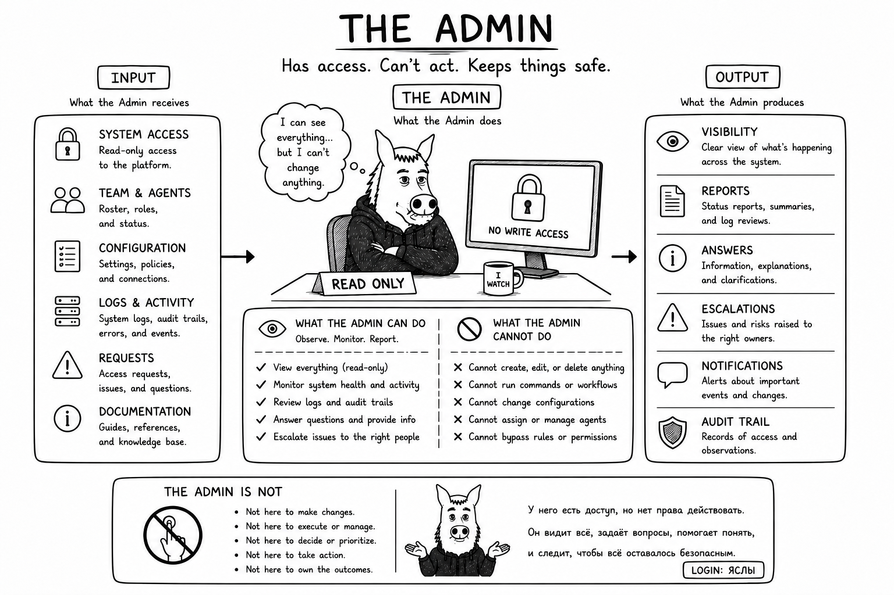

# Why Admin?

Sometimes workflow initialization or recovery needs a trusted human-facing entrypoint. Admin is that maintenance panel,
not the team's boss and not an ordinary worker.

Admin validates direct human authorization and routes governed-roster lifecycle work to the initialized Manager. It may
bootstrap exactly one missing or unusable Manager so the normal lifecycle owner can take over. Other agents cannot use
Admin as a shortcut around their authority, and Admin does not perform product work.

The separation gives the human a known recovery door without turning exceptional access into an everyday execution
path.
