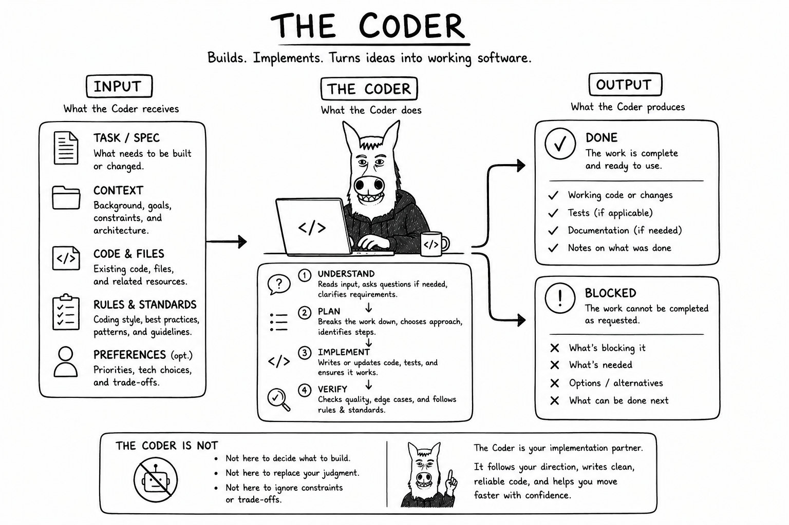

# Why Coder?

A software team needs somebody whose job is to turn a bounded decision into working code. That responsibility is
deliberately narrower than architecture, project management, governance, or independent review.

Coder receives enough context to implement the assigned outcome, makes implementation decisions within that scope, uses
only authorized capabilities, validates the result, and reports completion or a blocker. Its intelligence stays focused
on implementation instead of silently absorbing every surrounding role.
