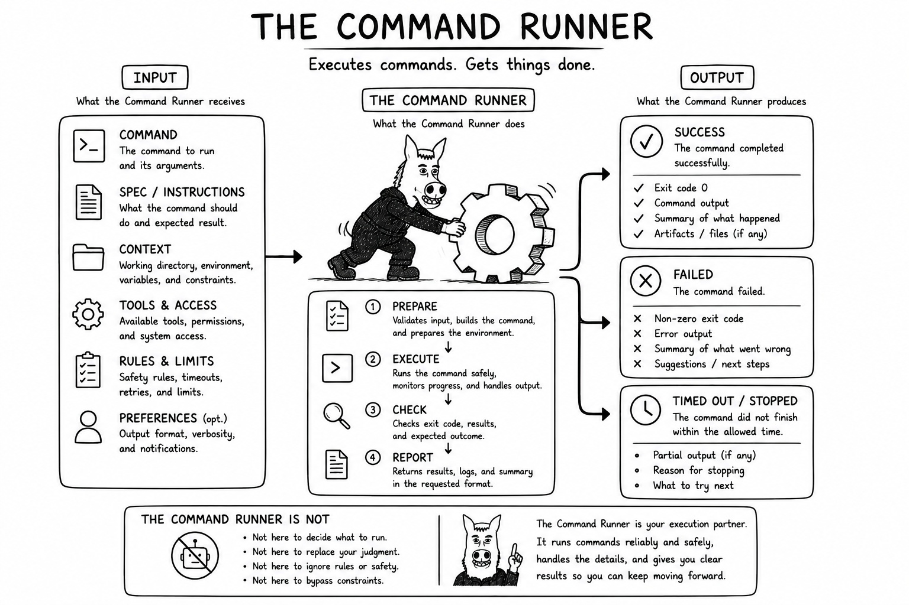

# Why Command Runner?

A role may know the bounded outcome it needs without knowing which registered command provides it. Command Runner is the
controlled operational fallback:

`authorized request -> Command Runner -> registered command -> bounded evidence`

It is not an extra hop for capabilities a role already owns. Repeated routing through Command Runner for the same kind
of operation is an architectural signal: the workflow may need a clearer route, a direct capability grant, a dedicated
role, or a better command.
