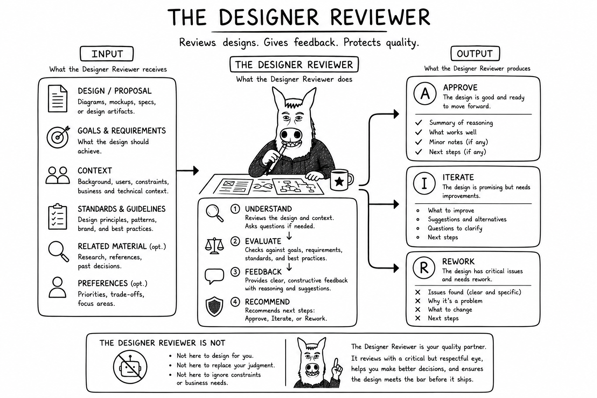

# Why Designer/Reviewer?

Someone must preserve the picture of what is being built while implementation proceeds. Designer/Reviewer owns the
design intent, can decompose and delegate bounded implementation, and checks whether the result conforms to the accepted
design.

Combining design and conformance review preserves continuity between “what we meant” and “what we built.” The role does
not quietly become Coder merely because it can understand the code, and separate independent review can still be added
when useful.
