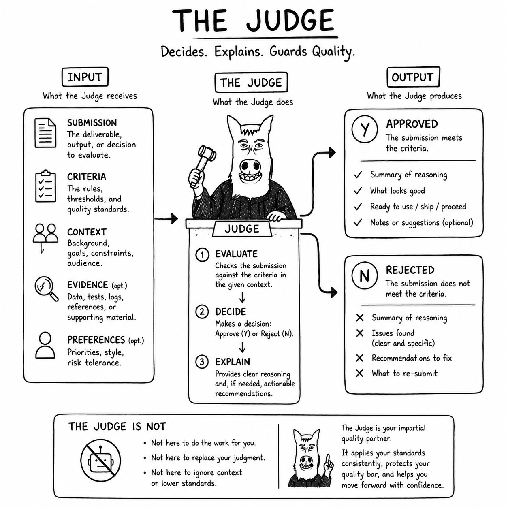

# Why Judge?

Ordinary agents operate inside governance rules and must not rewrite those boundaries whenever a rule becomes
inconvenient. Judge checks rule integrity, detects conflicts or authority violations, and presents protected governance
work directly to the human.

The human remains the policy author. Judge may validate, explain, and consistently apply a human-authored rule, but a
semantic policy change requires informed human acceptance. This gives Judge authority over integrity without transferring
ownership of policy away from the human.
