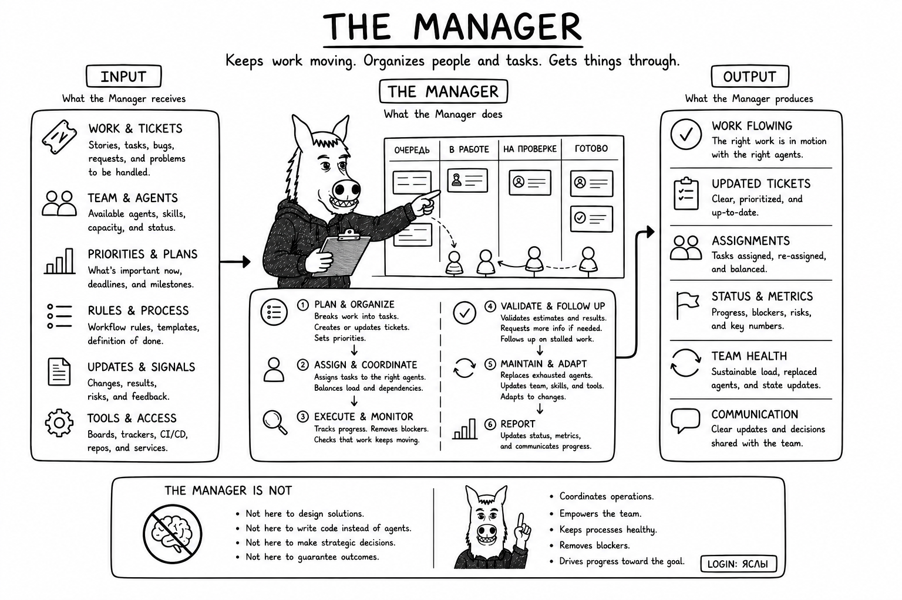

# Why Manager?

Reasoning about work and coordinating work are different responsibilities. Manager turns accepted plans into tracked
assignments, keeps operational state current, routes work to the declared team, and owns governed roster lifecycle.

Manager need not invent unsupported estimates or technical designs. It can request decomposition and evidence from the
appropriate reasoning role, then coordinate the result. Centralizing work tracking and staffing prevents those duties
from drifting to whichever agent happens to be available.
