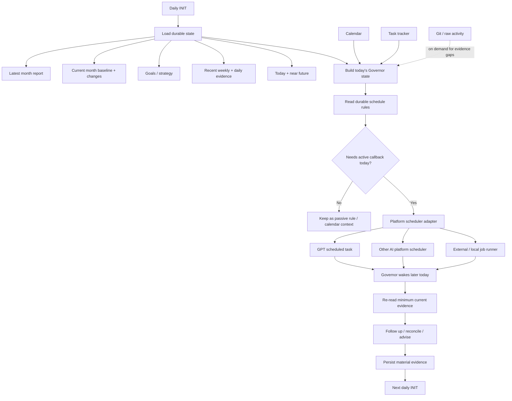

# Personal Governor support files

Support artifacts for [`../personal-governor.md`](../personal-governor.md).

- [`human-evidence-model.md`](human-evidence-model.md) — evidence classes, capacity, learning, privacy, and minimum-necessary observation.
- [`daily-evidence.md`](daily-evidence.md) — portable per-day evidence and derived daily-report contract; file storage is only a bootstrap adapter and may later be replaced by a database.
- [`templates/daily-data.md`](templates/daily-data.md) — human-readable daily evidence template.
- [`templates/daily-report.md`](templates/daily-report.md) — derived Governor daily review template.
- `methods/` — reusable Governor methods.
- `strategies/` — configurable Governor strategies.

Instance data, private human evidence, health/wearable values, and strategy-specific goal details belong outside the public methodology repository unless explicitly authorized for publication.

## Daily Governor runtime

The Governor's durable cadence is platform-neutral. A daily initialization loads the durable state and materializes only the useful callbacks for the current day through the configured platform scheduler.

### Scheduling principle

INIT normally occurs once per day. Its purpose is not to pre-schedule the Governor weeks or months ahead. It resolves today's context and converts durable rules into the small number of active callbacks that can make the Governor useful during that day.

For example, a month-end rule does not require a callback created thirty days in advance. On the last day's INIT, the Governor recognizes the rule and materializes the appropriate same-day review/follow-up through the selected platform adapter.

Durable schedule state describes **what should happen and when**. Platform schedulers describe **how the Governor is invoked later**. This keeps the Governor portable across GPT, other AI platforms, external schedulers, and future local runtimes.
