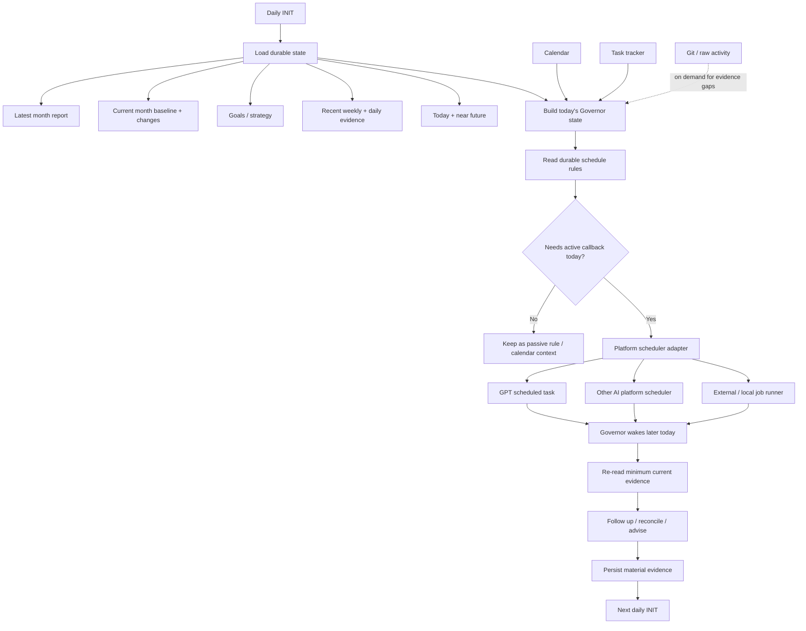
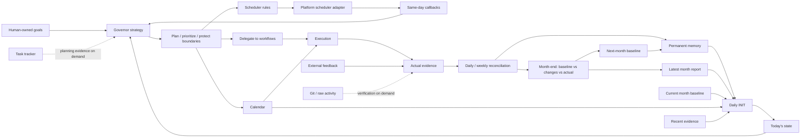
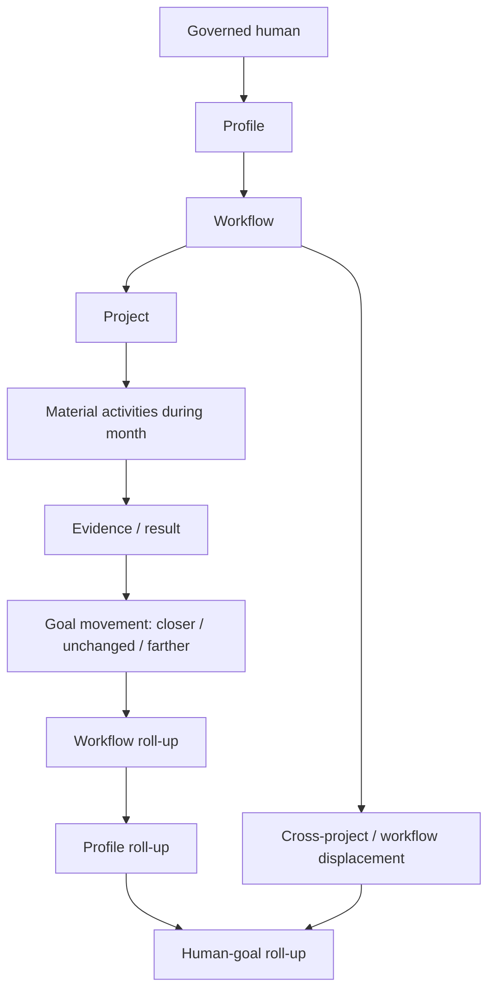

# Personal Governor support files

Support artifacts for [`../personal-governor.md`](../personal-governor.md).

- [`human-evidence-model.md`](human-evidence-model.md) — evidence classes, capacity, learning, privacy, and minimum-necessary observation.
- [`daily-evidence.md`](daily-evidence.md) — portable per-day evidence and derived daily-report contract; file storage is only a bootstrap adapter and may later be replaced by a database.
- [`templates/daily-data.md`](templates/daily-data.md) — human-readable daily evidence template.
- [`templates/daily-report.md`](templates/daily-report.md) — derived Governor daily review template.
- `methods/` — reusable Governor methods.
- `strategies/` — configurable Governor strategies.

Instance data, private human evidence, health/wearable values, and strategy-specific goal details belong outside the public methodology repository unless explicitly authorized for publication.


## Governor functions

The Personal Governor's reusable function set is:

1. **Initialize current state** — load durable memory, latest month report, current monthly plan, recent evidence, today's commitments, and near-future constraints.
2. **Maintain goals and strategy context** — preserve human-owned goals, selected strategy/stage, approaches/methods, checkpoints, and the evidence that may justify changing them.
3. **Plan monthly** — create an immutable goal-first monthly baseline and maintain a separate living plan as conditions change.
4. **Plan daily** — select a small set of outcomes, reconcile commitments/capacity, and place only justified work into the calendar.
5. **Govern calendar allocation** — preserve fixed obligations, create/restructure Governor-owned blocks, expose displacement cost, and keep discretionary blocks traceable to the current plan.
6. **Govern ticket admission** — create planning tickets when useful; inspect tickets proposed by humans/agents/workflows; attach Goal/Strategy/Method coordinates; classify selected-now, selected-this-month, prerequisite/support, later/backlog, off-plan, or no-current-goal/strategy.
7. **Protect cross-workflow human capacity** — prevent one profile/workflow/project from silently consuming capacity reserved for another selected outcome.
8. **Reconcile actual activity** — compare intended allocation with what materially happened using calendar, task, workflow, project, direct-human, and external evidence.
9. **Review progress** — determine whether projects, workflows, profiles, and the governed human moved closer, remained unchanged, or moved farther from selected goals.
10. **Run weekly/monthly feedback loops** — detect repeated displacement, useful deviations, planning errors, new evidence/opportunities, and update the living plan or next month's baseline.
11. **Maintain permanent memory** — preserve durable goals, decisions, evidence, relationship context, monthly plans/reports, and relevant operating patterns without duplicating every source system.
12. **Govern relationships/opportunities** — use relationship memory and external responses when they materially affect goals, commitments, opportunities, or allocation.
13. **Maintain professional public-profile alignment** — when configured, compare public professional surfaces with current goals/work and recommend bounded corrections through authorized workflows.
14. **Delegate execution** — route HOW-work to the appropriate workflow/agent while retaining WHY, WHEN, priority, and cross-workflow allocation responsibility.
15. **Schedule same-day follow-ups** — materialize useful callbacks through the configured platform scheduler after daily INIT; do not rely on calendar text to wake the Governor.
16. **Protect sustainable capacity** — treat recovery, sleep, health-related capacity constraints, and workload sustainability as planning inputs rather than afterthoughts.
17. **Explain interventions** — distinguish fact/evidence, interpretation, and Governor position/action, including why it recommends observe, nudge, re-engage, bound, defer, or stop/protect.
18. **Maintain continuity** — hand off to a successor Governor runtime without losing durable state or creating competing Governors for the same human.

The governed human remains the final authority. The Governor may reject allocation under the current plan, but it does not invent goals or permanently veto a human-owned decision.

## Daily Governor runtime

The Governor's durable cadence is platform-neutral. A daily initialization loads the durable state and materializes only the useful callbacks for the current day through the configured platform scheduler.



### Scheduling principle

INIT normally occurs once per day. Its purpose is not to pre-schedule the Governor weeks or months ahead. It resolves today's context and converts durable rules into the small number of active callbacks that can make the Governor useful during that day.

For example, a month-end rule does not require a callback created thirty days in advance. On the last day's INIT, the Governor recognizes the rule and materializes the appropriate same-day review/follow-up through the selected platform adapter.

Durable schedule state describes **what should happen and when**. Platform schedulers describe **how the Governor is invoked later**. This keeps the Governor portable across GPT, other AI platforms, external schedulers, and future local runtimes.


## Governor architecture at a glance

The Personal Governor is a persistent governance system around one human, not a single prompt or a conventional task workflow. Its major parts have distinct responsibilities.

| Part | Function |
| --- | --- |
| **Role contract** | Defines what the Governor is, its authority, boundaries, and relationship to workflows and the governed human. |
| **Strategy** | Interprets human-owned goals, priorities, opportunity cost, capacity, and evidence to decide what deserves attention. |
| **Methods** | Reusable reasoning procedures such as daily planning, measurable-progress review, state transitions, goal rehearsal, external feedback, and monthly plan/reality reconciliation. |
| **Permanent memory** | Durable human-readable source of truth for goals, decisions, evidence, relationships, monthly reports, plans, and learned operating patterns. |
| **Hot/runtime state** | Minimum current state needed for today's reasoning. It is reconstructed from durable sources rather than treated as permanent truth. |
| **INIT** | Once-per-day bootstrap: load the latest compressed history, current plan/goals, recent evidence, today and near future; establish current state; reconcile today's active callbacks. |
| **Calendar** | Operational commitment/allocation surface. It says when meaningful commitments are intended to happen; it is not the task database or permanent memory. |
| **Task tracker** | Operational project/task state owned by the relevant workflow/profile. Governor reads only what planning requires. |
| **Evidence loop** | Captures what actually happened and compares it with intentions without confusing activity with progress. |
| **Scheduler rules** | Durable desired cadence/triggers such as daily sync, weekly review, month-end reconciliation, or a conditional follow-up. |
| **Platform scheduler adapter** | Materializes useful callbacks for the current day through GPT, another AI platform, an external scheduler, or a local runtime. |
| **Workflow delegation** | Sends execution work to the appropriate workflow/agent while Governor retains WHY/WHEN/priority/allocation responsibility. |
| **External feedback** | Treats responses from people, users, markets, publications, opportunities, etc. as evidence that can alter assumptions or allocation. |
| **Continuity** | Replaces an exhausted Governor runtime while preserving one durable governed-human identity and authoritative memory. |

### Operating mechanics



### Time horizons

The Governor uses nested feedback loops rather than one giant plan:

```text
INIT / today
    -> What is true now?
    -> What matters today?
    -> What callbacks will make Governor useful later today?

Daily
    -> Intended vs actual
    -> Carry-forward / correction

Weekly
    -> Allocation trend
    -> Repeated displacement / progress pattern

Monthly
    -> Immutable baseline
    -> Living plan changes + reasons
    -> Actual outcomes
    -> Why deviations happened
    -> What changes next month

Long-term
    -> Human-owned goals / strategy
    -> Evidence from months and external reality
```

### Information hierarchy

Prefer compressed durable evidence before expensive raw reconstruction:

```text
strategy + goals
    ↓
previous month report
    ↓
current month baseline + material plan changes
    ↓
weekly summaries
    ↓
daily evidence
    ↓
calendar / task state
    ↓
raw Git, tickets, conversations, external sources
       only when a material evidence gap remains
```

This hierarchy is important for continuity. A fresh Governor should normally understand the human's current trajectory from durable summaries and plans without replaying every commit, ticket, calendar event, or conversation.


### Monthly reporting hierarchy

Month-end reporting follows the configured AI-Fleas ownership structure rather than a Governor-specific category tree:



The Governor should resolve workflow/project membership from the live profile configuration. For example, a profile may bind development, writing, YouTube, or financial workflows to different project refs. Only active projects for the month appear in the report.

The report therefore answers both:
- **bottom-up:** what happened in each project/workflow and what evidence resulted;
- **top-down:** whether those activities moved the profile and human-owned goals closer, left them unchanged, or moved them farther away.
