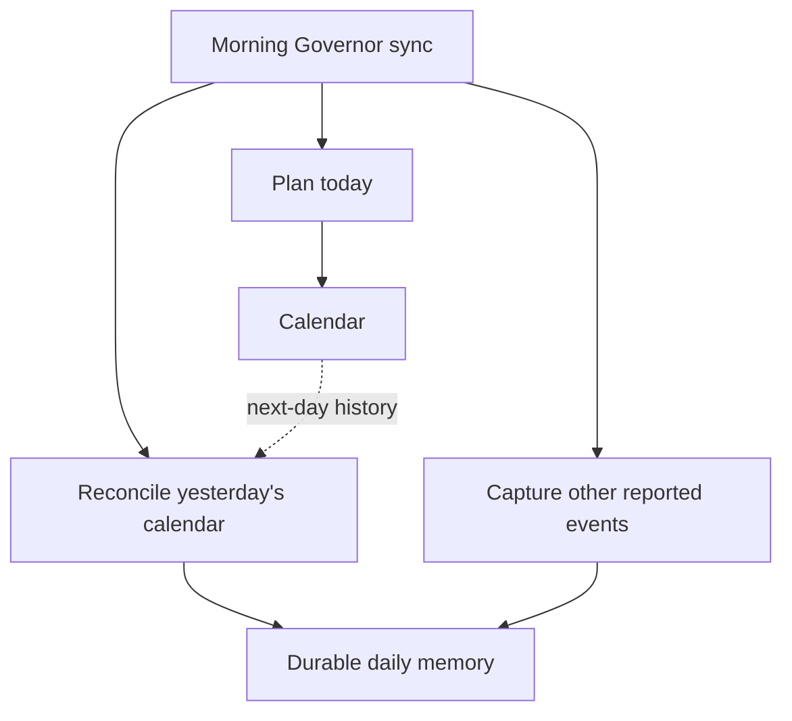

# Personal Governor daily evidence contract

The Personal Governor may persist authorized evidence by day so current planning, one-on-ones, and later longitudinal analysis can use the same inspectable evidence model.

This contract defines **meaning**, not a required database or filesystem implementation.

## Principles

- record evidence before interpretation;
- keep observed/self-reported/external evidence distinct from derived conclusions;
- attach source and time/provenance when available;
- missing data means unknown, not zero;
- an activity may support multiple goals or strategy paths;
- health/wearable evidence is private by default and remains optional/authorized;
- daily evidence may influence a recommendation but does not silently mutate strategy or durable human traits;
- storage may move from files to a database without changing the logical record model.

## Logical record types

### Daily snapshot

- `date`
- `timezone`
- `completeness`: partial or complete
- `sources_available`
- `sources_missing`
- `notes`

### Activity event

- `occurred_at` or bounded time/window when known
- `category`
- `summary`
- `strategy_path_refs`: zero or more strategy-instance references
- `goal_refs`: zero or more goal/sub-goal references
- `workflow_ref` / `project_ref` when relevant
- `outcome`
- `status_or_next`
- `source`
- `confidence`
- `privacy`

Suggested portable categories:

- engineering/code
- product/owned-venture
- distribution/public-presence
- external-user/relationship
- strategy/governance
- operations/maintenance
- learning/creative
- health/recovery

Categories are descriptive, not exclusive.

### Planned commitment / calendar event

Calendar is an operational scheduling surface, not the Governor's only durable memory of commitments.

Persist a normalized memory record for calendar history visible to the Governor, subject to authorization and privacy boundaries. **Past calendar events must be captured into durable memory** so historical planning/execution evidence does not depend on continued calendar access.

Future events remain operational calendar state by default. They may also be projected into memory when they materially affect preparation, allocation, deadlines, travel, or other forward reasoning, but future-event duplication is not required merely because an event exists.

Keep, when known:

- scheduled start/end or bounded time/window;
- summary/purpose;
- goal/strategy/workflow references;
- preparation or prerequisite;
- source calendar/event reference when available;
- execution status such as planned, completed, missed, late, cancelled, or rescheduled;
- resulting evidence/outcome and follow-up when known;
- provenance/confidence/privacy.

The calendar remains authoritative for exact current scheduling when available, and may be accessed through MCP or another adapter. Memory preserves the event's durable planning/execution meaning. Do not delete the historical memory record merely because the calendar event is past, moved, cancelled, or later unavailable. Record corrections/rescheduling explicitly.

For past events, mirror ordinary and low-value events as minimal normalized records rather than dropping them. Do not copy unnecessary private payloads: title/purpose, source identity, time/window, profile context, lifecycle state, and relevant goal/strategy links are normally sufficient. Client/shared events may use privacy-safe summaries.

Calendar is authoritative for current/future scheduling; memory is the durable historical Governor record. Track lifecycle changes such as rescheduled, cancelled, completed, or missed when known. Recurring series may retain a series identity plus occurrence-level history where useful.

### Daily calendar capture

The Governor should run a daily calendar-to-memory reconciliation, normally as part of the configured morning planning sync or another scheduled Governor maintenance pass:

1. inspect the previous day's calendar events;
2. ensure every past event has a normalized durable memory representation;
3. reconcile moved/cancelled/completed/missed status when evidence exists;
4. attach relevant profile/goal context without importing unnecessary private event payloads;
5. capture material non-calendar events reported during the morning retrospective in the same dated evidence layer;
6. make the operation idempotent using source calendar/event identity so repeated runs update/reconcile rather than duplicate records.

The morning sync therefore combines two complementary sources of yesterday's history: **calendar reconciliation** for scheduled events and **human/source retrospective capture** for things that happened outside the calendar.



If the daily pass is missed, a later reconciliation should backfill the gap rather than silently losing calendar history.

### Human signal

- `observed_at`
- `kind`
- `value`
- `unit` when applicable
- `target_or_baseline` when explicitly configured/known
- `source`
- `confidence`
- `privacy`

Possible kinds include sleep duration, subjective sleep quality, steps, exercise, activity distance, available attention/time, workload, recovery/energy indicators, or other explicitly authorized capacity evidence.

Do not interpret a human signal as a medical diagnosis or universal wellness score.

### Evidence reference

A durable reference to supporting evidence such as a tracker item, commit/PR, memory artifact, calendar event, product/user metric, or source export.

## Daily report

A daily report is a **derived Governor projection** over the evidence for that day. It should be concise and may include:

- current primary bet and whether it received actual attention;
- material outcomes that moved;
- coverage of configured strategy paths/goals;
- real-user, market, product, or other external evidence;
- infrastructure/tooling work and the active outcome it unblocked;
- relevant human capacity/recovery evidence;
- recommended continue/reduce/defer/stop adjustments;
- top carry-forward actions;
- waiting dependencies;
- uncertainty and evidence that could change the recommendation.

The report must not confuse activity volume with strategic progress.

## Bootstrap file adapter

A profile may temporarily store daily evidence in a human-readable structure such as:

```text
Data/
  Days/
    YYYY-MM-DD/
      Data/
      Reports/
      Raw/
  Templates/
```

`Data/` contains normalized evidence, `Reports/` contains derived views, and `Raw/` can contain authorized provider exports/snapshots.

This layout is an adapter, not canonical methodology. A future database may replace it while preserving the logical record types and provenance.

## Corrections and history

Historical daily records should remain inspectable. Correct mistakes explicitly rather than silently rewriting evidence to make the past look cleaner.

A later daily/weekly/one-on-one report may supersede an earlier recommendation when evidence or human intent changes. Preserve the earlier rationale.

## Relationship to the human evidence model

This contract specializes [`human-evidence-model.md`](human-evidence-model.md) for time-bounded daily evidence. The same privacy, minimum-necessary observation, capacity, and data-before-judgment rules apply.
