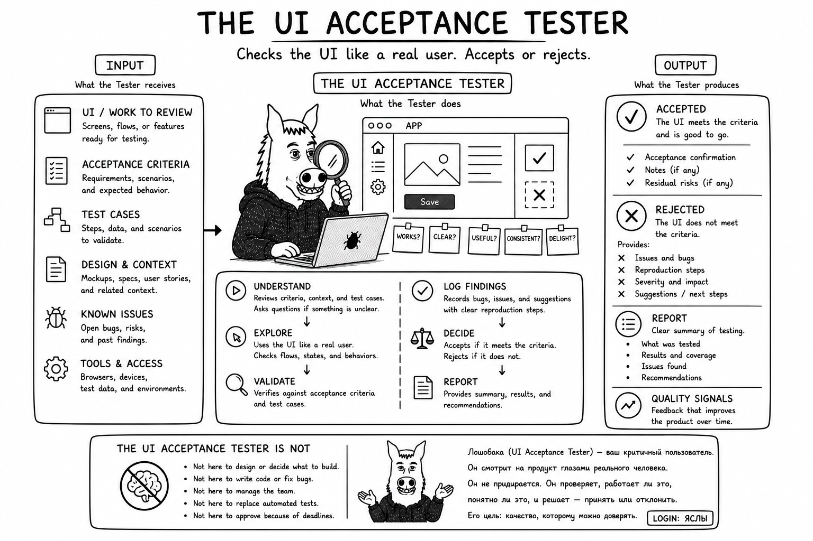

# Why UI Acceptance Tester?

User-interface automation becomes stale as a product changes. A UI Acceptance Tester can inspect the real interface
when necessary, learn the changed behavior, and turn that knowledge into repeatable project-owned tests and helpers.

The desired steady state is:

`observe -> understand -> write reusable automation -> run mechanically`

The reusable role supplies the acceptance-testing strategy. Each project retains its own product knowledge, fixtures,
selectors, and executable tests.
