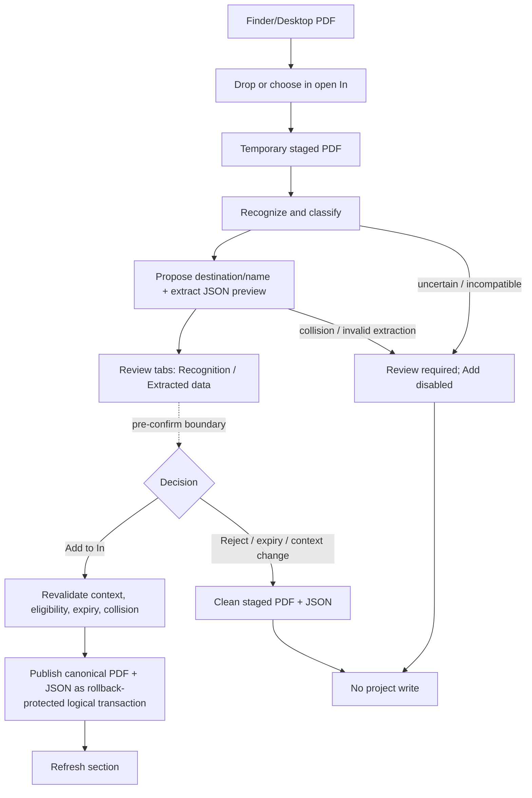
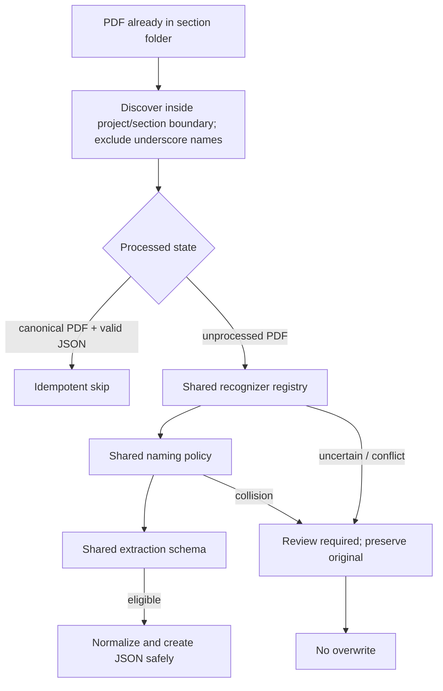
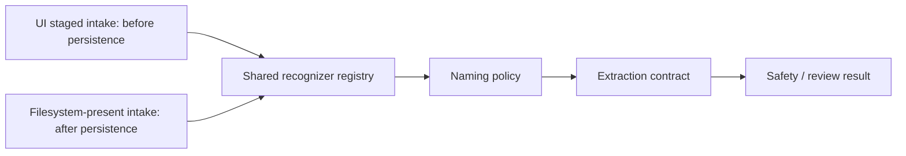

# accounting.workflow Spec

## Purpose

Define the operating rules for `accounting.workflow.md`.

## Rules

- Keep workflow scope, command mapping, and UI expectations aligned with the workflow markdown.
- Keep workflow-specific command panel mappings focused on commands useful in that workflow.
- Use project, command, and workflow specs as selectable context in the Spec panel.
- Within an Accounting project, ignore every file or directory whose name begins
  with `_` during discovery and processing. Never interpret or offer such an
  entry as an organization, branch, reporting period, section, or report source.
- Accounting quarter state is project-owned at
  `<project-root>/.ai-workflow-suite/workflows/accounting/state.yml`. The
  canonical state takes precedence; compatible legacy report-root state is read
  only for non-destructive migration and is retained. Accounting owns its
  `schema_version: 1` marker; see `ai-launcher/docs/project-workflow-state.md` for the
  shared ownership and exclusion convention.
- Current PDF intake scope is the selected `In` section of an open quarter only.
  Its drag/drop target and accessible picker remain enabled when the canonical
  `In` folder is missing; that folder may be created only by confirming an
  eligible pending item. `Out`, `Statements`, and closed-quarter intake remain
  disabled. A drop or picker selection is prepare-only and never writes project
  files. Dropped bytes remain mode `0600` in bounded, expiring, workflow-owned
  temporary staging while Accounting's
  declared workspace `pdfjs-dist` driver verifies readability/page decode,
  visible text extraction, supported document
  kind, and evidence matching the selected project, year, quarter, branch, and
  section from bounded visible page text. Filename is never acceptance evidence;
  PDF metadata is advisory only and cannot override contradictory visible content.
  Normal Accounting `In` compatibility is inferred from ordinary invoice,
  receipt, marketplace payout/host-earnings statement, or tax-document signals:
  a credible issuer/payee, document or reservation identifier, monetary total
  and currency/tax evidence, and one unambiguous labeled transaction, issue,
  service, booking, reservation, statement, or payout date. The date determines
  reporting year and quarter. Multiple credible dates spanning quarters are
  uncertain. Bank statements belong to `Statements`; vendor/supplier bills and
  accounts-payable or amount-due documents belong to `Out`. A branch label is
  not required, but an explicit contradictory property/business/branch label is
  rejected. Section is inferred from document direction and semantics rather
  than requiring a literal section marker.
  Booking.com Reservation Details are compatible with `In` only when visible
  content combines Booking.com source, reservation identity, check-in/out, stay
  facts, total/currency, facilitated guest payment, and commission evidence.
  Check-in supplies the period only when check-out remains in the same
  quarter/year; a crossing stay requires review. A normalized selected-branch
  token in the accommodation/property heading is positive evidence. Only that
  token may be returned; another property is a generic branch conflict.
  Family predicates must live in side-effect-free recognizer modules receiving
  only bounded normalized visible-text structures plus selected context. The
  driver owns ordered orchestration and safe contract validation.
  Accepted Booking marketplace reservations use the exact canonical basename
  `YYYY-MM-DD_booking_marketplace-reservation.pdf`, where the date is the safe
  recognized check-in/service date. Source and kind are closed allowlists.
  Guest/property/branch/reservation identifiers, emails, amounts, original
  filename, and metadata are forbidden. Collision never overwrites or silently
  adds a suffix; it requires review.
  While pending, the selected-section drop surface becomes a same-pane review
  surface with **Recognition** and **Extracted data** tabs and one item per file.
  Recognition shows only safe kind, source, destination, primary date/reporting
  period, branch evidence (or `No branch identified`), confidence, bounded
  evidence flags/reasons, and the proposed canonical filename. The proposal is
  derived only by the pure naming policy and performs no rename or canonical
  write. During prepare, the existing workflow-owned extraction contract runs
  against the staged PDF and stores only a bounded, schema-validated structured
  JSON artifact beside it; raw extracted text is never stored or displayed.
  The Extracted data tab renders a safe schema-oriented preview of that artifact.
  No canonical PDF or JSON sidecar exists until the user chooses **Add to In**.
  Add is enabled only when recognition, extraction schema, proposed filename,
  selected open context, and collision checks are eligible. It revalidates the
  opaque one-time pending ID, ownership, profile, workflow, project, selection,
  expiry, eligibility, and collision, then publishes the canonically named PDF
  and its JSON sidecar as one logical operation using confirmation-owned
  temporary artifacts with rollback. It never overwrites. **Reject / Discard**,
  expiry, context mismatch, and failed confirmation remove the exact staged PDF
  and JSON. Pending IDs are unguessable, one-time, replay-protected, TTL-bound,
  and subject to count/byte limits; batches retain explicit independent choices
  and optional Add-all-eligible behavior. Successful Add refreshes the selected
  section and clears its review item.
  The proposed filename is read-only. Add accepts the recognition, destination,
  proposal, and structured extraction together; naming and sidecar publication
  are automatic and require no follow-up action. `Normalize files` and
  `Extract missing JSON` are explicit idempotent reconciliation actions for
  PDFs already present through supported filesystem intake. They report normalized/extracted,
  remaining/skipped, review, and collision counts and leave already canonical
  PDF-plus-sidecar additions unchanged.
  Preferred intake is UI drag/drop because recognition, proposal, extraction
  preview, and confirmation happen before persistence. Files placed directly by
  a user or external sync are also legitimate. Reconciliation discovers them
  only inside the selected project/section boundary, retains underscore-name
  exclusions, and applies the same recognizer registry, naming policy,
  extraction schema, collision protection, privacy bounds, and fail-closed
  rules. Ambiguous or conflicting files remain unchanged for review.
  Empty text layers and scanned/image-only PDFs fail closed for review unless an
  approved OCR driver is added. Malformed, irrelevant,
  unsupported, mismatched, or uncertain documents fail closed before canonical
  persistence and leave no PDF, sidecar, or staging residue. Wrong period or
  branch, cross-quarter stays, incompatible destinations, invalid extraction
  schemas, and collisions likewise disable Add and fail closed. Partial batches
  report safe per-file outcomes without modifying source files.
- Understanding process failures use only bounded categories
  (`driver-unavailable`, compatibility `poppler-unavailable`, `timeout`,
  `malformed-pdf`, `render-failed`, `text-extraction-failed`,
  `invalid-contract`, or `internal-error`). PDF.js is the required runtime
  engine; Poppler status, if exposed, is compatibility metadata only and not a
  runtime dependency. The runtime status endpoint exposes only safe engine or
  compatibility availability plus the last category/timestamp/operation; it
  never exposes stderr, text, paths, filenames, environment, or secrets.
- Corporation identity and display metadata are project-owned. Accounting reads
  explicit project metadata first, then `corporation.yml`, `corporation.json`,
  or `BUSINESS-INFO.md` at the attached project root. Profile-level
  `incorporated_root_path` and `reports_root_path` are not supported and are
  never consulted.

### Preferred UI intake

Everything above the confirmation boundary is temporary; only Add may write the
project. Current implemented intake remains open-quarter `In` only.

### Supported filesystem reconciliation

Filesystem intake begins after a PDF already exists in the project. It is
supported, but unlike preferred UI intake it cannot provide a pre-save review.

Both paths converge on the same policy logic; only their persistence boundary
differs.

## UI Behavior

- When this workflow is selected, show this spec in the Spec panel unless the user selects a project or command afterward.
- Clicking the Spec panel title opens this file in the central dialog.

## Verification

`accounting-frontend/app.sh --test` is the canonical fail-fast Accounting test
route. It must cover native-style drag events, temporary prepare, modular
recognition, proposed naming, structured extraction and both review tabs,
Add/Reject, exact PDF-plus-sidecar publication and rollback, replay/negative
paths, privacy, startup/controller routes, and frontend template compilation.

## Future extension (not current scope)

A future generic Accounting intake may accept a PDF from a workflow-level drop
surface without a preselected destination. Recognition would suggest `In`,
`Out`, `Statements`, or Review and explain why, but the user must confirm before
persistence. It must reuse the modular recognizer registry, naming policies,
staged extraction/review transaction, privacy limits, and fail-closed rules, and
must never auto-route uncertain or conflicting documents. The implemented scope
in this version remains open-quarter `In`-only ingestion; no controller or UI
gate is loosened by this future note.
