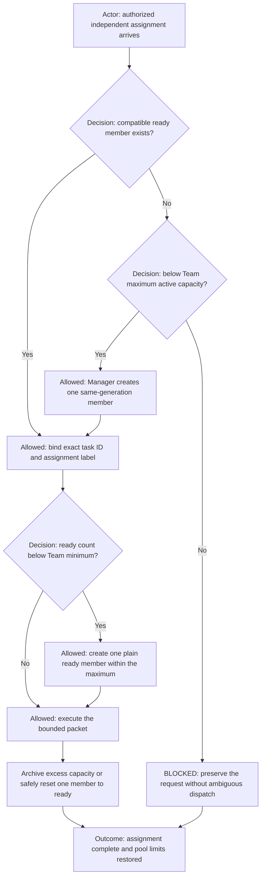
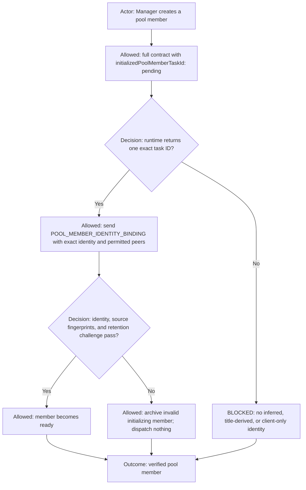
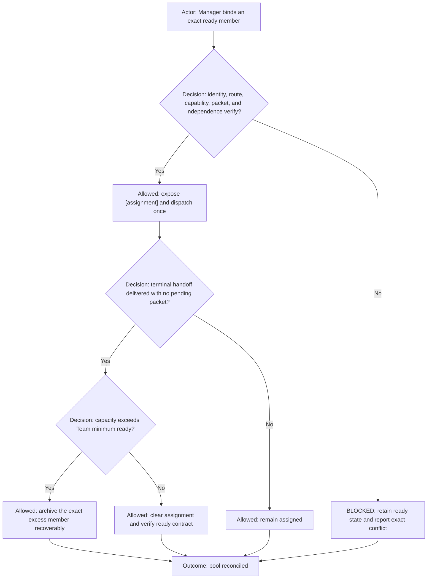
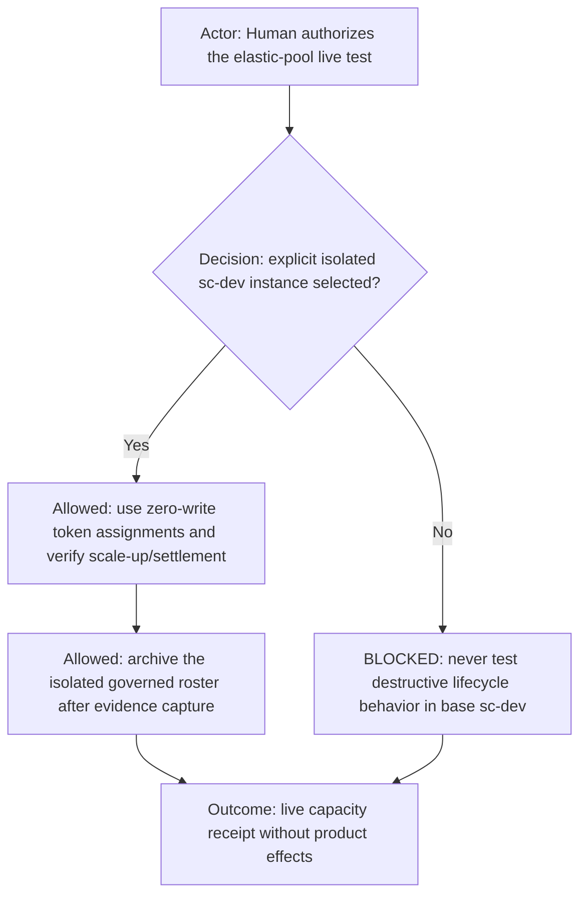

# Manager-owned Elastic Agent Pool

**DIAGRAM-FIRST CONTRACT — NO UNCOVERED RULE TEXT.** Every normative chapter starts with a compact vertical Mermaid
diagram containing its actor, decision, allowed route, prohibited route, and outcome.

The authoritative pool configuration and lifecycle ownership live in [team.md](team.md). This file defines execution
mechanics only and must not repeat or override the Team's permission tables.

## Capacity reconciliation

Manager is the sole governed pool staffing authority. It reads `elasticPool.enabled`, `minReady`, and `maxActive` from
`agents.yml`, verifies that they match `team.md`, and counts ready, busy, initializing, and retiring members toward the
hard maximum. A missing, conflicting, invalid, or `minReady > maxActive` configuration is
`BLOCKED_ELASTIC_POOL_CONFIGURATION`.

Elastic capacity is permitted only for safely independent assignments. It creates another runtime instance of the same
configured Agent and Role; it does not create a new Role, replace an existing responsibility lineage, or increment clone
generation. Coder work must have demonstrably non-overlapping file/write scopes and compatible shared Git state.

## Identity and readiness

Pool creation uses two-phase identity binding. Phase one contains the complete Agent contract and
`initializedPoolMemberTaskId: pending`; it never asks the new task to infer an ID that the runtime has not returned.
Phase two sends the same task a `POOL_MEMBER_IDENTITY_BINDING` containing its exact ID, Agent ID and name, Role,
generation, state, profile/workflow/logical/runtime project coordinates, source fingerprints, Manager return ID, and only
the peer bindings authorized by `team.md`. It becomes ready only after acknowledging that identity and passing a bounded
retention check. Failure is `BLOCKED_POOL_MEMBER_IDENTITY_BINDING` and no assignment is dispatched.

During initialization the member may perform only bounded read-only checks needed to validate its supplied source and
runtime identity. Assignment work, commands, repository writes, external mutations, and peer dispatch are prohibited
until readiness succeeds.

## Naming, assignment, and settlement

Runtime naming follows `Name (generation) [assignment] (lifecycle marker)`. Assignment labels are short, stable,
non-sensitive identifiers derived from the bounded work or registered operation, never raw arguments. Every dispatch
targets an exact verified task ID; a title never grants identity or authority.

The selected Command Runner's first acknowledgement remains `COPY THAT`. Before its first command it renames itself to
`⚙️ command-runner [<registered-command-or-operation>]` and verifies readback. Failure returns
`BLOCKED_COMMAND_RUNNER_BUSY_TITLE` without executing. It stays labeled throughout execution, waiting, retries, and
handoff. Only after the terminal handoff is delivered and there is no pending packet may the retained ready instance
restore `⚙️ command-runner` and verify readback.

Manager records exact task ID, Agent ID and name, Role, generation, assignment, state, caller/return IDs, and correlation
ID. Reuse requires cleared assignment context, verified identity and fingerprints, valid authorization state, and no
pending work. Excess instances are archived recoverably; active assignments are never interrupted merely to reach a
preferred presentation order.

## Live-test isolation

The canonical acceptance scenario is [dev-elastic-agent-pool.live-test.md](../dev-elastic-agent-pool.live-test.md).
It requires direct human authorization, an explicit `sc-dev-<instance-id>` logical project, zero product/repository/
tracker/external effects, and complete cleanup evidence. The base `sc-dev` project is prohibited for this scenario.
