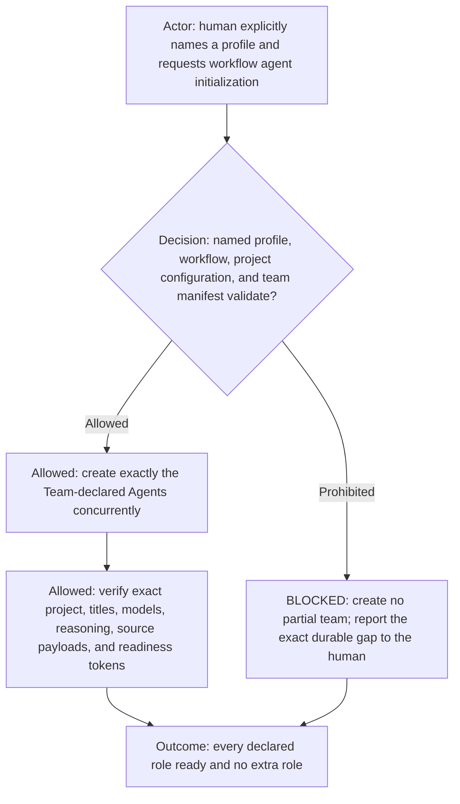
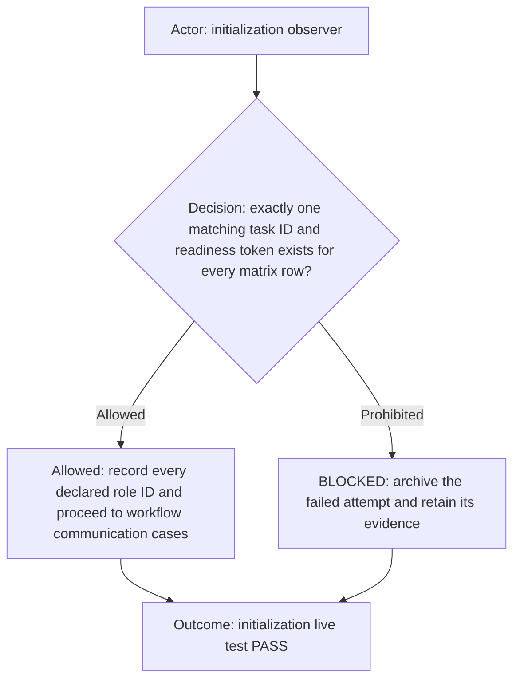
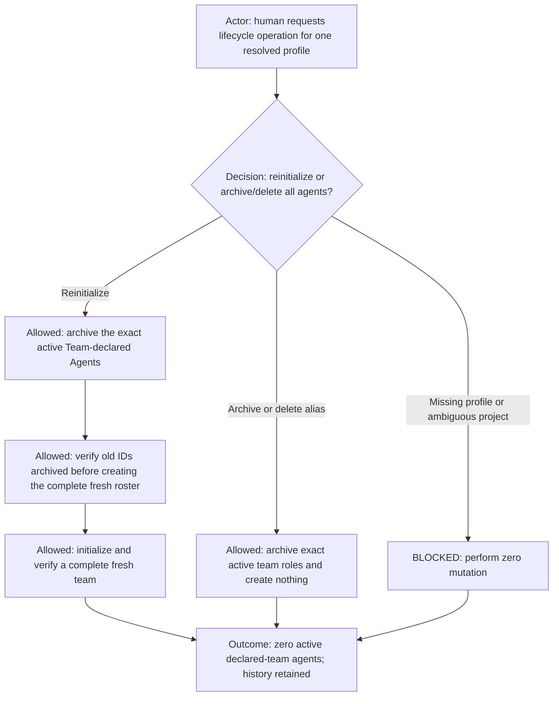

# Workflow agent initialization live test

**DIAGRAM-FIRST CONTRACT — NO UNCOVERED RULE TEXT.** Every normative chapter starts with a compact vertical Mermaid
diagram containing its actor, prerequisite or decision, allowed route, prohibited or `BLOCKED` route, and terminal
outcome. Diagram/text mismatch is `BLOCKED`.

Use this scenario to prove that any externally resolved profile paired with workflow `dev` can initialize its declared
visible agent team as logical project `<profile-id>-dev`. A request that says only “initialize the dev workflow” from an
unbound task is a required negative case and must create nothing until the human names the profile. The same request from a
task already verified as bound to one logical Dev project is a positive context-aware case.

## Initialization scenario

Run [initialization](init.md) using [the team manifest](team.md). Derive logical project `<profile-id>-dev` from the
externally selected profile ID and workflow ID `dev`. In Codex app mode, require the corresponding saved project projection
to exist already and use its configured folders as the agent project sources. Resolve repository, tracker, and fixture data
through the workflow-scoped project entry in the active Work Profile; never create the runtime project container, ask the
human to repeat its folders, or restore a project-specific context file under the reusable workflow.

Before the positive case, run the prerequisite case from an unbound task with no profile or logical-project ID. The
initializer must ask which profile and must not list replacement candidates, archive existing roles, create a task,
send an initialization payload, rename a task, or create a scheduler. Then verify the context-aware case from a task
whose runtime identity is already bound to exactly `<profile-id>-dev`; `initialize agents` may resolve that binding
without another question. Also verify that a missing runtime projection is `BLOCKED` with zero project or role creation.

Create exactly one task for every agent declaration in `../agents.yml`, concurrently. Use the exact title from that
row and require the exact readiness token declared by its linked role contract. Do not maintain a second role list here.

Record every returned task ID or pending client ID in one creation-batch ledger. Exercise a delayed-receipt case in
which the first batch returns only client IDs and remains absent from a capped recent-task listing: the initializer must
return `WAIT_FOR_PENDING_CREATION_RECEIPTS`, create zero fallback tasks, and keep polling/reconciling those exact client
IDs. When the delayed tasks resolve, reconcile their exact IDs into the same batch. PASS requires no unresolved client
ID and no second candidate for any declared Agent; a late task from an abandoned or terminally failed batch must be
archived by exact ID before the scenario can pass.

If any prerequisite or acknowledgement fails, archive only tasks created by that failed attempt and report the exact
contract or configuration gap to the human. Do not edit rule meaning until the human writes and identifies the Markdown
seed. After Judge performs only permitted meaning-preserving maintenance and focused static validation, repeat this
scenario. Do not expose a partial team as success.

## Passing evidence

PASS requires exactly one newly initialized visible task for every matrix row in `<profile-id>-dev`, exact titles,
initializer-verified task-creation model/reasoning values, one matching readiness token per role, no undeclared task, and
no role from another project counted as evidence. It also requires a fully reconciled creation ledger with zero pending
client IDs and zero delayed, duplicate, or failed candidates from every attempt. Role self-attestation is not model/reasoning evidence because the role
task may not expose that platform metadata. After PASS, run [the development workflow live acceptance
scenarios](../dev-live-test.md) against this team.

## Reinitialize and archive scenarios

For the positive reinitialize case, begin with one complete active Team-declared `<profile-id>-dev` roster. Record every
old task ID, archive those exact tasks, verify none remains active, create the complete declared roster concurrently, and
verify one new distinct ID plus the readiness token for every matrix row. No old task ID may be reused.

For the archive-only case, both “archive all agents for profile `<profile-id>` workflow dev” and “delete all agents for
profile `<profile-id>` workflow dev” must archive the exact declared-team tasks and create nothing. “Delete” never means
irreversible task deletion. Do not run the archive-only case immediately after a successful reinitialize when the resulting
team is needed for communication scenarios; its contract is proven statically or in a separately authorized cleanup run.
