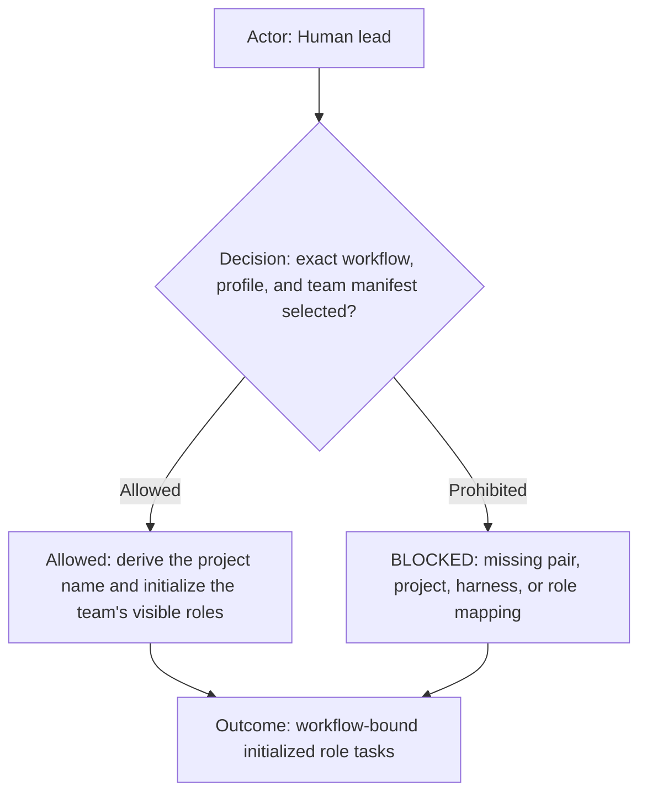
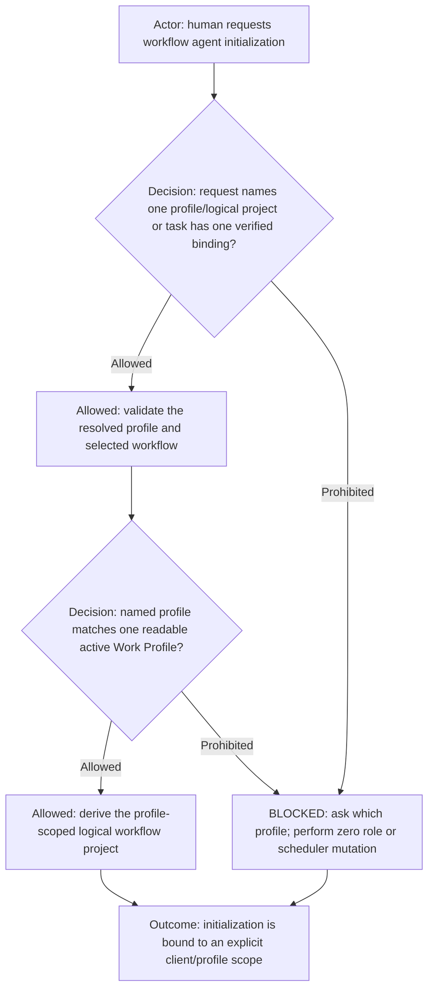
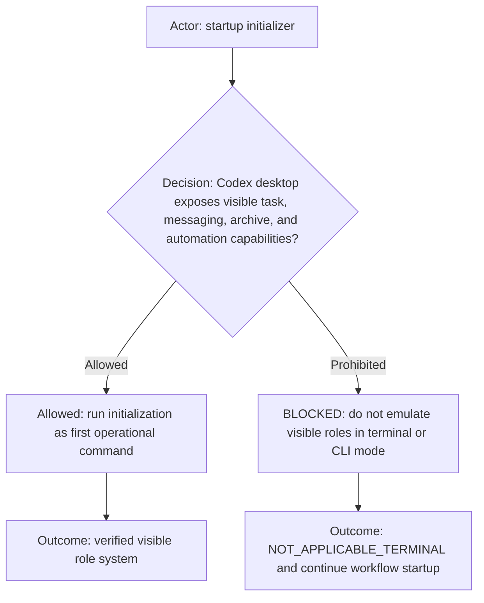
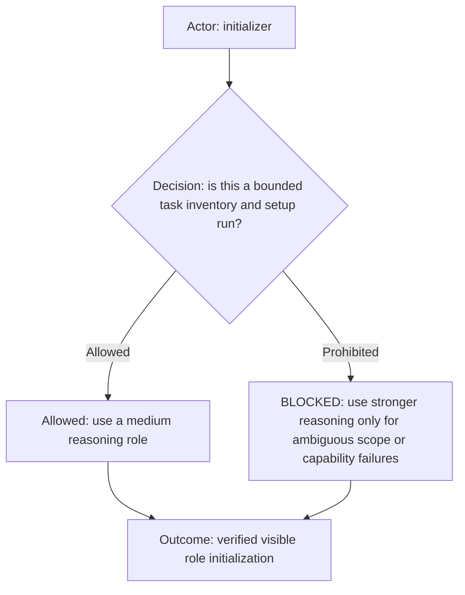
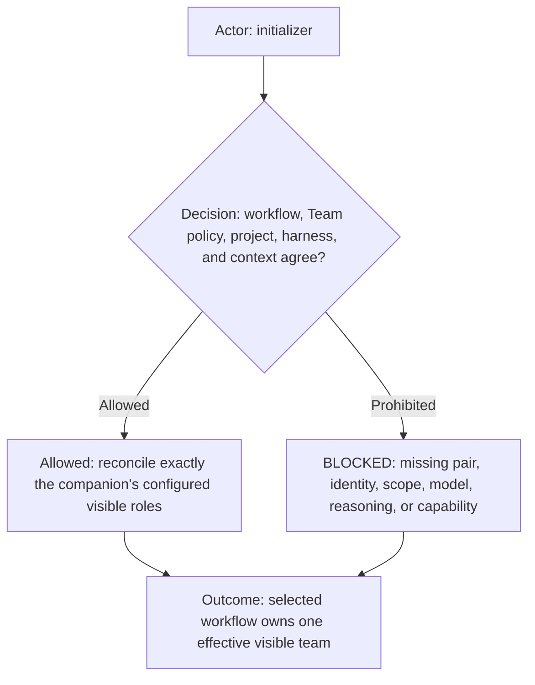
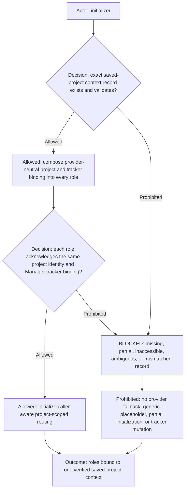
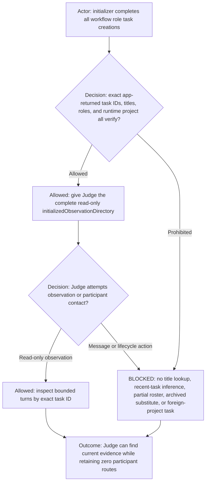
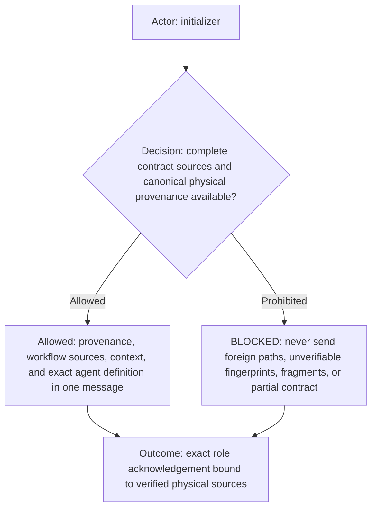
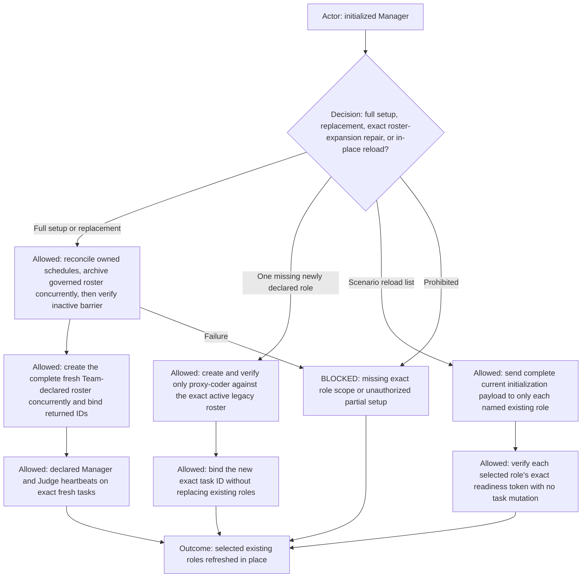

# Dev workflow agent initialization

**DIAGRAM-FIRST CONTRACT — NO UNCOVERED RULE TEXT.** Every normative chapter starts with a compact vertical Mermaid
diagram containing its actor, prerequisite or decision, allowed route, prohibited or `BLOCKED` route, and terminal
outcome. Diagram/text mismatch is `BLOCKED`.

The generic agent identity and communication contract is
[`agents.md`](../../agents.md). The canonical Dev policy is defined once in [team.md](team.md), while
[shared execution routing](shared-execution-routing.md) defines packet and evidence mechanics. The selected profile's
exact workflow entry owns the harness; the selected workflow and its Team page own
the effective team. This workflow contract defines
initialization only.

## Initialization route

This is the `dev` workflow's visible-agent initialization contract. Resolve the exact selected profile and workflow
before mutation. The authoritative workflow pair is `../dev.workflow.md` plus `team.md`. It initializes role context
only; it does not implement product work or run a development lifecycle.

## Explicit profile prerequisite

Every initialization request must resolve exactly one profile and logical project. The preferred forms explicitly name a
profile ID, such as `<profile-id>`, a configured base logical project ID such as `<profile-id>-dev`, or an explicitly
created isolated instance such as `<profile-id>-dev-<instance-id>`. The mandatory base prefix retains profile/workflow
identity; a safe nonempty instance suffix creates a separate communication boundary without changing profile bindings,
role contracts, or physical workspace membership. The profile represents the user,
client, or tenant scope in which the reusable workflow runs. A request may omit the profile only when the requesting task's
runtime identity is already bound to exactly one validated logical project; that binding supplies the profile and workflow
without a heuristic workspace or current-directory inference. An unbound task, multiple possible bindings, an unknown or
ambiguous name, or a mismatch must ask the human which profile and create, archive, rename, message, or schedule nothing.

## Runtime applicability

This initialization applies only in Codex desktop/app mode when the required visible task-management and automation
capabilities are available. In terminal/CLI mode, or when any required capability is unavailable, return
`[dev][agents-init] NOT_APPLICABLE_TERMINAL`, perform no role or scheduler mutation, and continue normal workflow
startup. Never substitute shell processes, tmux panes, hidden agents, browser automation, or same-name local sessions
for visible Codex role tasks.

## Model recommendation

Reviewed 2026-08. Use a medium reasoning role for normal initialization: it verifies project identity, role replacement
scope, model settings, acknowledgements, and the scheduler without making product decisions. Use stronger reasoning
only when saved-project scope, task identity, or platform capability behavior is ambiguous. Reassess this
recommendation when Codex task or automation APIs change.

## Workflow and visible-role selection

Resolve the selected workflow through its exact workflow entrypoint and `agents.yml`, then validate the readable team
projection before touching visible tasks. The manifest must declare the project naming convention, one workflow, no
concrete harness, and an agent set whose role, title, human-facing value, communication mode, lifecycle, model, reasoning, common
Role, Agent name, and readiness token agree with the selected workflow and authoritative Team policy.

Resolve the concrete harness only from the selected profile's exact `workflows[]` entry for this workflow. A `harness`
field in reusable `agents.yml`, the team projection, a common role, or an initialization packet that conflicts with the
profile is `BLOCKED`. This keeps agent composition reusable across profiles while retaining one exact runtime harness in
each initialized instance.

Derive the logical workflow project ID as `<profile-id>-<workflow-id>`, using the explicitly requested and validated Work
Profile's canonical `name` as `profile-id` and the selected workflow filename without `.workflow.md` as `workflow-id`.
Preserve canonical profile/workflow IDs and join them with one hyphen; for this workflow the base result is
`<profile-id>-dev`. Use `<profile-id>-dev-<instance-id>` only when the human explicitly selected that exact safe suffix.
Never infer an instance from a ticket, branch, folder, or concurrent-work request.

Resolve that logical project through the active runtime adapter. The logical project is runtime-agnostic: an adapter
may represent it as a workspace, session namespace, container, or another project scope. In Codex app mode, resolve an
existing saved Codex project whose label is the logical project ID, capture its runtime project ID, and verify its
configured folders. Initialization never creates, renames, or changes the runtime's project container. A missing
runtime projection or differently identified selected project is `BLOCKED`, not an alternate binding.

Reconcile exactly the agents declared by `../agents.yml`, using each exact title as its visible task
title; do not import roles from outside the selected workflow team or invent an omitted role. `lead` is the human and is never an AI task.

## Project-context binding

Resolve project context from the logical project's runtime projection, its configured folders, the selected Work
Profile, and the selected workflow project's `agent_context` configuration. The runtime-bound folders are the
authoritative project sources the initialized agents may reach; the human does not repeat those sources in the
initialization request. A source may be a Git repository, a subfolder within a Git repository, or a non-Git folder, and
one logical project may contain sources from one or multiple Git repositories. The profile owns its workflow-scoped
workspace projects directly under `workflows[].projects`; require their repository/storage paths to match the runtime
projection's accessible folders. External project configuration references are not used for profile-owned workflow
projects. The initializer must never add, remove, or substitute a folder. Zero accessible folders, an unreadable
folder, or a profile-project mismatch is `BLOCKED` before role mutation.

Validate the resulting context schema plus exact project, repository, workflow, and harness identity against the
selected pair, then compose the complete runtime record into every role initialization message. Validate and retain its
authoritative configuration-source binding: bundle root, selected profile path, commands root, workflows root, and
baseline root. The selected profile path is the single structural authority for its workflow projects and agent
context; referenced Markdown knowledge or policy files remain content resources, not additional structural
configuration. The tracker binding is provider-neutral configuration data: capability/provider identifier, workspace,
container identity and URL, lifecycle-state mapping, and explicitly disabled providers. Initialization logic never
branches on provider names. No project-specific context record belongs in this workflow directory.

When the selected workspace configuration declares `projects`, treat that list as the exact configured project inventory
and physical projection, not documentation. The initializer resolves every project to its canonical path, requires each
path to be readable and contained by the configured workspace root, verifies its configured remote identity when
present, and requires set equality
with the source projection exposed to the initializer by the runtime. Missing, extra, duplicate, substituted, or
remote-mismatched projects are `BLOCKED`. The initializer must not broaden an explicit project list back to the parent folder.

After that validation, embed an immutable `workspaceProjectsContext` in every role initialization message. It contains the
complete ordered project records (`id`, canonical path, and configured remote identity) plus the runtime project ID and an
explicit `runtimeProjectionVerifiedBy: initializer` receipt. A role validates this embedded record against the selected
workspace configuration and verifies the project paths and remotes it can read. It must not re-query a reduced per-task
project API and mistake that API's single working root for the saved project's multi-folder projection. Missing initializer
verification, a changed project, or a path/remote mismatch is `BLOCKED_INITIALIZATION_CONTEXT`.

Each project may also declare an optional `knowledge` list of profile-owned, project-specific knowledge references. These
references are for useful context that cannot or should not live in the source repository, such as local build setup,
organization-specific validation, or environment guidance. Resolve each `ref` relative to the project configuration file,
require canonical containment within that configuration directory, readability, a unique knowledge ID within its source,
and a SHA-256 fingerprint. Embed the resolved references and fingerprints under that project in `workspaceProjectsContext`.
Load a knowledge item only when its project and optional `applies_to` topics are relevant to the assigned work. Knowledge
supplements but never overrides repository-local instructions, workflow contracts, user instructions, or safety policy;
it must contain no secrets. Missing, escaping, unreadable, duplicate, or changed-during-read knowledge is
`BLOCKED_INITIALIZATION_CONTEXT`. Reusable workflow files never contain client or repository-specific knowledge.
`kind: instructions` identifies non-executable guidance; it must never be registered, advertised, or routed as a command
solely because it contains shell examples. Any execution described by knowledge still requires an existing workflow
capability, its normal owner, and the assignment's authorization.

Missing, partial, inaccessible, ambiguous, or mismatched context or configuration-source binding is `BLOCKED`. Never
initialize a role from a same-named rule in another project, sibling repository, or current-directory-derived root.
Never initialize Manager with a generic “configured tracker” placeholder or discover a substitute provider/container
from accessible accounts.

The complete runtime context embedded into each role uses provider-neutral standard sections. `trackerContext` contains the
exact profile-resolved capability/provider identifier, workspace, container ID/name/URL, lifecycle mapping, disabled
providers, policy references, supported operation names, and optional execution binding. The provider-neutral execution
binding contains a registered-command identifier, a command path relative to the initialized `commandsRoot`, and
`command_env_overrides`: profile-owned non-secret values keyed by environment placeholders declared in that registered command's contract.
For a declared Proxy Coder, `localHermesContext` additionally carries the exact profile ID, exact profile
`workflows[].path`, and exact selected profile-project `id` as `launcherProjectId`, alongside—but never conflated with—
the logical project ID and Codex runtime project ID. These are resolved before task creation and embedded literally.
The initializer rejects an override key the selected command does not declare. Workflow files never supply provider URLs, project
keys, browser modes, or adapter-specific environment values. Task creation is a two-phase identity operation because the
app returns trusted task IDs only after creation. The phase-one contract carries the complete immutable context and an
explicitly pending `initializedRoleDirectory`. After every Team-declared task-creation call returns, Admin constructs one exact
directory from those app-returned IDs and sends each role only the authorized phase-two bindings it may address. A role
does not become ready or dispatchable until it acknowledges its own exact returned task ID and every required recipient
binding. The directory never contains guessed, future, foreign, title-derived, or unauthorized identities. Missing,
duplicate, cross-project, or unacknowledged IDs are `BLOCKED_INITIALIZATION_CONTEXT`.

The same two-phase identity rule applies to a single-Agent context replacement. After Manager verifies the successor,
it rebuilds the affected runtime identity projections from the trusted successor task ID: replace the predecessor entry
in each authorized `initializedRoleDirectory`, replace it in Judge's read-only `initializedObservationDirectory`, and
require acknowledgements before dispatch. Static `team.md` policy is never edited to store runtime task IDs. Until every
affected projection agrees on one generation, the successor is non-dispatchable and the predecessor remains
authoritative; mixed-generation routing is `BLOCKED_REPLACEMENT_IDENTITY_PROPAGATION`.

For `ROLE_CONTEXT_CLONE`, Manager first freezes the exact source, reads generation `N` from its lifecycle record, renames
the source to `<configured-role-title> (<N>, cloning)`, and verifies readback before successor creation. It creates the
successor as `<configured-role-title> (<N+1>)` with the complete current contract and validated handoff snapshot. The
source remains visibly marked `(cloning)` until successor readiness, retention, and all authorized directory rebinds
pass. Failure restores the source's prior title and authority. The complete mechanics are defined by the manifest-selected
[`role-context-clone.md`](role-context-clone.md); generic fresh creation and elastic-pool creation cannot substitute.
Manager must then reconcile the app-owned lineage by exact task ID and may declare completion only with
`CLONE_SELF_CHECK_PASSED`: exactly one active expected successor, no delayed duplicate or failed candidate, consistent
authorized projections, every source-owned scheduler migrated to the exact successor without duplication, and the
predecessor verified inactive.

Phase one is passive contract loading inside the task that Admin already created. Its payload must explicitly state that
the recipient is that created task and must not call task-creation, task-lifecycle, scheduler, messaging, or approval-
gated tools. It waits for Admin's phase-two identity binding. “Initialize” never authorizes the recipient to create
another copy of itself. A nested creation attempt is `BLOCKED_RECURSIVE_INITIALIZATION`; the task is not ready until
Admin verifies that no child was created and resends the passive binding instruction.

## Judge observation directory

Judge receives two distinct phase-two structures. Its `initializedRoleDirectory` remains empty because it may address no
agent. Its read-only `initializedObservationDirectory` contains every exact current workflow role task, including Judge,
with the app-returned task ID, canonical role, exact title, runtime project ID, and lifecycle generation. The initializer
builds this directory only from the complete successfully created successor roster after title/project reconciliation;
it never derives an identity from title search, a capped recent-task listing, conversation memory, or a prior roster.

The observation directory grants only exact-task discovery for passive inspection authorized by the Judge contract. It
does not grant messaging, dispatch, wake, archive, rename, staffing, lifecycle, or execution authority. Judge must verify
that an observed task ID is present in the directory and still belongs to the initialized runtime project before reading
turns. A missing role, duplicate role, mismatched title/project, incomplete successor roster, or task ID from an earlier
generation is `BLOCKED_INITIALIZATION_CONTEXT`. Judge does not become ready until it acknowledges the complete observation
directory separately from its empty communication directory.

## Contract composition

Before composing any role, resolve the saved project's physical workspace with canonical real paths. Resolve every
configuration root from the validated runtime project context relative to that workspace and require canonical
containment within the selected workspace. For the selected workflow, record its agent manifest, team projection, shared
routing file, authoritative Team policy, and matching common Role,
project-relative path, canonical physical
path, and SHA-256 fingerprint after reading the exact bytes that will be composed. Symlink escape, root escape, duplicate
canonical source, unreadable source, changed-during-read fingerprint, or workflow/project/repository/harness mismatch is
`BLOCKED`.

For the `judge` declaration, the common role must resolve exactly to
`ai-workflows/_common/roles/judge.md`, as declared by [`../agents.yml`](../agents.yml). The initializer must not search for
an alternate definition, copy the common role into Dev, or create a profile-only or projectless Judge task. It combines
that Agent with the selected workflow, `agents.yml`, `team.md`, and the ordinary immutable workflow
coordinates. Every declaration resolves its common role directly from `agents.yml`.

For each declared AI role, send one self-contained initialization message beginning with an immutable identity header:
exact task/role identity, `profileId`, `workflowId`, logical project ID, runtime project ID, repository/workspace, harness,
canonical physical roots, runtime project context, and the complete fingerprinted source manifest. The role retains this
header for every incoming and outgoing communication and rejects any sender whose trusted initialized `profileId`,
`workflowId`, or logical project ID differs, before reading or executing the work payload. A common workflow name such as
`dev` never bridges two profiles: for example, a `<profile-a>-dev` Designer/Reviewer cannot address a `<profile-b>-dev` Coder. Follow the
header with the canonical source payload selected by the validated runtime adapter. An adapter without a shared,
directly readable workspace must include the complete verbatim contents—not merely paths, names, summaries, references,
or fingerprints—of the
the common [`agents.md`](../../agents.md) contract, selected workflow, companion,
`shared-execution-routing.md`, `permission-envelope.md`, `../agents.yml`, `team.md`, and the matching common Role.
The Judge payload also
contains its exact instance binding from team.md. The initializer—not the role—verifies that the task-creation request
and platform receipt use the manifest's exact model and reasoning values. A role verifies its payload identity and
contract
coherence but must not be asked to introspect platform model/reasoning metadata that is unavailable inside its task. After
every successful creation, the initializer MUST explicitly set that freshly returned exact task ID to its canonical
team-manifest title and read back both the title and actual runtime project ID independently. The returned
task's actual `projectId` MUST equal the validated runtime project ID used as the creation target; a requested target or
successful creation receipt alone is not binding evidence. This mandatory idempotent reconciliation applies
even when the creation request already supplied the same title, because a runtime adapter may derive a different visible
title from the initialization payload. A missing task, failed rename, mismatched title, or mismatched/missing project ID is
`BLOCKED`; archive only that freshly created partial task, never continue creation, substitute a same-looking task, or
accept an automatic title or projectless placement. This is title/project reconciliation, not role replacement. After
all parallel creations return and phase-two bindings are delivered, verify the exact readiness token for every role. Do
not compose `lead.md` into an AI
task. A later base contract, workflow, companion, harness, path, fingerprint, configured-role row, or capability-ownership
row mismatch requires reinitialization; an existing role must not accept replacement rules through conversational text
alone.

Every source-manifest entry contains `relativePath`, `canonicalPath`, and `sha256`. The initializer declares exactly one
`initializationTransport`: `embedded-content` or `codex-local-shared-workspace`. For `embedded-content`, every entry also
contains the exact `content` bytes decoded as UTF-8; initialization recomputes SHA-256 from `content` and rejects missing
content or a mismatch.

`codex-local-shared-workspace` is allowed only when the runtime is the Codex desktop application, task creation targets
the already-validated saved Codex project, and the new visible task directly shares every verified canonical workspace
path. The creation prompt must still carry the complete immutable header, resolved contexts, configuration binding, role
directory, and all nine manifest entries. Before readiness, the role canonicalizes each supplied path, verifies
containment beneath the supplied canonical roots, rejects symlinks or duplicate canonical files, reads each file directly,
recomputes SHA-256 from the exact bytes, and requires equality with the supplied fingerprint. Any inaccessible path, root
escape, changed file, missing verification receipt, non-Codex runtime, project mismatch, or unavailable shared workspace
is `BLOCKED_INCOMPLETE_CANONICAL_INITIALIZATION`. The role must not infer or search for substitute sources.

A prompt that omits contract bodies without declaring and satisfying `codex-local-shared-workspace`, or that supplies
only unverified paths, is `BLOCKED_INCOMPLETE_CANONICAL_INITIALIZATION` and must not be accepted as ready.

The immutable header MUST embed the complete `trackerContext` and the role-appropriate `initializedRoleDirectory`; paths
to configuration files are provenance and never substitute for resolved values. Manager validates that the configured
tracker capability, container identity, lifecycle mapping including `in_progress`, supported read operation, any
configured fallback execution binding, and the
exact initialized Command Runner task ID are present before returning `MANAGER_READY`. It must return
`BLOCKED_INITIALIZATION_CONTEXT` when any required field is missing or conflicting and must never search the target
repository, environment variables, accessible accounts, or visible tool names to reconstruct initialization context.
For Manager, a configured provider name alone is not runtime capability evidence. Initialization must prove either that
the declared tracker tool is attached or advertised to the new task, even when its connector authorization has not yet
been granted, or that `trackerContext.execution` is a complete executable adapter binding. A pending connector grant is
not a missing runtime binding. If both capability routes are absent, Manager returns
`BLOCKED_TRACKER_RUNTIME_NOT_ATTACHED` and is not ready or dispatchable.

When the profile configures a connector-backed tracker and `execution` is null, the initializer must not omit
`trackerContext` or translate null execution into “tracker unavailable.” It embeds the complete provider-neutral
container, lifecycle, supported operations, disabled providers, and explicit runtime capability proof naming the
attached/advertised connector read operation and its accepted reference forms. When the configured read operation
accepts a full item URL directly, that capability must be stated explicitly. Manager cannot return `MANAGER_READY` from role and
directory bindings alone.

The composed contracts are command-first: a matching registered deterministic command routes to Command Runner before
any missing-route decision. Team capability-policy or command-owner changes require Agent reinitialization before existing
visible workers may rely on them.

Runtime permission binding is defined only by [permission-envelope.md](permission-envelope.md). Every phase-two payload
must include that contract and its manifest values; readiness requires its complete validation.

## Initialization replacement and scheduler

Before governed-roster mutation, require a complete human-authorized lifecycle control packet relayed by exactly one
active, ready `🔑 Admin` to exactly one initialized Manager. Manager is the default lifecycle executor. Admin remains
infrastructure outside the Team-declared roster and must not create, initialize, clone, rebind, reload, or notify any
other governed role. If Manager is absent, direct human authorization permits Admin to create and canonically initialize
exactly one Manager only; the new Manager then executes the original request. Duplicate, pending, ambiguous, agent-invoked,
mismatched, or unready bootstrap state is `BLOCKED_MANAGER_BOOTSTRAP_IDENTITY` before any other roster mutation. Admin
may execute directly only after warning that Manager owns the operation and receiving a separate explicit human
confirmation naming the same closed action-and-target list. The original request alone is insufficient.

Apply the common [visible Agent definition](../../agents.md#agent-visibility-and-lifecycle-state) to every lifecycle
candidate. Only the definition's separate exact-task human authorization may admit an archived task; otherwise use the
applicable fresh-task route.

Before replacement, select candidates only from the selected workflow project ID and require an exact role title.

The initializer supports four explicit lifecycle operations after the profile, logical project, runtime projection,
sources, and team manifest validate:

- `initialize agents` creates the declared team only when no active declared-role task exists; an existing role or
partial team is `BLOCKED` and requires an explicit reinitialize or archive operation.
- `reinitialize agents` performs the transactional Admin successor handoff only when the human explicitly includes Admin;
  otherwise it preserves Admin. It reconciles only roster-owned schedules and archives every active declared role in
  the exact runtime project concurrently, verifies the complete inactive-roster barrier, and then creates the Team-declared fresh
  roles concurrently. It never mixes generations, refreshes a subset, or reuses an old task ID.
- `archive all agents` archives every active declared-team role task in the exact runtime project and creates nothing.
`delete all agents`, `remove all agents`, and equivalent wording are safe aliases for this archive operation;
initialization never hard-deletes a task or its history.
- `complete roster expansion` is a lifecycle-repair migration for the exact case where the active roster contains every
  previously declared ready role, `proxy-coder` is the sole missing current manifest role, and no duplicate or foreign
  role exists. It creates, title/project-reconciles, initializes, and binds only `proxy-coder`; it archives or replaces
  nothing. Any other partial roster remains `BLOCKED` and requires ordinary full reinitialization.

All four operations require an explicitly named profile. Archive selection is constrained by exact runtime project ID
plus exact team-manifest role identity. Admin, tasks in other logical projects, unrecognized tasks, and the optional
isolated `command-runner-test` task are outside “all agents.” Before archiving a role, reconcile only automations owned by
or targeting that exact role task. Only the explicit, verified successor handoff archives a predecessor Admin.

Same-title tasks in another workflow project are unrelated and remain untouched.

Lifecycle authority comes from an exact-ID transaction ledger, not an impossible requirement for an uncapped task-list
API. The ledger contains every known predecessor task ID, every task or client ID returned by the current transaction,
direct readback for those IDs, and fully paged archived-state evidence when archival is relevant. A capped recent-task
feed, sidebar excerpt, or title search is advisory discovery only: it may add exact IDs to the ledger but cannot remove or
invalidate known IDs. For a replacement, one directly verified exact predecessor plus zero unresolved receipts in that
role's transaction is sufficient to create one successor. For a human-archived missing role, exact archived-state proof
for the supplied predecessor plus zero unresolved receipts is sufficient to create one fresh role. Contradictory exact-ID
evidence returns `BLOCKED_AUTHORITATIVE_ROSTER_INVENTORY_UNAVAILABLE`; absence of an uncapped listing alone does not.
Every newly discovered same-role ID is reconciled before completion, and duplicate non-elastic generations are archived
by exact ID under the transaction's successor-first or rollback rules.

Before creating the roster, fingerprint the validated profile, manifest, Team policy, role contracts, and all included
rules from the current main checkout. Create every task against that same existing checkout; temporary Git worktrees,
secondary checkouts, clones, patch trees, and stashes are prohibited by `AGENTS.md`. A dirty tree is preserved and may be
used only when the human explicitly authorizes that exact lifecycle transaction against it. Conflicting or unreadable
source evidence is `BLOCKED_INITIALIZATION_SOURCE_REVISION`.

Dispatch archive operations for the exact governed roster concurrently and wait for readback proving every old role is
inactive before creating anything. Archive receipts without the complete barrier are insufficient. After the barrier,
create all manifest-declared agents concurrently, capture their exact IDs, apply phase-two identity bindings, and verify
every role before the roster becomes dispatchable. One failed creation keeps the batch incomplete; preserve successful
fresh identities as non-dispatchable evidence and create only the exact missing replacement without duplication. Never
hard-delete a role task. Sidebar order is presentation-only and is not an initialization or replacement gate.

Treat the complete concurrent creation call as one durable batch with one ledger row per declared Agent. A creation
receipt containing only `clientThreadId` is pending—not absent, failed, or safe to retry. Retain that client ID and its
intended Agent identity until the platform resolves it to an exact task ID or reports terminal failure. While any row is
pending, the initializer MUST NOT launch a fallback batch, switch from worktree to saved-project creation, retry that
Agent, or declare the roster missing. It waits for the pending receipts and performs fully paged exact-ID inventory
reconciliation. If a delayed task appears after another candidate exists, archive the delayed non-authoritative task by
exact ID before completion. The final cutover gate requires exactly one active task per non-elastic manifest Agent,
exactly the ledger-authorized count for elastic Agents, no unresolved client IDs, no failed partial task, and no task
from any earlier attempt. A timeout or temporary absence from a recent-task list leaves the batch open and returns
`WAIT_FOR_PENDING_CREATION_RECEIPTS`; it never authorizes another create call.

The initializer also accepts an explicit `reloadRoles` list for an in-place refresh. It must be nonempty, unique, contain
only exact configured roles that already exist in the selected project, and include a complete current
declaration-resolved source payload
and readiness-token verification for each named role. It never creates, archives, deletes, renames, reorders, or schedules
a role. Partial reload is prohibited during first setup and ordinary replacement. It is allowed for the Judge only when
the canonical live scenario records a verified same-case contract gap and the list excludes
`judge`; other callers need the normal full setup or replacement route.

Single-Agent replacement with an active predecessor is never an initializer-created partial roster. The initializer must
route that request to the Manager's `ROLE_CONTEXT_CLONE` transaction and must not create the successor itself. When the
human already archived the predecessor, exact-ID archived readback proves that state, and the creation ledger proves zero
unresolved client IDs, the initializer may create exactly one fresh role and complete both
identity phases. It must not fall back from a pending worktree creation to `environment: local`, retry while a client ID
is unresolved, or accept two same-title tasks as a successful result. If a client ID is pending, the request remains open
until authoritative reconciliation resolves it or reports terminal failure; no second create call is permitted.

### Single-role lifecycle decision table

| Authoritative state for the requested role | Required action |
| --- | --- |
| One active predecessor exists. | Do not initialize a fresh role. Manager performs `ROLE_CONTEXT_CLONE`, rebinds the successor, and archives the predecessor last. |
| The human already archived the exact predecessor; exact-ID archived-state proof exists; the transaction ledger has zero pending client IDs. | Manager creates and initializes exactly one fresh role. There is no predecessor to clone. |
| Any client ID for that role is unresolved. | Return `WAIT_FOR_PENDING_CREATION_RECEIPTS`; create nothing and do not switch to local or projectless placement. |
| Active, archived, or pending state is incomplete or contradictory. | Return `BLOCKED_AUTHORITATIVE_ROSTER_INVENTORY_UNAVAILABLE`; create, clone, and archive nothing. |

Sidebar visibility, a worktree arrow, `notLoaded`, title equality, or a recent-task result does not change these outcomes.
Only exact-ID predecessor readback, archived-state evidence, and the transaction's pending-creation ledger select a row.

Create exactly one active ten-minute `<derived-project-name> role manager scheduler` on the fresh Manager and one active ten-minute
`<derived-project-name> workflow judge` on the fresh Judge. The Manager scheduler reconciles only
tracker, staffing, and exact clone-lineage lifecycle—including delayed successors and leftover generations—and must not
inspect, simulate, or change sidebar ordering. Its prompt must explicitly invoke
[`role-context-clone.md`](role-context-clone.md) as the controlling reconciliation contract and include the concrete
`Coder (2)` source / `Coder (3)` successor leftover case from the Manager role; a generic duplicate-cleanup prompt is
not sufficient. It must verify predecessor archival through authoritative archived-task inventory evidence and must
never equate `notLoaded`, recent-list absence, or sidebar absence with archival. The judge heartbeat inspects
only new turns using per-role cursors, remains quiet on compliance, and reports bounded protected-configuration gaps to
the human. It never authors initial rule meaning or edits from a scheduled finding. After the human supplies the exact
Markdown seed in a direct Judge turn, only that direct turn may perform permitted meaning-preserving maintenance. Each
heartbeat stays bound to its exact role and workflow project.

Use [`role-context-clone-cleanup.live-test.md`](role-context-clone-cleanup.live-test.md) for the isolated one-minute
Manager cleanup scenario. Its temporary cadence and artificial predecessor are live-test data, not production defaults.

Initialization is not complete until app-state readback proves both schedules independently exist, are active, unique,
use the ten-minute cadence, target the exact fresh task IDs, and expose only their declared role capability. A schedule
name carried in an initialization payload is metadata, not creation evidence. Missing Judge automation is
`BLOCKED_JUDGE_HEARTBEAT_REQUIRED`; missing Manager automation is `BLOCKED_MANAGER_HEARTBEAT_REQUIRED`. Reinitialization
and same-role cloning migrate each schedule transactionally and repeat the same two postconditions before cutover.
