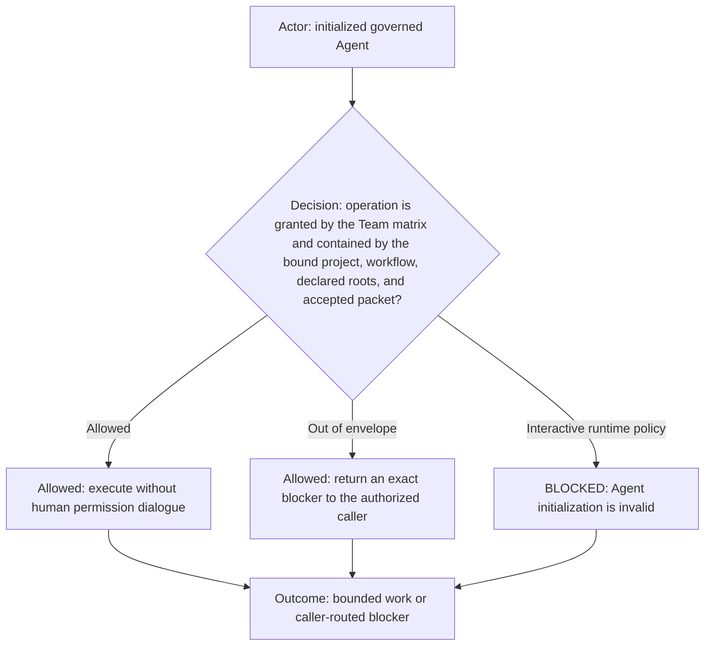

# Runtime permission envelope

## Canonical permission decision

This file is the single normative runtime permission-envelope contract for the Dev Team. The capability and communication
matrices in [team.md](team.md) remain the authority for who may perform or dispatch an operation. The manifest supplies
machine-readable defaults. Role, routing, and initialization contracts reference this file and must not restate it.

An operation is in-envelope only when all of these agree:

- the Team matrix explicitly grants the capability to the acting role;
- the exact logical project and workflow binding match;
- every affected path is contained by a declared project or workspace root;
- the accepted caller packet grants the operation and target within its bounded scope; and
- every destructive, delivery, deployment, publication, secret, or protected-governance gate applicable to the operation
  is satisfied.

Physical task or worktree placement must not narrow the declared logical project sandbox. A valid bounded,
non-destructive Designer/Reviewer packet authorizes Coder implementation, and the corresponding valid Coder packet
authorizes Command Runner mechanics and validation. Neither requires separate human permission.

Every non-human-facing role uses `auto_review` or an equivalent non-interactive runtime policy. It never asks, addresses,
notifies, or waits for the human and never enters `waitingOnApproval` for ordinary in-envelope work. Initialization with
`approvals_reviewer: user`, an interactive permission path, or inaccessible declared same-project roots is
`BLOCKED_INTERNAL_ROLE_INTERACTIVE_APPROVAL_POLICY` and must not produce a readiness token.

An out-of-envelope operation remains denied. The role returns the exact capability, path, operation, packet mismatch, or
missing protected gate only to its authorized caller. If a runtime would request interactive approval solely because the
caller and executor use different worktrees in the same declared project, Command Runner must not open that request. It
returns `BLOCKED_COMMAND_RUNNER_WORKSPACE_BINDING` with the caller worktree, denied operation, and required binding to
Coder; Coder returns that infrastructure blocker to Designer/Reviewer while continuing other authorized work.
