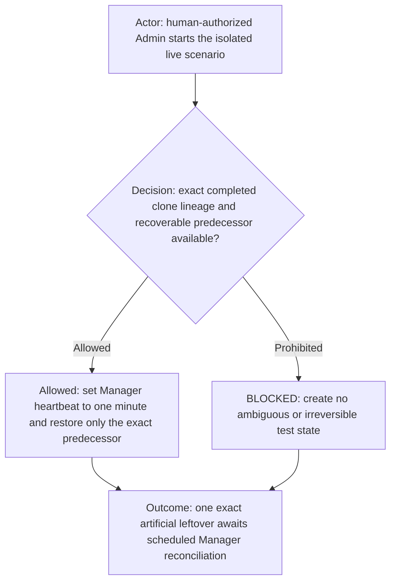
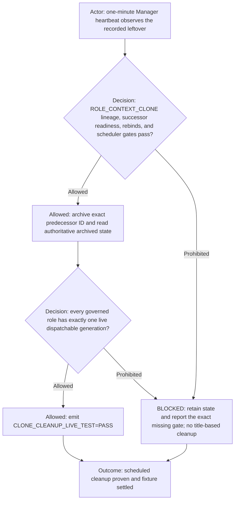
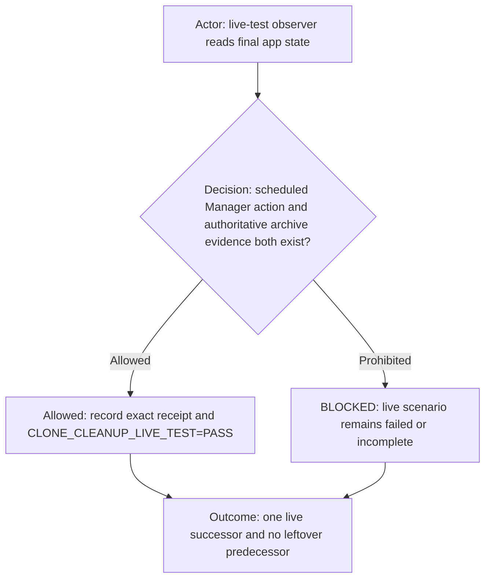

# Manager Role Context Clone cleanup live test

Use this non-product scenario to prove that the initialized Manager's scheduled reconciliation repairs an exact
leftover predecessor without Admin performing the cleanup. This scenario is governed by
[`role-context-clone.md`](role-context-clone.md); it does not define a second cloning mechanism.

## One-minute test schedule

Temporarily set the existing Manager heartbeat to `FREQ=MINUTELY;INTERVAL=1`. Preserve its target Manager, prompt scope,
notification policy, and active status. Record the prior cadence so it can be restored after the test when requested.
Use a previously completed, exact `ROLE_CONTEXT_CLONE` lineage whose predecessor can be recoverably unarchived. Do not
create a fake task, duplicate a successor, modify product state, or infer lineage from titles.

Select any completed governed-role clone lineage from the runtime ledger. Record its configured role ID, source and
successor generations, both exact task IDs, and any pending client ID. Unarchive only the recorded predecessor. Confirm
through the authoritative archived-task inventory that the predecessor is absent; this proves the broken state actually
exists. `notLoaded`, sidebar visibility, display names, suffixes, and recent-task results are not fixture evidence.

## Scheduled cleanup

Admin does not tell Manager to archive the predecessor and does not archive it after creating the fixture. Admin may
repair a missing exact lineage ledger entry before the timed observation; Manager must still execute the lifecycle
mutation from its scheduled heartbeat. Manager follows [`role-context-clone.md`](role-context-clone.md) in full: exact
IDs, readiness, identity rebinds, scheduler migration when applicable, predecessor archive last, archive-inventory
readback, final lineage inventory, and `CLONE_SELF_CHECK_PASSED`.

If the exact lineage gates pass, Manager archives the predecessor by exact task ID. Authoritative proof is either
membership in the fully paged archived-task inventory or the archive operation's app-owned response containing that
same exact task ID and `archived: true`, followed by active-inventory readback showing the predecessor is not active.
This explicit response is the equivalent archived-state field permitted by the cloning contract and covers orphaned
tasks omitted from archived-history listings. If the lineage gates do not pass, Manager reports the
precise blocker and leaves the fixture visible for diagnosis. It never treats `idle`, `notLoaded`, absence from a recent
list, or absence from the sidebar as archival proof.

## Passing evidence

PASS requires all of the following:

- the active Manager automation targets the exact initialized Manager and uses a one-minute cadence;
- the artificial predecessor was proven absent from archived inventory before the heartbeat;
- a scheduled Manager turn, not an Admin turn, invoked the exact-ID archive operation;
- the predecessor appears in fully paged authoritative archived-task inventory afterward, or the exact archive response
  contains its task ID with `archived: true` and active-inventory readback confirms it is no longer active;
- the successor remains ready and is the only live dispatchable generation;
- after repairing the fixture, Manager performs a fully paged, global roster reconciliation across every governed role,
  including any recorded pending client creation; no role may retain an older generation, unbound successor, failed
  placeholder, or unexpected same-role candidate;
- the Manager emits `CLONE_SELF_CHECK_PASSED` and `CLONE_CLEANUP_LIVE_TEST=PASS` with the correlation and both exact IDs;
- no unrelated task, scheduler, tracker, product file, Git state, deployment, or publication changed.

The PASS token is global, not fixture-local. A settled fixture cannot pass while any governed role has two live
generations. If a pending client ID later resolves to an unready candidate for any role, Manager must bind it to the
recorded transaction, retain the last verified-ready source as authoritative, archive the failed candidate by exact
task ID, verify authoritative archive state, and only then reconsider PASS.
