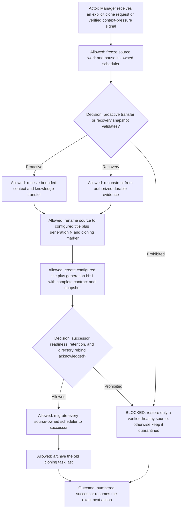
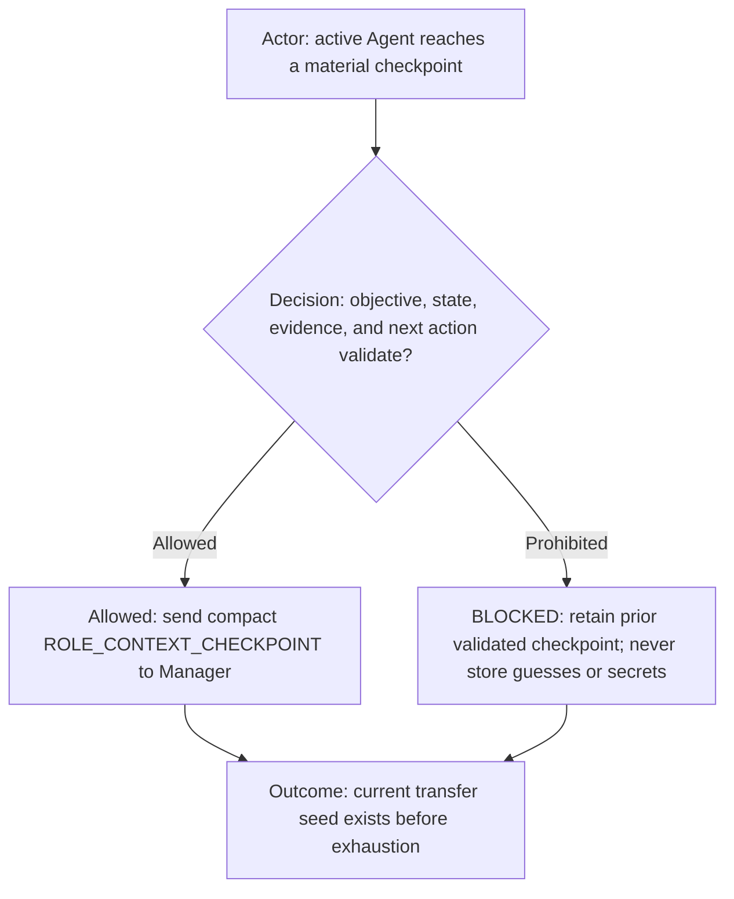
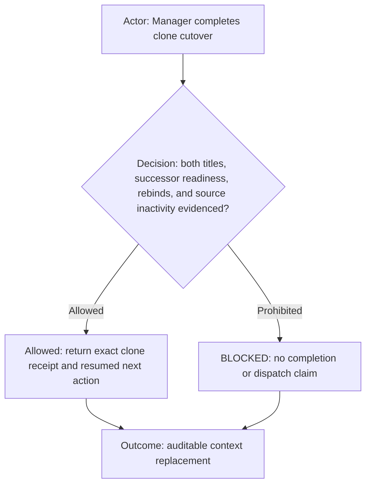

# Manager-owned Role Context Clone

**DIAGRAM-FIRST CONTRACT — NO UNCOVERED RULE TEXT.** Every normative chapter starts with a compact vertical Mermaid
diagram containing its actor, decision, allowed route, prohibited route, and outcome.

The authoritative lifecycle authority and naming grammar live in [team.md](team.md). This file defines the mandatory
Manager mechanics for replacing one Agent while preserving its responsibility and bounded context.

The human-facing name for that preservation is **context and knowledge transfer**. Here, “knowledge” means only the
validated working knowledge carried by the bounded handoff—accepted decisions, evidence, state, failures, and next
action—not an unverified memory dump or a claim that conversation history is authoritative. `ROLE_CONTEXT_CLONE` remains
the stable machine-facing protocol identifier.

## Clone lifecycle

`ROLE_CONTEXT_CLONE` is mandatory for every same-role replacement that preserves an active assignment or continuation
checkpoint, including explicit human replacement, context pressure, terminal exhaustion, failed delivery, incorrect
bootstrap, or recoverable worker failure. It is not elastic capacity and must not use fresh empty-context creation.

There is one replacement mechanism with two evidence modes. A **proactive clone** obtains direct context and knowledge
transfer while the source remains responsive, then locks it with `(cloning)`. A **recovery clone** is the degraded form
used when direct transfer is unavailable because the source is exhausted, disposed, incorrectly bootstrapped, or
non-responsive; Manager explicitly labels it recovery and reconstructs only from authorized evidence. It never claims
that direct knowledge transfer succeeded. Both modes preserve the same 1-to-1 lineage, generation, validation, rebind,
self-check, and archive gates.

## Continuous transfer readiness

Every active governed Agent follows `defaults.contextClone.checkpointPolicy` from `agents.yml`. After each material
decision, completed work slice, worker handoff, validation receipt, external-state mutation, or changed next action, it
sends Manager a compact `ROLE_CONTEXT_CHECKPOINT`. Manager validates it and replaces the prior checkpoint for that exact
role task ID only after validation. The checkpoint contains the bounded objective; ticket and correlation; accepted
requirements and decisions; repository, branch/worktree, changed-file, commit, PR, and tracker state; worker IDs and
pending packets; validation receipts; known failures and rejected approaches; exact next action; and evidence links. It
contains no secrets and never copies whole conversation history.

Manager persists generation per canonical role and logical project. The original task is generation `1` even when its
title is initially unnumbered. Generation comes from the Manager lifecycle record bound to the exact task ID, never from
title parsing or sidebar order.

For a proactive clone, after freezing new dispatch Manager obtains and validates the latest checkpoint plus at most one
bounded responsive delta. Only after that transfer is captured does Manager rename the source to
`<configured-role-title> (<N>, cloning)` and verifies exact readback. Only then may it create the successor as
`<configured-role-title> (<N+1>)`. The `(cloning)` marker remains visible throughout successor
initialization, readiness, retention, and every required `ROLE_REPLACEMENT_IDENTITY_BINDING` acknowledgement. Manager
archives the marked source only after all gates pass. Creating the successor before the verified source marker, omitting
either title readback, or archiving the source early is `BLOCKED_CLONE_PROTOCOL_VIOLATION`.

The context-and-knowledge-transfer snapshot contains the validated objective, ticket and correlation, accepted decisions, repository and Git
state, changed files, validation receipts, worker and peer identities, pending packets, failures, blockers, and exact next
action. It comes from the latest Manager-validated checkpoint plus a bounded responsive delta; whole-history copying is
not evidence and an exhausted source is never required to answer.

When direct transfer is unavailable, recovery resolves the same fields from the latest validated Manager checkpoint,
the configured work/ticket tracker, authorized task and delivery receipts, Git/worktree state, and external work
artifacts. Missing recovery evidence stays explicitly unknown and may block safe continuation; it is never filled from
title inference, sidebar order, or conversational memory.

After the successor returns its readiness token, Manager updates every authorized runtime role directory and Judge
observation directory, requires one consistent rebind correlation, then archives the source and resumes the checkpoint.
The successor is initialization-only before cutover; the source is handoff-only but remains authoritative.

Every automation owned by or targeting the source role is part of the clone transaction. Manager inventories those
automations before creation and pauses the source-bound automation before the source enters `(cloning)`. A scheduler
whose target is marked `(cloning)` must perform no tracker mutation, staffing change, task lifecycle action, clone
initiation, dispatch, or closure. If an atomic pause cannot be confirmed, the scheduler may only report its own bounded
status and must otherwise return `SCHEDULE_SKIPPED_SOURCE_CLONING` until cutover or rollback.

Manager preserves the automation's cadence, prompt scope, prior status, notification policy, and destination, and
retargets or recreates exactly one copy against the successor task ID after readiness and identity rebinds. It restores
the prior active/paused status only on the successor after verifying that binding, and archives/disables the
predecessor-bound copy before archiving the source task. Rollback is health-gated: for a proactive clone whose source
still passes readiness, Manager restores the source title, authority, and exact prior scheduler status. For a recovery
clone, or whenever source readiness cannot be re-proven, Manager keeps the source scheduler paused, keeps the source
non-dispatchable, quarantines any candidate, and reports `BLOCKED_CLONE_NO_HEALTHY_RUNTIME`; it never resumes scheduled
work merely to make the topology look rolled back. A missing,
duplicate, disabled-by-accident, or predecessor-bound required scheduler is `BLOCKED_CLONE_SCHEDULER_MIGRATION`; the
source remains authoritative until repaired. Roles with no declared or existing owned scheduler require no new one.

Clone execution is self-checking and idempotent. Before creation, Manager inventories the exact role lineage in the
runtime project and records the source task ID, generation, configured title, active assignment, and expected successor
title. Immediately after each lifecycle effect it reads the app-owned state back instead of trusting the requested
effect. It verifies, in order: exactly one source has the exact `(<N>, cloning)` title; no generation `N+1` task already
exists; exactly one creation request returns exactly one new task ID; that task has the expected `(<N+1>)` title,
project, model, reasoning, contract source, assignment/checkpoint, and readiness token; every required directory points
to that exact task ID; and the source is inactive only after cutover. A task-creation acknowledgement, title similarity,
sidebar order, or readiness token alone is insufficient evidence.

The scheduled Manager reconciliation defined by the Manager role is a continuation entry point into this same
transaction, not a separate duplicate-cleanup process. Seeing two numbered instances of any configured role is a signal
to load that role's recorded `ROLE_CONTEXT_CLONE` lineage. When the ledger proves generation `N` is the source and the
exact ready, rebound generation `N+1` is its successor, Manager archives generation `N` by exact task ID and verifies
`N+1` is the only live dispatchable instance of that role. Without that proof, it quarantines dispatch and reports the
exact conflicting IDs; display names and generation suffixes alone never authorize archival.

A creation response containing only a pending client ID is not a created successor and is not a failed attempt. Manager
records that client ID as an open clone transaction and remains responsible for it. It waits with bounded backoff and
reconciles the app-owned task inventory until the client creation resolves to exactly one real task ID or reports a
verified terminal setup failure. Manager must not end monitoring, restore the source title, report rollback, or accept a
new replacement request while that client creation remains unresolved. If continuation must cross turns, Manager keeps
an owned follow-up/heartbeat for the exact client ID until terminal reconciliation. On delayed success it completes
readiness, rebind, scheduler migration, and predecessor archive in the same transaction. On terminal failure it removes
or archives the failed placeholder, performs the health-gated rollback, and verifies that only the source remains.

Before reporting success, Manager performs a fully paged final reconciliation of every governed role lineage, not only
the role or fixture that triggered the current run. There must be exactly one active,
dispatchable successor for generation `N+1`, zero unexpected same-role candidates created by this attempt, no active
failed placeholder, every required rebind must agree, and the generation `N` source must be archived. If a delayed or
duplicate creation appears, Manager quarantines and recoverably archives the non-authoritative candidate by exact task
ID, repeats reconciliation, and reports the clone as complete only when the invariant holds. If it cannot establish one
unambiguous successor, it rolls back to the source and returns `BLOCKED_CLONE_SELF_CHECK_FAILED` with the conflicting
task IDs; it never leaves several apparent successors for the human to resolve. Every terminal path performs a final
inventory read proving either one active successor with an archived predecessor or one restored source with no live
candidate. A clone owner may not finish while both generations remain live. A global clone-cleanup or live-test PASS is
prohibited whenever any other governed lineage contains an unresolved pending client ID, duplicate generation, failed
placeholder, unbound successor, or leftover predecessor.

Archival is proven only by authoritative app-owned archive evidence for the exact task ID: a successful archive
operation followed by membership in the archived-task inventory (or an equivalent explicit archived-state field from
the app). `idle`, `notLoaded`, absence from a bounded recent-task list, a missing sidebar row, a title marker, and an
archive request receipt without readback are not archive evidence. If the exact predecessor is not present in the
authoritative archived inventory, Manager must treat it as live or unresolved, retry the exact-ID archive when the
lineage gates still pass, and must not emit `CLONE_SELF_CHECK_PASSED`.

On any rename, snapshot, creation, readiness, retention, rebind, or archive failure, Manager applies the health-gated
rollback above, quarantines the candidate, and reports the exact blocker. A healthy proactive source is restored and
remains authoritative: Manager restores the source's prior title and verifies its readiness before restoring authority.
An unhealthy recovery source remains visibly quarantined and non-dispatchable; it is not falsely
restored as operational and its scheduler remains paused.

## Required clone receipt

A successful receipt includes the role and logical project, generation `N` and `N+1`, source task ID and verified
`(<N>, cloning)` title, successor task ID and verified `(<N+1>)` title, readiness and retention result, every required
identity-rebind acknowledgement, source archive/inactive verification, and the resumed checkpoint and next action.
It also includes the final lineage inventory and the `CLONE_SELF_CHECK_PASSED` result proving exactly one active
dispatchable successor and no unresolved candidate or failed placeholder from the attempt.
For a scheduled role, the receipt additionally includes the automation ID, unchanged cadence/status/policy, exact new
target task ID, and proof that no active predecessor-bound or duplicate owned scheduler remains.
