# Shared Execution Routing Contract

**DIAGRAM-FIRST CONTRACT — NO UNCOVERED RULE TEXT.** Every normative chapter starts with a compact vertical Mermaid
diagram containing the same actor, prerequisite or decision, allowed route, prohibited or `BLOCKED` route, and terminal
outcome as its prose. A missing element or diagram/text disagreement invalidates the contract and returns `BLOCKED`.
Headings, Mermaid syntax, and purely descriptive labels are exempt.

**Purpose:** this is the shared transport protocol for the Dev roster. It explains how an already-authorized action is
carried in a packet, verified, delivered, acknowledged, evidenced, and closed.

**Not its purpose:** this file does not decide Team membership or grant permissions. [team.md](team.md) is the single
Team-policy authority. This contract may narrow a Team-authorized route with safety checks, but it cannot create a Role,
Agent, capability, contact route, or exception.

This Dev routing contract extends [`../../agents.md`](../../agents.md) and adds only Dev-specific transport, lifecycle,
and acceptance mechanics.

## Permission source

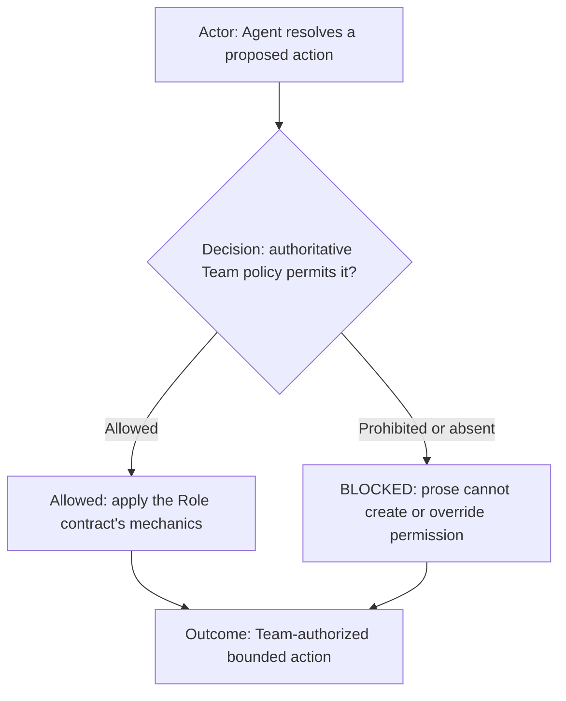

[`../agents.yml`](../agents.yml) supplies machine-readable instantiation values. [team.md](team.md) is authoritative for
roster, Role-to-Agent mapping, work ownership, execution, delegation, prohibitions, human dialogue, internal packets,
authorization relay, lifecycle, and contact. The remaining chapters define packet shape, evidence, ordering, and failure
mechanics; they may narrow Team policy but cannot add permission or exception.

## Overall lifecycle

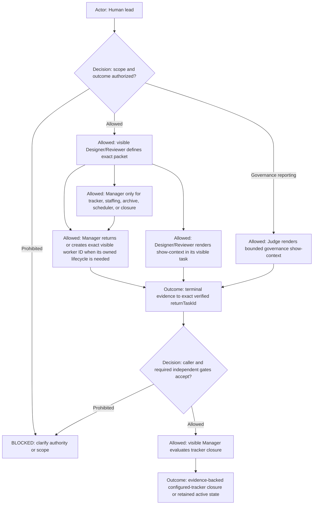

The human lead authorizes outcomes and remains final human authority. Designer/Reviewer owns interpretation,
architecture, exact work packets, worker dispatch, reviewer-owned validation dispatch, and independent technical
review. Manager owns tracker, staffing, archive, scheduler, and closure lifecycle only. Manager is never a proxy or
relay for Coder, Command Runner, or UI Acceptance Tester. Designer/Reviewer dispatches registered Command Runner routes
directly using the exact initialized visible task ID. Coder and UI Acceptance Tester retain Manager-owned ticket and
staffing preflight, after which Designer/Reviewer sends the packet directly to the returned worker ID. Coder-to-Command
Runner is authorized for bounded implementation mechanics, with evidence returning directly to Coder. A worker returns
terminal evidence to its exact verified `returnTaskId`. Manager alone closes a ticket after every required gate passes.

Command Runner is the sole executor of every effectful registered command, including editor, browser, Git mutation, build, test,
deployment, publication, scripts, custom utilities, and effectful shell mechanics, except Coder's ordinary read-only
product-file inspection, `show-context`, and
protected profile-scoped AI configuration publication. Judge exclusively owns protected governance commit, push,
PR create/update/open, and publication
verification after every protected gate passes. Designer/Reviewer owns `show-context` rendering
inside its visible task for direct human context requests and must report the opened or rendered artifact. Judge may
directly render `show-context` only for a direct human governance request about protected configuration or a bounded
Judge finding, and only inside its own visible task. This reporting exception grants no source mutation, participant
contact, runtime inspection, product context, or other command authority. Outside these named exceptions, every other role
may only compose or dispatch a complete bounded packet to the exact initialized Command Runner task; it must not execute
a command itself. Manager's
configured tracker lifecycle operations are a capability first; when that capability is unavailable, Manager may send
the exact profile-resolved tracker adapter fallback to Command Runner. This narrow route does not grant generic Command
Runner proxy authority. Tracker lifecycle operations are not otherwise a Command Runner command.

Coder directly owns zero-effect, target-contained reading of authorized product files and repository state using ordinary inspection mechanics;
this capability is not restricted by a command-name list. It grants no protected-artifact, credential, external-path,
write, network, environment, runtime, process-lifecycle, script, custom-utility, build, test, Git mutation, or package authority.
Direct filesystem reads, zero-effect local search such as `rg` and `rg --files`, and target-contained read-only Git such
as `git status`, `git diff`, `git log`, `git show`, and `git blame` are inspection mechanics, not delegated
operational execution. `No commands` or equivalent packet wording cannot remove this Team-owned capability. Coder must
not substitute computer-use control of a human-owned IDE, editor, terminal UI, or desktop application for source
inspection; visible UI/IDE interaction requires an explicit UI packet and the workflow's UI-acceptance route.

This boundary is mechanically fail-closed at every workflow-controlled process-launch adapter through
`commandExecutionDecision`. The adapter supplies both the claimed role and the server-derived initialized role plus the
registered route; only a matching trusted `command-runner` identity may reach process spawn. Role identity from prompt
text, task title, packet content, or command input is untrusted. Missing or mismatched identity, an unregistered route, or
any direct process attempt by Designer/Reviewer is rejected before spawn. A runtime that exposes its own shell outside
workflow-controlled adapters must enforce the same role-scoped tool restriction at that host boundary; repository prose
does not turn an independently exposed host shell into an authorized route.
Coder sends those operational or effectful commands directly to Command Runner. Designer/Reviewer must not relay, forward, or reconstruct
that request. If any active packet or stale role binding says Coder cannot contact Command Runner for those delegated
commands, the route is `BLOCKED_STALE_CODER_COMMAND_RUNNER_BINDING` until the affected roles reload the current contract.

## Human-facing and internal role boundary

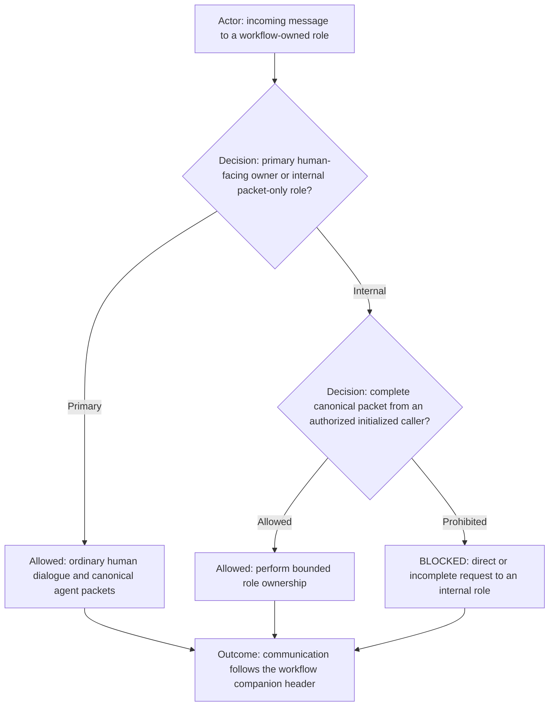

The authoritative decisions for this chapter are the route rows in
[team.md](team.md). The `Direct human dialogue` row identifies the primary human
owner and Judge's governance-only human route. `receive_internal_packet` and `send_internal_work_packet` define exact
agent routes. `relay_human_authorization` permits only attestation by the primary owner and verification by Command
Runner. `use_human_as_packet_courier`, `agent_review_of_judge_work`, and `judge_to_agent_message` are prohibited for
every role.

Mechanically, internal work uses a complete canonical packet from an exact initialized caller. Human authorization
attestation carries the trusted source task ID and one enumerated bounded effect. Incomplete authorization remains in the
primary owner's visible task. Failed internal delivery is reported as `BLOCKED_DELIVERY`. These mechanics do not create
permissions beyond Team communication policy.

An internal packet-only recipient for which `relay_human_authorization` is prohibited never evaluates human intent or
approval. It evaluates only its trusted caller, packet completeness, capability, scope, and actual operation result. A
tool or mutation denial is returned to the caller with the exact operation and target evidence; it must not be rewritten
as a request for direct human approval. Human-facing interpretation remains exclusively with the primary owner.

## Authoritative rule-source binding

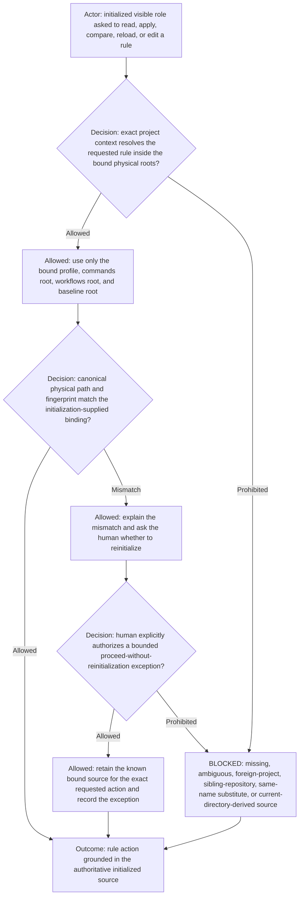

Every initialized visible role receives and retains the complete `configuration` source binding from the validated project-
context record: `bundleRoot`, `profilePath`, `commandsRoot`, `workflowsRoot`, and `baselineRoot`. Its initialization
message also contains the runtime provenance resolved by the initializer: logical project and repository, canonical
workspace path, canonical physical root paths, and a source manifest containing each composed contract's project-relative
path, canonical physical path, and SHA-256 fingerprint. When asked to read, apply, compare, reload, or edit rules,
commands, workflows, role contracts, or configuration, the role resolves the source only through that retained binding
and first verifies the logical saved project and repository and canonical path containment. It must not infer a source
from the current working directory, an absolute path supplied without matching provenance, a sibling checkout, another
saved project, search-result ordering, or a same-named file elsewhere.

When a known source inside the bound roots has changed or no longer matches its recorded fingerprint, the role explains
the mismatch and asks the human whether reinitialization is wanted before proceeding. Reinitialization is the preferred
way to refresh authority, but it is not an automatic blocker for one bounded action when the human explicitly authorizes
that action to proceed without reinitialization. The role records the exact human authorization, action, and source
mismatch, continues only with its already-known bound source, and never treats the exception as a source rebind or a
general authorization. Missing, partial, inaccessible, ambiguous, foreign, or out-of-root provenance remains `BLOCKED`.
Importing changed content still requires an exact authorized transfer into the bound destination; reinitialization makes
the transferred rule authoritative for future work.

## Manager is not a worker proxy

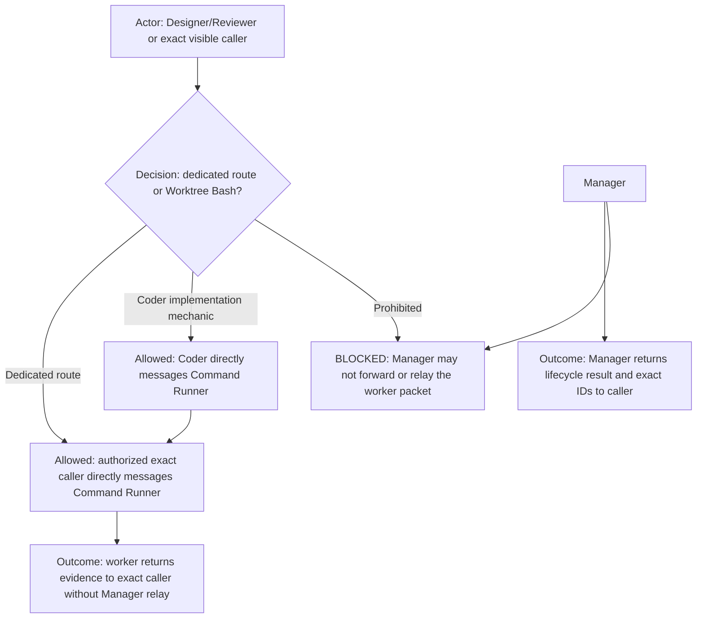

Manager never acts as a proxy for general execution-role traffic. Designer/Reviewer, Coder, or another exact visible
caller whose role policy explicitly permits it sends a complete packet for a registered command directly to Command
Runner. The sole Manager-originated command packet is a profile-resolved tracker adapter fallback for a Manager-owned
tracker action when the configured capability is unavailable. Coder directly dispatches bounded source inspection and
implementation-validation mechanics; Designer/Reviewer separately owns semantic decisions and independent validation. A
bounded `worktree-bash` route is allowed only when no more specific command matches and the packet authorizes its exact
arguments and effects. UI Acceptance Tester still requires Manager-owned ticket and staffing preflight; Manager returns
exact IDs to the caller, and the caller then messages the worker directly. Manager is invoked only for Manager-owned
lifecycle actions: configured-tracker search/create/update/closure, visible worker creation/archive, scheduler
management, or exact-ID lifecycle verification. Manager must not receive an assignment merely to forward unrelated
execution or relay worker evidence.

## Agent identity — Codex app visible tasks only

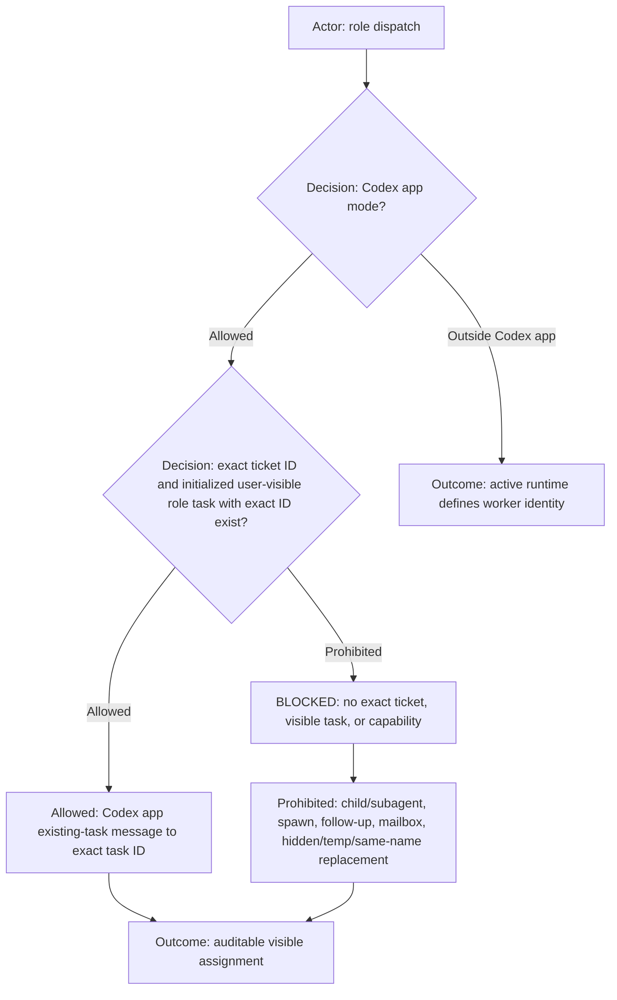

**IN CODEX APP MODE, AGENT MEANS A PREDEFINED, USER-VISIBLE ROLE TASK — NEVER A CODEX SUBAGENT.** `Designer/Reviewer`,
`Manager`, `Coder`, `Command Runner`, and `UI Acceptance Tester` mean only initialized, user-visible Codex role tasks
with exact task IDs belonging to the selected workflow project declared by the adjacent agents companion. Every
post-initialization cross-task work request **MUST** include the exact tracker `ticketId` and use Codex app
existing-task messaging with that task ID. Child/subagents and collaboration spawn, follow-up, mailbox, hidden,
temporary, replacement, or same-name routes are unconditionally prohibited with no exception. An unavailable exact
ticket, task, or capability is `BLOCKED`. “Ask Manager” resolves only to the initialized visible Manager task ID and
never to a spawn or substitute. Designer/Reviewer directly dispatches registered Command Runner commands without Manager.
Coder directly dispatches bounded implementation mechanics to Command Runner and receives their evidence.
After Manager returns ticket and staffing information for Coder or UI Acceptance Tester, Designer/Reviewer directly dispatches the selected worker.
Manager is never the communication proxy. Outside Codex app mode, this visible-task
transport contract does not invent Codex tasks or prohibit the selected runtime's own declared worker identity; the
active workflow/runtime contract remains authoritative.

## Manager caller, project, and return context

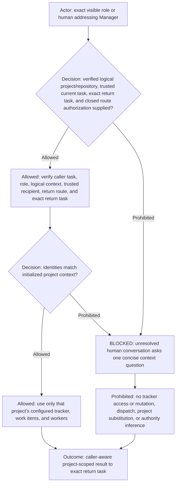

The canonical agent coordinates are `profileId`, `workflowId`, `logicalProjectId`, and `runtimeProjectId`; together they
resolve the `<profile-id>-<workflow-id>` logical agent project. That logical project scopes team identity and peer
communication. It is distinct from the exact profile-authorized repository/workspace selected for the current request or
packet, which scopes work rather than permanently rebinding the role. The agent coordinates are mandatory in every
inter-agent and command packet and must remain unchanged across delegation and return. A
recipient blocks missing or conflicting coordinates rather than reconstructing them from a path, URL, or conversation.
All inter-agent sender, recipient, and return tasks must belong to those identical coordinates. Cross-profile routing is
never a valid workflow edge and cannot be made valid by a relay, Manager approval, command execution, or matching role
name. A human starts a separate interaction inside the other initialized profile when such work is needed.

Every cross-task request to Manager **MUST** identify `callerTaskId`, `returnTaskId`, caller role or human identity,
saved project, repository or workspace, request intent, ticket or work-packet ID when one exists, and closed
`returnRouteAuthorization`. `same-as-caller` is valid only when caller and return IDs are equal. `caller-designated` is
valid only when the caller names one distinct, initialized visible return task in the resolved project and repository
and Manager verifies that exact route as part of caller/project context. Missing, mismatched, foreign-project,
foreign-repository, substitute, or broadcast return routes are `BLOCKED`. Manager verifies the exact caller task and
role against visible-task state and verifies the project against the initialization-supplied project-context record
before tracker access or mutation.

Every Designer/Reviewer-to-Manager request is created from this single canonical packet template and passed through the
executable `createManagerPacket` validator in `visible-role-routing.mjs` before Codex app delivery:

```yaml
callerTaskId: <exact initialized Designer/Reviewer task ID>
returnTaskId: <exact initialized return task ID>
callerIdentity: designer / reviewer
project: <initialized logical project>
repository: <initialized logical repository>
intent: <bounded Manager-owned lifecycle request>
ticketCandidateCorrelationId: <stable intake correlation ID>
ticketId: <optional supplied configured-tracker issue key>
ticketUrl: <optional supplied configured-tracker issue URL>
returnRouteAuthorization: same-as-caller | caller-designated
```

Manager passes every received packet through `managerPacketDecision` before tracker access. An incomplete or invalid
packet authorizes no lookup or mutation. Manager sends the canonical visible receipt
`BLOCKED_INVALID_PACKET: <reason>` to the packet's valid `returnTaskId`, or to the trusted Codex sender task when the
return ID itself is absent. It verifies delivery, retries once to that same task, and reports `BLOCKED_DELIVERY` visibly
in Manager's own task if the return still fails. Manager may never end a triggered turn without at least one visible
response and an explicit delivery disposition; `managerTurnCompletionDecision` rejects silent completion.

“We,” “our,” “current work,” and “current tasks” mean only the verified caller’s resolved project and work context. The
sole direct-human representation is `lead/human in this visible task`, which requires `callerTaskId` to equal the
current initialized visible role task. An explicitly named alternate caller uses that role's exact verified
`callerTaskId` and role identity; arbitrary human strings are `BLOCKED`. Manager states the resolved caller and project
in its answer. An explicitly named alternate project is used only after its own exact project-context record is
verified.

If caller or project context is missing or unverifiable, Manager returns `BLOCKED_INVALID_PACKET` through the trusted
sender route and has no tracker, mutation, dispatch, or authorization authority. It never repairs the packet from
conversation memory or silently assumes its initialized project.

For cross-task delivery, a final answer inside Manager’s own task is not terminal delivery. Manager sends the result
through Codex app existing-task messaging to the exact `returnTaskId` and verifies a successful receipt. Failure
retries once to the same target, then returns `BLOCKED_DELIVERY`; substitution and broadcast are prohibited. A
same-task human answer is local. Scheduler reconciliation has no conversational return target and remains governed by
its quiet scheduler contract.

## Task, model, capability, ticket, and staffing preflight

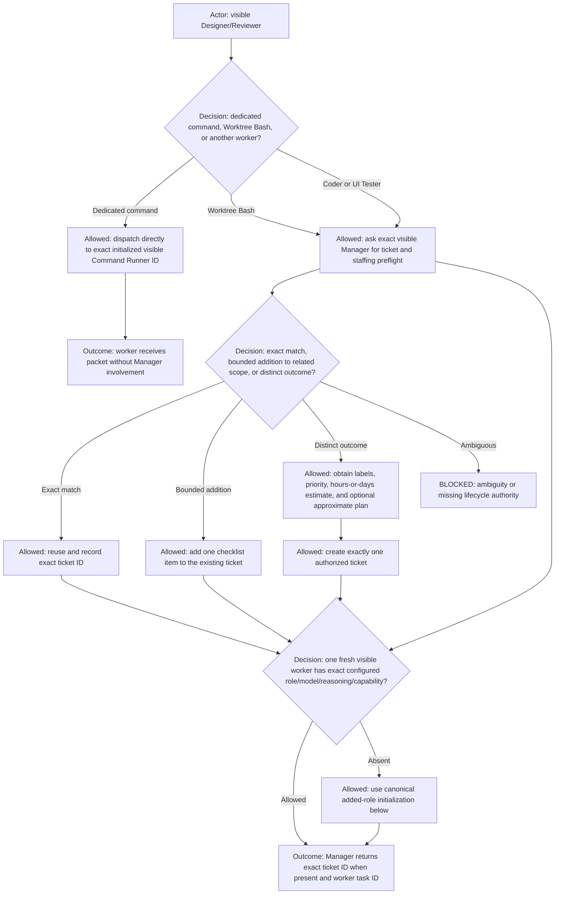

Before every Coder or UI Acceptance Tester assignment, Designer/Reviewer asks Manager for the required ticket and
staffing preflight. An ordinary human work request without a ticket ID does not route back to the human for tracker
lookup: Designer/Reviewer **MUST** immediately message the exact initialized visible Manager with bounded intent and a
ticket-candidate correlation ID. Manager owns search, unique-match reuse, bounded checklist attachment, deduplicated
creation when authorized, and factual tracker readback. Designer/Reviewer waits for Manager's exact ticket ID and scope
evidence, then continues automatically. It asks the human only for a genuine semantic conflict or authorization
decision that Manager explicitly returns with evidence. Merely stating that Manager will be consulted without
performing the cross-task dispatch is prohibited. Designer/Reviewer calls the exact initialized visible Command Runner
directly for reviewer-owned commands; Coder calls it directly for bounded implementation mechanics. Manager must not be
invoked merely to proxy, approve, forward, or relay a Command Runner packet.

An absent required Coder or UI Acceptance Tester is ordinary Manager-owned staffing state, not an Admin lifecycle repair
and not a terminal work blocker. Designer/Reviewer sends the staffing packet to Manager in the same turn, waits for the
exact receipt, and resumes dispatch automatically when Manager returns a verified worker ID. Asking the human to create
the worker, asking the human to contact Admin, or ending the work merely because the worker is absent is prohibited.
Only Manager's evidenced semantic conflict, authorization dependency, malformed manifest, duplicate active worker, or
failed task creation may produce the corresponding precise blocker; Designer/Reviewer must report that evidence without
recasting routine staffing as Admin work.

A supplied tracker ID or URL follows the same immediate Manager route. Designer/Reviewer puts it in the canonical
packet's `ticketId` or `ticketUrl`; the validator preserves that field for Manager. It is input for factual resolution,
not verified evidence Designer/Reviewer may bind or interpret directly. Manager exact-reads the supplied reference before
search or creation. If the fresh receipt shows one eligible ticket whose scope matches the bounded request, Manager reuses
that ticket and continues staffing; absence of a prior active packet, worker, or workflow record is not a reason to block
intake. Designer/Reviewer waits for Manager's actual card fields and scope receipt before claiming the ticket is bound or
asking the human what outcome to pursue. Claiming a URL-derived ticket is bound, or merely narrating that Manager will be
consulted without the actual cross-task receipt, is prohibited.

For Coder and UI Acceptance Tester, Manager searches active and non-canceled configured-tracker items before every
creation. Search compares the normalized requested outcome, project or workflow, affected capability, existing labels
or tags, descriptions, and checklist content. Manager reuses one exact outcome match. When the request is a bounded
addition inside one existing ticket's outcome, Manager must add one checklist item to the existing ticket instead of
creating a new ticket. A related but independently deliverable outcome may become a separate ticket linked by the same
stable grouping labels. Multiple plausible matches, unclear ownership, or duplicate checklist content is `BLOCKED`
until Designer/Reviewer resolves meaning.

Before creating a distinct ticket, Manager applies stable grouping labels or tags derived from the initialized project
context and request scope. Reuse existing normalized labels and do not create spelling variants or near-duplicates.
Manager classifies work as a bug only when grounded evidence shows functionality existed before the current task or
change and is now broken, regressed, or incorrect. Breakage introduced or discovered while developing the current task
remains implementation scope for that existing ticket, normally as a checklist item or correction, and is not a
separate bug by default. A missing feature or desired enhancement is also not a bug. If the pre-existing-functionality
boundary is unclear, Manager asks the exact responsible registered agent whether the behavior worked before the current
task's changes and waits for a concise classification before mutation. For a grounded bug, Manager applies the
configured tracker's canonical bug label or tag and never invents `bug`, `defect`, and `regression` variants in
parallel.

Manager also records a normalized priority. It may infer priority only from explicit request language, numbered stages,
or clear dependency order: an earlier blocking stage has higher priority than work that depends on it. Stage numbering
alone does not authorize marking every Stage 1 item urgent or changing human-stated priority. When priority is absent,
conflicting, or not evident from ordering, Manager asks the exact responsible registered agent, normally
Designer/Reviewer or the exact owner named by the active packet, for a brief priority recommendation and rationale.
Manager maps that grounded recommendation to the configured tracker's priority field or stable priority label without
inventing a parallel scale.

Every new ticket must also record an estimate in hours or days, never points. If that estimate is absent, Manager
directly asks the exact initialized Designer/Reviewer resolved from the registered visible-agent inventory. Manager may
include a request for an approximate implementation plan of at most five short, high-level steps.

This is a low-cost, non-execution ticket-lifecycle consultation identified by caller, project, repository, and a
ticket-candidate correlation ID. The responsible agent uses only the request and context already available, states
material uncertainty, and must not inspect the repository, invoke tools, perform research, produce detailed
architecture, review implementation, dispatch work, or elaborate merely to improve confidence. It may occur before a
ticket ID exists and authorizes only priority advice, the estimate, and an optional approximate plan, never
implementation or proxy traffic. Manager creates exactly one ticket only after labels, priority, and estimate are
grounded; absence of the optional plan does not block creation.

Manager records the exact reused, updated, or created ticket ID and verifies one fresh, initialized visible worker with
the matrix role, model, reasoning, and capability; two active workers for the same role are prohibited. If the role is
absent, Manager uses the canonical added-role initialization below. For Coder and UI staffing, Manager returns the
exact ticket ID and worker task ID to Designer/Reviewer only after initialization succeeds. Manager owns staffing and
tracker mutation, never implementation semantics or execution relay. Command Runner execution does not require Manager
preflight.

Designer/Reviewer and Manager are persistent control roles. Coder, Command Runner, and UI Acceptance Tester are
disposable visible worker instances. Initial setup creates one of each role; later worker disposal and creation follow
the worker lifecycle below.

## Canonical initialization for every added AI role

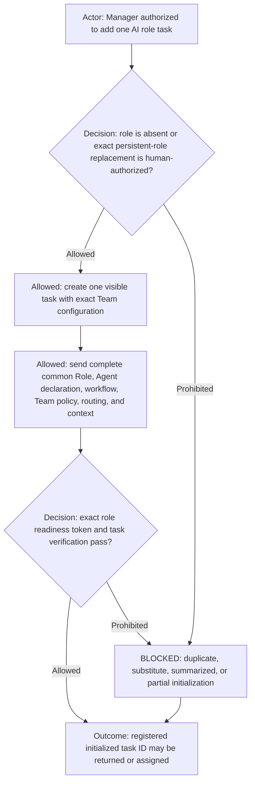

Every AI role task added after initial setup uses the same self-contained canonical initialization payload used by full
workflow agent initialization:
complete common [`agents.md`](../../agents.md) contract, selected workflow,
adjacent `agents.yml`, authoritative `team.md`, `shared-execution-routing.md`, runtime-validated project context, matching common Role, and any declared workflow
binding.
The complete declaration-resolved file artifacts appear
in the fingerprinted source manifest; runtime project context is bound separately and is never a committed project-specific
fixture. A summary, remembered rule set, omitted common contract, omitted CSV, or reduced prompt is prohibited. Duplicate
persistent roles are prohibited unless the human authorizes replacement of the exact prior task.

For `judge`, the matching definition is the common `ai-workflows/_common/roles/judge.md` role definition named by
`agents.yml`, plus the selected workflow and team.md projection.
Initialization creates the visible task only inside the exact selected runtime
project and injects its profile, workflow, logical/runtime project, roster, validation-command, scenario, and schedule
jurisdiction. It never creates a standalone, profile-only, or projectless Judge and never infers authority from the shared
file location.

The task remains unusable until it returns the matching token: `DESIGNER_REVIEWER_READY`, `MANAGER_READY`,
`CODER_READY`, `COMMAND_RUNNER_READY`, or `UI_ACCEPTANCE_TESTER_READY`. Manager then verifies visibility, uniqueness,
Team-configured model/reasoning/capability, and initialized registration. Failure is `BLOCKED`; the task receives no assignment
or returned staffing ID. This single rule carries every capability and handoff requirement, including Coder-to-Command
Runner bounded execution packets, the exact `COPY THAT` first-commentary acknowledgement, same-turn continuation, exact
`returnTaskId` terminal evidence, blocker reporting, and non-closure status.

## Delegation and capability ownership

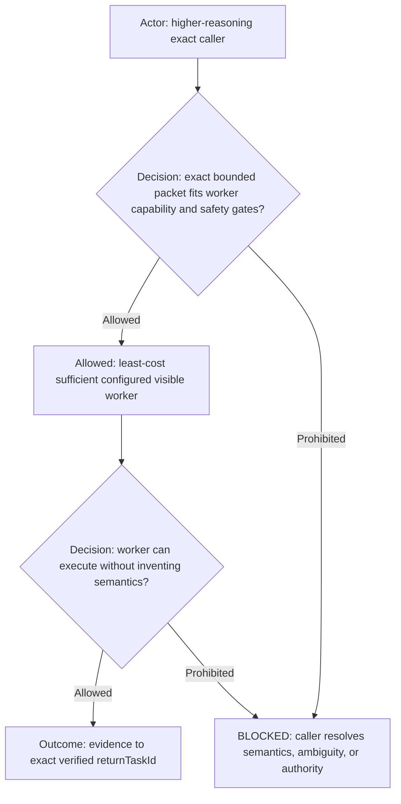

The higher-reasoning caller owns interpretation, architecture, scope, ambiguity, the exact work packet, and acceptance.
The lower-reasoning worker uses the least-cost sufficient configured model, performs only bounded work, never invents
semantics, and returns terminal evidence or `BLOCKED` to the exact verified `returnTaskId`. Explicit capability and
safety gates override model-name hierarchy. The Team capability policy is authoritative.

## Judge isolated command test

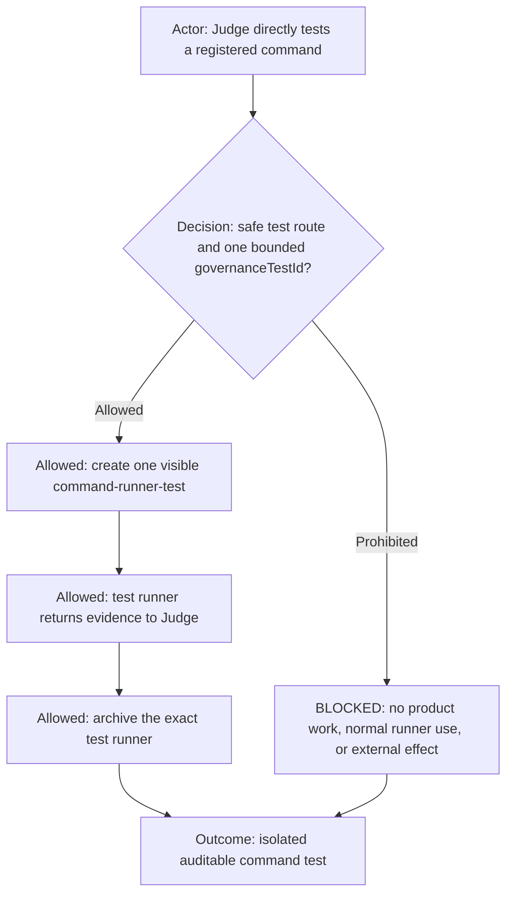

On a direct human request, Judge may create one `command-runner-test` visible worker for one nonempty
`governanceTestId`. It accepts only the Judge's complete test packet, executes only a registered safe or dry-run
command route, returns evidence to Judge, and is then archived automatically. It must not perform product work,
external effects, tracker actions, or replace the normal Command Runner. This is the sole firewall exception for this
test role.

## Protected governance edit gate

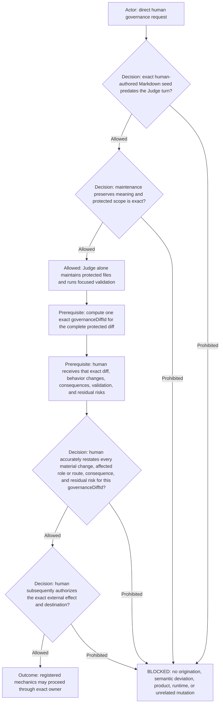

Judge is the sole AI validator and physical maintainer for the distributed protected profile-scoped AI configuration
surface after the human-authored rule seed gate passes; it is never the original author of rule meaning. The human must
already have edited and identified the exact Markdown seed before the Judge turn. Judge may correct expression, rephrase
without changing meaning, replicate the same rule to exact human-named locations, and add mechanical validation that
enforces only the seed. After the human explicitly requests representation synchronization, Judge may translate the
same seeded meaning into the corresponding matrix rows, role declarations, diagrams, and focused validation tests. The
human may name a bounded family such as the governance matrices; Judge resolves and lists its exact members from the
active workflow's authoritative references before editing.

Representation synchronization never expands policy scope. Every target must remain inside the seed's original role,
workflow, profile, workspace, and repository scope. Judge may not add a role, workflow, permission, exception, route,
condition, consequence, or other policy choice. An out-of-scope target is `BLOCKED_JUDGE_RULE_SCOPE_EXPANSION`; an
ambiguous translation is `BLOCKED_JUDGE_RULE_PROJECTION_AMBIGUITY` until the human edits the Markdown meaning. A verbal
request, scheduled finding, AI-created dirty diff, or desired outcome is not a seed.

The repository-local `../../../ai-profile/**` bundle is configuration, not governance rules. Its ordinary non-secret
tracked artifacts are not part of this surface and follow the Designer/Reviewer-to-Coder implementation route. The
protected surface contains
every file under `ai-commands/**`; workflow and agent contract Markdown, acceptance-scenario definitions, and focused
governance tests under `ai-workflows/**`; active agent instruction/rule files such as `../../../AGENTS.md`; and
governance-specific documentation. Command
Markdown, specs, examples, implementations, route definitions, and tests under `ai-commands/**` remain protected
regardless of file extension. Credentials, local/session state, generated files, and caches below
`../../../ai-profile/**` are never governance-edit authority.

Profile configuration remains identity-isolated. Designer/Reviewer and Coder may route or edit only the canonical profile
root whose directory identity equals their immutable initialized `profileId`; visibility of sibling profiles never grants
access. Cross-profile configuration mutation is `BLOCKED_PROFILE_CONFIGURATION_BOUNDARY`. Only the separately declared
human-owned Admin may act on another exact profile, and only from a direct human request that explicitly names and
validates that target profile; no governed role may dispatch or relay that exception.

The mixed `ai-workflows/**` tree is not protected wholesale: workflow application/runtime source, Electron or launcher
implementation, product/harness source, and their implementation tests remain Coder-owned even when located below it.
Artifact purpose, not the `ai-workflows` path alone, determines that boundary. No workflow agent reviews or approves
Judge work; the human is the sole approval authority. Manager, Coder, Command Runner, and UI Acceptance Tester return a
factual governance gap only through their exact authorized route to Designer/Reviewer, which may report it to the human.
They may not contact or dispatch Judge, edit protected configuration, or use the human as a packet courier. Command Runner
rejects every protected-governance publication packet. Judge alone directly performs receipt-verified protected commit,
push, PR create/update/open, and publication verification for its permitted maintenance diff.

Before any protected change is committed, published, reloaded, deployed, or otherwise made effective, the Judge must
present the complete uncommitted diff plus a plain-language account of changed behavior, affected roles and routes,
consequences, validation, and residual risks. It then asks the human to restate those material items in the human's own
words. The comprehension gate passes only when that response accurately covers every material item for the exact
`governanceDiffId`; the Judge asks focused follow-up questions for anything missing, mistaken, or ambiguous. `Yes`,
`approved`, `looks good`, an emoji, silence, prior approval, broad standing authority, inferred intent, or action-only
wording such as `commit and push` does not demonstrate understanding. After comprehension is demonstrated, each exact
external effect and destination requires a separate subsequent explicit human authorization. Judge is the exclusive
mechanical owner for protected-governance publication.

The Judge computes one nonempty `governanceDiffId` as a deterministic SHA-256 identity of the canonical repository
identity, base revision, and complete protected change set, including every changed path, status, and exact content for
tracked and untracked files. The disclosed diff, material explanation, validation result, human-understanding receipt,
and external-effect authorization must each name that exact `governanceDiffId`. Any path, status, content, base
revision, or repository-identity change creates a new identity and immediately invalidates every earlier explanation,
validation, understanding, and authorization receipt; the complete gate restarts from disclosure. Similar content, a
commit hash alone, a summary, or an agent-supplied label is not a substitute for the computed identity.

Every protected-governance external-effect packet must carry the ordered receipt chain `governanceDisclosureReceipt` →
`governanceExplanationReceipt` → `governanceValidationReceipt` → `humanComprehensionReceipt` →
`externalEffectAuthorizationReceipt`. Every receipt contains the same exact `governanceDiffId`, one nonempty unique
`receiptId`, and an integer `sequence` strictly greater than the preceding receipt. `humanComprehensionReceipt` must
include a coverage checklist mapping every disclosed material change, affected role or route, consequence, and residual
risk to the human's accurate restatement, plus any focused question and resolved answer.
`externalEffectAuthorizationReceipt` must be a later distinct human message authorizing exactly one action and naming
the exact repository, branch, remote, environment or activation target, and PR destination when applicable; arrays,
multiple actions, wildcards, implied defaults, and bundled `commit and push` authorization are prohibited.

Authorization receipt IDs are single-use. Disclosure, explanation, validation, and comprehension receipts remain
reusable only as unchanged evidence for later transitions of the same `governanceDiffId`; they cannot authorize an
effect. Judge checks the authorization ID against trusted consumed-receipt evidence before protected publication
execution, atomically records it as consumed only when its exact effect succeeds, and refuses an already-consumed
authorization. A failed effect may be retried only under the protected route's explicit retry policy with the same
unchanged diff and authorization; an ambiguous outcome is `BLOCKED` until state is read back and must not be blindly
retried. A new action, destination, changed diff, or replacement authorization requires a new authorization receipt
with a later sequence. No agent-review receipt exists. Judge verifies the ordered chain, authorization single-use
status, and unchanged protected change set and fails closed without changing external state.

## Dispatch, acknowledgement, and exact-return handoff

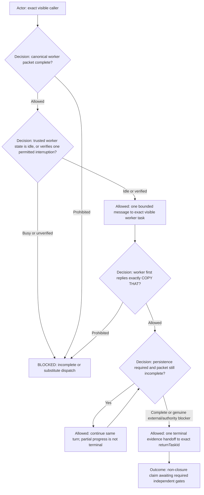

Every worker packet **MUST** identify nonempty exact `callerTaskId`, `returnTaskId`, caller role or closed
human identity, logical `project`, logical `repository`, request intent, `workerId`, bounded scope,
validation, prohibitions, and terminal condition. It also identifies ticket or work-packet ID when one
exists and closed `returnRouteAuthorization`.

Every Coder packet and correction **MUST** additionally contain nonempty `implementationDesignDiagram` and
`implementationDesignText` fields copied from the design already shown in the visible Designer/Reviewer
task. The Mermaid source must be identical, declare exactly `flowchart TD`, and remain semantically
consistent with the text. Left-to-right and right-to-left Mermaid directions are prohibited.

`savedProjectId` and `workspacePath`, when carried as app/runtime evidence, are resolved by Manager to the
logical initialized context and are never compared directly to project/repository names. The actual
recipient/current-task ID is trusted execution context, never packet data: it must equal `workerId`;
packet `currentTaskId` is prohibited. Manager verifies the named worker and return task are unique
initialized visible tasks in the resolved project/repository.

Before delivery, the sender and recipient read the worker's trusted active-assignment state. An idle worker
may receive one complete packet. An active worker rejects every new or unrelated packet with
`BLOCKED_WORKER_BUSY`. The only permitted interruption kinds are `current-scope-correction`,
`safety-stop`, and `explicit-replacement`; each requires matching trusted interruption authority. A
current-scope correction must carry the active `workPacketId`; an explicit replacement must carry the
active `workPacketId` as `replacesWorkPacketId`. Packet text cannot create, broaden, or verify an
interruption. This gate applies uniformly to every worker role and caller, including
Designer/Reviewer-to-Command Runner, Coder-to-Command Runner, and UI Acceptance Tester-to-Command Runner.

Before any execution, the worker's first user-visible **commentary** response **MUST** be exactly `COPY
THAT`; it is not a final response, does not await `PROCEED` or another prompt, and an acknowledgement-only
ended turn is a protocol violation. When the packet requires persistence, execution continues in the same
turn until completion or a genuine evidenced external/authority blocker. Partial progress or remaining
in-scope coding is neither a terminal blocker nor acceptance or completion, and never authorizes ticket
closure or the next gate.

Exactly one terminal disposition is `DONE`, `BLOCKED`, or `APPROVAL_REQUIRED`, and its evidence handoff **MUST** be
sent through Codex app existing-task messaging to the exact verified `returnTaskId`. `DONE` requires complete work and
full evidence. `BLOCKED` requires evidence of a genuine external blocker and an exact next action. `APPROVAL_REQUIRED`
requires evidence of a genuine authority/approval dependency and an exact next action. Remaining in-scope coding cannot
use either terminal blocker form. Every terminal handoff contains changed files, commands/tests, requirement-to-test
mapping, residual risks or blockers, and explicit non-closure status. Progress messages are not terminal delivery. A
failed delivery retries once to the same target. If both attempts receive a definite app safety rejection, the caller
may read the exact worker's completed terminal turn and accept it only when its nonempty correlation ID, exact
`returnTaskId`, and terminal disposition match the active packet; it records both rejected sends and forwards the
verified evidence through its own exact return route. This observed-turn fallback never permits a substitute recipient,
broadcast, inferred evidence, or worker-operation retry. Every other failed delivery returns `BLOCKED_DELIVERY`. A
human speaking directly in a visible role task is `lead/human in this visible task` unless the human explicitly names
another caller.

## Tests, UI acceptance, publication, and assignment acceptance

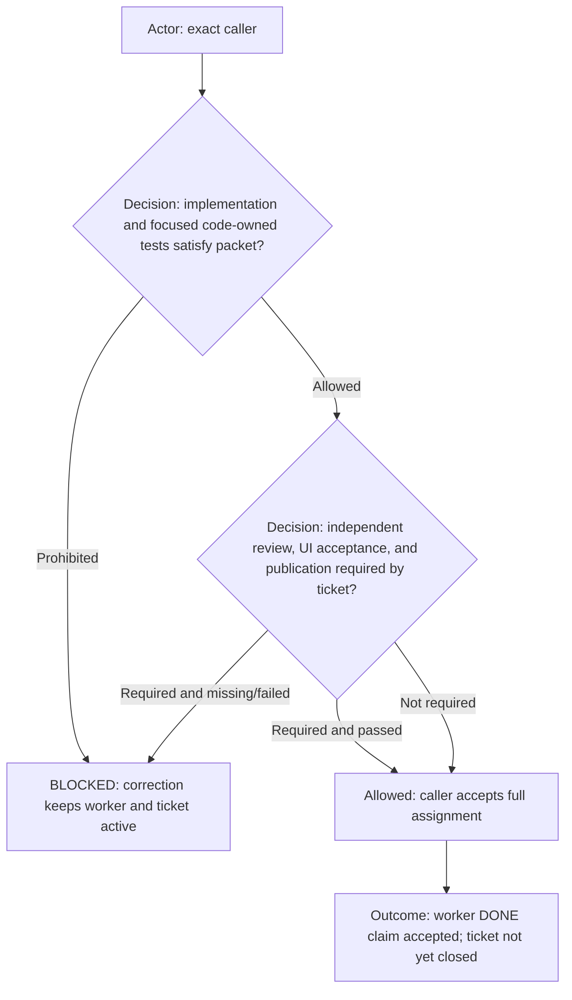

Coder owns source and test edits plus direct dispatch of bounded implementation mechanics, but never command execution.
Command Runner owns registered mechanical commands and applies
[permission-envelope.md](permission-envelope.md) for packet authority, runtime approval behavior, and workspace-binding
blockers. UI Acceptance Tester owns independent visible UI interaction and acceptance judgment, may not replace it
with API or code inspection, and must directly delegate every matching registered setup, launch, readiness, capture,
reset, and cleanup command to Command Runner with the UI Tester task as caller and return task. UI Acceptance Tester
never runs those commands itself, and Command Runner never performs or decides visible acceptance. Designer/Reviewer
owns reviewer validation dispatch and independent technical review. Ordinary publication occurs only when explicitly
authorized and routed to Command Runner; protected governance publication belongs exclusively to Judge. The exact
caller validates the assignment and required gates. Failure or correction keeps the worker active. Worker `DONE` is a
claim, never ticket closure.

## Worker acceptance, archive, and fresh replacement

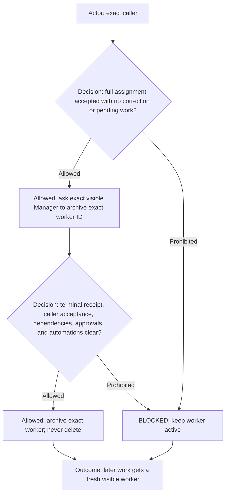

After full assignment acceptance, the caller asks Manager to archive the exact disposable worker task ID. Manager
verifies terminal receipt, caller acceptance, no correction, pending work, dependency, approval, or owned/targeted
automation. Manager then archives that exact worker and never deletes it. Later work creates a fresh visible worker.
Persistent Designer/Reviewer and Manager tasks are not disposed by this worker lifecycle. A ticket may remain in the
profile-configured `in_progress` lifecycle state across multiple worker assignments.

## Manager-authoritative tracker closure

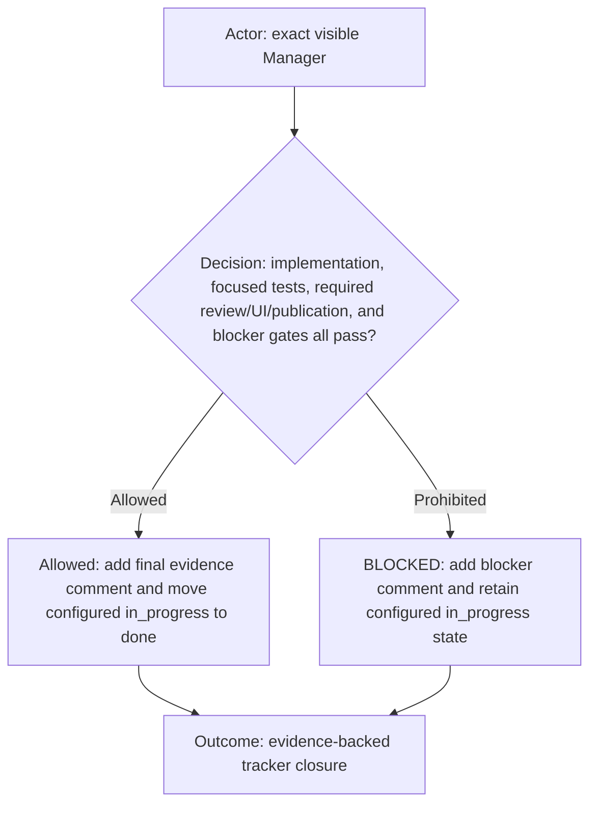

Manager alone verifies every ticket gate: implementation, focused tests, independent review and UI acceptance when
required, publication when required, and absence of blockers. When all pass, Manager adds one final evidence-backed
comment and moves the ticket from the profile-configured `in_progress` state to the configured `done` state. Otherwise
Manager adds a concise blocker comment and retains the configured `in_progress` state. Worker completion, review
labels, and tracker state never substitute for the required evidence.

## Scheduled configured-tracker reconciliation

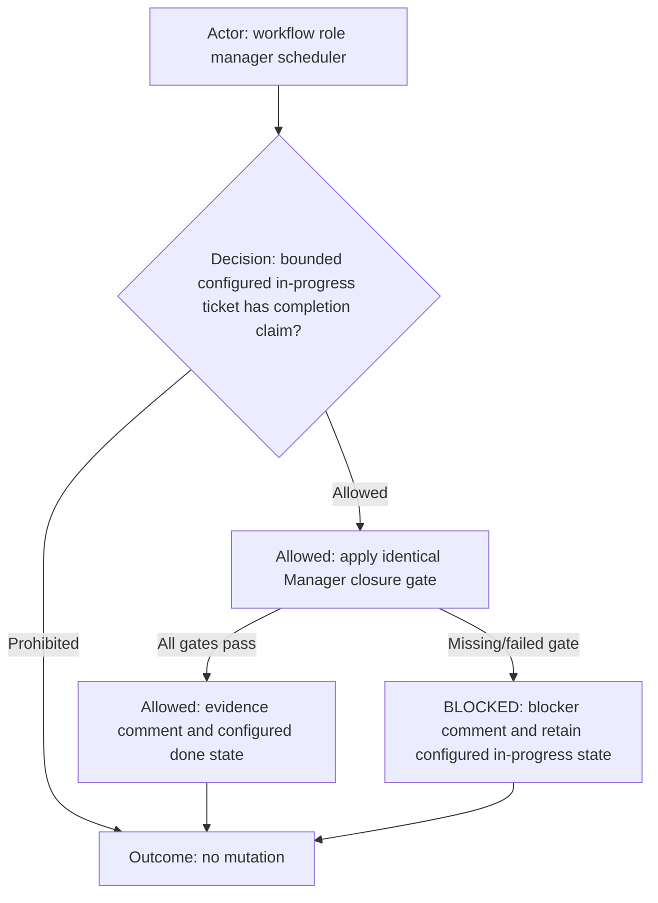

The scheduled Manager reconciliation scans only bounded tickets in the profile-configured `in_progress` state with
completion claims and applies the same closure gate. It may add the final evidence or blocker comment and reconcile
status. It **MUST NOT** create, dispatch, wake, retry, replace, or resume work.
