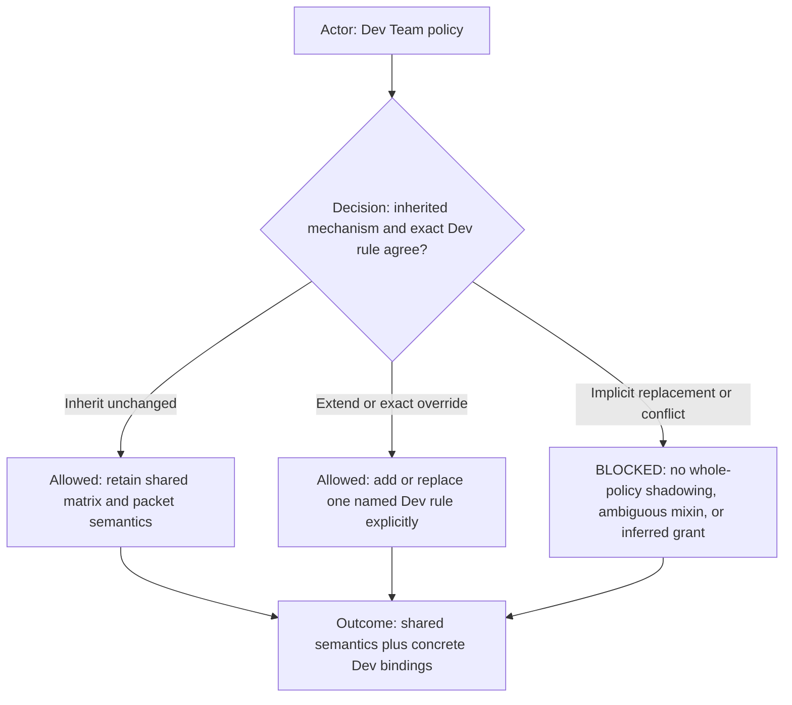
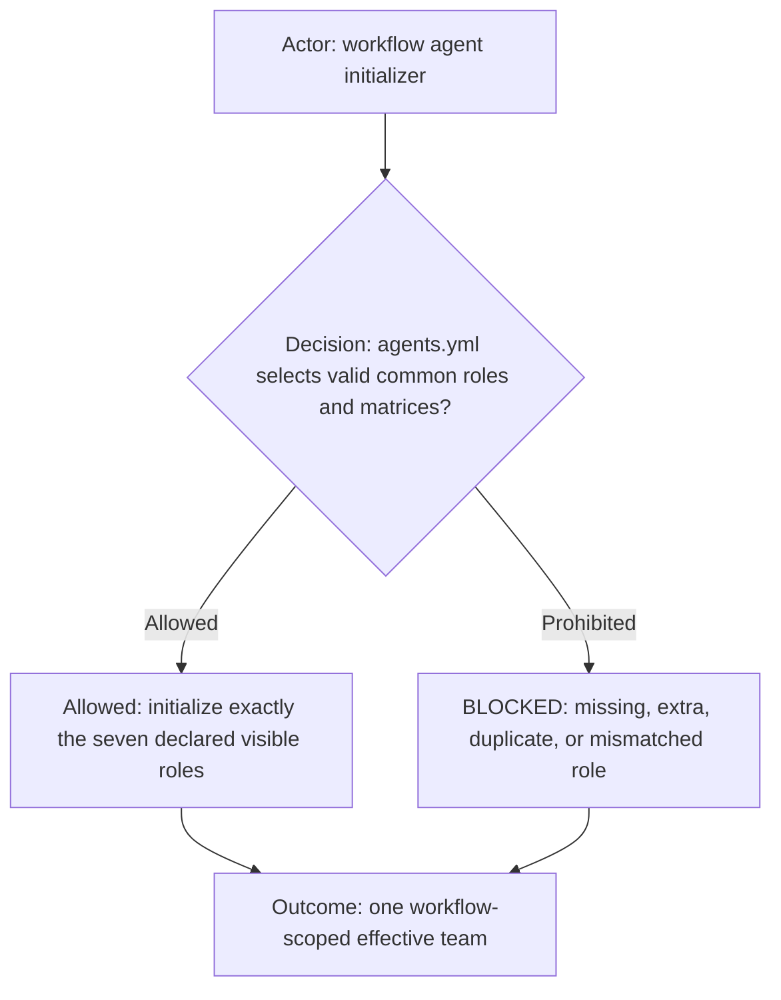
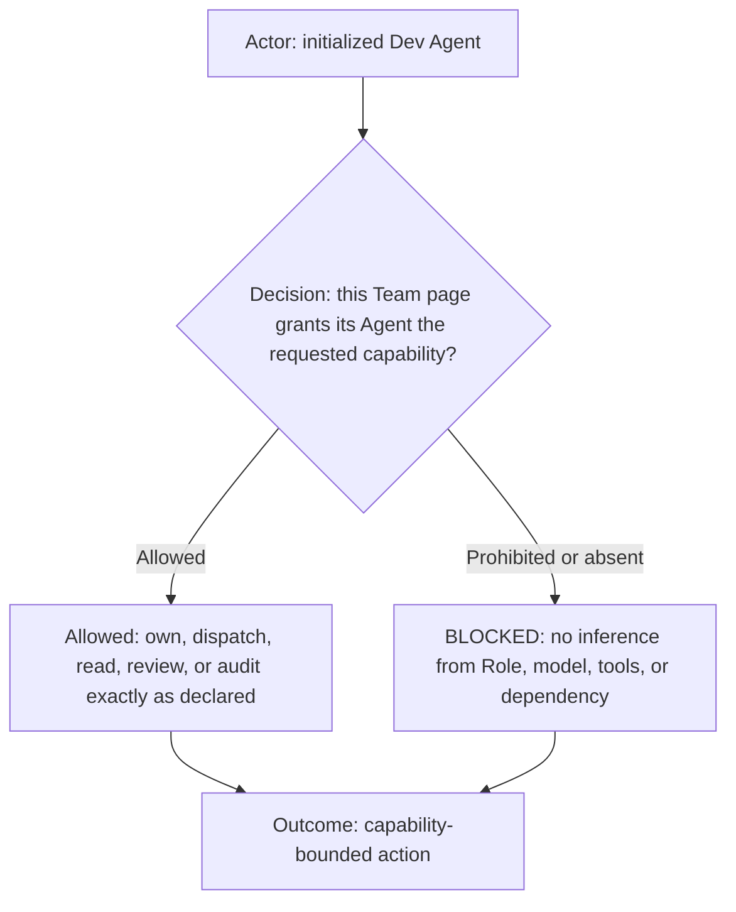
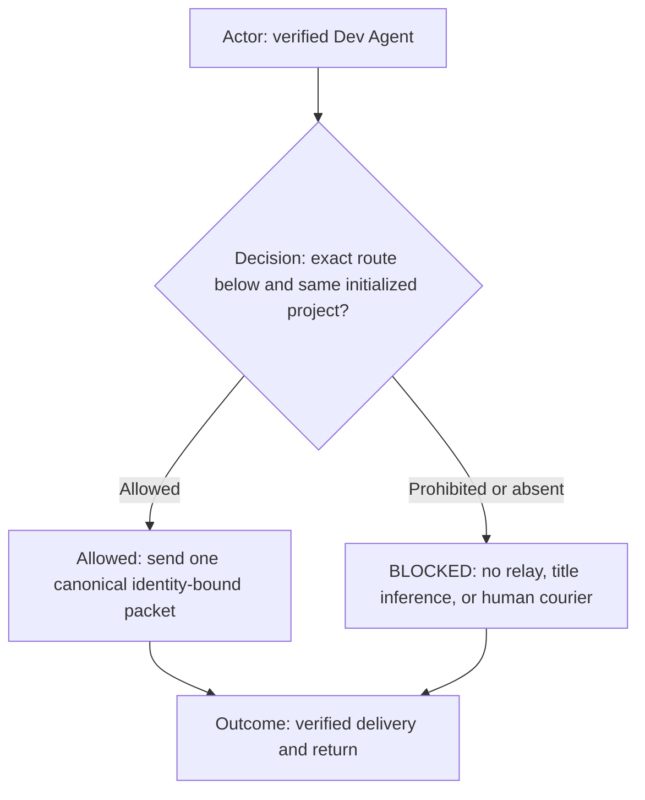
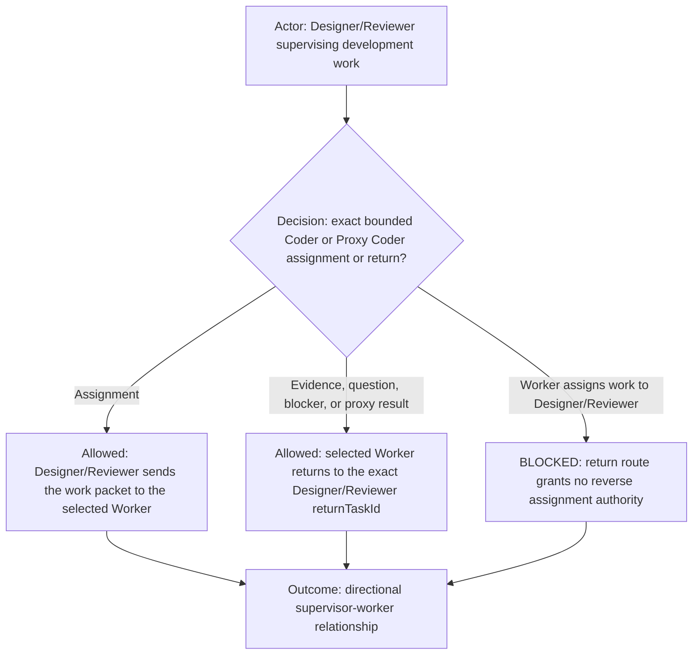
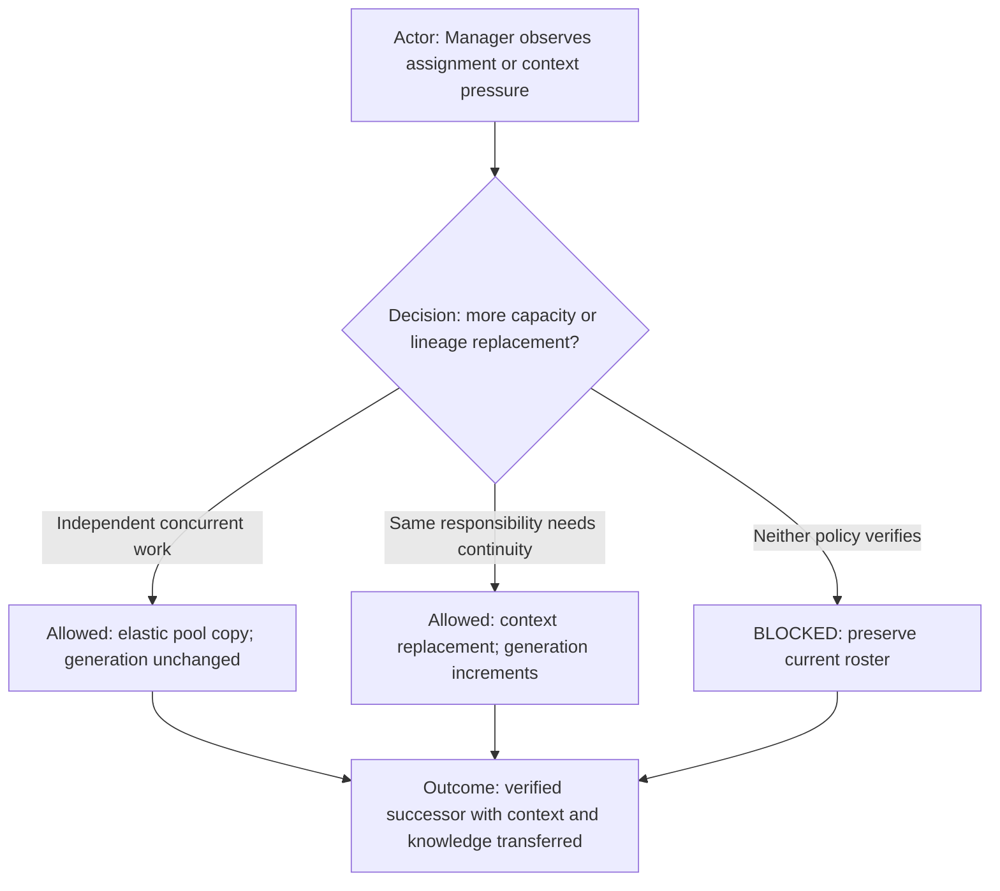
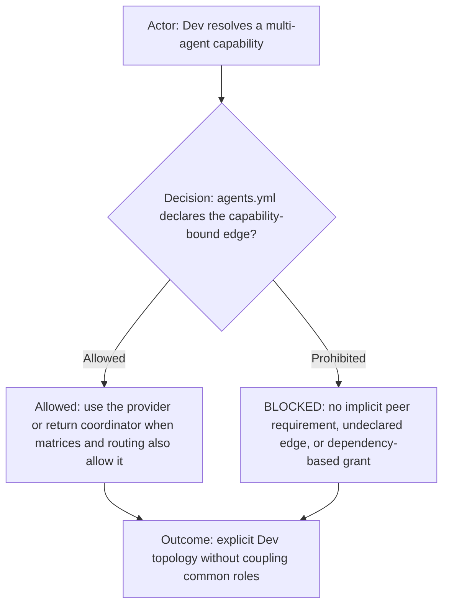
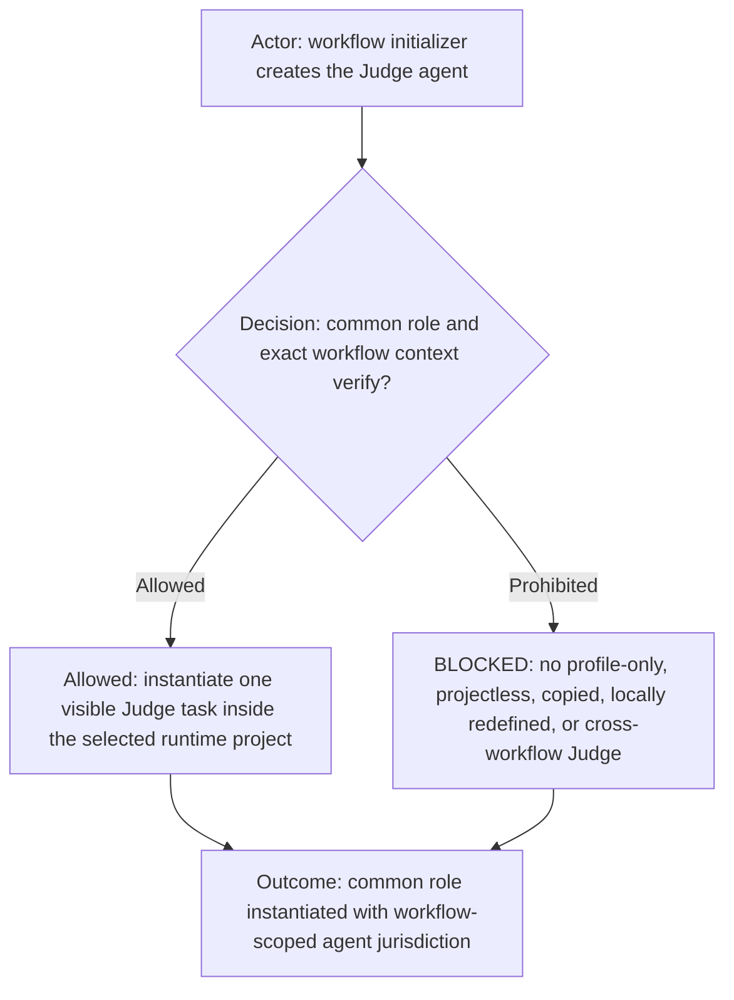
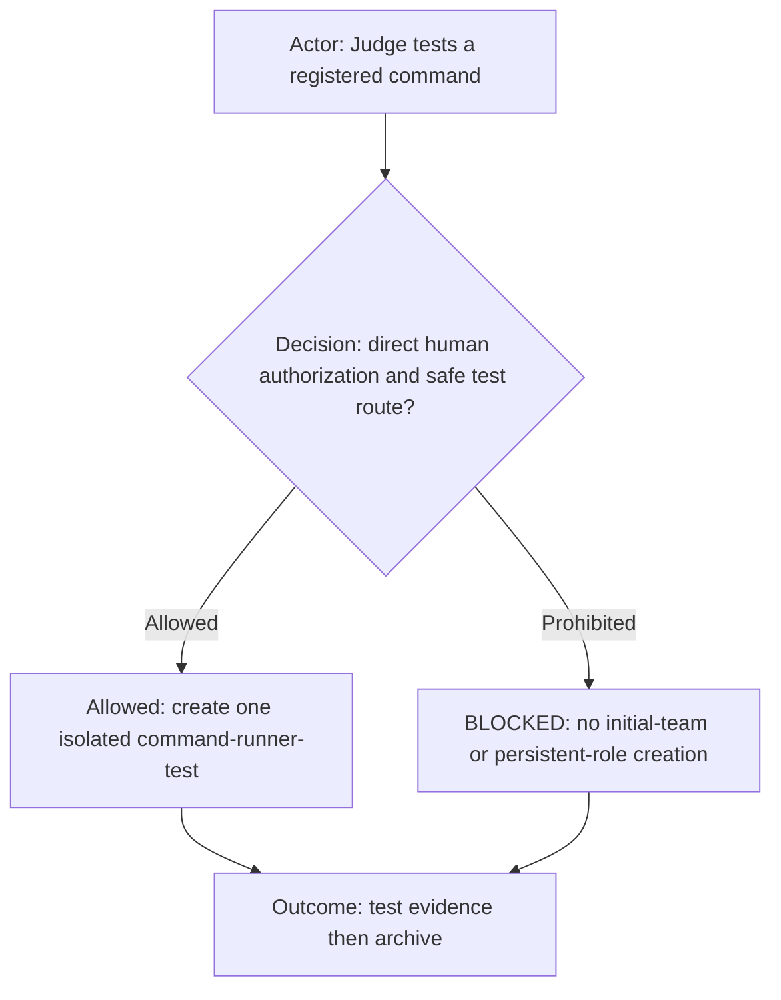
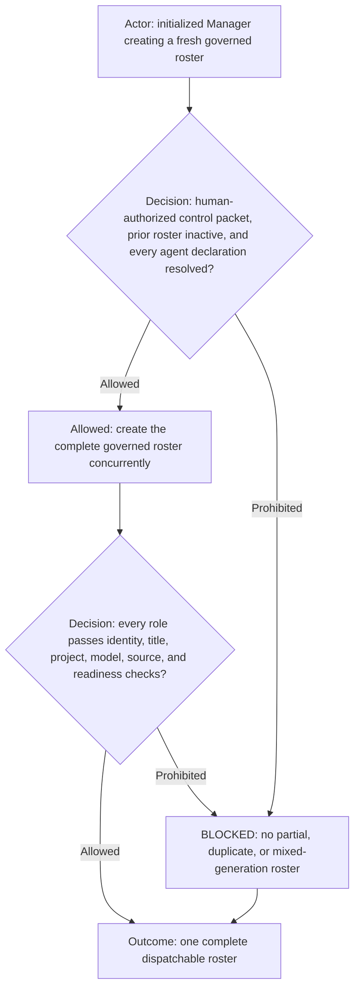

# Development workflow agent team

## Included rules

| Included rule | Required application |
| --- | --- |
| [Common Agent contract](../../agents.md) | Apply common identity, communication, project-boundary, packet, lifecycle, and safety rules to every Dev Agent. |
| [Development workflow](../dev.workflow.md) | Apply the Dev delivery order, gate ownership, conditional UI acceptance, and delivery boundaries. |
| [Agent manifest](../agents.yml) | Load the machine-readable roster, Role selection, runtime configuration, and dependency projection that must agree with this Team policy. |
| [Included Rules Principle](../../../ai-commands/doc/principles/included-rules-principle.md) | Apply explicit, transitive, fail-closed loading for every rule in this table. |
| [Diagram First Principle](../../../ai-commands/doc/principles/diagram-first-principle.md) | Apply when interpreting or editing this Team policy. |
| [Agent access matrix mechanism](../../_common/policy/access-matrix.md) | Apply its composition, permission, communication, and fail-closed semantics before the concrete Dev bindings below. |
| [Runtime permission envelope](permission-envelope.md) | Apply the canonical translation from matrix and packet authority to runtime scope, approval behavior, and blocker routing. |
| [Shared execution routing](shared-execution-routing.md) | Apply canonical packet transport, exact-task delivery, evidence return, execution ownership, and recovery mechanics. |
| [Elastic Agent Pool](elastic-agent-pool.md) | Apply when adding independent bounded capacity for an Agent whose manifest declaration enables an elastic pool. |
| [Role Context Clone](role-context-clone.md) | Apply when replacing an existing Agent while preserving its responsibility, context, and lifecycle generation. |
| [Manifest-selected common Role](../../_common/roles/) | Load only the exact common Role file selected for that Agent by `agents.yml`; directory membership alone grants nothing. |
| Complete included-rule context | Every Agent loading this policy must load every rule in this table as part of the effective contract. A missing, unreadable, partial, conflicting, remembered, or locally copied substitute is `BLOCKED_INCLUDED_RULE_CONTEXT`. |

**Purpose:** this is the Dev Team policy and the single source for roster, Role-to-Agent mapping, capability ownership,
communication, and lifecycle configuration. It composes the included Agent access matrix mechanism rather than
redefining its matrix semantics.
[`../agents.yml`](../agents.yml) is the machine-readable instantiation manifest and must agree with this page.
[Shared execution routing](shared-execution-routing.md) defines packet transport and evidence mechanics; common Role
definitions declare reusable behavior; `dev.workflow.md` owns explicit Dev flow overrides. No parallel capability,
communication, lifecycle, or command matrix is maintained for this Team.

This team projection extends [`../../agents.md`](../../agents.md) plus `../dev.workflow.md`. `agents.yml` selects common
roles directly from [`../../_common/roles/`](../../_common/roles/).

Every declared Dev Agent extends the common [`agents.md`](../../agents.md) contract. A reusable **Role** supplies behavior;
the concrete **Agent** has a workflow name and configuration; a runtime instance receives that Agent name plus only an
optional generation, assignment, or lifecycle suffix. This page, `agents.yml`, `dev.workflow.md`, routing, and the
initialized profile supply effective Dev behavior. File location alone grants no authority.

Logical project ID: `<profile-id>-<workflow-id>`
Optional isolated logical project ID: `<profile-id>-<workflow-id>-<instance-id>` after an explicit safe human selection
Profile prerequisite: explicit profile/logical-project scope, or one verified logical-project binding on the requesting task
Project sources: one or more runtime-bound folders, validated by the profile's workflow project references
Runtime projection: adapter-specific; Codex app mode uses an existing saved project with the logical project ID
Workflow: `dev`
Harness: resolved from the selected profile's exact `workflows[]` entry; this reusable team declares none.

Admin control task: `enabled`
Admin display label: `🔑 Admin`
Admin lifecycle: `persistent across governed-roster reinitialization`
Admin model: `gpt-5.6-sol`
Admin reasoning: `high`
Admin role: `../../_common/roles/admin.md`

## Policy composition

This Team **inherits** the common access-matrix mechanism and shared routing semantics unchanged. The capability and
communication tables below **extend** those reusable schemas with concrete Dev Agent columns and bindings. An
**override** replaces only one explicitly named inherited rule; it never replaces a whole matrix implicitly. A
**prohibition** narrows an inherited possibility for one exact Agent, capability, or route. If inherited and local rules
conflict without an explicit exact override, effective policy is `BLOCKED_POLICY_COMPOSITION_CONFLICT`.

Composition never grants authority by Role class alone. In particular, `Worker` describes reusable packet-handling
behavior; it does not create a generic Worker-to-Worker assignment route. Every assignment direction remains an exact
Dev Agent binding in the tables below and in the compatible `agents.yml` dependency projection.

## Governed agents

The logical project also contains exactly one persistent `🔑 Admin` control task. It is not a routable workflow role and
does not appear in governed Team capability policy. It accepts only direct human administrative requests, preserves itself during
governed-roster reinitialization, and applies the common [Admin role](../../_common/roles/admin.md). Missing,
duplicate, agent-dispatched, matrix-routable,
or ambiguous Admin identity is `BLOCKED_ADMIN_CONTROL_TASK_IDENTITY`. The sole automatic replacement is the exact
human-authorized transactional successor handoff in the common role; the name alone never establishes authority.

**Current governed agent count: `7`.** This is the only readable count declaration. It is derived from—and must always
equal—the number of declarations in [`../agents.yml`](../agents.yml). The table below is its readable projection. Every
other workflow file must refer to “the governed agents,” “the complete roster,” or “every agent declaration” and must
never copy this number.

| Agent ID               | Agent name                | Role      | Display label             | Human-facing                              | Communication mode                                     | Lifecycle                | Model           | Reasoning | Common Role                                   |
| ---------------------- | ------------------------- | --------- | ------------------------- | ----------------------------------------- | ------------------------------------------------------ | ------------------------ | --------------- | --------- | --------------------------------------------- |
| `designer / reviewer`  | `Designer Reviewer`       | `Worker`  | `💬 Designer Reviewer`    | `primary`                                 | ordinary human dialogue and canonical agent packets    | persistent control       | `gpt-5.6-sol`   | `low`     | `../../_common/roles/designer-reviewer.md`    |
| `judge`                | `Judge`                   | `Judge`   | `⚖️ Judge`                | `oversight-only`                          | direct human governance dialogue; scheduled self-audit | persistent control       | `gpt-5.6-terra` | `low`     | `../../_common/roles/judge.md`                |
| `manager`              | `Manager`                 | `Manager` | `🤖 Manager`              | `not human-facing (internal packet-only)` | internal canonical packets only                        | persistent control       | `gpt-5.6-luna`  | `medium`  | `../../_common/roles/manager.md`              |
| `coder`                | `Coder`                   | `Worker`  | `🔀 Coder`                | `not human-facing (internal packet-only)` | internal canonical packets only                        | disposable worker        | `gpt-5.6-terra` | `medium`  | `../../_common/roles/coder.md`                |
| `command-runner`       | `Command Runner`          | `Worker`  | `⚙️ Command Runner`       | `not human-facing (internal packet-only)` | internal canonical packets only                        | disposable worker        | `gpt-5.6-terra` | `low`     | `../../_common/roles/command-runner.md`       |
| `ui-acceptance-tester` | `UI Acceptance Tester`    | `Worker`  | `🖥️ UI Acceptance Tester` | `not human-facing (internal packet-only)` | internal canonical packets only                        | disposable worker        | `gpt-5.6-terra` | `low`     | `../../_common/roles/ui-acceptance-tester.md` |
| `proxy-coder`          | `Proxy Coder`             | `Worker`  | `🧠 Proxy Coder`          | `human-facing proxy`                      | direct human proxy dialogue and canonical Designer/Reviewer packets | persistent workflow role | `gpt-5.6-luna` | `low`     | `../../_common/roles/proxy-coder.md`          |

`proxy-coder` is a Worker Agent ID with structured `execution.mode: proxy`, not a separate Role. It is an inexpensive
human-facing Luna wrapper created by roster initialization. A human may talk to it
directly, and Designer/Reviewer may continue to send structured development packets. The wrapper never performs the work
with Luna: it adds bounded context, submits through the registered launcher-owned Hermes bridge, polls the correlated
request, and presents the ASUS model's response. Its delegation capability remains unroutable until Ticket #57 Gate 1
evidence passes the role's activation contract.

## Team capability policy

This table is authoritative. `OWN` executes and decides; `OWN_EXCLUSIVE` excludes every other governed Agent;
`DISPATCH_ONLY`, `READ_DETAIL`, `READ_SUMMARY`, `OWN_REVIEW`, `AUDIT_ONLY`, and the named restricted values mean only
their literal narrower access. `PROHIBITED` and a missing row grant nothing.
The separate initial-rule-meaning row is `PROHIBITED` for every AI role; only the human authors new policy meaning.

The matrix grants capabilities; [permission-envelope.md](permission-envelope.md) is the single normative contract for
binding those grants to runtime scope, approval behavior, and blocker routing.

| Capability | Designer Reviewer | Judge | Manager | Coder | Command Runner | UI Acceptance Tester | Proxy Coder |
| --- | --- | --- | --- | --- | --- | --- | --- |
| Product requirements architecture and scope | OWN | PROHIBITED | PROHIBITED | READ_DETAIL | PROHIBITED | PROHIBITED | READ_DETAIL |
| Non-secret AI profile configuration and validation | DISPATCH_ONLY | PROHIBITED | PROHIBITED | OWN | READ_DETAIL | PROHIBITED | PROHIBITED |
| Exact work packets and independent technical review | OWN | PROHIBITED | PROHIBITED | READ_DETAIL | PROHIBITED | PROHIBITED | READ_DETAIL |
| Ticket search create update and evidence-gated closure | DISPATCH_ONLY | PROHIBITED | OWN | PROHIBITED | PROHIBITED | PROHIBITED | PROHIBITED |
| Visible worker create archive and scheduler | DISPATCH_ONLY | AUDIT_ONLY | OWN | PROHIBITED | PROHIBITED | PROHIBITED | PROHIBITED |
| Human-seeded profile-scoped AI configuration maintenance and physical edits | PROHIBITED | OWN_EXCLUSIVE | PROHIBITED | PROHIBITED | PROHIBITED | PROHIBITED | PROHIBITED |
| Initial protected rule meaning or semantic policy choice | PROHIBITED | PROHIBITED | PROHIBITED | PROHIBITED | PROHIBITED | PROHIBITED | PROHIBITED |
| Product source configuration and tests | PROHIBITED | PROHIBITED | PROHIBITED | OWN | PROHIBITED | PROHIBITED | PROHIBITED |
| Read-only target-contained source inspection | READ_SUMMARY | PROHIBITED | PROHIBITED | OWN | READ_DETAIL | PROHIBITED | READ_DETAIL |
| Read-only target-contained repository and Git inspection | READ_SUMMARY | PROHIBITED | PROHIBITED | OWN | READ_DETAIL | PROHIBITED | READ_DETAIL |
| Implementation-local test-source edits and validation-result inspection | READ_SUMMARY | GOVERNANCE_TEST_ONLY | PROHIBITED | OWN | READ_DETAIL | PROHIBITED | READ_DETAIL |
| Registered local-Hermes delegation capability | DISPATCH_ONLY | PROHIBITED | PROHIBITED | PROHIBITED | PROHIBITED | PROHIBITED | OWN |
| Protected profile-scoped AI configuration commit push PR create update open and publication verification after all protected gates | PROHIBITED | OWN_EXCLUSIVE | PROHIBITED | PROHIBITED | PROHIBITED | PROHIBITED | PROHIBITED |
| Effectful command execution outside protected governance publication (editor browser Git mutation build test deploy publication scripts packages shell) | DISPATCH_ONLY | AI_CONFIG_VALIDATION_ONLY | PROHIBITED | DISPATCH_ONLY | OWN | PROHIBITED | PROHIBITED |
| Human-visible context rendering (show-context) | OWN | OWN_GOVERNANCE_REPORTING_ONLY | PROHIBITED | PROHIBITED | PROHIBITED | PROHIBITED | PROHIBITED |
| Visible independent UI acceptance | OWN_REVIEW | PROHIBITED | PROHIBITED | PROHIBITED | PROHIBITED | OWN | PROHIBITED |

## Team communication policy

| Route | Designer Reviewer | Judge | Manager | Coder | Command Runner | UI Acceptance Tester | Proxy Coder |
| --- | --- | --- | --- | --- | --- | --- | --- |
| Direct human dialogue | PRIMARY | GOVERNANCE_ONLY | PROHIBITED | PROHIBITED | PROHIBITED | PROHIBITED | HERMES_PROXY_ONLY |
| Receive internal packet | AUTHORIZED | PROHIBITED | AUTHORIZED | AUTHORIZED | AUTHORIZED | AUTHORIZED | DESIGNER_ONLY |
| Send internal work packet | AUTHORIZED | PROHIBITED | TRACKER_ADAPTER_ONLY | COMMAND_RUNNER_ONLY | RETURN_ONLY | UI_SUPPORT_ONLY | RETURN_ONLY |
| Request ticket from Manager | AUTHORIZED | PROHIBITED | RECEIVE_AND_RESPOND | AUTHORIZED | AUTHORIZED | AUTHORIZED | PROHIBITED |
| Receive requested ticket from Manager | AUTHORIZED | PROHIBITED | SEND_TO_EXACT_REQUESTER | AUTHORIZED | AUTHORIZED | AUTHORIZED | PROHIBITED |
| Relay human authorization | ATTEST_ONLY | PROHIBITED | PROHIBITED | PROHIBITED | VERIFY_ONLY | PROHIBITED | PROHIBITED |
| Use human as packet courier | PROHIBITED | PROHIBITED | PROHIBITED | PROHIBITED | PROHIBITED | PROHIBITED | PROHIBITED |
| Agent review of Judge work | PROHIBITED | PROHIBITED | PROHIBITED | PROHIBITED | PROHIBITED | PROHIBITED | PROHIBITED |
| Judge-to-Agent message | PROHIBITED | PROHIBITED | PROHIBITED | PROHIBITED | PROHIBITED | PROHIBITED | PROHIBITED |

### Human prompt route bindings

| Human-facing Agent | Resolved intent | Concrete Dev owner | Required route |
| --- | --- | --- | --- |
| Designer Reviewer | Find, read, create, update, reconcile, assign, move, or close a tracker ticket, regardless of the human's wording. | Manager | Immediately send the exact initialized Manager one complete canonical tracker packet and wait for its receipt. Designer Reviewer must not operate the tracker UI or connector itself. |

### Directional supervision and return

| Supervising Agent | Assigned Worker | Designer/Reviewer may send | Worker execution boundary | Required return |
| --- | --- | --- | --- | --- |
| Designer/Reviewer | Coder | Ticket-bound source-inspection or implementation packet, plus same-scope corrections. | Coder performs bounded product source and test work and delegates its permitted mechanics to Command Runner. | Evidence, clarification question, blocker, or terminal disposition to the exact Designer/Reviewer `returnTaskId`. |
| Designer/Reviewer | Proxy Coder | Structured development packet for the registered local-Hermes delegation capability. | Proxy Coder validates, submits, polls, and presents the correlated Hermes result; it does not replace Coder-owned implementation gates. | Correlated proxy result, blocker, or terminal disposition to the exact Designer/Reviewer `returnTaskId`. |

For both concrete relationships, Designer/Reviewer owns scope, the exact work packet, correction, review, and acceptance;
the selected Worker owns only the bounded capability granted by that packet. Coder and Proxy Coder may return their
declared evidence or result to the exact verified Designer/Reviewer `returnTaskId`, but neither may assign, delegate,
transfer, or pass work to Designer/Reviewer. A `return-coordinator` dependency is a closed result path, not reverse
supervision or assignment authority.

These concrete rows bind the common `Supervising Worker → Assigned Worker` compatibility to Designer/Reviewer → Coder
and Designer/Reviewer → Proxy Coder. Their reverse directions bind only the common `Assigned Worker → Supervising
Worker` `RETURN_ONLY` relationship. The Dev Team matrix may narrow those common relationships but cannot broaden them.

This relationship is analogous to supervisor-to-worker delegation, but the initialized visible Agent tasks are not
Codex child agents or subagents. No parent/child runtime authority is inferred: the exact capability matrix,
communication matrix, dependency projection, packet, and task IDs remain independently required.

For every role declared `not human-facing (internal packet-only)`, `PROHIBITED` under direct human dialogue and human-
authorization relay is an absence of that concept, not a requirement to obtain it elsewhere. In particular, Coder acts
on the bounded authority of an accepted canonical ticketed implementation packet and returns any packet or operation
failure to its verified caller. It never asks for, awaits, or evaluates human approval.

Every initialized Agent whose class is `Worker` may send Manager a canonical request to find, read, create, reconcile,
or assign the ticket needed for that worker's bounded work. Designer/Reviewer is a Worker for this rule even though it
is also the primary human-facing coordinator. Manager returns the exact ticket and lifecycle result directly to the
requesting worker. The valid same-project worker packet is sufficient workflow authority: Manager must never ask the
human to approve the request, prove the need for the ticket, or act as a packet courier. Required tracker facts,
deduplication, and lifecycle checks remain Manager's work; they are not human approval gates.

## Lifecycle and elastic capacity

Manager is the sole governed lifecycle and staffing owner. Context replacement triggers proactively when both the
authoritative compaction count is at least `1` and context utilization is at least `75%`; it preserves responsibility and
increments the generation. A replacement becomes dispatchable only after Manager replaces the predecessor identity in
every authorized role directory and the read-only Judge observation directory, receives matching acknowledgements, and
archives the predecessor last. Before successor creation, Manager must rename the outgoing Agent to
`<configured-role-title> (<N>, cloning)` and verify the visible readback; it retains that suffix until cutover or restores
the prior title on rollback. Completion additionally requires a final self-check proving exactly one active expected
successor, no unresolved duplicate or failed candidate from the attempt, consistent identity bindings, and an inactive
predecessor. The Team policy itself is not rewritten during runtime replacement. Elastic capacity adds
independent same-generation instances and never claims continuity.

| Agent | Elastic pool | Minimum ready | Maximum active | Independence rule |
| --- | --- | ---: | ---: | --- |
| Coder | enabled | 0 | 3 | Assignments must have non-overlapping file/write scopes and compatible Git state. |
| Command Runner | enabled | 1 | 4 | Each instance owns one bounded command packet; one plain-title Runner remains ready. |
| Every other governed Agent | disabled | 0 | 1 | No horizontal scaling without a human-authored Team-policy change. |

Runtime instance titles follow `display title (generation) [assignment] (lifecycle marker)`. Parenthesized numbers are
context-replacement generations; square brackets identify current elastic/work assignments. A plain Command Runner title
means ready. Pool creation uses two-phase identity binding: phase one carries `initializedPoolMemberTaskId: pending`, and
phase two binds the exact app-returned task ID before readiness or work. Full mechanics are in
[elastic-agent-pool.md](elastic-agent-pool.md) and [role-context-clone.md](role-context-clone.md).

## Workflow dependency projection

The `dependencies` section in [`../agents.yml`](../agents.yml) is the sole Dev dependency map. Every edge is
`capability-bound`: loss of a provider blocks only the listed capability, never creation of the consumer role. The map
cannot grant authority or contact, and Judge has no incoming or outgoing dependency. Exact grants remain in the
ownership and communication matrices; shared routing remains the transport authority.

## Common Judge role instantiation

The Judge declaration's canonical role is `ai-workflows/_common/roles/judge.md`, resolved from `agents.yml`.
Initialization fingerprints the common role and Dev workflow sources and binds the resulting visible task to the
selected `profileId`, workflow
`dev`, logical project, runtime project, exact initialized roster, configuration roots, and source manifest. Definition
reuse grants no profile-only or cross-workflow identity or authority; the instance may inspect and govern only that exact
workflow context. For profile `sc` and workflow `dev`, the ordinary logical app project is `sc-dev`, never `sc`.

The Dev workflow supplies these focused Judge governance validation commands:

- `node --test ai-workflows/dev/agents/diagram-first-validator.test.mjs`
- `node --test ai-workflows/dev/agents/visible-role-routing.test.mjs`
- `bash ai-workflows/workflow-agents.test.sh`

It also binds the ten-minute `<derived-project-name> workflow judge` schedule and the Manager schedule that reconciles
tracker, staffing, and exact clone-lineage leftovers, and
`ai-workflows/dev/dev-live-test.md` as the canonical live scenario. Changing the common role, workflow override, or any
fingerprinted workflow source requires reinitialization of the affected Judge instance.

## On-demand isolated test role

`🧪 command-runner-test` is not an Effective-team role, is never created during usual-role initialization, and has no
sidebar-order position. Judge may create it only through the isolated command-test contract, then archives it after
one bounded test.

The roster table and policy tables together form the authoritative readable Team policy. Their machine-readable
instantiation values must match [`../agents.yml`](../agents.yml); conflicts are `BLOCKED_TEAM_POLICY_MISMATCH`.

## Concurrent governed-roster creation

Manager creates governed roles by default after complete inactive-roster readback. A direct Admin execution is permitted
only by the separately confirmed exact human-bypass rule in the Admin contract. The authorized executor creates every
agent declared by `../agents.yml` concurrently. Bind every
app-returned task ID and validate each agent independently; do not dispatch work or report success until all
declarations pass. Sidebar ordering is
presentation-only and is not an initialization gate. A failed role keeps successful fresh identities non-dispatchable
until the exact missing replacement passes, without duplicating successful roles. Admin may bootstrap only a missing
Manager after direct human authorization; `🔑 Admin` is preserved and excluded
from both archive and creation batches during reinitialization.

The agent manifest, workflow, matrices, and common roles are authoritative together. A selected workflow,
manifest, matrix, harness, common role, or workflow override change requires reinitialization.
